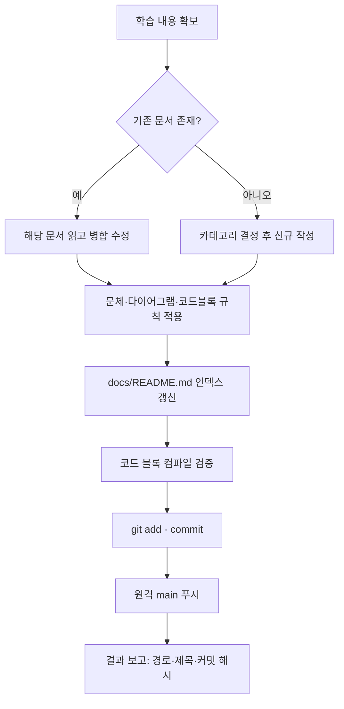
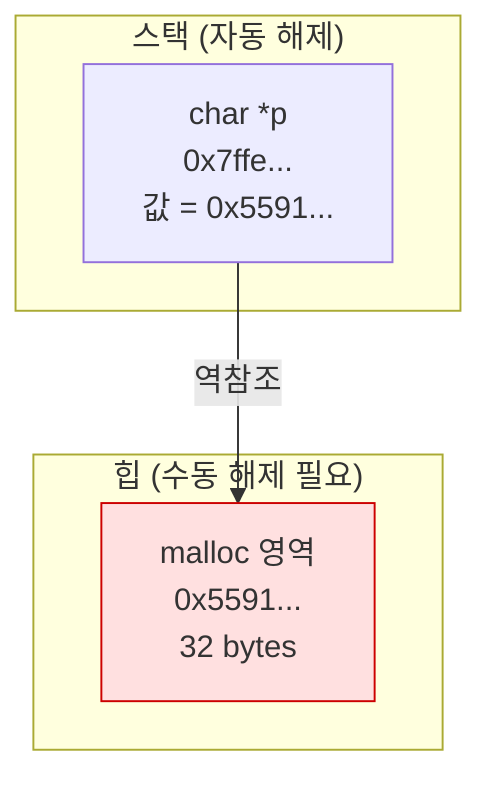
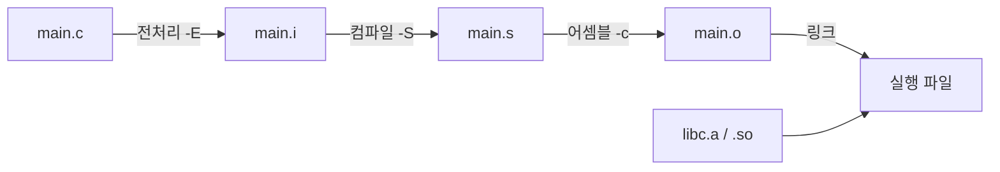

# C Study Notes

## Overview

C 학습 과정에서 나온 개념·실험·삽질을 **한국어 학습 문서**로 정리하고, 문서 저장소에 커밋·푸시까지 마무리하는 스킬. 대상 디렉토리는 `/Users/sunwoo/Documents/Codelab/C`.

독자는 **Java 기반 경험만 있는 개발자 본인**. 프로그래밍 일반 개념은 이미 알고 있으므로 변수·반복문 같은 기초 설명은 불필요하고, **C에서만 달라지는 지점**(메모리 수동 관리, 포인터, 컴파일·링크 단계, 헤더/소스 분리, 빌드 시스템, 디버깅 도구, 코드 컨벤션)에 문서의 무게를 둠.

이 스킬은 **문서 작성 → 인덱스 갱신 → 커밋 → 원격 main 푸시**까지가 한 단위. 커밋·푸시를 생략하면 작업 미완료로 간주.

## When to Use

- C 개념 설명이 끝난 뒤 "정리해줘", "문서로 남겨줘" 요청이 있는 경우
- 연습 소스를 컴파일·실행하며 얻은 결과를 기록해야 하는 경우
- 기존 학습 문서에 새로 알게 된 내용을 덧붙이거나 수정해야 하는 경우
- 여러 세션에 걸친 학습 내용을 주제별로 재편성해야 하는 경우

**Don't use for:**
- 연습 소스 코드 자체의 작성·디버깅 (문서화 요청이 없으면 이 스킬 불필요)
- 단발성 질의응답 (대화로 끝나는 짧은 질문은 문서화 대상 아님)
- C 외 언어 학습 정리

## 전체 흐름



1. **재료 정리** — 대화에서 다룬 개념, 실제 실행한 컴파일 명령, 에러 메시지, 코드를 수집. 대화에 없던 내용은 지어내지 않음.
2. **위치 결정** — 아래 디렉토리 규칙에 따라 신규 파일 생성 또는 기존 문서 수정. 먼저 `ls`/`grep`으로 중복 주제 확인.
3. **작성** — 문서 템플릿 + 문체 규칙 + Mermaid·코드 블록 규칙 적용.
4. **인덱스 갱신** — `docs/README.md`에 링크 추가·정렬.
5. **검증** — 코드 블록 실제 컴파일, Mermaid 문법 확인, 체크리스트 통과.
6. **커밋·푸시** — 고정 커밋 포맷으로 커밋 후 `origin main` 푸시.

## 디렉토리 규칙

```
/Users/sunwoo/Documents/Codelab/C
├── CLAUDE.md                    # 작업 규칙 (이 스킬로 갱신 가능)
├── docs/
│   ├── README.md                # 문서 인덱스 (필수 갱신 대상)
│   ├── 01-basics/               # 문법, 타입, 전처리기
│   ├── 02-memory/               # 포인터, 스택/힙, malloc, 누수
│   ├── 03-build/                # 컴파일·링크, gcc/clang 옵션, Make/CMake
│   ├── 04-project-layout/       # 디렉토리 구조, 헤더 분리, 코드 컨벤션
│   ├── 05-debugging/            # gdb/lldb, CLion 디버거, sanitizer
│   └── 06-system/               # 파일 I/O, 프로세스, 스레드, 시스템 콜
└── <연습 소스 디렉토리들>
```

- 파일명 — `kebab-case.md`, 영문 소문자 (예: `pointer-arithmetic.md`, `static-vs-dynamic-linking.md`). 본문은 한국어.
- 카테고리가 애매한 주제는 **가장 학습 맥락에 가까운 곳** 한 군데에만 두고, 관련 문서는 하단 "관련 문서"로 상호 링크. 같은 내용 중복 생성 금지.
- 없는 카테고리 디렉토리는 필요 시 생성. 임의의 새 최상위 카테고리 추가는 기존 6개로 소화 불가할 때만.
- 예제 소스가 긴 경우 `docs/<카테고리>/examples/<name>.c`로 분리하고 문서에서 상대 경로 링크.

## 문체 규칙 — 명사형 개조체 (필수)

문서 본문의 모든 서술은 **명사 또는 명사형 어미로 종결**. 종결어미(`~한다`, `~이다`, `~된다`, `~하세요`)를 쓰지 않음. 학습 노트는 다시 훑어볼 때 스캔 속도가 중요하고, 개조체가 문장당 정보 밀도를 높여줌.

| 금지 | 사용 |
|---|---|
| `malloc`은 힙에 메모리를 할당한다. | `malloc` — 힙 영역에 지정 크기 메모리 할당 |
| 포인터를 초기화하지 않으면 위험하다. | 미초기화 포인터 역참조 → 정의되지 않은 동작 |
| 함수 포인터는 콜백을 구현할 때 사용한다. | 함수 포인터 — 콜백 구현 경우 사용 |
| 이 옵션을 켜면 경고가 늘어난다. | `-Wall` 지정 시 경고 범위 확대 |
| Java와 다르게 GC가 없어서 직접 해제해야 한다. | Java와 달리 GC 부재 → `free` 수동 호출 필요 |

세부 규칙:

- 허용 종결 — 명사(`할당`, `필요`, `불가`), 명사형 어미(`~함`, `~음`, `~기`), 기호(`→`, `=`, `·`).
- 인과·조건은 기호로 압축 — `조건 → 결과`, `A vs B`, `A ≠ B`.
- 판단·주의는 명사구로 — `주의: 이중 `free` 시 힙 손상`.
- **예외 (개조체 미적용)** — 코드 블록 내부 주석, 실제 에러 메시지 인용, Mermaid 노드 라벨, 외부 문서 인용. 원문 그대로 보존.
- 개조체가 문장 의미를 훼손할 정도로 압축되면 문장을 나눔. 압축이 목적이 아니라 스캔 가능성이 목적.

## 문서 템플릿

```markdown
# <주제 제목>

> <한 줄 요약 — 개조체>

## 개념

- <핵심 정의 · 동작>

## Java와의 차이

| 항목 | Java | C |
|---|---|---|
| <비교축> | <동작> | <동작> |

## 코드

```c
// 최소 재현 예제
```

## 동작 구조

<Mermaid 다이어그램>

## 컴파일 · 실행

```bash
gcc -Wall -g main.c -o main && ./main
```

- `-Wall` — <이 명령에서의 역할>
- `-g` — <이 명령에서의 역할>
- `-o main` — <이 명령에서의 역할>

```
<실제 출력>
```

## 함정 · 주의점

- <실수 유형> → <결과> → <회피 방법>

## CLion 팁

- <해당 시. 없으면 절 삭제>

## 관련 문서

- [<문서명>](../<경로>.md)
```

- `Java와의 차이` 절은 **비교축이 실제로 존재할 때만** 유지. 억지 비교는 오해를 만들므로, 대응 개념이 없으면 절 삭제 후 "Java에 대응 개념 부재" 한 줄로 대체.
- 절 순서는 유지하되, 내용 없는 절은 남기지 않고 삭제.

## 코드 블록 규칙 (필수)

C 학습 문서는 **컴파일 가능한 코드**로 보여줘야 함. 산문 설명만으로는 학습 노트 기능 상실.

- 언어 태그 필수 — `c`, `bash`, `cmake`, `make`, `text`(출력·에러).
- 예제는 **최소 재현 형태** — `#include`부터 `return 0;`까지 그대로 복사해 컴파일 가능한 완결 코드. 조각만 남기면 나중에 재현 불가.
- 핵심 줄에 주석 표시 — `// ← 이 줄에서 누수 발생`.
- **컴파일 명령과 실제 출력을 함께 기재.** 명령만 적고 결과를 생략하면 검증 불가.
- 에러를 다루는 문서는 **실제 컴파일러 에러 메시지 원문**을 `text` 블록으로 인용. 요약·번역 금지 (검색 키워드로 쓰임).
- 코드 블록 앞뒤에 개조체 한 줄씩 — `무엇을 하는 코드` → `왜 이렇게 하는지 / 무엇이 문제인지`. 코드만 덩그러니 두지 않음.
- 문서에 넣기 전 **실제로 컴파일·실행해 검증**. 검증 불가한 환경이면 문서에 `검증 미완료` 표기.

## 명령행 옵션 설명 규칙 (필수)

컴파일·빌드 명령을 제시할 때 **그 명령에 쓰인 모든 옵션을 불릿으로 설명**. 독자가 명령을 복사만 하고 뜻을 모른 채 넘어가면 학습 문서 기능 상실. 문서 중간부터 읽어도 옵션 의미를 파악할 수 있어야 함.

적용 대상 — `cc`/`gcc`/`clang`, `ar`, `make`, `cmake`, 그 외 옵션을 동반하는 실행 명령 전부.

작성 형식 — 명령 블록 **바로 아래**, 출력 블록 **앞**에 배치.

```bash
cc -Wall -Wextra -g -fsanitize=address main.c -o mysh
```

- `-Wall` — 주요 경고 활성
- `-Wextra` — 추가 경고 활성
- `-g` — 디버그 심볼 포함. lldb·ASan 행 번호 표시에 필요
- `-fsanitize=address` — 메모리 오류 검사 코드 삽입
- `-o mysh` — 출력 파일명 지정. 미지정 시 `a.out`

세부 규칙:

- **그 명령에 실제로 쓰인 옵션만** 나열. 안 쓴 옵션 설명 금지.
- 순서는 명령에 등장한 순서 유지.
- 설명은 개조체 한 줄. 해당 명령에서의 **역할** 중심 — 일반론 나열이 아니라 왜 이 명령에 필요한지.
- `-o <이름>`처럼 인자를 동반하면 인자까지 포함해 표기.
- 옵션이 하나도 없는 단순 명령(`./mysh`, `ar t lib.a`, `make`)은 불릿 생략 가능. 단 `make -j4`처럼 옵션이 붙으면 설명 필요.
- 같은 문서 내 반복 등장 시에도 **생략하지 않음**. 중복을 감수하고 각 블록에 배치 — 문서를 순서대로 읽지 않는 독자 기준.
- 플랫폼 종속 옵션은 차이 명시 — 예: `-lm` — 수학 라이브러리 링크. **Linux 필수, macOS 불필요**.
- 실행 명령(`./mysh`)·파이프 결합(`| ./mysh`)이 붙은 경우 그 의미도 한 줄 추가.

## Mermaid 다이어그램 규칙 (필수)

C 학습에서 어려운 부분은 대부분 **눈에 보이지 않는 구조**(메모리 배치, 포인터 지시 관계, 빌드 단계, 호출 스택). 이런 내용은 산문으로 풀지 않고 다이어그램으로 제시.

주제별 다이어그램 선택:

| 주제 | 다이어그램 |
|---|---|
| 메모리 배치 (스택/힙/데이터) | `flowchart` + `subgraph` |
| 포인터 지시 관계 | `flowchart LR` (노드 = 주소·값) |
| 컴파일 → 링크 파이프라인 | `flowchart LR` |
| 함수 호출·스택 프레임 순서 | `sequenceDiagram` |
| 구조체 · typedef 관계 | `classDiagram` |
| 상태 전이 (파일 디스크립터, 프로세스 상태) | `stateDiagram-v2` |

예시 — 메모리 배치:



예시 — 빌드 파이프라인:



세부 규칙:

- 노드 라벨에 **실제 값·주소·크기**를 넣어 구체화. `포인터`보다 `char *p → 0x5591 (32B)`가 학습에 유효.
- 위험 지점(누수, 댕글링 포인터, 이중 해제)은 `classDef`로 색 구분.
- 다이어그램 앞뒤에 그것이 무엇을 보여주는지 개조체 한 줄. 설명 대체가 아니라 보완.
- 구조적 내용이 없는 단순 문법 문서에는 억지로 넣지 않음.
- 파이프 문자·괄호가 라벨에 필요하면 `"..."` 로 감싸 파싱 오류 방지. 작성 후 문법 확인.

## CLAUDE.md 갱신

작업 규칙 자체가 바뀌는 경우 루트 `CLAUDE.md`를 갱신. 이때도 개조체 적용. 학습 문서와 성격이 다르므로 Mermaid·코드 블록 강제 규칙은 미적용(빌드 흐름 등 구조 설명 시에만 사용).

## Git 커밋 · 푸시 (필수, 타협 불가)

문서 작성 후 커밋·푸시까지 완료하지 않으면 작업 미완료. 로컬에만 남은 문서는 다음 세션에서 유실 위험.

### 커밋 메시지 포맷 (고정)

```
feat: <타이틀>

- <간단한 내용 설명>
```

- 접두사는 항상 `feat:` — 신규 작성·수정·재편성 모두 동일. 접두사 분기를 두지 않아 히스토리 표기를 단순화.
- `<타이틀>` — 문서 주제 한 줄. 파일명이 아니라 내용 기준.
- 본문은 `- ` 불릿, **1~3개**. 개조체 유지.
- 여러 문서를 함께 작성한 경우 문서당 불릿 1개.

**예시 1**
```
feat: 포인터 산술과 배열 접근

- 포인터 산술의 타입 크기 단위 이동 정리
- 배열 인덱싱과 포인터 역참조의 등가 관계 예제 추가
```

**예시 2**
```
feat: gcc 컴파일 4단계 문서 보강

- 전처리·컴파일·어셈블·링크 단계별 산출물 확인 명령 추가
- 정적 링크와 동적 링크 비교 표 갱신
```

### 실행 순서

```bash
cd /Users/sunwoo/Documents/Codelab/C
git status                      # 의도한 파일만 변경되었는지 확인
git add docs/ CLAUDE.md         # 문서 경로만 스테이징
git commit -m "feat: <타이틀>" -m "- <설명>"
git pull --rebase origin main   # 원격 선행 커밋 반영
git push origin main
```

- **문서 파일만 스테이징.** `git add .`로 연습 소스·빌드 산출물(`*.o`, 실행 파일, `cmake-build-*/`)을 함께 올리지 않음. 미추적 빌드 산출물이 보이면 `.gitignore` 보강을 별도로 제안.
- 푸시 실패(비-fast-forward, 인증, 원격 미설정) 시 임의 강제 푸시 금지. 원인과 함께 보고하고 사용자 판단 요청.
- 대상 브랜치는 `main` 고정. 다른 브랜치에 있으면 진행 전 확인.

## Common Pitfalls

1. **종결어미로 문장을 닫기.** "~한다", "~이다"는 이 문서 규칙 위반. 초안을 다 쓴 뒤 종결어미 전수 검사 후 개조체로 치환.
2. **코드 없이 산문만 쓰기.** C 문서의 핵심은 컴파일 가능한 예제. 개념 설명만 남으면 학습 노트로 기능하지 않음.
3. **컴파일 명령만 적고 출력 생략.** 결과가 없으면 나중에 재현 검증 불가. 명령·출력 쌍으로 기재.
3-1. **옵션 설명 누락.** `-Wall -g -o` 등을 설명 없이 노출하면 독자가 복사만 하고 의미를 모름. 명령에 쓰인 옵션 전량을 불릿으로 기재. 같은 문서 내 반복 등장 시에도 생략 금지.
4. **에러 메시지 요약·번역.** 원문 그대로 두어야 나중에 검색으로 찾을 수 있음.
5. **구조를 산문으로만 설명.** 메모리 배치·포인터 관계·빌드 단계는 Mermaid 사용. 반대로 단순 문법 문서에 억지 다이어그램 삽입도 금지.
6. **Java 비교를 모든 문서에 강제.** 대응 개념이 없는데 억지 비교하면 오개념 생성. 없으면 절 삭제.
7. **기초 문법 과다 설명.** 독자는 Java 경력 개발자. 반복문·조건문 문법 나열은 지면 낭비. C 고유 지점에 집중.
8. **중복 문서 생성.** 작성 전 `ls`·`grep`으로 기존 문서 확인. 같은 주제면 신규 생성이 아니라 병합 수정.
9. **인덱스 갱신 누락.** `docs/README.md`에 링크가 없으면 문서 발견 불가.
10. **커밋·푸시 생략.** 문서 저장까지만 하고 종료하는 것은 미완료. 커밋 포맷도 임의 변경 금지.
11. **`git add .` 로 전체 스테이징.** 빌드 산출물 오염 위험. 문서 경로만 지정.
12. **대화에 없던 내용 작성.** 실행하지 않은 명령의 출력, 확인하지 않은 표준·버전 동작을 지어내지 않음. 불확실하면 `확인 필요` 표기.

## Verification Checklist

- [ ] 기존 문서 중복 여부를 `ls`·`grep`으로 확인함
- [ ] 문서 위치가 카테고리 규칙에 맞음 (`docs/<NN-카테고리>/kebab-case.md`)
- [ ] 본문 전체가 명사형 개조체 — 종결어미(`~한다`/`~이다`/`~된다`) 부재
- [ ] 코드 블록에 언어 태그 존재, 예제가 복사 후 컴파일 가능한 완결 형태
- [ ] 컴파일 명령과 **실제 출력**을 함께 기재함
- [ ] 모든 명령 블록에 **쓰인 옵션 전량**을 불릿으로 설명함 (반복 등장 시에도 생략 부재)
- [ ] 에러 메시지를 원문 그대로 인용함 (해당 시)
- [ ] 구조적 내용을 Mermaid로 제시하고 문법 확인함 (해당 시)
- [ ] 다이어그램 노드에 실제 값·크기 등 구체 정보 포함
- [ ] Java 비교가 실제 대응 개념이 있을 때만 존재함
- [ ] 코드·출력·주장이 대화에서 실제 확인된 내용임 (환각 없음)
- [ ] `docs/README.md` 인덱스에 링크 추가·정렬함
- [ ] 커밋 메시지가 `feat: <타이틀>` + `- <설명>` 포맷임
- [ ] 문서 경로만 스테이징함 (빌드 산출물 미포함)
- [ ] `origin main` 푸시 완료
- [ ] 결과 보고에 문서 경로·제목·커밋 해시 포함

## 참고 자료

문체 변환 예시, 주제별 Mermaid 패턴, 완성 문서 예시는 **`references/style-guide.md`** 에 있음. 첫 문서 작성 전 또는 개조체 변환이 어색할 때 참조.
