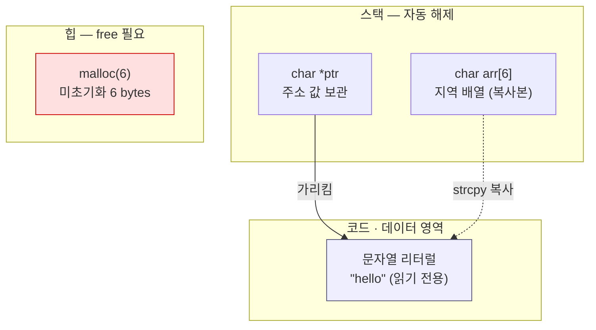
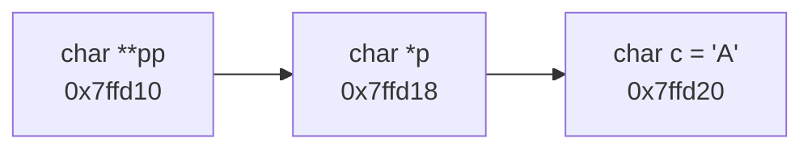
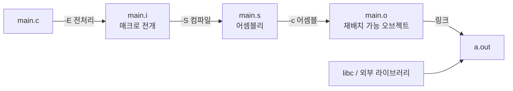
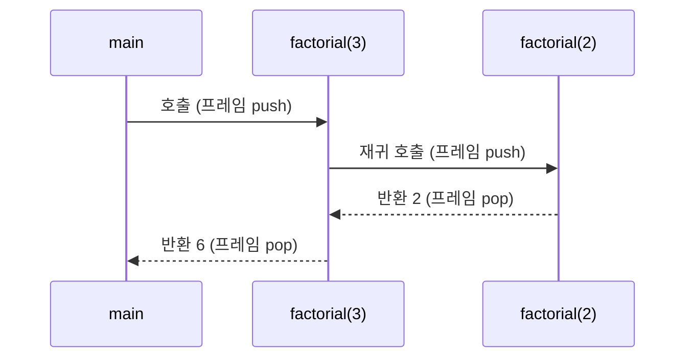
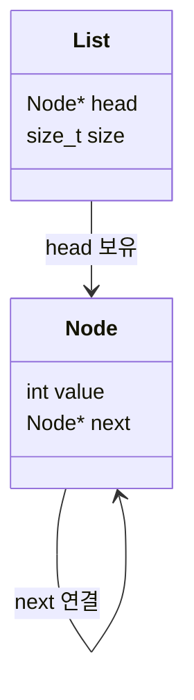
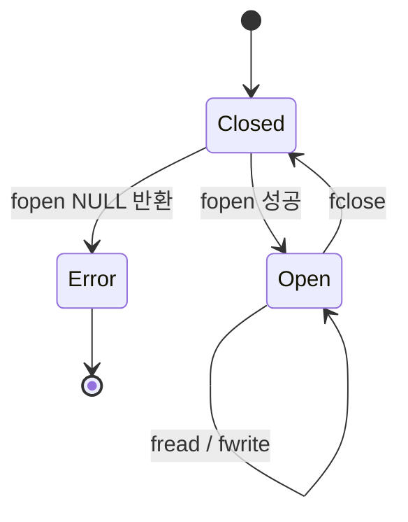
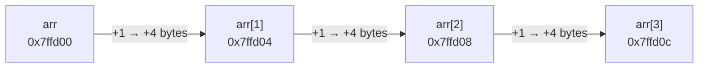

# Style Guide — 개조체 변환 · Mermaid 패턴 · 완성 문서 예시

## 목차

1. [개조체 변환 사례집](#1-개조체-변환-사례집)
2. [주제별 Mermaid 패턴](#2-주제별-mermaid-패턴)
3. [완성 문서 예시](#3-완성-문서-예시)
4. [인덱스 형식](#4-인덱스-형식)

---

## 1. 개조체 변환 사례집

### 정의 · 설명

| 서술체 | 개조체 |
|---|---|
| `sizeof`는 타입의 크기를 바이트 단위로 반환한다. | `sizeof` — 타입 크기 반환 (바이트 단위) |
| 문자열은 널 문자로 끝나는 char 배열이다. | C 문자열 = 널 종단(`'\0'`) `char` 배열 |
| 구조체는 값 타입이므로 대입 시 전체가 복사된다. | 구조체 = 값 타입 → 대입 시 전체 복사 발생 |
| 헤더 파일에는 선언만 두고 정의는 소스 파일에 둔다. | 헤더 = 선언 전용, 소스 = 정의 배치 |

### 조건 · 인과

| 서술체 | 개조체 |
|---|---|
| 배열 범위를 넘어서 접근하면 정의되지 않은 동작이 발생한다. | 배열 범위 초과 접근 → 정의되지 않은 동작 |
| free를 두 번 호출하면 힙이 손상될 수 있다. | 이중 `free` → 힙 손상 가능 |
| -O2를 켜면 실행 속도가 빨라지지만 디버깅이 어려워진다. | `-O2` 지정 시 실행 속도 향상, 디버깅 난이도 상승 |
| 포인터를 해제한 뒤에도 변수는 남아 있어서 댕글링 포인터가 된다. | `free` 이후 포인터 값 잔존 → 댕글링 포인터 발생 |

### 용도 · 목적

| 서술체 | 개조체 |
|---|---|
| 함수 포인터는 콜백을 구현할 때 사용한다. | 함수 포인터 — 콜백 구현 경우 사용 |
| `static`은 파일 내부로 스코프를 제한할 때 쓴다. | `static` — 파일 스코프 제한 경우 사용 |
| valgrind는 메모리 누수를 추적하는 데 사용한다. | valgrind — 메모리 누수 추적 용도 |

### 주의 · 권고

| 서술체 | 개조체 |
|---|---|
| 반드시 malloc의 반환값을 검사해야 한다. | `malloc` 반환값 NULL 검사 필수 |
| gets는 사용하지 말고 fgets를 사용하는 것이 좋다. | `gets` 사용 금지, `fgets` 대체 권장 |
| 컴파일 시 -Wall을 켜는 습관이 필요하다. | `-Wall` 상시 지정 권장 |

### 예외 — 원문 보존 대상

아래는 개조체로 바꾸지 않고 그대로 둠:

- 코드 블록 내부 주석 — `// 여기서 누수가 발생한다` (자유)
- 실제 에러 메시지 — `error: expected ';' before '}' token`
- Mermaid 노드 라벨 — 짧은 명사구 위주지만 문법 우선
- 외부 표준·문서 인용문

---

## 2. 주제별 Mermaid 패턴

### 2.1 메모리 배치 — `flowchart` + `subgraph`

포인터 변수와 대상 메모리의 소재를 분리해 보여줌.



### 2.2 포인터 지시 관계 — `flowchart LR`

이중 포인터·연결 리스트 등 참조 사슬 표현.



### 2.3 컴파일 파이프라인 — `flowchart LR`

각 단계 산출물과 확인 옵션을 함께 표기.



### 2.4 함수 호출 · 스택 프레임 — `sequenceDiagram`

재귀·콜백의 진입·복귀 순서 표현.



### 2.5 구조체 관계 — `classDiagram`



### 2.6 상태 전이 — `stateDiagram-v2`

파일 디스크립터·프로세스 상태 등.



### 문법 주의

- 라벨에 `()`, `|`, `:`, `"` 포함 시 `"..."` 로 감쌈. `"` 자체는 `&quot;` 로 표기.
- 줄바꿈은 `<br/>`.
- `classDef` 는 다이어그램 하단에 모아 선언 후 `class <노드> <클래스>` 로 적용.
- 노드 ID는 영문·숫자만. 한글 ID 사용 시 파싱 실패 위험 → 라벨에만 한글 사용.

---

## 3. 완성 문서 예시

아래는 규칙을 모두 적용한 문서 형태. 길이·절 구성의 기준으로 참고.

````markdown
# 배열과 포인터의 등가성

> 배열명 = 첫 원소 주소로 감쇠(decay), 단 `sizeof`·`&` 문맥에서 예외

## 개념

- 배열명 대부분 문맥에서 첫 원소 포인터로 감쇠
- `arr[i]` ≡ `*(arr + i)` ≡ `*(i + arr)` ≡ `i[arr]`
- 포인터 산술 이동 단위 = 대상 타입 크기 (바이트 아님)
- 감쇠 예외 — `sizeof(arr)`, `&arr`, 문자열 리터럴 초기화

## Java와의 차이

| 항목 | Java | C |
|---|---|---|
| 배열 길이 정보 | 객체에 `length` 보유 | 미보유 → 별도 전달 필요 |
| 범위 검사 | 런타임 검사 후 예외 | 검사 부재 → 정의되지 않은 동작 |
| 배열 전달 | 참조 전달 (길이 유지) | 포인터 감쇠 (길이 소실) |

## 코드

배열명 감쇠와 `sizeof` 예외를 동시에 확인하는 예제.

```c
#include <stdio.h>

void print_size(int arr[]) {
    printf("함수 내부 sizeof: %zu\n", sizeof(arr));  // ← 포인터 크기
}

int main(void) {
    int arr[5] = {1, 2, 3, 4, 5};
    printf("main sizeof: %zu\n", sizeof(arr));       // ← 배열 전체 크기
    printf("arr[2]=%d, *(arr+2)=%d, 2[arr]=%d\n",
           arr[2], *(arr + 2), 2[arr]);
    print_size(arr);
    return 0;
}
```

함수 매개변수의 `int arr[]` 표기는 `int *arr` 와 동일 → 길이 정보 소실.

## 동작 구조

포인터 산술의 이동 단위가 타입 크기임을 보여줌.



## 컴파일 · 실행

```bash
gcc -Wall -g array_decay.c -o array_decay && ./array_decay
```

`-Wall` 지정 시 감쇠 관련 경고 발생 → 컴파일러가 실수 지점을 직접 지목.

```
array_decay.c: In function 'print_size':
array_decay.c:4:45: warning: 'sizeof' on array function parameter 'arr' will return size of 'int *' [-Wsizeof-array-argument]
main sizeof: 20
arr[2]=3, *(arr+2)=3, 2[arr]=3
함수 내부 sizeof: 8
```

## 함정 · 주의점

- 함수 내 `sizeof(arr)` 로 원소 개수 계산 시도 → 포인터 크기 반환 → 오동작
- 길이 전달 누락 → 범위 초과 접근 → 정의되지 않은 동작
- `int (*p)[5]` (배열 포인터) 와 `int *p[5]` (포인터 배열) 혼동 주의

## CLion 팁

- 디버거 Variables 창에서 배열 매개변수는 포인터로 표시 → 원소 확인 시 `*arr@5` 형식 watch 등록

## 관련 문서

- [포인터 산술](pointer-arithmetic.md)
- [스택과 힙 메모리 배치](stack-vs-heap.md)
````

---

## 4. 인덱스 형식

`docs/README.md` 는 카테고리별 링크 목록 유지. 신규 문서 작성 시 해당 카테고리에 링크 1줄 추가, 파일명 기준 정렬.

```markdown
# C 학습 문서 인덱스

## 01. 기초 문법
- [전처리기와 매크로](01-basics/preprocessor-macro.md) — 조건부 컴파일, 매크로 함정
- [타입과 형변환](01-basics/types-and-casting.md) — 정수 승격, 암묵 변환 규칙

## 02. 메모리
- [배열과 포인터의 등가성](02-memory/array-pointer-equivalence.md) — 감쇠 규칙, sizeof 예외
- [스택과 힙 메모리 배치](02-memory/stack-vs-heap.md) — 수명, 해제 책임

## 03. 빌드
- [gcc 컴파일 4단계](03-build/gcc-compile-stages.md) — 전처리~링크 산출물 확인
```

- 링크 뒤 ` — <한 줄 요약>` 형식으로 개조체 요약 부착. 요약 없는 링크만 나열 시 탐색 효율 저하.
- 카테고리 디렉토리가 비면 인덱스에서도 해당 절 생략.
