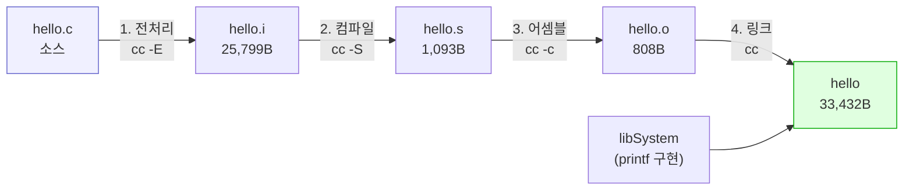
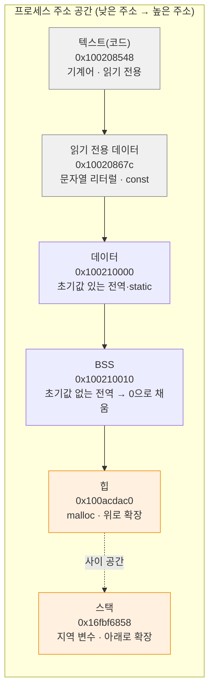
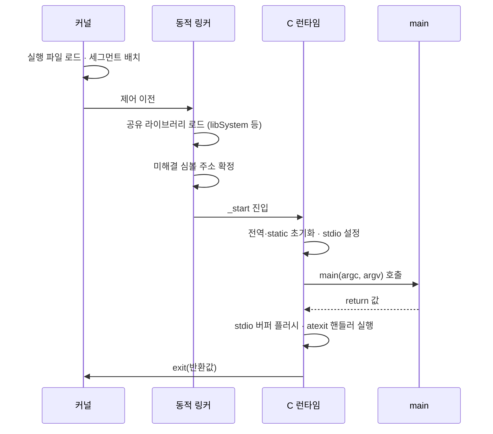

# C 프로그램의 동작 및 컴파일 방식

> 소스 코드 → 실행 파일 4단계 변환. 실행 시 메모리 세그먼트 배치. Java의 JVM 계층 부재

## 개념

- C는 **네이티브 컴파일 언어** — 소스를 CPU 명령어로 직접 변환. 실행 시 중간 계층 부재
- 변환 4단계 — 전처리 → 컴파일 → 어셈블 → 링크. 각 단계마다 별도 산출물 생성
- 실행 파일은 **플랫폼 종속** — macOS arm64용 바이너리는 Linux·x86에서 실행 불가
- 실행 시 프로세스 메모리가 용도별 세그먼트로 분할 배치

## Java와의 차이

| 항목 | Java | C |
|---|---|---|
| 컴파일 결과 | 바이트코드(`.class`) | 네이티브 기계어 |
| 실행 주체 | JVM이 해석·JIT 컴파일 | OS가 직접 로드·실행 |
| 이식성 | 바이트코드 그대로 이식 | 플랫폼별 재컴파일 필요 |
| 실행 시작 | JVM 기동 후 `main` 호출 | 커널 → 동적 링커 → `_start` → `main` |
| 런타임 검사 | 배열 범위·널 검사 존재 | 검사 부재 → 성능 확보, 안전성 개발자 책임 |
| 메모리 회수 | GC 자동 | `free` 수동 |

**핵심 차이** — Java는 "JVM 위에서 도는 프로그램", C는 "OS가 직접 실행하는 프로그램". 이 차이가 성능·이식성·안전성 전반의 트레이드오프를 결정

## 컴파일 4단계



크기 변화 주목 — 전처리 후 25KB로 급증(헤더 전개), 목적 파일에서 808B로 축소(기계어), 링크 후 33KB(런타임 포함)

### 예제 소스

```c
#include <stdio.h>

#define GREETING "Hello"          // 전처리기가 텍스트 치환

int main(void) {
    printf("%s, C!\n", GREETING);
    return 0;
}
```

### 1단계 · 전처리 (preprocessing)

- 역할 — `#include` 헤더 전개, `#define` 매크로 치환, `#if` 조건부 컴파일 처리, 주석 제거
- **텍스트 수준 조작**. 문법 검사 부재
- 산출물 — `.i` 파일

```bash
cc -E hello.c | tail -8
```

- `-E` — 전처리까지만 수행 → 헤더 전개 결과를 표준 출력으로

```
# 2 "hello.c" 2


int main(void) {
    printf("%s, C!\n", "Hello");
    return 0;
}
```

- `GREETING` → `"Hello"` 치환 확인
- `#include <stdio.h>` → `printf` 등 선언 수백 줄로 전개 → 25KB 급증
- `# 2 "hello.c"` — 원본 위치 표시. 오류 메시지의 행 번호 근거

### 2단계 · 컴파일 (compilation)

- 역할 — 전처리 결과를 **어셈블리 코드**로 변환. 문법 검사·타입 검사·최적화 수행
- 오류 대부분이 이 단계에서 발생
- 산출물 — `.s` 파일

```bash
cc -S hello.c -o hello.s && head -12 hello.s
```

- `-S` — 컴파일까지만 수행 → 어셈블리(`.s`) 생성
- `-o hello.s` — 출력 파일명을 `hello.s`로 지정. 미지정 시 `a.out`

```
	.build_version macos, 26, 0	sdk_version 26, 5
	.section	__TEXT,__text,regular,pure_instructions
	.globl	_main                           ; -- Begin function main
	.p2align	2
_main:                                  ; @main
	.cfi_startproc
; %bb.0:
	sub	sp, sp, #32
	stp	x29, x30, [sp, #16]             ; 16-byte Folded Spill
	add	x29, sp, #16
```

- `sub sp, sp, #32` — 스택 포인터 32바이트 감소 = 지역 변수 공간 확보
- arm64 명령어 확인 가능. x86과 상이

### 3단계 · 어셈블 (assembly)

- 역할 — 어셈블리 → **기계어 목적 파일**. 아직 실행 불가
- 외부 함수(`printf`)는 미해결 상태로 표시만
- 산출물 — `.o` 파일

```bash
cc -c hello.c -o hello.o && file hello.o && nm hello.o
```

- `-c` — 컴파일까지만 수행하고 링크 생략 → 목적 파일(`.o`) 생성
- `-o hello.o` — 출력 파일명을 `hello.o`로 지정. 미지정 시 `a.out`

```
hello.o: Mach-O 64-bit object arm64
0000000000000000 T _main
                 U _printf
0000000000000044 s l_.str
000000000000004c s l_.str.1
```

- `T _main` — 이 파일이 **정의**한 심볼 (Text 섹션)
- `U _printf` — **미해결**(Undefined). 다른 곳에 정의 존재 필요
- 주소가 `0000...` — 아직 배치 전. 링크 시 확정

### 4단계 · 링크 (linking)

- 역할 — 여러 `.o`와 라이브러리를 결합. **미해결 심볼에 실제 주소 부여**
- 시작 코드(`_start` 등 런타임) 추가
- 산출물 — 실행 파일

```bash
cc hello.o -o hello && file hello && ./hello
```

- `-o hello` — 출력 파일명을 `hello`로 지정. 미지정 시 `a.out`
- `&& file hello && ./hello` — 컴파일 성공 시에만 실행

```
hello: Mach-O 64-bit executable arm64
Hello, C!
```

- `object` → `executable` 전환 확인
- `printf` 실제 구현은 시스템 라이브러리(`libSystem`)에 존재 → 링커가 연결

### 단계 통합 실행

```bash
cc hello.c -o hello
```

- `-o hello` — 출력 파일명을 `hello`로 지정. 미지정 시 `a.out`
- 옵션 미지정 시 4단계 자동 수행 후 중간 파일 삭제
- 단계별 확인이 필요할 때만 `-E`·`-S`·`-c` 사용

## 실행 시 메모리 레이아웃

프로그램 실행 시 프로세스 주소 공간이 용도별 분할



### 검증 코드

```c
#include <stdio.h>
#include <stdlib.h>

int   g_init   = 42;        // 데이터 세그먼트 (초기값 있는 전역)
int   g_uninit;             // BSS 세그먼트 (초기값 없는 전역 → 0)
const char *g_str = "리터럴";  // 문자열 리터럴 → 읽기 전용 영역

void func(void) { }         // 텍스트(코드) 세그먼트

int main(void) {
    int   stack_var = 1;              // 스택
    int  *heap_ptr  = malloc(4);      // 힙

    printf("텍스트(함수)   %p\n", (void *)func);
    printf("읽기전용(문자열) %p\n", (void *)g_str);
    printf("데이터(초기화)  %p\n", (void *)&g_init);
    printf("BSS(미초기화)   %p\n", (void *)&g_uninit);
    printf("힙            %p\n", (void *)heap_ptr);
    printf("스택          %p\n", (void *)&stack_var);

    printf("\ng_uninit 값 = %d (자동 0 초기화)\n", g_uninit);

    free(heap_ptr);
    return 0;
}
```

```bash
cc -Wall -Wextra -g layout.c -o layout && ./layout
```

- `-Wall` — 주요 경고 활성. 미초기화 변수·타입 불일치 등 검출
- `-Wextra` — `-Wall` 미포함 추가 경고 활성
- `-g` — 디버그 심볼 포함. lldb 추적·ASan 행 번호 표시에 필요
- `-o layout` — 출력 파일명을 `layout`로 지정. 미지정 시 `a.out`
- `&& ./layout` — 컴파일 성공 시에만 실행

```
텍스트(함수)   0x100208548
읽기전용(문자열) 0x10020867c
데이터(초기화)  0x100210000
BSS(미초기화)   0x100210010
힙            0x100acdac0
스택          0x16fbf6858

g_uninit 값 = 0 (자동 0 초기화)
```

- 주소 순서 — 텍스트 < 읽기전용 < 데이터 < BSS < 힙 < 스택. 위 다이어그램과 일치
- 스택 주소(`0x16f...`)가 힙(`0x100a...`)보다 훨씬 큼 → 반대 방향 확장
- 실행마다 주소 변동 — ASLR(주소 공간 배치 무작위화) 보안 기능

### 세그먼트별 특성

| 세그먼트 | 내용 | 수명 | 초기화 | 크기 결정 |
|---|---|---|---|---|
| 텍스트 | 기계어 코드 | 프로그램 전체 | 실행 파일에서 로드 | 컴파일 시점 |
| 읽기 전용 | 문자열 리터럴, `const` | 프로그램 전체 | 실행 파일에서 로드 | 컴파일 시점 |
| 데이터 | 초기값 있는 전역·`static` | 프로그램 전체 | 지정 값 | 컴파일 시점 |
| BSS | 초기값 없는 전역·`static` | 프로그램 전체 | **자동 0** | 컴파일 시점 |
| 힙 | `malloc` 할당 | `free` 호출까지 | **없음 (쓰레기 값)** | 런타임 |
| 스택 | 지역 변수, 인자, 복귀 주소 | 함수 반환까지 | **없음 (쓰레기 값)** | 런타임 |

**초기화 규칙 요약** — 전역·`static`은 자동 0, 지역 변수와 `malloc` 결과는 초기화 부재

```c
int g;              // 0 보장
static int s;       // 0 보장

void f(void) {
    int local;      // 쓰레기 값. 사용 전 대입 필수
    int *p = malloc(sizeof(int));   // *p 쓰레기 값
    int *q = calloc(1, sizeof(int));// *q = 0 보장
}
```

## 프로그램 시작 · 종료 흐름



- `main`의 `return 0` = `exit(0)` — 종료 코드로 OS에 전달. 셸에서 `echo $?`로 확인
- 관례 — `0` 성공, 0 이외 실패

종료 코드 확인

```bash
./hello; echo "종료 코드: $?"
```

```
Hello, C!
종료 코드: 0
```

## `main` 함수 형태

```c
int main(void)                      // 인자 미사용
int main(int argc, char *argv[])    // 명령행 인자 사용
```

- `argc` — 인자 개수. **프로그램 이름 포함** → 최소 1
- `argv[0]` — 프로그램 이름, `argv[argc]` — `NULL`

```c
#include <stdio.h>

int main(int argc, char *argv[]) {
    printf("argc = %d\n", argc);
    for (int i = 0; i < argc; i++)
        printf("argv[%d] = %s\n", i, argv[i]);
    return 0;
}
```

```bash
cc -Wall args.c -o args && ./args hello world
```

- `-Wall` — 주요 경고 활성. 미초기화 변수·타입 불일치 등 검출
- `-o args` — 출력 파일명을 `args`로 지정. 미지정 시 `a.out`
- `&& ./args hello world` — 컴파일 성공 시에만 실행

```
argc = 3
argv[0] = ./args
argv[1] = hello
argv[2] = world
```

- Java의 `String[] args`와 달리 프로그램 이름이 포함됨 → 인덱스 1부터 실제 인자

## 함정 · 주의점

- 지역 변수·`malloc` 결과를 초기화 없이 읽음 → 쓰레기 값. 실행마다 다른 결과 → 재현 곤란
- 문자열 리터럴 수정 시도 → 읽기 전용 영역 → 세그먼테이션 폴트
  ```c
  char *p = "hello";
  p[0] = 'H';        // ← 크래시. 배열로 선언해야 수정 가능
  char arr[] = "hello";
  arr[0] = 'H';      // ← 정상. 스택 복사본
  ```
- 링크 오류를 컴파일 오류로 오인 → `Undefined symbols`는 링크 단계. 소스 문법 문제 아님
- 다른 플랫폼 바이너리 실행 시도 → 형식 불일치 오류. 재컴파일 필요
- 스택 크기 한계(기본 8MB 수준) 초과 → 스택 오버플로. 대용량 배열은 힙 사용
- `main` 반환값 생략 — C99 이상은 `0` 암묵 반환. 명시 권장

## 검증

- [ ] `cc -E`·`-S`·`-c` 각 단계 산출물 생성 확인
- [ ] `nm`으로 `T`(정의)·`U`(미해결) 심볼 구분 확인
- [ ] 세그먼트별 주소 순서 확인
- [ ] 전역 변수 자동 0 초기화 확인
- [ ] `echo $?`로 종료 코드 확인
- [ ] `argv[0]`이 프로그램 이름임을 확인

## 다음 단계

- [gcc 컴파일 · 실행 명령어](../03-build/gcc-compile-and-run.md) — 실무 옵션 전반
- [Makefile 작성법](../03-build/makefile-guide.md) — 빌드 자동화

## 관련 문서

- [C 소스코드 구성 요소](../04-project-layout/source-file-types.md) — `.c`·`.h`·`.o`·`.a` 파일 역할
- [학습 문서 인덱스](../README.md)
