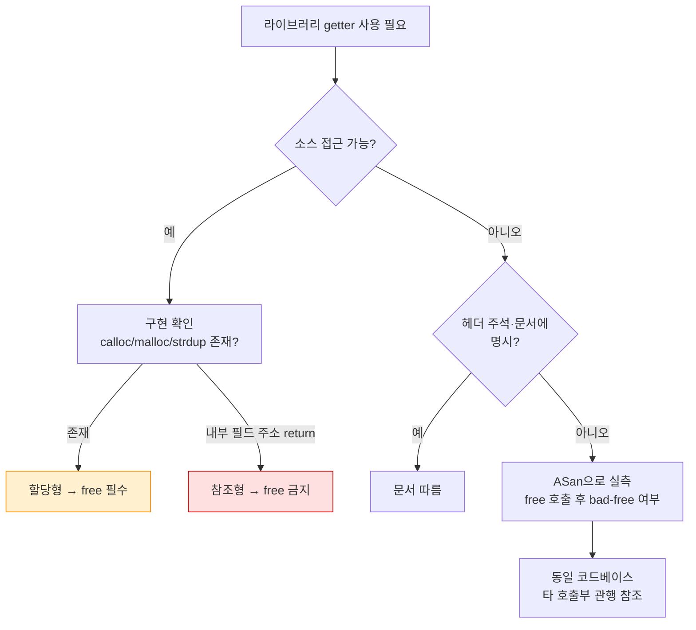

---
tags:
  - lang/c
  - c/memory
  - ownership
  - memory-leak
  - double-free
  - api-design
  - status/verified
aliases:
  - 반환 포인터 소유권
  - 메모리 소유권 규약
  - bad free
created: 2026-08-24
updated: 2026-08-24
---

# 반환 포인터 소유권 규약 — 할당형 vs 참조형

> 라이브러리가 `char *` 를 돌려줄 때 **해제 책임이 누구에게 있는지**가 타입에 드러나지 않음. 같은 헤더 안에 두 부류가 섞이면 누수와 bad free가 동시 발생

## 개념

C는 포인터 소유권을 언어 차원에서 표현하지 못함. 반환 타입 `char *` 하나가 두 가지를 뜻함:

| 부류 | 내부 동작 | 호출자 책임 | 위반 결과 |
|---|---|---|---|
| **할당형** | `malloc`/`calloc`/`strdup` 후 반환 | `free` **필수** | 미해제 → **누수** |
| **참조형** | 내부 구조체 필드 주소 그대로 반환 | `free` **금지** | 해제 → **bad free · abort** |

명명 규칙으로도 구분 불가 — `get_host()` 와 `get_user()` 가 서로 다른 부류일 수 있음.

## Java와의 차이

| 항목 | Java | C |
|---|---|---|
| 반환 객체 수명 | GC가 도달 가능성으로 판정 | 호출자가 규약을 읽고 판단 |
| 내부 필드 반환 | 참조 공유. 안전 | 참조형. 해제 시 abort |
| 방어적 복사 | `return new String(s)` 관용 | 할당형. 호출자 `free` 필요 |
| 규약 위반 탐지 | 컴파일러·런타임 모두 미탐지 | 런타임 abort 또는 조용한 누수 |

Java에서 "내부 배열을 그대로 반환하면 캡슐화가 깨진다"는 문제는 C에서 **메모리 안전성 문제**로 승격.

## 코드

```c
#include <stdio.h>
#include <stdlib.h>
#include <string.h>

typedef struct { char host[32]; char user[32]; } record_t;

static record_t g_rec = { "example.com", "alice" };

/* 할당형 — 새 버퍼를 calloc 해서 반환. 호출자가 free 필수 */
char *get_host_copy(void) {
    char *buf = calloc(1, strlen(g_rec.host) + 1);
    if (buf == NULL) return NULL;
    strcpy(buf, g_rec.host);
    return buf;
}

/* 참조형 — 내부 구조체 필드 주소를 그대로 반환. free 하면 안 됨 */
char *get_user_ref(void) {
    return g_rec.user;
}

int main(void) {
    char *h = get_host_copy();
    char *u = get_user_ref();

    printf("host=%s user=%s\n", h, u);
    printf("host 주소 g_rec 밖인가: %s\n",
           ((void *)h < (void *)&g_rec || (void *)h >= (void *)(&g_rec + 1)) ? "예(힙)" : "아니오");
    printf("user 주소 g_rec 안인가: %s\n",
           ((void *)u >= (void *)&g_rec && (void *)u < (void *)(&g_rec + 1)) ? "예(내부)" : "아니오");

    free(h);      // ← 필수
    /* free(u); ← 실행 시 즉시 abort. 힙 블록이 아님 */
    return 0;
}
```

두 함수의 시그니처가 **완전히 동일**(`char *(void)`). 반환값 주소가 전역 구조체 범위 안인지로만 구별 가능.

## 컴파일 · 실행

```bash
cc -Wall -Wextra -g ownership.c -o own && ./own
```

- `-Wall` — 주요 경고 활성
- `-Wextra` — 추가 경고 활성
- `-g` — 디버그 심볼 포함
- `-o own` — 출력 파일명 지정

```
host=example.com user=alice
host 주소 g_rec 밖인가: 예(힙)
user 주소 g_rec 안인가: 예(내부)
```

경고 0건. **컴파일러는 소유권 위반을 전혀 탐지하지 못함**.

## 규약 위반 — 참조형에 `free`

`free(u);` 주석을 해제하고 실행 시:

```bash
cc -Wall -Wextra -g -fsanitize=address own_bad.c -o own_asan && ./own_asan
```

- `-fsanitize=address` — 메모리 오류 검사 코드 삽입. bad free 탐지에 필요
- 나머지 옵션은 위와 동일

```
=================================================================
==51736==ERROR: AddressSanitizer: attempting free on address which was not malloc()-ed: 0x0001022e4020 in thread T0
    #0 0x000102add258 in free+0x7c (libclang_rt.asan_osx_dynamic.dylib:arm64e+0x41258)
    #1 0x0001022dc9f8 in main own_bad.c:33
    #2 0x0001898dfdfc in start+0x1b4c (dyld:arm64e+0x1fdfc)

0x0001022e4020 is located 32 bytes inside of global variable 'g_rec' defined in 'own_bad.c' (0x0001022e4000) of size 64
SUMMARY: AddressSanitizer: bad-free own_bad.c:33 in main
==51736==ABORTING
```

ASan 없이 실행해도 종료 코드 `134`(SIGABRT). 다만 진단 메시지가 없어 원인 파악 불가.

- `is located 32 bytes inside of global variable 'g_rec'` — 반환 주소가 전역 변수 내부임을 정확히 지목. 참조형 판별에 그대로 활용 가능

## 판별 흐름



소스가 있으면 **구현을 직접 읽는 것이 유일하게 확실한 방법**. 함수명·반환 타입·헤더 주석 모두 신뢰 불가.

## 실측 판별 — 주소 범위 비교

소스가 없을 때 참조형 여부를 런타임에 확인:

```c
char *p = some_get(obj);
printf("obj=%p~%p, ret=%p\n", (void *)obj, (void *)((char *)obj + obj_size), (void *)p);
```

반환 주소가 대상 객체 범위 안이면 참조형. 힙 블록이면 할당형일 가능성이 높으나, 다른 객체 내부일 수도 있어 확정 불가 → ASan 병행 권장.

## 규약을 코드에 남기는 방법

C에는 강제 수단이 없으므로 **명명과 주석으로 표현**:

| 수단 | 예 |
|---|---|
| 접미사 규칙 | `get_host_copy()` (할당형) vs `get_host_ref()` (참조형) |
| `const` 한정 | 참조형은 `const char *` 반환 → 수정·해제 의도 차단 신호 |
| 헤더 주석 | `/* @return 힙 버퍼. 호출자 free 필요 */` |
| 짝 함수 제공 | `obj_get_x()` / `obj_free_x()` 쌍으로 노출 |

`const char *` 반환이 가장 실효성 높음 — `free(const char *)` 호출 시 컴파일러가 한정자 제거 경고 발생.

## 함정 · 주의점

- **같은 헤더 안에 두 부류 혼재** → 호출부마다 개별 판단 필요. 코드 리뷰로는 놓치기 쉬움
- **참조형 반환값을 다른 포인터에 대입 후 원본 객체 해제** → 댕글링 포인터. 원본 수명 안에서만 유효
- **할당형 반환값을 임시 표현식으로 전달** → `f(get_host_copy())` 는 **해제 방법 자체가 없음**. 반드시 변수에 받을 것
- **NULL 반환 미검사 후 `strcpy` 전달** → 할당 실패 시 SIGSEGV. 할당형은 항상 NULL 검사
- **반복 호출 시 이전 반환값 미해제** → `p = get_copy(); p = get_copy();` 첫 블록 누수. 재대입 전 `free`
- **정적 버퍼 반환형 존재** → 세 번째 부류. `free` 금지 + **다음 호출 시 내용 덮어씀**. `strtok`·`ctime`·`inet_ntoa` 계열

## 검출

```bash
# 누수 (할당형 미해제)
valgrind --leak-check=full --show-leak-kinds=all ./prog        # Linux
leaks --atExit -- ./prog                                        # macOS

# bad free (참조형 해제)
cc -Wall -g -fsanitize=address prog.c -o prog && ./prog
```

- `--leak-check=full` — 누수 블록별 상세 스택 출력
- `--show-leak-kinds=all` — `still reachable` 포함 전 종류 표시
- `--atExit` — 프로세스 종료 시점에 검사 수행
- `-fsanitize=address` — bad free·overflow 즉시 abort + 원인 지목

누수와 bad free는 **정반대 방향의 오류**이므로 두 도구를 함께 돌려야 양쪽 모두 잡힘.

## 검증

- [x] 할당형 반환 주소가 전역 구조체 범위 밖(힙)임을 주소 비교로 확인
- [x] 참조형 반환 주소가 전역 구조체 내부임을 주소 비교로 확인
- [x] 참조형에 `free` 호출 시 종료 코드 134(SIGABRT) 확인
- [x] ASan이 `bad-free` 로 판정하고 전역 변수 내부 32바이트 지점임을 지목함을 확인
- [x] `-Wall -Wextra` 로 소유권 위반이 탐지되지 않음을 확인

## 관련 문서

- [[C/docs/02-memory/heap-and-free|free의 실제 동작]] — 할당자 구조와 해제 후 메모리 상태
- [[C/docs/08-syntax/pointer-types|포인터 자료형]] — `const T *` 와 반환 포인터 수명
- [[C/docs/08-syntax/function-parameters|함수 인자 전달]] — `const T *` 로 수정 의도를 차단하는 규약
- [[C/docs/07-stdlib/07-strtok-internals|strtok 내부 동작]] — 정적 버퍼 반환형의 대표 사례
- [[C/docs/07-stdlib/02-string|문자열 처리]] — `strdup` 의 힙 반환과 해제 책임
- [[C/docs/08-syntax/flexible-array-member|가변 길이 구조체]] — 직렬화 버퍼의 단일 할당·해제 관리
