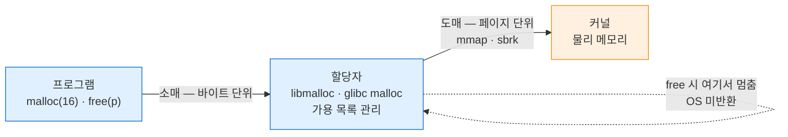
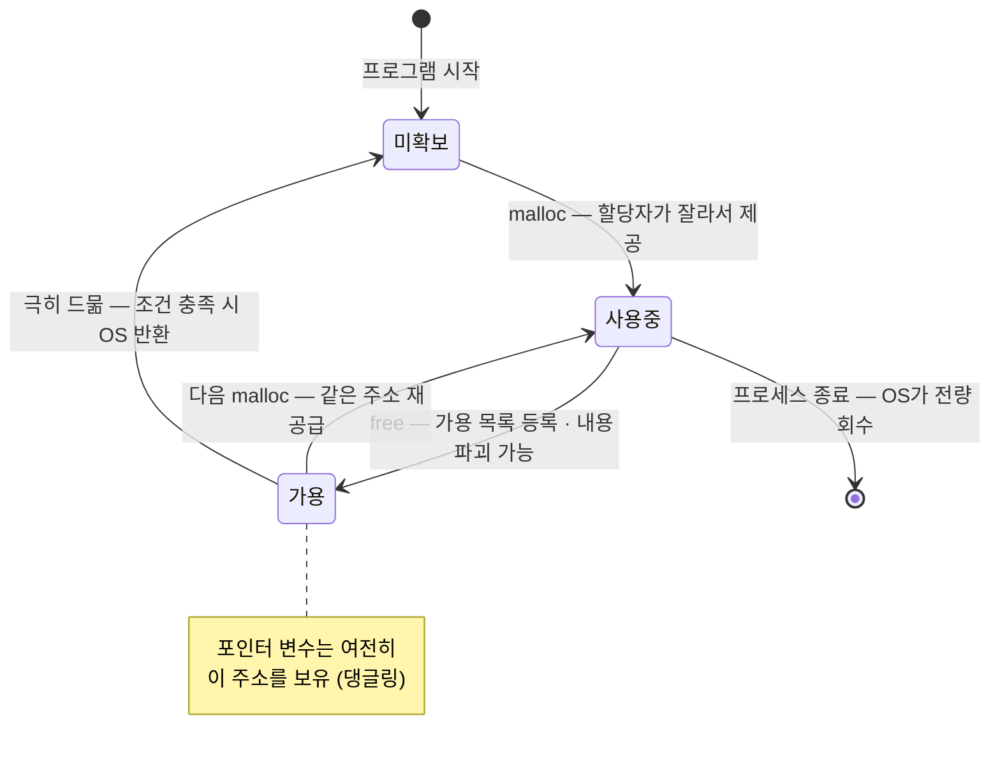

---
tags:
  - lang/c
  - c/memory
  - heap
  - free
  - malloc
  - use-after-free
  - allocator
  - status/verified
aliases:
  - free 동작 원리
  - 힙 할당자
  - dangling pointer
created: 2026-08-18
updated: 2026-08-18
---

# `free`의 실제 동작

> `free`는 **OS에 메모리를 반환하지 않음**. 할당자 내부 가용 목록에 등록할 뿐. 포인터 값도 그대로 잔존

## 개념

`free(p)` 수행 시 일어나는 일

| 항목 | 실제 동작 |
|---|---|
| OS에 메모리 반환 | **부재** (대부분). 할당자가 계속 보유 |
| 블록 내용 | 할당자 구현에 따라 **파괴 또는 잔존**. 어느 쪽도 무보장 |
| 포인터 변수 `p` | **불변**. 여전히 같은 주소 보유 → 댕글링 포인터 |
| 블록 상태 | "사용 중" → "가용" 표시. 재할당 대상으로 편입 |

`free`의 의미 — "이 블록을 다시 써도 된다고 **할당자에게 통보**". 물리 메모리 반납 아님

## 3계층 구조

프로그램은 OS와 직접 거래하지 않음. 중간의 **할당자**(libc malloc 구현)가 도매·소매 역할 수행



파란 = 사용자 공간 · 주황 = 커널 공간

- `malloc` — 할당자가 보유 중인 영역에서 **잘라서 제공**. 부족할 때만 커널에 요청
- `free` — 할당자에게 **반납**. 커널까지 내려가지 않음
- 이유 — 시스템 콜 비용 회피. 매 `free`마다 커널 왕복 시 성능 붕괴

## 실험 1 — `free` 후 블록 내용

`free` 직후 같은 주소를 읽어 내용 변화 관찰. **정의되지 않은 동작이므로 실증 목적 한정**

```c
#include <stdio.h>
#include <stdlib.h>
#include <string.h>

static void dump(const char *tag, const unsigned char *p, size_t n) {
    printf("%-10s", tag);
    for (size_t i = 0; i < n; i++) printf("%02x ", p[i]);
    printf(" | ");
    for (size_t i = 0; i < n; i++) putchar(p[i] >= 32 && p[i] < 127 ? p[i] : '.');
    putchar('\n');
}

int main(void) {
    unsigned char *p = malloc(32);
    memcpy(p, "ABCDEFGHIJKLMNOPQRSTUVWXYZ01234", 32);
    dump("free 전", p, 32);

    free(p);
    dump("free 후", p, 32);      /* 정의되지 않은 동작. 실증 목적 한정 */
    return 0;
}
```

```bash
cc -Wall -Wextra dump.c -o dump && ./dump
```

- `-Wall` — 주요 경고 활성. 미초기화 변수·타입 불일치 등 검출
- `-Wextra` — `-Wall` 미포함 추가 경고 활성
- `-o dump` — 출력 파일명을 `dump`로 지정. 미지정 시 `a.out`
- `&& ./dump` — 컴파일 성공 시에만 실행

```
free 전   41 42 43 44 45 46 47 48 49 4a 4b 4c 4d 4e 4f 50 51 52 53 54 55 56 57 58 59 5a 30 31 32 33 34 00  | ABCDEFGHIJKLMNOPQRSTUVWXYZ01234.
free 후   05 00 00 00 00 00 00 00 05 00 00 00 00 00 00 00 00 00 00 00 00 00 00 00 00 00 00 00 00 00 00 00  | ................................
```

- 원본 문자열 **완전 소멸**. macOS libmalloc이 블록 전체를 스크럽
- 앞 16바이트 `05 00 …` — 할당자가 기록한 **가용 목록 관리 정보**. 크기 클래스·연결 포인터 용도로 추정
- "`free` 후에도 데이터가 남는다"는 통념과 상반 — **구현 종속**
- glibc(Linux)는 앞부분 포인터만 덮어쓰고 뒤쪽 잔존하는 경향. **어느 쪽도 의존 불가**

보안 관점 — 비밀번호·키를 담았던 버퍼는 `free` 전에 명시적으로 덮어쓰기 필요. 잔존 여부가 무보장이므로 소거를 할당자에 위임 불가

### 덮어쓴 값의 정체 — free list 링크

`free` 직후 블록 앞부분에 나타나는 작은 정수(`0x02`·`0x03`·`0x05` 등)는 사용자 데이터의 잔재가 아니라 **할당자가 기록한 가용 목록 연결 정보**

블록을 띄워 `free`(사이에 살아있는 블록 유지 → 병합 차단)하면 구조가 드러남

```c
#include <stdio.h>
#include <stdlib.h>
#include <string.h>

#define N 8

int main(void) {
    unsigned char *p[N];
    for (int i = 0; i < N; i++) { p[i] = malloc(32); memset(p[i], 0xAA, 32); }

    printf("블록 간격 = %td 바이트 (%td quantum)\n\n",
           p[1] - p[0], (p[1] - p[0]) / 16);

    for (int i = 0; i < N; i += 2) {              /* 짝수만 해제 */
        free(p[i]);
        printf("\nfree(p[%d]) 후:\n", i);
        for (int j = 0; j <= i; j += 2) {
            unsigned long v0, v1;
            memcpy(&v0, p[j], sizeof v0);         /* UB — 실증 목적 한정 */
            memcpy(&v1, p[j] + 8, sizeof v1);
            printf("  p[%d] @%p : %#lx %#lx\n", j, (void *)p[j], v0, v1);
        }
    }
    for (int i = 1; i < N; i += 2) free(p[i]);
    return 0;
}
```

```bash
cc -Wall -Wextra offset.c -o offset && ./offset
```

- `-Wall` — 주요 경고 활성. 미초기화 변수·타입 불일치 등 검출
- `-Wextra` — `-Wall` 미포함 추가 경고 활성
- `-o offset` — 출력 파일명을 `offset`으로 지정. 미지정 시 `a.out`
- `&& ./offset` — 컴파일 성공 시에만 실행

```
블록 간격 = 32 바이트 (2 quantum)

free(p[0]) 후:
  p[0] @0x103035a10 : 0x3 0x3

free(p[2]) 후:
  p[0] @0x103035a10 : 0x3 0x11a5
  p[2] @0x103035a50 : 0x11a1 0x3

free(p[6]) 후:
  p[0] @0x103035a10 : 0x3 0x11a5
  p[2] @0x103035a50 : 0x11a1 0x11a9
  p[4] @0x103035a90 : 0x11a5 0x11ad
  p[6] @0x103035ad0 : 0x11a9 0x3
```

주소와 값을 대조하면 대응 관계가 성립. 각 주소를 16으로 나눈 하위값이 링크 값의 하위 바이트와 일치

| 블록 | 주소 | 주소/16 하위 | 첫 워드 | 둘째 워드 |
|---|---|---|---|---|
| `p[0]` | `0x…a10` | `a1` | `0x3` (끝) | `0x11a5` → `p[2]` |
| `p[2]` | `0x…a50` | `a5` | `0x11a1` → `p[0]` | `0x11a9` → `p[4]` |
| `p[4]` | `0x…a90` | `a9` | `0x11a5` → `p[2]` | `0x11ad` → `p[6]` |
| `p[6]` | `0x…ad0` | `ad` | `0x11a9` → `p[4]` | `0x3` (끝) |

- 구조 — **이중 연결 가용 목록**. 첫 워드 = 이전 블록, 둘째 워드 = 다음 블록
- 링크는 절대 주소가 아니라 **quantum(16바이트) 단위 압축 오프셋**. 작은 정수로 보이는 이유
- 상위 `0x11` 부분 — 검증용 태그로 추정. 힙 손상 탐지 목적
- **`0x3`처럼 이웃 없음을 뜻하는 종단값**은 프로그램의 할당 이력·magazine 상태에 따라 상이. `0x02`·`0x05` 등으로 관찰됨
- 이웃이 하나도 없는 상태(단독 해제)에서는 두 워드가 **같은 종단값** → `02 00 … 02 00 …` 형태로 나타남

정리하면 — 해제 블록 앞 16바이트는 할당자의 **장부 자리로 전용**됨. 사용자 값이 지워진 것이 아니라 **다른 용도로 재사용**된 결과

- 값의 정확한 인코딩은 libmalloc **구현 세부·버전 종속** → 해석에 의존 금지
- 실용적 함의 — `free` 후 앞부분을 읽으면 **원본과 무관한 작은 정수**가 보이는 것이 정상. 힙 손상 징후 아님
- 반대로 **사용 중** 블록에서 이런 값이 보이면 이중 `free` 또는 use-after-free 의심 근거

### 해제 후 재할당으로 덮어쓰이는 과정

`free` → 같은 크기 재요청 시 동일 블록 반환. 장부 값이 다시 사용자 데이터로 교체

```
argv1 = 0x10145d990 (실제 128 B, 토큰 3개)
free 전 (주소들): 000000016f22a7d8 000000016f22a7db 000000016f22a7de 0000000000000000
free 직후:        0000000000000005 0000000000000005 0000000000000000 0000000000000000

argv2 = 0x10145d990 → argv1과 동일 주소 (재사용)
재할당 후 argv1 위치: 000000016f22a7d0 000000016f22a7d4 000000016f22a7d6 0000000000000000
```

- `free` 직후 — 앞 두 칸만 종단값(`0x05`)으로 교체. **나머지 칸은 0으로 정리**
- 재할당 후 — 같은 주소에 새 토큰 주소들이 기록 → 이전 내용 완전 소멸
- 해제한 배열을 계속 참조하면 **다음 할당 시점에 값이 바뀜** → use-after-free가 간헐적으로만 드러나는 원인
- 진단 — ASan은 해제 블록을 격리해 재사용을 지연시키므로 이 은폐를 차단

## 실험 2 — 블록 재사용

`free`한 블록이 어디로 가는지 확인. 다음 `malloc`이 **같은 주소** 반환

```c
#include <stdio.h>
#include <stdlib.h>
#include <string.h>
#include <malloc/malloc.h>

int main(void) {
    char *p = malloc(16);
    strcpy(p, "HELLO");

    printf("요청 16B → 실제 확보 %zu B\n", malloc_size(p));
    printf("free 전 : 주소 %p, 내용 \"%s\"\n", (void *)p, p);

    free(p);

    /* 아래 두 줄은 정의되지 않은 동작. 실증 목적 한정 */
    printf("free 후 : 주소 %p (포인터 값 불변)\n", (void *)p);
    printf("free 후 : 첫 바이트 0x%02x\n", (unsigned char)p[0]);

    char *q = malloc(16);
    printf("재할당  : 주소 %p → %s\n", (void *)q,
           p == q ? "직전 블록 재사용" : "다른 블록");
    free(q);
    return 0;
}
```

```bash
cc -Wall -Wextra basic.c -o basic && ./basic
```

- `-Wall` — 주요 경고 활성. 미초기화 변수·타입 불일치 등 검출
- `-Wextra` — `-Wall` 미포함 추가 경고 활성
- `-o basic` — 출력 파일명을 `basic`으로 지정. 미지정 시 `a.out`
- `&& ./basic` — 컴파일 성공 시에만 실행

```
요청 16B → 실제 확보 16 B
free 전 : 주소 0x104e39b80, 내용 "HELLO"
free 후 : 주소 0x104e39b80 (포인터 값 불변)
free 후 : 첫 바이트 0x02
재할당  : 주소 0x104e39b80 → 직전 블록 재사용
```

- **포인터 값 불변** — `free`는 인자를 값으로 받으므로 호출자 변수 변경 불가. `p = NULL`은 별도 수행 필요
- 첫 바이트 `0x48`(`'H'`) → `0x02` 변경 확인
- 재할당 주소 **완전 동일** — 할당자가 방금 반납받은 블록을 즉시 재공급
- `malloc_size` — macOS 전용(`<malloc/malloc.h>`). Linux는 `malloc_usable_size`(`<malloc.h>`)

## 상태 전이

블록 관점의 생애 주기. `free`는 소멸이 아니라 **상태 변경**



프로세스 종료 시에는 OS가 전 페이지 회수 → **종료 직전 `free` 생략은 누수 아님**. 단 장기 실행 프로그램에서는 치명적

## 실험 3 — OS 반환 여부

`free` 후 실제 물리 메모리(RSS) 변화 측정. 최대치가 아닌 **현재값** 관찰 필요

```c
#include <stdio.h>
#include <stdlib.h>
#include <string.h>
#include <mach/mach.h>

static long rss_mb(void) {                    /* 현재 상주 메모리 (최대치 아님) */
    mach_task_basic_info_data_t info;
    mach_msg_type_number_t cnt = MACH_TASK_BASIC_INFO_COUNT;
    task_info(mach_task_self(), MACH_TASK_BASIC_INFO, (task_info_t)&info, &cnt);
    return (long)(info.resident_size / (1024 * 1024));
}

int main(void) {
    const size_t BIG   = 200u * 1024 * 1024;  /* 200 MB */
    const size_t SMALL = 1u * 1024 * 1024;    /* 1 MB */

    printf("시작           : 현재 RSS %3ld MB\n", rss_mb());

    char *big = malloc(BIG);
    memset(big, 1, BIG);                      /* 실제 물리 페이지 확보 */
    printf("200MB 사용     : 현재 RSS %3ld MB\n", rss_mb());
    free(big);
    printf("200MB free 후  : 현재 RSS %3ld MB\n", rss_mb());

    char *small[100];
    for (int i = 0; i < 100; i++) { small[i] = malloc(SMALL); memset(small[i], 1, SMALL); }
    printf("1MB x100 사용  : 현재 RSS %3ld MB\n", rss_mb());
    for (int i = 0; i < 100; i++) free(small[i]);
    printf("1MB x100 free  : 현재 RSS %3ld MB\n", rss_mb());
    return 0;
}
```

```bash
cc -Wall -Wextra rss2.c -o rss2 && ./rss2
```

- `-Wall` — 주요 경고 활성. 미초기화 변수·타입 불일치 등 검출
- `-Wextra` — `-Wall` 미포함 추가 경고 활성
- `-o rss2` — 출력 파일명을 `rss2`로 지정. 미지정 시 `a.out`
- `&& ./rss2` — 컴파일 성공 시에만 실행

```
시작           : 현재 RSS   1 MB
200MB 사용     : 현재 RSS 201 MB
200MB free 후  : 현재 RSS 201 MB
1MB x100 사용  : 현재 RSS 301 MB
1MB x100 free  : 현재 RSS 301 MB
```

- 200MB 해제 후에도 RSS **201MB 유지** → OS 미반환 확증
- 소형 블록 100개 해제 후에도 **301MB 유지**
- `memset` 필수 — 미접근 시 가상 주소만 확보되고 물리 페이지 미배정 → RSS 미증가
- `mach_task_basic_info` — macOS 전용. Linux는 `/proc/self/statm` 조회
- `getrusage`의 `ru_maxrss`는 **최대치**라 감소 미관찰 → 반환 여부 판정 불가. 현재값 측정 필수
- glibc는 대형 `mmap` 블록을 `free` 시 `munmap`으로 즉시 반환하는 경향 — **플랫폼 종속**. 본 결과는 macOS 실측

관찰 결과 — 메모리 사용량이 줄지 않는다고 곧바로 누수로 단정 불가. 할당자 보유분과 누수는 별개

## 실험 4 — 크기 클래스

할당자는 요청 크기를 그대로 쓰지 않고 **정해진 단위로 반올림**

```c
#include <stdio.h>
#include <stdlib.h>
#include <malloc/malloc.h>

int main(void) {
    size_t req[] = {1, 8, 16, 17, 32, 100, 1000};
    for (size_t i = 0; i < sizeof(req) / sizeof(*req); i++) {
        void *p = malloc(req[i]);
        printf("요청 %4zu B → 실제 %4zu B (낭비 %zu B)\n",
               req[i], malloc_size(p), malloc_size(p) - req[i]);
        free(p);
    }
    return 0;
}
```

```bash
cc -Wall -Wextra layout.c -o layout && ./layout
```

- `-Wall` — 주요 경고 활성. 미초기화 변수·타입 불일치 등 검출
- `-Wextra` — `-Wall` 미포함 추가 경고 활성
- `-o layout` — 출력 파일명을 `layout`으로 지정. 미지정 시 `a.out`
- `&& ./layout` — 컴파일 성공 시에만 실행

```
요청    1 B → 실제   16 B (낭비 15 B)
요청    8 B → 실제   16 B (낭비 8 B)
요청   16 B → 실제   16 B (낭비 0 B)
요청   17 B → 실제   32 B (낭비 15 B)
요청   32 B → 실제   32 B (낭비 0 B)
요청  100 B → 실제  112 B (낭비 12 B)
요청 1000 B → 실제 1024 B (낭비 24 B)
```

- **16바이트 단위 정렬** — 최소 할당 단위가 16B. `malloc(1)`도 16B 소비
- 소형 객체 다수 할당 시 낭비 누적 → 구조체 배열 일괄 할당이 유리
- 정렬 이유 — 모든 기본 타입(`double`·포인터 등)의 정렬 요구 충족 필요
- `free`가 크기를 인자로 받지 않는 이유 — 할당자가 **블록별 크기를 자체 기록** 중이므로 주소만으로 조회 가능

## 댕글링 포인터와 use-after-free

`free` 후에도 포인터가 유효한 주소를 담고 있어 **접근이 우연히 성공**

```c
#include <stdio.h>
#include <stdlib.h>
#include <string.h>

int main(void) {
    char *p = malloc(16);
    strcpy(p, "HELLO");
    free(p);
    printf("use-after-free: %s\n", p);   /* ← 정의되지 않은 동작 */
    free(p);                             /* ← 이중 free */
    return 0;
}
```

일반 빌드

```bash
cc -Wall -Wextra uaf.c -o uaf_plain && ./uaf_plain
```

- `-Wall` — 주요 경고 활성. 미초기화 변수·타입 불일치 등 검출
- `-Wextra` — `-Wall` 미포함 추가 경고 활성
- `-o uaf_plain` — 출력 파일명을 `uaf_plain`으로 지정. 미지정 시 `a.out`

- **컴파일 경고 0건.** `-Wall -Wextra`로도 미검출
- 이중 `free`에서 종료 코드 **133**(= 128 + 5, `SIGTRAP`) 발생. 오류 메시지 부재
- 크래시 직전 `printf` 출력은 버퍼에 갇혀 **유실** → [버퍼링 문서](../07-stdlib/06-stdio-buffering.md) 참조

## 검출 — AddressSanitizer

정확한 발생 위치·해제 위치·할당 위치를 전부 보고

```bash
cc -Wall -Wextra -g -fsanitize=address uaf.c -o uaf_asan && ./uaf_asan
```

- `-Wall` — 주요 경고 활성. 미초기화 변수·타입 불일치 등 검출
- `-Wextra` — `-Wall` 미포함 추가 경고 활성
- `-g` — 디버그 심볼 포함. 리포트에 **파일명·행 번호** 표시에 필요
- `-fsanitize=address` — 메모리 오류 검사 코드 삽입. 해제된 블록을 격리 구역에 보존해 재사용 지연
- `-o uaf_asan` — 출력 파일명을 `uaf_asan`으로 지정. 미지정 시 `a.out`

```
==14695==ERROR: AddressSanitizer: heap-use-after-free on address 0x6020000000f0 at pc 0x000105742e08
READ of size 2 at 0x6020000000f0 thread T0
    #2 0x000104dcc830 in main uaf.c:9

0x6020000000f0 is located 0 bytes inside of 16-byte region [0x6020000000f0,0x602000000100)
freed by thread T0 here:
    #1 0x000104dcc818 in main uaf.c:8

previously allocated by thread T0 here:
    #1 0x000104dcc7fc in main uaf.c:6

SUMMARY: AddressSanitizer: heap-use-after-free uaf.c:9 in main
```

이중 `free`만 단독 발생 시

```
==14821==ERROR: AddressSanitizer: attempting double-free on 0x6020000000f0 in thread T0:
    #1 0x000100ce081c in main dfree.c:7
freed by thread T0 here:
    #1 0x000100ce0808 in main dfree.c:5
```

- **3개 위치를 동시 제시** — 오류 발생 지점(`uaf.c:9`), 해제 지점(`uaf.c:8`), 최초 할당 지점(`uaf.c:6`)
- ASan이 해제 블록을 즉시 재사용하지 않고 **격리** → 재할당으로 은폐되는 현상 차단
- 비용 — 실행 속도 약 2배 저하, 메모리 사용 증가. 개발·테스트 빌드 한정 사용

## Java와의 차이

| 항목 | Java | C |
|---|---|---|
| 해제 주체 | GC 자동 | **개발자 수동** `free` |
| 해제 시점 | 참조 소멸 후 GC 판단 | `free` 호출 즉시 |
| 해제 후 참조 | **불가능** — 참조 있으면 미수거 | 포인터 잔존 → use-after-free |
| 이중 해제 | 개념 부재 | **힙 손상 · 크래시** |
| 메모리 압축 | GC가 객체 이동·압축 수행 | 이동 부재 → **단편화 누적** |
| OS 반환 | JVM 힙 정책에 따름 | 할당자 판단. 대개 미반환 |
| 누수 | 참조 유지로 발생 | `free` 누락으로 발생 |
| 사용량 감소 관찰 | GC 후 감소 가능 | `free` 후에도 **RSS 불변** |

- Java는 참조가 살아 있으면 수거하지 않음 → **use-after-free 원천 불가**
- C는 반대 — 해제해도 포인터가 살아 있음 → 개발자가 규율로 방어
- 대응 원칙 — `free` 직후 `p = NULL` 대입. 이후 접근이 즉시 널 역참조 크래시로 드러남

## 함정 · 주의점

- `free` 후 포인터 재사용 → use-after-free. `free(p); p = NULL;` 관용화
- `free(NULL)` — **안전**. 검사 불요
- 이중 `free` → 힙 손상 또는 `SIGTRAP`. 해제 후 `NULL` 대입으로 예방(`free(NULL)`이 무해하므로)
- `malloc` 반환 주소가 아닌 값 전달 → 정의되지 않은 동작
  ```c
  char *p = malloc(16);
  p++;                  // ← 주소 이동
  free(p);              // ← 잘못됨. 원래 주소 필요
  ```
- 스택 변수·문자열 리터럴 주소 `free` → 크래시
- `realloc` 후 이전 포인터 `free` → 이미 해제된 블록. `realloc`이 내부적으로 해제 수행
- `free` 후 메모리 사용량 미감소를 누수로 오판 → 할당자 보유분. `leaks`·ASan으로 판정
- 해제 전 민감 정보 미소거 → 잔존 가능. `memset` 후 `free` (컴파일러 최적화 제거 주의)
- 종료 직전 `free` 생략은 누수 아님 — 단 장기 실행 프로세스·라이브러리에서는 필수

## 검증

- [x] `free` 후 32바이트 전량 파괴 확인 (macOS)
- [x] `free` 후 포인터 값 불변 확인
- [x] 재할당 시 동일 주소 재사용 확인
- [x] 200MB·1MB×100 해제 후 RSS 불변 확인 (OS 미반환)
- [x] 16바이트 단위 크기 클래스 확인
- [x] 이중 `free` 종료 코드 133 확인
- [x] ASan use-after-free·double-free 리포트 확인
- [x] 해제 블록 앞 16바이트가 이중 연결 가용 목록 링크임을 주소 대조로 확인
- [x] 링크가 quantum 단위 압축 오프셋임을 확인 (`0x11a5` ↔ 주소 `0x…a50`)
- [x] 해제 후 동일 크기 재할당 시 같은 주소 반환·장부 값 교체 확인
- [ ] 링크 필드 상위 태그(`0x11`)의 정확한 의미 — libmalloc 구현 세부로 미확정
- [ ] glibc(Linux)의 `free` 후 내용 잔존·`munmap` 반환 동작 — 미검증

## 관련 문서

- [[C/docs/07-stdlib/03-stdlib|메모리 · 변환]] — `malloc`·`calloc`·`realloc`·`free` API 사용 규칙
- [[C/docs/01-basics/c-program-execution-model|C 프로그램의 동작 및 컴파일 방식]] — 스택·힙·데이터 세그먼트 배치
- [[C/docs/07-stdlib/06-stdio-buffering|표준 입출력 버퍼링과 fflush]] — 크래시 시 출력이 유실되는 이유
- [[C/docs/08-syntax/size-t-type|size_t 타입]] — `malloc` 인자의 곱셈 오버플로
- [[C/docs/08-syntax/double-pointer|이중 포인터]] — 해제·재할당 시 호출자 포인터를 갱신하는 구조
- [[C/docs/05-debugging/lldb-memory-inspection|lldb로 메모리 주소 값 조회하기]] — 해제 전후 블록을 디버거로 직접 관찰
- [[C/projects/make-shell/10-debugging|10 디버깅 · 검증]] — ASan·`leaks` 실전 적용
- [[C/docs/README|학습 문서 인덱스]] — 카테고리별 전체 문서 목록
