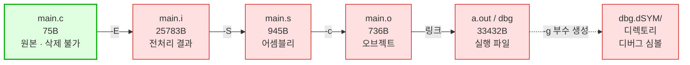
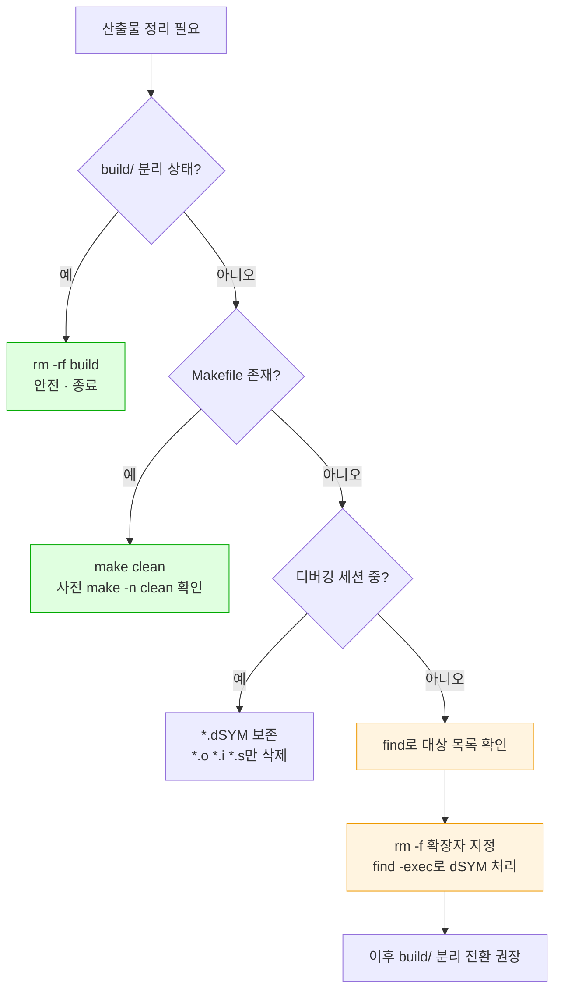

---
tags:
  - lang/c
  - c/build
  - build-artifacts
  - gitignore
  - cleanup
  - status/verified
aliases:
  - 빌드 산출물
created: 2026-08-14
updated: 2026-08-19
---

# 빌드 산출물 정리

> `cc`/`gcc` 실행으로 생기는 부산물의 종류·정리 방법·수동 삭제 시 주의점

## 개념

- 빌드 산출물 — 소스에서 파생된 파일 전체. 소스만 있으면 **언제든 재생성 가능**
- 재생성 가능 = 삭제해도 손실 없음 → 버전 관리 대상 아님
- 위험 지점 — 산출물과 소스가 **같은 디렉토리에 섞여 있는 경우**. 확장자 기반 일괄 삭제 시 소스 오삭제 위험
- 근본 해결 — 산출물 전용 디렉토리(`build/`) 분리 → 디렉토리 통째 삭제로 정리 완료

## 산출물 종류

컴파일 단계별로 다른 산출물 생성. 각 단계는 [컴파일 4단계](../01-basics/c-program-execution-model.md) 참조

| 파일 | 생성 명령 | 정체 | 삭제 안전성 |
|---|---|---|---|
| `main.i` | `cc -E main.c -o main.i` | 전처리 결과 (헤더 전개된 C 소스) | 안전 |
| `main.s` | `cc -S main.c -o main.s` | 어셈블리 소스 | 안전 |
| `main.o` | `cc -c main.c` | 오브젝트 파일 (기계어, 링크 전) | 안전 |
| `a.out` | `cc main.c` | 실행 파일. `-o` 미지정 시 기본명 | 안전 |
| `dbg` | `cc -g main.c -o dbg` | 실행 파일 (디버그 심볼 포함) | 안전 |
| `dbg.dSYM/` | `cc -g` 부수 생성 (macOS) | 디버그 심볼 번들 **디렉토리** | 조건부 — 아래 참조 |
| `*.d` | `cc -MMD` | 헤더 의존성 목록 (Make용) | 안전 |
| `cmake-build-*/` | CLion 빌드 | CMake 캐시·산출물 전체 | 안전 |

`.dSYM`은 **파일이 아니라 디렉토리** → `rm -f`로 삭제 불가, `rm -rf` 필요

## 실제 생성 확인

단일 소스에 각 단계 명령 적용 후 목록 확인

```c
#include <stdio.h>
int main(void) {
    printf("hello\n");
    return 0;
}
```

```bash
cc main.c
cc -c main.c
cc -g main.c -o dbg
cc -E main.c -o main.i
cc -S main.c -o main.s
ls -la
```

- `-c` — 컴파일까지만 수행, 링크 생략 → `main.o` 생성
- `-g` — 디버그 심볼 포함. macOS에서 `dbg.dSYM/` 번들 부수 생성
- `-o dbg` — 출력 파일명 지정. 미지정 시 `a.out`
- `-E` — 전처리까지만 수행 → 헤더 전개된 C 소스 출력
- `-o main.i` — 전처리 결과 저장 파일명
- `-S` — 컴파일까지만 수행 → 어셈블리 출력
- `-o main.s` — 어셈블리 저장 파일명
- `ls -la` — 숨김 파일 포함 상세 목록

```
-rwxr-xr-x@  1 sunwoo  wheel  33432 Aug 14 15:11 a.out
-rwxr-xr-x@  1 sunwoo  wheel  33648 Aug 14 15:11 dbg
drwxr-xr-x@  3 sunwoo  wheel     96 Aug 14 15:11 dbg.dSYM
-rw-r--r--@  1 sunwoo  wheel     75 Aug 14 15:11 main.c
-rw-r--r--@  1 sunwoo  wheel  25783 Aug 14 15:11 main.i
-rw-r--r--@  1 sunwoo  wheel    736 Aug 14 15:11 main.o
-rw-r--r--@  1 sunwoo  wheel    945 Aug 14 15:11 main.s
```

`dbg.dSYM` 행 선두 `d` → 디렉토리. 나머지 산출물은 일반 파일

## 산출물 관계도

소스 하나에서 파생되는 산출물의 계보. 화살표 방향 = 재생성 방향 → 상위 노드만 있으면 하위 전부 복구 가능



- 초록 = 보존 필수 (사람이 작성한 원본)
- 빨강 = 삭제 가능 (재생성 가능한 파생물)

## Java와의 차이

| 항목 | Java | C |
|---|---|---|
| 산출물 위치 | `target/`·`build/` 자동 분리 (Maven·Gradle 규약) | 기본값 = **소스와 같은 디렉토리** |
| 정리 명령 | `mvn clean`·`gradle clean` 표준 제공 | 표준 부재 → `rm` 직접 실행 또는 `make clean` 자작 |
| 중간 산출물 | `.class` 단일 종류 | `.i`·`.s`·`.o`·`.dSYM` 등 단계별 다종 |
| 오삭제 위험 | 낮음 — 디렉토리 분리로 소스와 미혼재 | **높음** — 소스와 혼재 → 글롭 실수 시 소스 손실 |
| stale 산출물 | 빌드 도구가 타임스탬프 자동 추적 | `cc` 단독 실행 시 추적 부재 → 수동 관리 |

핵심 차이 — Java는 빌드 도구가 산출물 격리·정리를 대신 처리. C는 `cc` 단독 사용 시 **전부 수동 책임**

## 정리 방법 — 권장 순서

### 1순위 — 산출물 디렉토리 분리 (최선)

애초에 섞이지 않게 하는 방식. 오삭제 위험 원천 제거

```bash
mkdir -p build
cc -c main.c -o build/main.o
cc build/main.o -o build/app
rm -rf build
```

- `mkdir -p build` — `build` 디렉토리 생성. `-p` 지정 시 이미 존재해도 에러 미발생
- `-c` — 링크 생략, 오브젝트 파일까지만 생성
- `-o build/main.o` — 산출물을 `build/` 하위에 배치
- `-o build/app` — 실행 파일도 `build/` 하위 배치
- `rm -rf build` — 디렉토리 통째 삭제. `-r` 재귀, `-f` 미존재 시 에러 억제

소스는 `build/` 밖에 있으므로 **소스 오삭제 구조적으로 불가**

### 2순위 — `make clean` 정의

Makefile 사용 시 정리 규칙 등록. 상세는 [Makefile 작성법](makefile-guide.md) 참조

```make
clean:
	rm -rf build $(TARGET) $(TARGET).dSYM

.PHONY: clean
```

- `.PHONY: clean` — `clean`이라는 **파일**이 존재해도 명령을 실행하도록 지정. 미지정 시 "이미 최신"으로 판단해 건너뜀

```bash
make clean
```

### 3순위 — 수동 `rm` (소스 혼재 시)

디렉토리 분리 전 임시 대응. **아래 주의점 전부 숙지 후 실행**

```bash
rm -f *.o *.i *.s *.d a.out
find . -name "*.dSYM" -exec rm -rf {} +
```

- `rm -f` — 파일 삭제. `-f` 지정 시 대상 미존재해도 에러 미발생
- `*.o *.i *.s *.d a.out` — 삭제 대상 패턴. `.c`·`.h` **미포함**이 핵심
- `find .` — 현재 디렉토리 이하 재귀 탐색
- `-name "*.dSYM"` — 이름 패턴 매치. 따옴표로 감싸 셸 글롭 확장 차단
- `-exec rm -rf {} +` — 매치된 항목에 `rm -rf` 실행. `{}` = 매치 결과, `+` = 여러 건 일괄 전달

## 함정 · 주의점

### 1. zsh 글롭 미매치 → 명령 중단

macOS 기본 셸 zsh는 글롭 패턴이 아무것도 매치하지 않으면 **에러 발생 후 명령 미실행**. bash는 패턴 문자열을 그대로 전달 → 동작 차이 존재

```bash
rm -rf *.dSYM
```

- `-r` — 재귀 삭제 (디렉토리 대상)
- `-f` — 대상 미존재 시 에러 억제. **단 글롭 미매치는 억제 대상 아님**

```
(eval):1: no matches found: *.dSYM
exit=1
```

`-f`를 붙여도 방지 불가 — 에러 주체가 `rm`이 아니라 **zsh 자체**이기 때문

증상 — 여러 정리 명령을 `&&`로 연결한 경우 이 지점에서 **뒤 명령 전부 미실행**. 정리한 줄 알았으나 산출물 잔존

회피 — `find` 사용

```bash
find . -name "*.dSYM" -exec rm -rf {} +
```

```
exit=0
```

매치 0건이어도 정상 종료 → 스크립트 중단 부재

### 2. stale `.o` — 소스 수정이 실행 파일에 미반영

`.o`를 남긴 채 링크만 재실행하면 **수정 전 코드로 빌드됨**. Java의 증분 컴파일과 달리 `cc` 단독 실행은 타임스탬프 추적 부재

재현 — `printf("hello\n")`로 `.o` 생성 → 소스를 `printf("changed\n")`로 수정 → `.o`만 링크

```bash
cc main.o -o stale
./stale
```

- `main.o` — 이미 존재하는 오브젝트 파일을 입력으로 사용. 소스 재컴파일 미수행
- `-o stale` — 출력 실행 파일명
- `./stale` — 현재 디렉토리의 실행 파일 실행. `./` 미지정 시 `PATH` 탐색 → 미발견

```
hello
```

소스는 `changed`인데 출력은 `hello` → `.o`가 예전 코드 보존

교훈 — 디버깅 중 원인 불명의 동작 지속 시 **`.o` 삭제 후 전체 재빌드** 우선 시도

### 3. `.dSYM` 삭제 → lldb 소스 행 표시 상실

`-g`로 빌드해도 macOS는 디버그 정보를 실행 파일이 아닌 **별도 `.dSYM` 번들**에 배치. 번들 삭제 시 소스 레벨 디버깅 불가

#### 생성 조건 — 단일 명령일 때만

`-g` 지정만으로 항상 생기지 않음. **컴파일과 링크를 한 명령으로 수행할 때만** 부수 생성

```bash
cc main.c -o main                                    # A. -g 없음
cc -g -c main.c -o main.o && cc -g main.o -o main    # B. 분리 컴파일 후 링크
cc -g main.c -o main                                 # C. 단일 명령
```

- `-g` — 디버그 심볼 포함. `.dSYM` 생성 여부를 가르는 조건
- `-c` — 컴파일까지만 수행하고 링크 생략 → 목적 파일(`.o`) 생성
- `-o main.o` · `-o main` — 출력 파일명 지정. 미지정 시 `a.out`
- `&&` — 앞 명령 성공 시에만 다음 실행

| 방식 | `.dSYM` |
|---|---|
| A. `-g` 미지정 | **부재** |
| B. `-g` + 분리 컴파일 | **부재** |
| C. `-g` + 단일 명령 | **생성** (20K 내외) |

이유 — 단일 명령은 중간 `.o`가 임시 파일이라 링크 후 삭제됨. 디버그 정보 유실 방지 목적으로 `dsymutil` 자동 실행해 번들 보존. 분리 컴파일은 `.o`가 남으므로 불요

`.dSYM` 부재 상태에서도 `.o` 보존 시 디버깅 정상

```bash
cc -g -c main.c -o main.o && cc -g main.o -o main
lldb -b -o "breakpoint set -f main.c -l 40" -o "run" -o "frame variable cap" ./main
```

- `-g` — 디버그 심볼 포함. `.o` 안에 배치
- `-c` — 링크 생략. `.o` 생성
- `-o main.o` · `-o main` — 출력 파일명 지정
- `lldb -b` — 배치 모드. 명령 수행 후 자동 종료
- `-o "<명령>"` — 시작 시 실행할 lldb 명령
- `breakpoint set -f main.c -l 40` — `main.c` 40행에 브레이크포인트
- `run` — 실행
- `frame variable cap` — 지역 변수 `cap` 출력

```
Breakpoint 1: where = main`read_line + 56 at main.c:40:5, address = 0x0000000100000618
(size_t) cap = 16
```

- 소스 행(`main.c:40`)·변수값 정상 표시 → `.dSYM` 없이도 **`.o` 경유 심볼 해석**
- 단 `.o` 삭제 시 심볼 상실 → 배포·이관 시에는 `.dSYM` 보존이 안전

`.dSYM` 삭제 후 lldb 실행

```bash
lldb -b -o "b main" -o "run" -o "bt" ./dbg
```

- `-b` — 배치 모드. 명령 실행 후 자동 종료
- `-o "b main"` — `main`에 브레이크포인트 설정
- `-o "run"` — 프로그램 실행
- `-o "bt"` — 백트레이스 출력
- `./dbg` — 디버깅 대상 실행 파일

```
Process 44346 stopped
* thread #1, queue = 'com.apple.main-thread', stop reason = breakpoint 1.1
    frame #0: 0x0000000100000460 dbg`main
dbg`main:
->  0x100000460 <+0>:  sub    sp, sp, #0x20
    0x100000464 <+4>:  stp    x29, x30, [sp, #0x10]
    0x100000468 <+8>:  add    x29, sp, #0x10
    0x10000046c <+12>: mov    w8, #0x0                  ; =0 
```

소스 행 대신 **어셈블리 표시** → `main.c:3` 형태 위치 정보 상실

판단 기준 — 디버깅 세션 중이면 `.dSYM` 보존, 종료 후면 삭제 가능. 삭제해도 `cc -g` 재실행으로 재생성

### 4. 확장자 없는 실행 파일 — 패턴 매치 불가

C 실행 파일은 확장자 부재(`app`, `mysh`, `dbg`) → `*.exe` 같은 패턴 사용 불가. 소스·문서와 육안 구분 어려움

`file`로 판별

```bash
for f in *; do [ -f "$f" ] && file "$f" | grep -q "Mach-O.*executable" && echo "실행 파일: $f"; done
```

- `for f in *` — 현재 디렉토리 항목 순회
- `[ -f "$f" ]` — 일반 파일 여부 검사. 디렉토리 제외
- `file "$f"` — 파일 종류 판별
- `grep -q` — 매치 여부만 검사, 출력 억제
- `"Mach-O.*executable"` — macOS 실행 파일 시그니처

```
실행 파일: a.out
실행 파일: dbg
실행 파일: stale
```

참고 — 각 산출물의 `file` 판별 결과

```
a.out:  Mach-O 64-bit executable arm64
main.o: Mach-O 64-bit object arm64
main.i: c program text, ASCII text
main.s: assembler source text, ASCII text
```

`main.i`는 `c program text`로 판별 → **확장자로만 구분해야 소스와 미혼동**

### 5. `rm -rf $VAR` — 변수 미정의 시 재앙

Makefile·스크립트에서 변수 오타·미정의 시 `rm -rf` 단독 실행 → 현재 디렉토리 전체 삭제 위험

```make
clean:
	rm -rf $(BUILDDIR)      # BUILDDIR 미정의 → rm -rf 단독 실행
```

회피 — 변수 대신 리터럴 경로 사용, 또는 Make 실행 전 `make -n clean`으로 확인

```bash
make -n clean
```

- `-n` — dry-run. 실행할 명령을 출력만 하고 미실행

### 6. 삭제 전 확인 습관

수동 `rm` 실행 전 `find`로 대상 목록 확인 → 예상 밖 파일 포함 여부 검증

```bash
find . -name "*.o" -o -name "*.i" -o -name "*.s" -o -name "a.out" -o -name "*.dSYM"
```

- `-o` — OR 조건 결합
- 삭제 명령 미포함 → **목록만 출력**

```
./main.o
./main.s
./main.i
./a.out
```

목록에 `.c`·`.h`가 없음을 확인한 뒤 `rm` 실행

## 정리 판단 흐름



## `.gitignore` 등록

산출물은 재생성 가능 → 커밋 대상 아님. 최소 등록 목록

```
# 빌드 산출물
*.o
*.i
*.s
*.d
*.dSYM/
a.out
build/
cmake-build-*/

# 확장자 없는 실행 파일 — 개별 지정 필요
mysh
app
```

- `*.dSYM/` — 후행 `/` 지정 시 디렉토리만 매치
- 확장자 없는 실행 파일은 패턴 매치 불가 → **파일명 개별 등록** 또는 `build/` 하위 배치로 일괄 해결

### 함정 — `.dSYM` 미등록 시 번들 일부만 추적

`*.dSYM/` 누락 상태에서 실행 파일명(`main`)만 등록하면 **번들이 쪼개져** 추적됨

```bash
git check-ignore -v src/main.dSYM/Contents/Resources/DWARF/main
git check-ignore -v src/main.dSYM/Contents/Info.plist
```

- `git check-ignore` — 지정 경로가 어느 규칙으로 무시되는지 조회
- `-v` — 매치된 `.gitignore` 파일·행 번호·패턴 함께 출력. 미매치 시 출력 부재

```
.gitignore:15:main	src/main.dSYM/Contents/Resources/DWARF/main
```

- `DWARF/main` — 파일명이 `main`이라 **실행 파일 규칙에 걸려 무시**
- `Info.plist`·`Relocations/aarch64/main.yml` — 매치 규칙 부재 → **추적 대상**
- 결과 — 정작 디버그 정보 본체(`DWARF/main`)는 빠지고 **껍데기만 커밋**. 저장소 오염 + 무용지물
- `.gitignore` 규칙이 파일명 기준이라 **번들 내부까지 개별 적용**되는 데서 발생
- 예방 — `*.dSYM/`을 명시 등록해 번들 전체를 일괄 제외

이미 스테이징된 경우 인덱스에서만 제거 (작업 파일 보존)

```bash
git rm -r --cached src/main.dSYM
```

- `git rm` — 추적 목록에서 제거
- `-r` — 디렉토리 재귀 처리. `.dSYM`은 디렉토리이므로 필수
- `--cached` — **인덱스에서만** 제거. 작업 디렉토리 파일은 유지

## CLion 팁

- CLion은 `cmake-build-debug/`·`cmake-build-release/`에 산출물 자동 격리 → 소스 혼재 문제 미발생
- 메뉴 `Build > Clean` = `make clean` 대응. 캐시까지 지우려면 `Tools > CMake > Reset Cache and Reload Project`
- 터미널에서 `cc` 직접 실행한 산출물은 CLion `Clean` 대상 **미포함** → 수동 삭제 필요
- 프로젝트 루트에 정체불명 실행 파일이 보이면 대개 터미널 수동 컴파일 잔여물

## 관련 문서

- [[C/docs/03-build/gcc-compile-and-run|gcc 컴파일 · 실행 명령어]] — 컴파일 명령과 옵션 전반
- [[C/docs/03-build/makefile-guide|Makefile 작성법]] — 빌드 자동화와 증분 빌드
- [[C/docs/03-build/cmake-guide|CMakeLists.txt 작성법]] — `cmake-build-*/`·`CMakeCache.txt` 생성 주체와 out-of-source 빌드
- [[C/docs/01-basics/c-program-execution-model|C 프로그램의 동작 및 컴파일 방식]] — 소스가 실행 파일이 되는 과정
- [[C/docs/04-project-layout/source-file-types|C 소스코드 구성 요소]] — `.c`·`.h`·`.o`·`.a` 파일 역할
- [[C/docs/README|학습 문서 인덱스]] — 카테고리별 전체 문서 목록
