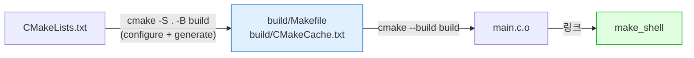
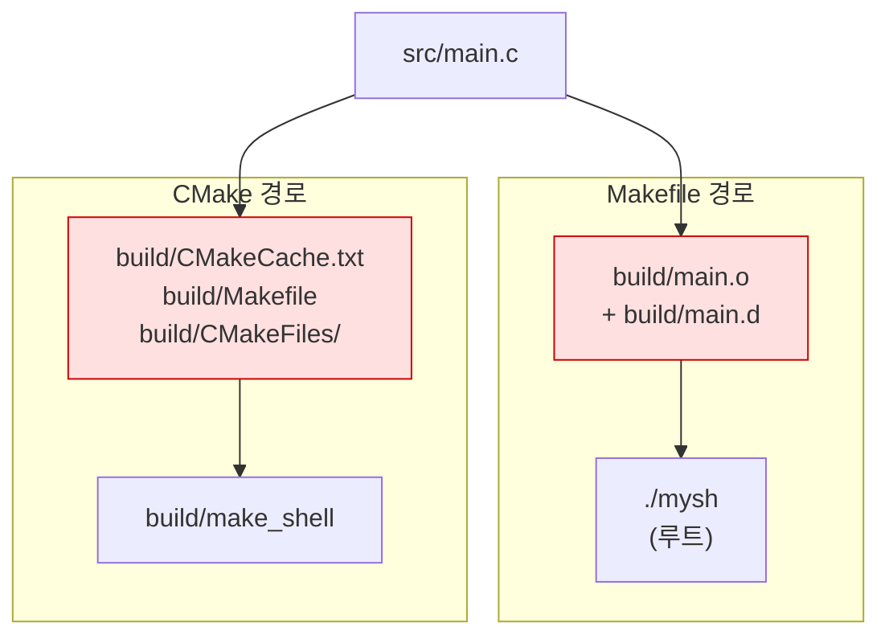

---
tags:
  - lang/c
  - c/build
  - cmake
  - clion
  - out-of-source
  - project/make-shell
  - status/wip
aliases:
  - CMakeLists.txt
  - CMake 작성법
created: 2026-08-14
updated: 2026-08-14
---

# CMakeLists.txt 작성법과 Makefile 병행 시 충돌

> CMake — 빌드 파일 **생성** 도구. `CMakeLists.txt` 기본 명령 · out-of-source 빌드 · CLion 연동 · Makefile 동시 사용 시 충돌 4종 정리

## 역할

- 빌드 **실행**이 아니라 빌드 **파일 생성** — `CMakeLists.txt` → `Makefile`·Ninja·Xcode 프로젝트 산출
- 크로스 플랫폼 — 동일 `CMakeLists.txt`로 macOS·Linux·Windows 대응. 컴파일러·경로 차이를 CMake가 흡수
- CLion 기본 빌드 시스템 — 프로젝트 인식·인덱싱·디버거 연동이 `CMakeLists.txt` 기준

2단 구조 — `cmake`로 빌드 파일 생성(configure·generate) 후 `cmake --build`로 실제 컴파일



- Make는 1단(`Makefile` → 컴파일), CMake는 2단. 중간에 생성물이 끼는 구조가 아래 충돌 문제의 근원

## Java와의 차이

| 항목 | Java (Gradle·Maven) | C (CMake) |
|---|---|---|
| 성격 | 빌드 실행 도구 | 빌드 파일 **생성** 도구 |
| 산출물 위치 | `build/`·`target/` 관례 강제 | 사용자가 `-B`로 지정 |
| 소스 목록 | 디렉토리 규칙으로 자동 수집 | `add_executable`에 **명시 열거** |
| 의존성 | 저장소 자동 다운로드 | `find_package`·수동 설치 |
| 표준 지정 | `sourceCompatibility` | `set(CMAKE_C_STANDARD 99)` |
| 캐시 | 도구 내부 관리 | `CMakeCache.txt` 파일로 노출 |

- Gradle과 달리 **소스 자동 수집 부재** — 파일 추가 시 `CMakeLists.txt` 수정 필요. 아래 충돌 2번의 원인

## 최소 CMakeLists.txt

`make-shell` 프로젝트의 초기 상태

```cmake
cmake_minimum_required(VERSION 3.19)
project(make_shell_project C)

set(CMAKE_C_STANDARD 99)

add_executable(make_shell src/main.c)
```

명령별 역할

| 명령                                     | 역할                                         |
| -------------------------------------- | ------------------------------------------ |
| `cmake_minimum_required(VERSION 3.19)` | 최소 CMake 버전. 미달 시 configure 중단. **최상단 필수** |
| `project(make_shell_project C)`        | 프로젝트명 + 사용 언어. `C` 명시 시 C++ 컴파일러 탐색 생략     |
| `set(CMAKE_C_STANDARD 99)`             | C 표준 지정 → `-std=gnu99` 전달                  |
| `add_executable(<타겟> <소스...>)`         | 실행 파일 타겟 정의. 타겟명이 산출 파일명                   |

- `project()`의 프로젝트명(`make_shell_project`)과 `add_executable()`의 타겟명(`make_shell`)은 **별개**. 실행 파일명은 타겟명

## out-of-source 빌드

소스 디렉토리와 빌드 디렉토리를 분리하는 방식. CMake 권장 형태

```bash
cmake -S . -B build
```

- `-S .` — 소스 디렉토리(`CMakeLists.txt` 위치) 지정
- `-B build` — 빌드 디렉토리 지정. 부재 시 자동 생성

```text
-- The C compiler identification is AppleClang 21.0.0.21000101
-- Detecting C compiler ABI info
-- Detecting C compiler ABI info - done
-- Check for working C compiler: /usr/bin/cc - skipped
-- Detecting C compile features
-- Detecting C compile features - done
-- Configuring done (0.4s)
-- Generating done (0.0s)
-- Build files have been written to: .../make-shell/build
```

빌드 실행

```bash
cmake --build build
```

- `--build build` — 지정 디렉토리의 생성된 빌드 파일로 컴파일 수행. 생성기(Make·Ninja) 종류와 무관한 통일 명령

```text
[ 50%] Building C object CMakeFiles/make_shell.dir/src/main.c.o
[100%] Linking C executable make_shell
[100%] Built target make_shell
```

- 생성물 전량이 빌드 디렉토리 안에만 존재 → 삭제 시 디렉토리 하나 제거로 완결
- in-source 빌드(`cmake .`)는 소스 트리에 `CMakeCache.txt`·`CMakeFiles/`를 흩뿌림 → **비권장**

실제 컴파일 명령 확인

```bash
cmake --build build --clean-first -- VERBOSE=1
```

- `--clean-first` — 빌드 전 기존 산출물 제거. 전체 재컴파일 강제
- `-- VERBOSE=1` — `--` 뒤는 생성기로 전달. Make 생성기에서 실제 명령 출력

```text
/usr/bin/cc   -std=gnu99 -arch arm64 -MD -MT CMakeFiles/make_shell.dir/src/main.c.o -MF CMakeFiles/make_shell.dir/src/main.c.o.d -o CMakeFiles/make_shell.dir/src/main.c.o -c .../src/main.c
[100%] Linking C executable make_shell
/usr/bin/cc  -arch arm64 -Wl,-search_paths_first -Wl,-headerpad_max_install_names CMakeFiles/make_shell.dir/src/main.c.o -o make_shell
```

- `-MD -MT -MF` — CMake가 헤더 의존성 추적을 **자동 삽입**. Makefile에서 `-MMD -MP`를 손으로 넣던 부분에 해당
- `-arch arm64` — macOS 아키텍처 자동 지정
- `-Wall -Wextra -g` **부재** → 아래 충돌 3번

## 주요 명령 추가

### 헤더 경로

```cmake
target_include_directories(make_shell PRIVATE include)
```

- Makefile의 `-Iinclude`에 해당
- `PRIVATE` — 이 타겟만 사용. `PUBLIC`은 이 타겟에 링크하는 타겟까지 전파(라이브러리 작성 시 사용)
- 미지정 시 `include/`의 헤더를 `#include "util.h"` 형태로 찾지 못함

### 컴파일 옵션

```cmake
target_compile_options(make_shell PRIVATE -Wall -Wextra -g)
```

- 특정 타겟에만 적용. **권장 형태**
- 전역 변수 방식도 존재 — `set(CMAKE_C_FLAGS "-Wall -Wextra -g")`. 하위 모든 타겟에 적용되며 기존 값을 덮어쓸 위험 → 타겟 단위 명령 우선

### 표준 엄격 적용

```cmake
set(CMAKE_C_STANDARD 99)
set(CMAKE_C_STANDARD_REQUIRED ON)
set(CMAKE_C_EXTENSIONS OFF)
```

- `CMAKE_C_STANDARD 99` 단독 지정 시 → `-std=gnu99` (GNU 확장 포함)
- `CMAKE_C_EXTENSIONS OFF` 추가 시 → `-std=c99` (순수 표준)
- `CMAKE_C_STANDARD_REQUIRED ON` — 컴파일러가 미지원 시 하향 조정 없이 오류

## Makefile 병행 시 충돌 4종

`make-shell`은 `Makefile`과 `CMakeLists.txt`를 동시 보유. **양쪽 모두 빌드 성공하나 결과가 상이**

두 빌드의 소스·산출물 관계



- `build/` 디렉토리를 **양쪽이 서로 다른 용도로 점유** → 충돌 1번

### 1. `build/` 디렉토리 충돌 (실제 버그)

Makefile은 `OBJDIR := build`를 오브젝트 저장소로 사용. CMake를 관례대로 `build/`에 configure하면 동일 디렉토리 점유

```bash
cmake -S . -B build
```

- `-S .` — 소스 디렉토리
- `-B build` — Makefile이 이미 `main.o`를 두고 있는 디렉토리

```text
-- Build files have been written to: .../make-shell/build
```

configure 후 `build/` 내용 — 두 도구의 산출물 혼재

```bash
ls build/
```

```text
CMakeCache.txt
CMakeFiles
Makefile
cmake_install.cmake
main.d
main.o
```

발생 문제 3가지

- **`build/Makefile` 생성** — CMake가 자체 `Makefile`을 그 위치에 씀. `build/`에서 `make` 실행 시 프로젝트 Makefile이 아닌 CMake 생성 Makefile이 동작
- **`make clean`이 CMake 캐시 전량 삭제** — `rm -rf $(OBJDIR)`가 `CMakeCache.txt`·`CMakeFiles/`까지 제거

```bash
make clean && ls build
```

```text
rm -rf build mysh
ls: build: No such file or directory
```

- 이후 CLion은 재configure 강제 → 빌드 지연·인덱싱 재수행

**회피** — 빌드 디렉토리 분리. CLion 기본값이 `cmake-build-debug/`이므로 그대로 사용

```bash
cmake -S . -B cmake-build-debug
```

- `-B cmake-build-debug` — Makefile의 `build/`와 무충돌 경로

### 2. 소스 목록 방식 상이

| | Makefile | CMakeLists.txt |
|---|---|---|
| 소스 지정 | `$(wildcard src/*.c)` 자동 수집 | `src/main.c` 명시 열거 |

- `src/`에 `.c` 추가 시 — `make`는 자동 인식, CMake는 **조용히 무시**
- 결과 — CMake 빌드에서만 `Undefined symbols` 링크 오류. 파일이 늘어나는 순간 갈라짐

`file(GLOB ...)`로 자동 수집이 가능하나 **비권장** — configure 시점에 목록 확정 → 파일 추가 후에도 재configure 없이 이전 목록 사용. `add_executable`에 수동 추가가 안전

### 3. 컴파일 플래그 상이

`compile_commands.json`으로 실제 명령 비교

```bash
cmake -S . -B cmake-build-debug -DCMAKE_EXPORT_COMPILE_COMMANDS=ON
```

- `-DCMAKE_EXPORT_COMPILE_COMMANDS=ON` — 컴파일 명령 DB 생성. `-D`는 CMake 캐시 변수 설정

```text
CMake:    cc -std=gnu99 -arch arm64 -c src/main.c
Makefile: cc -Wall -Wextra -g -Iinclude -MMD -MP -c src/main.c -o build/main.o
```

차이별 영향

| 항목 | 영향 |
|---|---|
| `-Wall -Wextra` 부재 | **CLion에서 경고 미표시**, `make`에서만 표시 → 경고 누락 |
| `-Iinclude` 부재 | `include/` 헤더 참조 시 CMake 빌드만 실패 |
| `-g` 부재 | 디버그 심볼 부재 → 디버거 행 번호 미표시 |
| `-std=gnu99` vs 표준 | GNU 확장 허용 여부 차이 |

- `-g` 부재 원인 — `CMAKE_BUILD_TYPE` 미지정 시 기본값 공백 → 최적화·디버그 플래그 전무

### 4. 산출물 이름·위치 상이

| | 산출물 |
|---|---|
| `make` | `./mysh` (프로젝트 루트) |
| CMake | `build/make_shell` |

- `make run`(`./$(TARGET)`)은 CMake 산출물 미실행 → 두 빌드 결과가 별개 파일로 공존
- 오래된 한쪽을 실행하며 수정이 반영되지 않는다고 오판할 위험

## 수정안

충돌 1·3번 해소 형태. 2·4번은 학습용 병행 시 인지만으로 무해

```cmake
cmake_minimum_required(VERSION 3.19)
project(make_shell_project C)

set(CMAKE_C_STANDARD 99)
set(CMAKE_C_STANDARD_REQUIRED ON)
set(CMAKE_C_EXTENSIONS OFF)

add_executable(make_shell src/main.c)
target_include_directories(make_shell PRIVATE include)
target_compile_options(make_shell PRIVATE -Wall -Wextra -g)
```

```bash
cmake -S . -B cmake-build-debug && cmake --build cmake-build-debug -- VERBOSE=1
```

- `-S .` — 소스 디렉토리
- `-B cmake-build-debug` — Makefile의 `build/`와 분리
- `-- VERBOSE=1` — 실제 컴파일 명령 출력

```text
/usr/bin/cc  -I/tmp/cmfix/include -std=c99 -arch arm64 -Wall -Wextra -g -MD -MT CMakeFiles/make_shell.dir/src/main.c.o -MF CMakeFiles/make_shell.dir/src/main.c.o.d -o CMakeFiles/make_shell.dir/src/main.c.o -c /tmp/cmfix/src/main.c
```

- `-Iinclude`·`-Wall -Wextra -g` 반영 확인 → Makefile과 플래그 일치
- 검증 환경 — `/tmp/cmfix`에 동일 구성 복제 후 확인. 출력 경로가 해당 위치로 표기됨

`.gitignore` 보강 필요 — 현재 `make-shell/.gitignore`는 **0바이트**

```text
build/
cmake-build-*/
mysh
*.o
*.d
```

## CLion 팁

- CLion은 프로젝트 열 때 `CMakeLists.txt`를 자동 configure → `cmake-build-debug/`·`cmake-build-release/` 생성. 빌드 타입별 디렉토리 분리가 기본
- `CMakeLists.txt` 수정 저장 시 자동 재configure. 실패 시 CMake 탭에 오류 표기
- CMake 실행 파일이 CLion에 **번들 포함** — 셸 PATH에는 `cmake` 부재 가능. 확인 명령

```bash
which cmake
```

```text
cmake not found
```

- 번들 경로 — `/Applications/CLion.app/Contents/bin/cmake/mac/aarch64/bin/cmake` (Apple Silicon). 터미널 사용 시 PATH 추가 또는 `brew install cmake` 별도 설치
- 코드 인덱싱·경고 표시가 `CMakeLists.txt` 플래그 기준 → `-Wall -Wextra` 누락 시 CLion 에디터에서 경고 미표시. Makefile에만 넣으면 IDE가 인지 불가
- 실행 구성은 `add_executable` 타겟 단위 자동 생성. Makefile 타겟(`run`·`clean`)은 미인식

## 함정 · 주의점

- Makefile `OBJDIR`과 CMake 빌드 디렉토리 동일 지정 → 산출물 혼재·`make clean`이 캐시 삭제 → 경로 분리
- `add_executable`에 소스 누락 → 링크 시 `Undefined symbols`. 컴파일 단계는 통과하므로 원인 파악 지연
- `file(GLOB)` 사용 → 파일 추가가 재configure를 유발하지 않아 목록 미갱신
- `CMAKE_BUILD_TYPE` 미지정 → `-g`·`-O` 전무. 디버깅 시 심볼 부재
- `set(CMAKE_C_FLAGS "...")`로 대입 → 기존 플래그 소실. 추가 시 `target_compile_options` 사용
- `CMakeCache.txt`가 **절대 경로 기록** → 프로젝트 디렉토리 이동·복사 시 configure 오류. 빌드 디렉토리 삭제 후 재생성으로 해소
- in-source 빌드(`cmake .`) 실행 → 소스 트리 오염. 실행 시 되돌리기 번거로움
- CMake 캐시 변수는 한번 설정되면 유지 → `-D` 값 변경이 반영되지 않으면 빌드 디렉토리 삭제

## Make vs CMake 정리

| 항목 | Make | CMake |
|---|---|---|
| 성격 | 빌드 실행 | 빌드 파일 생성 |
| 헤더 의존성 | `-MMD -MP` 수동 지정 | 자동 삽입 |
| 소스 수집 | `$(wildcard)` 자동 | 수동 열거 |
| 플랫폼 | Unix 계열 | 크로스 플랫폼 |
| CLion | 제한적 | 기본 지원 |

- 학습 순서 — Make로 컴파일·링크 원리 파악 후 CMake로 이행. CMake가 결국 이 과정을 대신 수행

## 검증

- [x] `cmake -S . -B build` configure 성공
- [x] `cmake --build` 빌드·실행 성공
- [x] `build/` 충돌 시 산출물 혼재 재현
- [x] `make clean`이 CMake 캐시 삭제 재현
- [x] 두 빌드의 컴파일 플래그 차이 확인 (`compile_commands.json`)
- [x] 수정안 플래그 반영 확인
- [ ] 소스 파일 추가 시 CMake 미인식 재현 — 미실행
- [ ] Linux 환경 동작 — 미확인 (`-arch arm64`는 macOS 한정)

## 관련 문서

- [[C/docs/03-build/makefile-guide|Makefile 작성법]] — 병행 대상. `OBJDIR`·`wildcard`·`-MMD` 등 충돌 지점의 Makefile 측 문법
- [[C/docs/03-build/gcc-compile-and-run|gcc 컴파일 · 실행 명령어]] — CMake가 생성하는 컴파일 명령의 개별 옵션
- [[C/docs/03-build/build-artifacts-cleanup|빌드 산출물 정리]] — `CMakeCache.txt`·`cmake-build-*/` 정리와 `.gitignore`
- [[C/projects/make-shell/09-project-layout|프로젝트 구조화]] — `make-shell`의 헤더 분리와 빌드 시스템 도입 단계
- [[C/docs/README|학습 문서 인덱스]] — 카테고리별 전체 문서 목록
