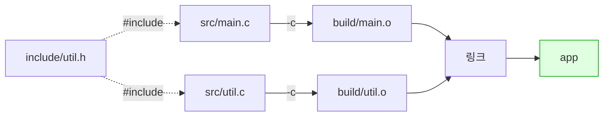

---
tags:
  - lang/c
  - c/build
  - gcc
  - compile-options
  - linking
  - cli
  - status/verified
aliases:
  - gcc 옵션
created: 2026-08-14
updated: 2026-08-14
---

# gcc 컴파일 · 실행 명령어

> 단일 파일부터 다중 파일·라이브러리 링크까지. 실무에서 쓰는 옵션과 오류 메시지 해석

## 최소 실행 절차

```bash
cc -Wall -Wextra -g hello.c -o hello   # 컴파일
./hello                                # 실행
echo $?                                # 종료 코드 확인
```

- `-Wall` — 주요 경고 활성. 미초기화 변수·타입 불일치 등 검출
- `-Wextra` — `-Wall` 미포함 추가 경고 활성
- `-g` — 디버그 심볼 포함. lldb 추적·ASan 행 번호 표시에 필요
- `-o hello` — 출력 파일명을 `hello`로 지정. 미지정 시 `a.out`
- `./` 필수 — 현재 디렉토리는 `PATH`에 미포함. `hello`만 입력 시 `command not found`
- 출력 파일명 미지정 시 `a.out` 생성

## macOS의 gcc 주의사항 (중요)

```bash
gcc --version
```

- `--version` — 컴파일러 이름·버전·타깃 아키텍처 출력. 실제 컴파일 미수행

```
Apple clang version 21.0.0 (clang-2100.1.1.101)
Target: arm64-apple-darwin25.5.0
```

- macOS의 `gcc`는 **clang의 별칭**. 실제 GNU GCC 아님
- 대부분의 옵션 호환. 일부 GCC 전용 옵션·경고명 상이
- 진짜 GCC 필요 시 — `brew install gcc` 후 `gcc-14` 등 버전 포함 이름 사용
- 본 문서는 `cc` 표기 사용 (시스템 기본 컴파일러 지칭). `gcc`·`clang` 모두 동일 동작

## 필수 옵션

| 옵션 | 역할 | 사용 시점 |
|---|---|---|
| `-o <파일>` | 출력 파일명 지정 | 항상 |
| `-Wall` | 주요 경고 활성 | 항상 |
| `-Wextra` | 추가 경고 활성 | 항상 |
| `-g` | 디버그 심볼 포함 | 개발 중 |
| `-c` | 컴파일만 (링크 제외) | 다중 파일 |
| `-I<디렉토리>` | 헤더 탐색 경로 추가 | 헤더 분리 시 |
| `-l<이름>` | 라이브러리 링크 | 외부 함수 사용 |
| `-L<디렉토리>` | 라이브러리 탐색 경로 | 외부 라이브러리 |
| `-D<이름>[=값]` | 매크로 정의 | 조건부 컴파일 |
| `-O0`~`-O3`·`-Os` | 최적화 수준 | 배포 시 `-O2` |
| `-std=<표준>` | C 표준 지정 | 호환성 필요 시 |
| `-fsanitize=address` | 메모리 오류 검사 | 개발 중 |

**개발 중 권장 조합**

```bash
cc -Wall -Wextra -g -fsanitize=address main.c -o main
```

- `-Wall` — 주요 경고 활성. 미초기화 변수·타입 불일치 등 검출
- `-Wextra` — `-Wall` 미포함 추가 경고 활성
- `-g` — 디버그 심볼 포함. lldb 추적·ASan 행 번호 표시에 필요
- `-fsanitize=address` — AddressSanitizer 활성. 힙 오버플로·use-after-free 즉시 검출
- `-o main` — 출력 파일명을 `main`로 지정. 미지정 시 `a.out`

**배포 시 권장 조합**

```bash
cc -Wall -Wextra -O2 main.c -o main
```

- `-Wall` — 주요 경고 활성. 미초기화 변수·타입 불일치 등 검출
- `-Wextra` — `-Wall` 미포함 추가 경고 활성
- `-O2` — 적극 최적화. 배포 빌드 권장 수준
- `-o main` — 출력 파일명을 `main`로 지정. 미지정 시 `a.out`

## 경고 옵션 활용

`-Wall -Wextra`는 실제 버그를 잡아냄. 경고 0건 유지가 기본 규율

```c
#include <stdio.h>
int main(void) {
    int x;
    int y = 3;
    printf("%d\n", x);
    return 0;
}
```

```bash
cc -Wall -Wextra warn.c -o warn
```

- `-Wall` — 주요 경고 활성. 미초기화 변수·타입 불일치 등 검출
- `-Wextra` — `-Wall` 미포함 추가 경고 활성
- `-o warn` — 출력 파일명을 `warn`로 지정. 미지정 시 `a.out`

```
warn.c:4:9: warning: unused variable 'y' [-Wunused-variable]
    4 |     int y = 3;
      |         ^
warn.c:5:20: warning: variable 'x' is uninitialized when used here [-Wuninitialized]
    5 |     printf("%d\n", x);
      |                    ^
warn.c:3:10: note: initialize the variable 'x' to silence this warning
    3 |     int x;
      |          ^
      |           = 0
2 warnings generated.
```

- 미초기화 변수 사용 — Java라면 컴파일 오류. C는 경고에 그침 → **경고 무시 = 버그 방치**
- `[-Wuninitialized]` — 경고 종류명. 개별 제어 시 사용
- `-Werror` 추가 → 경고를 오류로 승격 → 강제 수정. CI에서 유용

## 다중 파일 컴파일

### 한 번에 컴파일

```bash
cc -Wall -Wextra -g -Iinclude src/main.c src/util.c -o app
```

- `-Wall` — 주요 경고 활성. 미초기화 변수·타입 불일치 등 검출
- `-Wextra` — `-Wall` 미포함 추가 경고 활성
- `-g` — 디버그 심볼 포함. lldb 추적·ASan 행 번호 표시에 필요
- `-Iinclude` — `include` 디렉토리를 헤더 탐색 경로에 추가
- `-o app` — 출력 파일명을 `app`로 지정. 미지정 시 `a.out`
- 간단하나 매번 전체 재컴파일

### 분할 컴파일 (권장)

```bash
cc -Wall -Wextra -g -Iinclude -c src/main.c -o build/main.o
cc -Wall -Wextra -g -Iinclude -c src/util.c -o build/util.o
cc build/main.o build/util.o -o app
```

- `-Wall` — 주요 경고 활성. 미초기화 변수·타입 불일치 등 검출
- `-Wextra` — `-Wall` 미포함 추가 경고 활성
- `-g` — 디버그 심볼 포함. lldb 추적·ASan 행 번호 표시에 필요
- `-Iinclude` — `include` 디렉토리를 헤더 탐색 경로에 추가
- `-c` — 컴파일까지만 수행하고 링크 생략 → 목적 파일(`.o`) 생성
- `-o build/main.o` — 출력 파일명을 `build/main.o`로 지정. 미지정 시 `a.out`
- `-o build/util.o` — 출력 파일명을 `build/util.o`로 지정. 미지정 시 `a.out`
- `-o app` — 출력 파일명을 `app`로 지정. 미지정 시 `a.out`
- 변경된 파일만 재컴파일 가능 → 대규모 프로젝트에서 시간 절약
- 이 반복을 자동화한 것이 Make → [Makefile 작성법](makefile-guide.md)



## 라이브러리 링크

### 표준 라이브러리

```c
#include <stdio.h>
#include <math.h>
int main(void) { printf("sqrt(2) = %.6f\n", sqrt(2.0)); return 0; }
```

```bash
cc math_t.c -o math_t && ./math_t
```

- `-o math_t` — 출력 파일명을 `math_t`로 지정. 미지정 시 `a.out`
- `&& ./math_t` — 컴파일 성공 시에만 실행

```
sqrt(2) = 1.414214
```

- macOS — `-lm` 불필요 (수학 함수가 `libSystem`에 통합)
- **Linux — `-lm` 필수**. 미지정 시 `undefined reference to 'sqrt'`

```bash
cc math_t.c -o math_t -lm    # Linux에서 필요
```

- `-o math_t` — 출력 파일명을 `math_t`로 지정. 미지정 시 `a.out`
- `-lm` — 수학 라이브러리 링크. **Linux 필수, macOS 불필요**

### 주요 링크 옵션

| 라이브러리 | 옵션 | 헤더 | 비고 |
|---|---|---|---|
| 수학 | `-lm` | `<math.h>` | Linux 필수, macOS 불필요 |
| POSIX 스레드 | `-lpthread` | `<pthread.h>` | Linux 필수 |
| 실시간 | `-lrt` | `<time.h>` | Linux 일부 함수 |

- **링크 순서 주의** — `-l` 옵션은 이를 사용하는 소스 **뒤에** 배치
  ```bash
  cc main.c -lm -o main     # 정상
  cc -lm main.c -o main     # Linux에서 실패 가능
  ```

## 매크로 정의 — `-D`

```c
#include <stdio.h>
int main(void) {
#ifdef DEBUG
    printf("디버그 모드\n");
#else
    printf("릴리스 모드\n");
#endif
    return 0;
}
```

```bash
cc dbg.c -o dbg && ./dbg
cc -DDEBUG dbg.c -o dbg2 && ./dbg2
```

- `-o dbg` — 출력 파일명을 `dbg`로 지정. 미지정 시 `a.out`
- `&& ./dbg` — 컴파일 성공 시에만 실행
- `-DDEBUG` — 매크로 `DEBUG` 정의. 소스 수정 없이 조건부 컴파일 전환
- `-o dbg2` — 출력 파일명을 `dbg2`로 지정. 미지정 시 `a.out`
- `&& ./dbg2` — 컴파일 성공 시에만 실행

```
릴리스 모드
디버그 모드
```

- 소스 수정 없이 빌드 시점에 동작 전환
- 값 지정 — `-DMAX_SIZE=1024` → 소스의 `MAX_SIZE`가 `1024`로 치환

디버그 로그 관용 패턴

```c
#ifdef DEBUG
#define LOG(fmt, ...) fprintf(stderr, "[%s:%d] " fmt "\n", __FILE__, __LINE__, ##__VA_ARGS__)
#else
#define LOG(fmt, ...) ((void)0)
#endif
```

- `__FILE__`·`__LINE__` — 컴파일러 제공 매크로. 파일명·행 번호 자동 삽입
- 릴리스 빌드에서 `((void)0)` → 코드 완전 제거

## 최적화 수준

| 옵션 | 특성 | 용도 |
|---|---|---|
| `-O0` | 최적화 부재 (기본값) | 디버깅 — 소스와 실행 흐름 일치 |
| `-O1` | 기본 최적화 | 절충 |
| `-O2` | 적극 최적화 | **배포 권장** |
| `-O3` | 최대 최적화 (코드 크기 증가) | 성능 임계 구간 |
| `-Os` | 크기 우선 | 임베디드 |

실측 비교 — 이중 루프 2000만 회 연산

```bash
for O in 0 2; do cc -O$O heavy.c -o h_O$O; /usr/bin/time -p ./h_O$O; done
```

- `-O$O` — 반복 변수로 `-O0`·`-O2` 순차 지정
- `-o h_O$O` — 레벨별 실행 파일을 다른 이름으로 생성
- `/usr/bin/time -p` — 실행 시간 측정. `-p` = POSIX 형식(real·user·sys) 출력

```
  -O0 크기 33448B  real 0.39
  -O2 크기 33432B  real 0.37
```

- 본 예제에서는 차이 미미 — clang이 `-O0`에서도 단순 루프를 효율 처리
- 최적화 효과는 코드 특성에 크게 의존 → **측정 없는 최적화 판단 금지**
- `-O2` 이상은 디버깅 곤란 — 변수 제거·행 병합 발생. 개발 중 `-O0 -g` 유지

## C 표준 지정 — `-std`

```c
#include <stdio.h>
int main(void) {
    for (int i = 0; i < 2; i++) printf("%d ", i);   // C99부터 허용
    printf("\n");
    return 0;
}
```

```bash
cc -std=c89 -Wall c89.c -o c89
```

- `-std=c89` — C 표준을 `c89`로 지정
- `-Wall` — 주요 경고 활성. 미초기화 변수·타입 불일치 등 검출
- `-o c89` — 출력 파일명을 `c89`로 지정. 미지정 시 `a.out`

```
c89.c:3:10: warning: GCC does not allow variable declarations in for loop initializers before C99 [-Wgcc-compat]
    3 |     for (int i = 0; i < 2; i++) printf("%d ", i);
      |          ^
1 warning generated.
```

```bash
cc -std=c11 -Wall c89.c -o c11 && ./c11
```

- `-std=c11` — C 표준을 `c11`로 지정
- `-Wall` — 주요 경고 활성. 미초기화 변수·타입 불일치 등 검출
- `-o c11` — 출력 파일명을 `c11`로 지정. 미지정 시 `a.out`
- `&& ./c11` — 컴파일 성공 시에만 실행

```
0 1
```

| 표준 | 주요 추가 사항 |
|---|---|
| `c89`/`c90` | 최초 표준. `for` 내 변수 선언 불가, `//` 주석 불가 |
| `c99` | `for` 내 선언, `//` 주석, `bool`, 가변 길이 배열 |
| `c11` | `_Static_assert`, 무명 구조체, 스레드 |
| `c17` | C11 결함 수정 (기능 추가 부재) |

- 미지정 시 컴파일러 기본값 사용 (최신 clang은 C17 수준)
- 신규 프로젝트 — `-std=c11` 권장

## 오류 메시지 해석

### 컴파일 오류 — 문법·타입 문제

```
main.c:5:15: error: use of undeclared identifier 'prinf'
    5 |     prinf("hi\n");
      |     ^~~~~
```

- `파일:행:열` — 위치 정확히 표시
- 첫 오류부터 수정 — 뒤 오류는 연쇄 발생일 수 있음

### 링크 오류 — 정의 부재

```c
#include <stdio.h>
void missing_func(void);            // 선언만 존재
int main(void) { missing_func(); return 0; }
```

```bash
cc undef.c -o undef
```

- `-o undef` — 출력 파일명을 `undef`로 지정. 미지정 시 `a.out`

```
Undefined symbols for architecture arm64:
  "_missing_func", referenced from:
      _main in undef-2e13c9.o
ld: symbol(s) not found for architecture arm64
clang: error: linker command failed with exit code 1 (use -v to see invocation)
```

- **컴파일 오류 아님** — `ld`(링커)가 낸 오류. 문법은 정상, 구현이 부재
- 원인 3가지
  1. 함수 정의 미작성
  2. 정의된 `.c` 파일을 링크 명령에 미포함
  3. 라이브러리 `-l` 옵션 누락
- Linux 메시지 형태 상이 — `undefined reference to 'missing_func'`

### 헤더 미발견

```
fatal error: 'util.h' file not found
```

- `-I` 경로 누락 또는 파일명 오타
- `#include "util.h"` (따옴표) — 소스 기준 상대 경로 우선
- `#include <util.h>` (꺾쇠) — 시스템 경로만 탐색 → 자작 헤더에 부적합

## 유용한 조사 명령

| 명령 | 용도 |
|---|---|
| `nm <파일.o>` | 심볼 목록 (`T`=정의, `U`=미해결) |
| `file <파일>` | 파일 형식·아키텍처 |
| `otool -L <실행파일>` | 의존 동적 라이브러리 (macOS) |
| `ldd <실행파일>` | 동일 (Linux) |
| `cc -v ...` | 컴파일러 내부 동작 상세 출력 |
| `cc -E ...` | 전처리 결과 확인 |
| `cc -### ...` | 실행될 명령만 출력 (실제 실행 부재) |

의존 라이브러리 확인

```bash
otool -L hello
```

- `-L` — 실행 파일이 참조하는 동적 라이브러리 목록 출력

## 자주 쓰는 명령 모음

```bash
# 단일 파일 개발 빌드
cc -Wall -Wextra -g main.c -o main && ./main

# 메모리 오류 검사 포함
cc -Wall -Wextra -g -fsanitize=address main.c -o main && ./main

# 다중 파일
cc -Wall -Wextra -g -Iinclude src/*.c -o app

# 배포 빌드
cc -Wall -Wextra -O2 -DNDEBUG src/*.c -o app

# 경고를 오류로 (CI)
cc -Wall -Wextra -Werror src/*.c -o app

# 전처리 결과만 확인
cc -E main.c | less

# 어셈블리 확인
cc -S -O2 main.c -o main.s
```

위 조합에 쓰인 옵션 — 상세는 [필수 옵션](#필수-옵션) 표 참조

- `-Wall` `-Wextra` — 경고 활성. 전 조합에 공통
- `-g` — 디버그 심볼. 개발 빌드에만
- `-o <이름>` — 출력 파일명. 미지정 시 `a.out`
- `&& ./main` — 컴파일 성공 시에만 실행
- `-fsanitize=address` — 메모리 오류 검사. 개발 빌드에만
- `-Iinclude` — `include`를 헤더 탐색 경로에 추가
- `-O2` — 적극 최적화. 배포 빌드
- `-DNDEBUG` — `NDEBUG` 정의 → `assert` 전량 무효화. 배포 빌드 관례
- `-Werror` — 경고를 오류로 승격. CI에서 경고 유입 차단
- `-E` — 전처리 결과만 출력 (`| less`로 페이지 단위 확인)
- `-S` — 어셈블리만 생성. `-O2`와 함께 쓰면 최적화 결과 확인 가능
- `src/*.c` — 셸 와일드카드. `src` 하위 모든 `.c` 전달

## 함정 · 주의점

- `./` 누락 → `command not found`. 현재 디렉토리는 `PATH` 미포함
- `-o` 누락 → `a.out` 생성. 여러 프로그램 작업 시 덮어쓰기 혼선
- `-Wall` 미사용 → 미초기화 변수·타입 불일치 방치 → 런타임 버그
- 경고를 무시하고 진행 → C의 경고는 대부분 실제 문제. 0건 유지
- `-l` 옵션을 소스 앞에 배치 → Linux에서 링크 실패
- macOS에서 `-lm` 습관화 → 무해하나 불필요. Linux 이식 시에는 필수
- `-O2`와 `-g` 동시 사용 후 디버깅 → 변수 최적화 제거로 추적 곤란
- 링크 오류를 문법 오류로 오인 → `Undefined symbols`는 소스 문법 무관
- `#include <자작헤더.h>` 사용 → 시스템 경로만 탐색 → 미발견. 따옴표 사용
- 실행 파일을 git에 커밋 → `.gitignore` 필요

## CLion 팁

- CLion은 CMake 기반 → 직접 `cc` 명령 미사용. 하지만 명령 이해가 CMake 설정 이해의 전제
- `Build` → `Build Project` 시 하단에 실제 컴파일 명령 출력 → 옵션 확인 가능
- 터미널 창(`View` → `Tool Windows` → `Terminal`)에서 직접 컴파일 실습 가능

## 검증

- [ ] 단일 파일 컴파일 후 `./` 로 실행 성공
- [ ] `-Wall -Wextra` 경고 발생 코드로 경고 메시지 확인
- [ ] 분할 컴파일 후 링크 성공
- [ ] 링크 오류 메시지 재현 및 원인 파악
- [ ] `-DDEBUG` 유무에 따른 동작 변화 확인
- [ ] `nm`으로 심볼 확인

## 다음 단계

- [[C/docs/03-build/makefile-guide|Makefile 작성법]] — 위 명령들의 자동화

## 관련 문서

- [[C/docs/01-basics/c-program-execution-model|C 프로그램의 동작 및 컴파일 방식]] — 소스가 실행 파일이 되는 과정
- [[C/docs/04-project-layout/source-file-types|C 소스코드 구성 요소]] — `.c`·`.h`·`.o`·`.a` 파일 역할
- [[C/docs/README|학습 문서 인덱스]] — 카테고리별 전체 문서 목록
- [[C/docs/03-build/build-artifacts-cleanup|빌드 산출물 정리]] — 빌드 산출물 정리와 `.gitignore`
