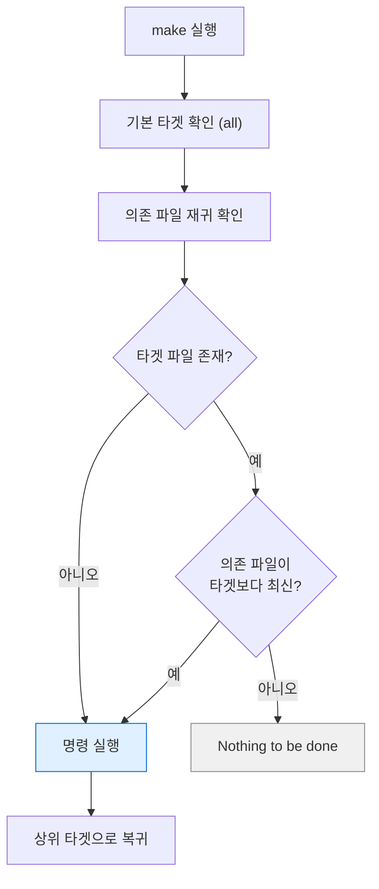
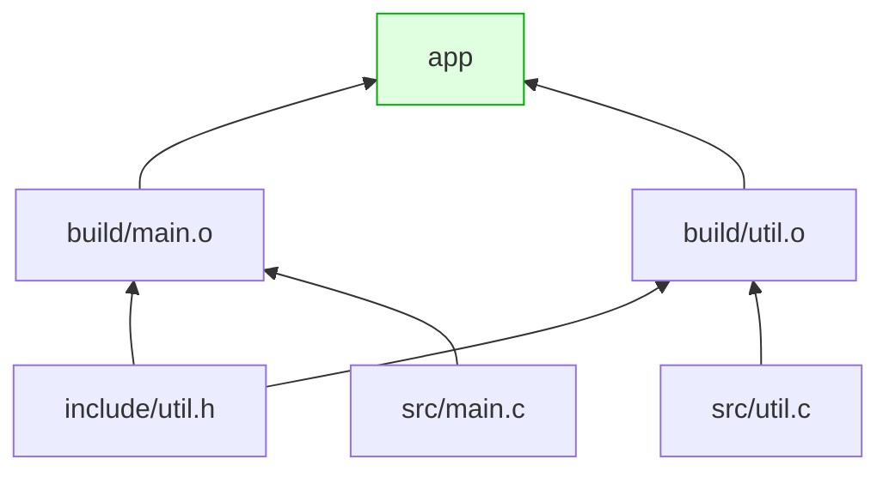

---
tags:
  - lang/c
  - c/build
  - makefile
  - make
  - incremental-build
  - status/wip
aliases:
  - Makefile
created: 2026-08-14
updated: 2026-08-14
---

# Makefile의 역할과 작성 문법

> 컴파일 명령 자동화 + 변경분만 재빌드. 규칙·변수·자동 변수·패턴 규칙 문법 정리

## 역할

- 반복 컴파일 명령 자동화 — 파일 10개면 명령 11줄. 매번 입력 불가
- **증분 빌드** — 파일 타임스탬프 비교 후 변경된 것만 재컴파일
- 작업 정의 — 빌드 외 `clean`·`run`·`test` 등 프로젝트 명령 통합

## Java와의 차이

| 항목 | Java (Gradle·Maven) | C (Make) |
|---|---|---|
| 의존성 파악 | 도구가 자동 분석 | 규칙에 명시 (또는 `-MMD` 활용) |
| 빌드 단위 | 프로젝트·모듈 | 파일 단위 |
| 재빌드 판단 | 도구 내부 관리 | **파일 수정 시각 비교** |
| 표준 구조 | 관례 강제(`src/main/java`) | 관례 부재. 직접 정의 |
| 외부 의존성 | 저장소에서 자동 다운로드 | 수동 설치 후 `-l` 지정 |

**Make의 핵심 원리** — "타겟 파일이 의존 파일보다 오래되었으면 명령 실행". 타임스탬프 비교가 전부

## 기본 문법

```make
타겟: 의존파일1 의존파일2
<TAB>실행할 명령
```

**들여쓰기는 반드시 탭 문자.** 스페이스 사용 시 오류

```bash
make -f Makefile.bad
```

- `-f Makefile.bad` — 기본 `Makefile` 대신 지정 파일 사용

```
Makefile.bad:2: *** missing separator.  Stop.
```

- 발생 시 해당 행의 들여쓰기를 탭으로 교체
- 편집기 설정 — Makefile에서만 탭 유지 필요. CLion은 `.editorconfig`로 제어 가능

## 최소 Makefile

```make
app: main.c util.c
	cc -Wall -Wextra -g main.c util.c -o app
```

```bash
make          # app 생성
make          # 변경 없으면 재빌드 부재
```

- 첫 번째 타겟이 기본 타겟 → `make`만 입력 시 실행
- 한계 — 파일 하나만 고쳐도 전체 재컴파일

## 실전 Makefile (전체)

디렉토리 구조

```
project/
├── Makefile
├── include/util.h
├── src/main.c
├── src/util.c
└── build/          # 생성됨
```

```make
CC      := cc
CFLAGS  := -Wall -Wextra -g -Iinclude -MMD -MP
LDFLAGS :=
SRCDIR  := src
OBJDIR  := build
TARGET  := app

SRCS := $(wildcard $(SRCDIR)/*.c)
OBJS := $(patsubst $(SRCDIR)/%.c,$(OBJDIR)/%.o,$(SRCS))
DEPS := $(OBJS:.o=.d)

all: $(TARGET)

$(TARGET): $(OBJS)
	$(CC) $(OBJS) $(LDFLAGS) -o $@

$(OBJDIR)/%.o: $(SRCDIR)/%.c | $(OBJDIR)
	$(CC) $(CFLAGS) -c $< -o $@

$(OBJDIR):
	mkdir -p $@

clean:
	rm -rf $(OBJDIR) $(TARGET)

run: $(TARGET)
	./$(TARGET)

-include $(DEPS)

.PHONY: all clean run
```

### 실행 결과

```bash
make
```

```
cc -Wall -Wextra -g -Iinclude -MMD -MP -c src/main.c -o build/main.o
cc -Wall -Wextra -g -Iinclude -MMD -MP -c src/util.c -o build/util.o
cc build/main.o build/util.o  -o app
```

재실행 — 변경 부재

```bash
make
```

```
make: Nothing to be done for `all'.
```

`run` 타겟

```bash
make run
```

```
./app
2 + 3 = 5
```

정리

```bash
make clean
```

```
rm -rf build app
```

## 문법 요소별 설명

### 변수 — `:=` vs `=`

```make
A := $(shell echo immediate)    # 즉시 평가 (정의 시점에 확정)
B  = $(shell echo deferred)     # 지연 평가 (사용 시점마다 평가)
demo:
	@echo "A(:=) $(A)"
	@echo "B(=)  $(B)"
```

```
A(:=) immediate
B(=)  deferred
```

- **`:=` 권장** — 예측 가능, 반복 평가 부재
- `=` 사용 시 참조할 때마다 재평가 → 셸 명령이면 매번 실행 → 성능 저하
- `?=` — 미정의 시에만 대입. 환경변수 우선 허용 시 사용
- `+=` — 기존 값에 추가

명령 앞 `@` — 명령 자체 출력 억제 (결과만 표시)

### 자동 변수

```make
demo: dep1.txt dep2.txt
	@echo "타겟 $$@ = $@"
	@echo "첫의존 $$< = $<"
	@echo "전체의존 $$^ = $^"
```

```
타겟 $@ = demo
첫의존 $< = dep1.txt
전체의존 $^ = dep1.txt dep2.txt
```

| 변수 | 의미 | 주 용도 |
|---|---|---|
| `$@` | 타겟 이름 | `-o $@` |
| `$<` | 첫 번째 의존 파일 | `-c $<` |
| `$^` | 전체 의존 파일 (중복 제거) | 링크 명령 |
| `$+` | 전체 의존 파일 (중복 유지) | 드묾 |
| `$*` | 패턴 규칙의 `%` 부분 | 파일명 조작 |

- Makefile에서 `$` 리터럴 출력 시 `$$` 표기 필요

### 패턴 규칙

```make
$(OBJDIR)/%.o: $(SRCDIR)/%.c | $(OBJDIR)
	$(CC) $(CFLAGS) -c $< -o $@
```

- `%` — 와일드카드. `build/main.o`는 `src/main.c`에서 생성
- 파일이 100개여도 규칙 1개로 처리
- `| $(OBJDIR)` — **순서 전용 의존성**(order-only). 파이프 뒤 항목은 "존재만 하면 됨"
  - 디렉토리는 파일 추가 시마다 타임스탬프 변경 → 일반 의존성이면 매번 전체 재빌드
  - 순서 전용 지정으로 회피

### 함수

| 함수                   | 역할       | 예시                                      |
| -------------------- | -------- | --------------------------------------- |
| `$(wildcard 패턴)`     | 파일 목록 수집 | `$(wildcard src/*.c)`                   |
| `$(patsubst 전,후,대상)` | 패턴 치환    | `$(patsubst src/%.c,build/%.o,$(SRCS))` |
| `$(subst 전,후,대상)`    | 문자열 치환   | `$(subst .c,.o,$(SRCS))`                |
| `$(shell 명령)`        | 셸 명령 결과  | `$(shell date +%Y)`                     |
| `$(notdir 경로)`       | 파일명만 추출  | `$(notdir src/main.c)` → `main.c`       |
| `$(dir 경로)`          | 디렉토리만 추출 | `$(dir src/main.c)` → `src/`            |
| `$(addprefix 접두,목록)` | 접두사 부착   | `$(addprefix build/,$(FILES))`          |

축약 표기 — `$(OBJS:.o=.d)` 는 `$(patsubst %.o,%.d,$(OBJS))`와 동일

### `.PHONY`

```make
.PHONY: all clean run
```

- 파일이 아닌 **작업 이름**임을 명시
- 미지정 시 — `clean`이라는 파일이 존재하면 "이미 최신"으로 판단하여 명령 미실행
- 관례 — `all`·`clean`·`install`·`test`·`run` 등 전부 등록

## 헤더 의존성 자동 추적 (중요)

기본 Makefile의 최대 약점 — **헤더 변경 미감지**

```make
build/main.o: src/main.c        # util.h 변경은 감지 못함
```

- `util.h`의 구조체를 수정해도 `main.o` 재빌드 부재 → 구조체 정의 불일치 상태로 링크 → 실행 시 이상 동작

### 해결 — `-MMD -MP`

```make
CFLAGS := ... -MMD -MP
DEPS   := $(OBJS:.o=.d)
-include $(DEPS)
```

- `-MMD` — 컴파일 시 `.d` 의존성 파일 자동 생성 (시스템 헤더 제외)
- `-MP` — 헤더 삭제 시 오류 방지용 더미 타겟 추가
- `-include` — 파일 부재 시에도 오류 미발생 (최초 빌드 대응)

생성된 `.d` 파일 내용

```bash
cat build/util.d
```

```
build/util.o: src/util.c include/util.h
include/util.h:
```

- Make 규칙 형식 그대로. `util.h` 의존성이 자동 기록됨

동작 확인 — 헤더만 수정

```bash
touch include/util.h && make
```

```
cc -Wall -Wextra -g -Iinclude -MMD -MP -c src/main.c -o build/main.o
cc -Wall -Wextra -g -Iinclude -MMD -MP -c src/util.c -o build/util.o
cc build/main.o build/util.o  -o app
```

- 헤더를 포함한 **양쪽 소스 모두 재컴파일** → 정상 동작 확인

## 빌드 판단 흐름



의존성 그래프 예시



- `util.h` 수정 → `main.o`·`util.o` 모두 갱신 대상 → `app` 재링크

## 유용한 make 옵션

| 옵션 | 역할 |
|---|---|
| `make -n` | 실행할 명령만 출력 (드라이런) |
| `make -j4` | 4개 병렬 빌드 — 대규모에서 속도 향상 |
| `make -B` | 강제 전체 재빌드 |
| `make -f 파일` | 다른 이름의 Makefile 사용 |
| `make -C 디렉토리` | 해당 디렉토리에서 실행 |
| `make --debug=b` | 재빌드 판단 근거 출력 |
| `make -p` | 내장 규칙·변수 전체 출력 |

디버깅 — 왜 재빌드되는지 확인

```bash
make --debug=b 2>&1 | head -20
```

- `--debug=b` — 기본(basic) 디버그 출력. 각 타겟의 재빌드 판단 근거 표시
- `2>&1 | head -20` — 표준 오류를 표준 출력에 합쳐 앞 20줄만 확인

## 자주 쓰는 타겟 관례

```make
all: $(TARGET)              # 기본 빌드
clean:                      # 산출물 제거
	rm -rf $(OBJDIR) $(TARGET)
run: $(TARGET)              # 빌드 후 실행
	./$(TARGET)
test: $(TARGET)             # 테스트 실행
	./tests/run_tests.sh
debug: CFLAGS += -fsanitize=address -O0
debug: clean $(TARGET)      # 타겟별 변수 재정의
install: $(TARGET)          # 시스템 설치
	install -m 755 $(TARGET) /usr/local/bin/
```

- `debug: CFLAGS += ...` — 타겟 한정 변수. 해당 타겟 빌드에만 적용
- 검증 미완료 — `install`·`test` 타겟은 실제 실행 미확인

## 함정 · 주의점

- **들여쓰기에 스페이스 사용** → `missing separator`. Makefile 최다 실수
- `.PHONY` 미등록 상태에서 동명 파일 존재 → 타겟 미실행
- 헤더 의존성 미추적 → 헤더 수정 후 재빌드 부재 → 정의 불일치. `-MMD -MP` 필수
- 각 명령 행이 **독립 셸**에서 실행 → `cd` 효과 다음 행에 미전달
  ```make
  bad:
  	cd src
  	pwd          # ← src 아님. 원래 위치
  good:
  	cd src && pwd   # ← 한 행에 연결
  ```
- `=` 사용 시 `$(shell ...)` 반복 실행 → 빌드 지연. `:=` 사용
- `make -j` 병렬 빌드 시 디렉토리 생성 경합 → 순서 전용 의존성(`| $(OBJDIR)`)으로 방지
- `clean`에 `rm -rf $(VAR)` 사용 시 변수 미정의 → `rm -rf` 단독 실행 위험. 변수 확인 필수
- 타임스탬프 기반 판단 → 파일 시각이 미래로 설정되면 오동작. `touch`로 정정
- 빌드 산출물 git 커밋 → `.gitignore`에 `build/`·`*.o`·`*.d`·실행 파일 등록

## Make vs CMake

| 항목 | Make | CMake |
|---|---|---|
| 성격 | 빌드 실행 도구 | 빌드 파일 **생성** 도구 |
| 출력 | 직접 컴파일 | Makefile·Ninja·Xcode 프로젝트 생성 |
| 플랫폼 | Unix 계열 중심 | 크로스 플랫폼 |
| 학습 난이도 | 문법 단순, 규칙 직접 작성 | 문법 복잡, 자동화 범위 넓음 |
| CLion | 지원하나 제한적 | **기본 지원** |

- 학습 목적 — Make로 빌드 원리 파악 후 CMake 사용 권장. CMake가 결국 이 과정을 대신 수행
- CLion 사용 시 최종적으로 CMake 필요 → [프로젝트 구조화](../../projects/make-shell/09-project-layout.md) 참조

## 검증

- [ ] 최초 `make`로 전체 빌드 성공
- [ ] 재실행 시 `Nothing to be done` 출력
- [ ] 소스 1개 수정 시 해당 파일만 재컴파일
- [ ] 헤더 수정 시 관련 소스 전부 재컴파일 (`-MMD` 동작)
- [ ] `make clean` 후 산출물 제거 확인
- [ ] `make run` 동작
- [ ] 탭 대신 스페이스 사용 시 오류 재현

## 관련 문서

- [[C/docs/03-build/gcc-compile-and-run|gcc 컴파일 · 실행 명령어]] — Makefile이 자동화하는 명령들
- [[C/docs/04-project-layout/source-file-types|C 소스코드 구성 요소]] — `.c`·`.h`·`.o`·`.a` 파일 역할
- [[C/docs/README|학습 문서 인덱스]] — 카테고리별 전체 문서 목록
- [[C/docs/01-basics/c-program-execution-model|C 프로그램의 동작 및 컴파일 방식]] — 소스가 실행 파일이 되는 과정
- [[C/docs/03-build/build-artifacts-cleanup|빌드 산출물 정리]] — 빌드 산출물 정리와 `.gitignore`
