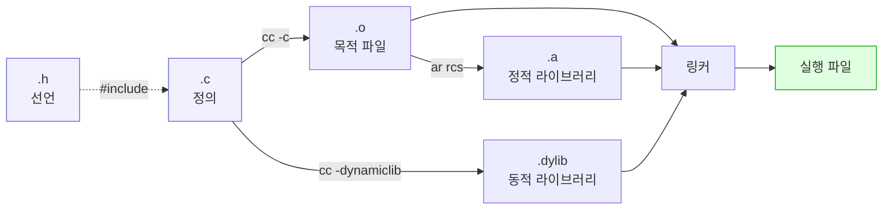
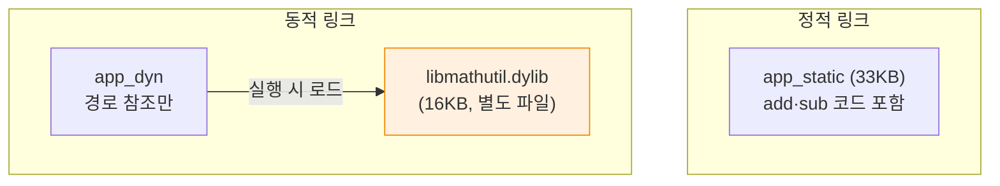

---
tags:
  - lang/c
  - c/project-layout
  - header
  - object-file
  - static-library
  - dynamic-library
  - linking
  - status/verified
aliases:
  - 헤더와 소스 분리
  - 정적 라이브러리
created: 2026-08-14
updated: 2026-08-14
---

# C 소스코드 구성 요소 — `.c` · `.h` · `.o` · `.a` · `.dylib`

> 파일 종류별 역할과 생성·소비 관계. 선언과 정의 분리, 가시성 제어, 라이브러리 형태

## 파일 종류 요약

| 확장자              | 이름       | 내용            | 생성 방법            | 사람이 읽음 |
| ---------------- | -------- | ------------- | ---------------- | ------ |
| `.c`             | 소스       | 함수 **정의**(구현) | 직접 작성            | 예      |
| `.h`             | 헤더       | **선언**·타입·매크로 | 직접 작성            | 예      |
| `.i`             | 전처리 결과   | 헤더 전개된 소스     | `cc -E`          | 예 (드묾) |
| `.s`             | 어셈블리     | CPU 명령 텍스트    | `cc -S`          | 예 (드묾) |
| `.o`             | 목적 파일    | 기계어 + 심볼 테이블  | `cc -c`          | 아니오    |
| `.a`             | 정적 라이브러리 | `.o` 묶음 아카이브  | `ar rcs`         | 아니오    |
| `.dylib` / `.so` | 동적 라이브러리 | 실행 시 로드되는 코드  | `cc -dynamiclib` | 아니오    |
| `.d`             | 의존성 파일   | Make 규칙       | `cc -MMD`        | 예      |
| (없음)             | 실행 파일    | 완성된 프로그램      | `cc` 링크          | 아니오    |

macOS는 `.dylib`, Linux는 `.so` 사용

## 생성 관계



## `.h` — 헤더 파일

### 역할

**선언만** 배치. 다른 파일에 노출할 인터페이스 정의

포함 대상

- 함수 프로토타입 — `int add(int a, int b);`
- 타입 정의 — `typedef struct { ... } Point;`
- 매크로 — `#define MAX 100`
- `extern` 전역 변수 선언
- 다른 헤더 `#include`

**미포함 대상**

- 함수 본문(정의) → 여러 `.c`가 포함 시 중복 심볼 링크 오류
- 전역 변수 정의 → 동일 문제
- `static` 함수 (파일 한정이므로 헤더 무의미)

### 인클루드 가드 필수

```c
#ifndef MATHUTIL_H          // 미정의이면 아래 진행
#define MATHUTIL_H          // 정의 표시

int  add(int a, int b);
int  sub(int a, int b);

#endif  // MATHUTIL_H
```

가드 없는 헤더를 두 번 포함하면 오류

```c
#include "noguard.h"
#include "noguard.h"
int main(void) { return 0; }
```

```bash
cc -Wall dup.c -o dup
```

- `-Wall` — 주요 경고 활성. 미초기화 변수·타입 불일치 등 검출
- `-o dup` — 출력 파일명을 `dup`로 지정. 미지정 시 `a.out`

```
In file included from dup.c:2:
./noguard.h:1:27: error: typedef redefinition with different types ('struct Point' vs 'struct Point')
    1 | typedef struct { int x; } Point;
      |                           ^
dup.c:1:10: note: './noguard.h' included multiple times, additional include site here
```

- 직접 두 번 포함하는 경우는 드묾. **간접 중복**이 실제 원인 — `a.h`가 `c.h` 포함, `b.h`도 `c.h` 포함, `main.c`가 둘 다 포함
- 대안 — `#pragma once` (비표준이나 주요 컴파일러 지원). 표준 가드가 이식성 우위

### `#include` 두 형태

| 형태 | 탐색 순서 | 용도 |
|---|---|---|
| `#include "util.h"` | 소스 파일 위치 → `-I` 경로 → 시스템 | **자작 헤더** |
| `#include <stdio.h>` | `-I` 경로 → 시스템 경로 | **표준·외부 라이브러리** |

- 자작 헤더에 꺾쇠 사용 → `file not found`
- `#include`는 **텍스트 붙여넣기**. Java `import`처럼 심볼 참조가 아님

## `.c` — 소스 파일

### 역할

함수 **정의**(구현) 배치. 컴파일 단위

```c
#include "mathutil.h"       // 자기 헤더 우선 → 선언·정의 불일치 즉시 발견
#include <stdio.h>          // 표준 헤더 나중

int add(int a, int b) { return a + b; }
```

- 자기 헤더를 먼저 포함하는 이유 — 헤더가 독립적으로 컴파일 가능한지 검증됨
- 선언(`.h`)과 정의(`.c`) 시그니처 불일치 시 컴파일 오류 발생 → 조기 발견

### 가시성 제어 — `static`

```c
#include <stdio.h>
int  public_func(void)  { return 1; }        // 외부 노출
static int private_func(void) { return 2; }  // 파일 내부 한정
int use(void) { return public_func() + private_func(); }
```

```bash
cc -Wall -c vis.c -o vis.o && nm vis.o
```

- `-Wall` — 주요 경고 활성. 미초기화 변수·타입 불일치 등 검출
- `-c` — 컴파일까지만 수행하고 링크 생략 → 목적 파일(`.o`) 생성
- `-o vis.o` — 출력 파일명을 `vis.o`로 지정. 미지정 시 `a.out`

```
0000000000000038 t _private_func
0000000000000000 T _public_func
0000000000000008 T _use
```

- **`T` 대문자** = 외부 노출 전역 심볼. 다른 `.c`에서 호출 가능
- **`t` 소문자** = 파일 내부 한정. 링커가 외부에 미노출
- Java 대응 — `static` ≈ `private`, 미지정 ≈ `public`

`static` 사용 권장 상황

- 헤더에 선언하지 않는 보조 함수 전부
- 파일 내부 전용 전역 변수
- 효과 — 이름 충돌 방지, 컴파일러 최적화 여지 확대

### 전역 변수 선언·정의 분리

헤더 (`config.h`)

```c
extern int g_verbose;       // 선언 — "어딘가에 존재"
```

소스 (`config.c`)

```c
int g_verbose = 0;          // 정의 — 실제 메모리 할당. 정확히 한 곳
```

- 헤더에 `int g_verbose = 0;` 배치 → 포함한 모든 `.c`가 정의 → `duplicate symbol` 링크 오류

## `.o` — 목적 파일

### 특성

- 기계어 + 심볼 테이블. **실행 불가** (진입점·라이브러리 미연결)
- 외부 함수는 미해결 상태로 표시

```bash
cc -Wall -c add.c -o add.o && nm add.o
```

- `-Wall` — 주요 경고 활성. 미초기화 변수·타입 불일치 등 검출
- `-c` — 컴파일까지만 수행하고 링크 생략 → 목적 파일(`.o`) 생성
- `-o add.o` — 출력 파일명을 `add.o`로 지정. 미지정 시 `a.out`

```
0000000000000000 T _add
```

심볼 종류

| 표시 | 의미 |
|---|---|
| `T` / `t` | 코드 정의 (대문자=외부, 소문자=내부) |
| `D` / `d` | 초기화된 데이터 |
| `B` / `b` | BSS (미초기화 데이터) |
| `U` | **미해결** — 다른 곳의 정의 필요 |
| `s` | 읽기 전용 데이터 (문자열 리터럴 등) |

- 링크 = 모든 `U`를 어딘가의 `T`와 연결하는 작업
- 연결 실패 → `Undefined symbols` 오류

## `.a` — 정적 라이브러리

### 생성

```bash
cc -Wall -c add.c sub.c              # .o 생성
ar rcs libmathutil.a add.o sub.o     # 아카이브 묶기
```

- `-Wall` — 주요 경고 활성. 미초기화 변수·타입 불일치 등 검출
- `-c` — 컴파일까지만 수행하고 링크 생략 → 목적 파일(`.o`) 생성
- `r` — 아카이브에 추가·교체
- `c` — 아카이브 새로 생성 (없으면 경고 억제)
- `s` — 심볼 인덱스 생성. 미지정 시 링크 실패 가능
- **이름 규칙** — `lib<이름>.a`. 링크 시 `-l<이름>`으로 지정 (`lib`·`.a` 생략)
- `ar` 옵션 — `r` 추가·교체, `c` 새로 생성, `s` 심볼 인덱스 생성

내용 확인

```bash
ar t libmathutil.a
```

- `t` — 아카이브 내용 목록 출력

```
__.SYMDEF SORTED
add.o
sub.o
```

- `.o` 파일들의 단순 묶음 + 심볼 색인
- `__.SYMDEF` — 빠른 심볼 조회용 인덱스 (`s` 옵션이 생성)

```bash
nm libmathutil.a | grep ' T '
```

```
0000000000000000 T _add
0000000000000000 T _sub
```

### 링크

```bash
cc main.c -L. -lmathutil -o app_static && ./app_static
```

- `-L.` — `.` 디렉토리를 라이브러리 탐색 경로에 추가
- `-lmathutil` — `libmathutil` 라이브러리 링크
- `-o app_static` — 출력 파일명을 `app_static`로 지정. 미지정 시 `a.out`
- `&& ./app_static` — 컴파일 성공 시에만 실행

```
8 2
```

- `-L.` — 현재 디렉토리를 라이브러리 탐색 경로에 추가
- `-lmathutil` — `libmathutil.a` 또는 `libmathutil.dylib` 탐색
- **필요한 `.o`만 추출**하여 실행 파일에 복사. 미사용 함수는 미포함

## `.dylib` / `.so` — 동적 라이브러리

### 생성

```bash
cc -dynamiclib -fPIC add.c sub.c -o libmathutil.dylib
```

- `-dynamiclib` — 동적 라이브러리(`.dylib`) 생성 (macOS). Linux는 `-shared`
- `-fPIC` — 위치 독립 코드 생성. 동적 라이브러리에 필수
- `-o libmathutil.dylib` — 출력 파일명을 `libmathutil.dylib`로 지정. 미지정 시 `a.out`

```
libmathutil.dylib 16816B
```

- `-fPIC` — 위치 독립 코드(Position Independent Code). 임의 주소 로드 가능
- Linux — `cc -shared -fPIC ... -o libmathutil.so`

### 링크 · 실행

```bash
cc main.c -L. -lmathutil -o app_dyn && ./app_dyn
```

- `-L.` — `.` 디렉토리를 라이브러리 탐색 경로에 추가
- `-lmathutil` — `libmathutil` 라이브러리 링크
- `-o app_dyn` — 출력 파일명을 `app_dyn`로 지정. 미지정 시 `a.out`
- `&& ./app_dyn` — 컴파일 성공 시에만 실행

```
8 2
```

의존성 확인

```bash
otool -L app_dyn
```

- `-L` — 실행 파일이 참조하는 동적 라이브러리 목록 출력

```
app_dyn:
	libmathutil.dylib (compatibility version 0.0.0, current version 0.0.0)
	/usr/lib/libSystem.B.dylib (compatibility version 1.0.0, current version 1356.0.0)
```

- 실행 파일에 라이브러리 **경로만 기록**. 코드 미포함
- 실행 시 동적 링커가 로드 → 라이브러리 파일 삭제 시 실행 실패
- Linux 확인 명령 — `ldd app_dyn`

**주의** — `.a`와 `.dylib`가 같은 이름으로 공존하면 링커가 **동적 우선** 선택. 정적 강제 시 `-Wl,-Bstatic`(Linux) 또는 `.a` 경로 직접 지정

### 정적 vs 동적 비교

| 항목 | 정적 (`.a`) | 동적 (`.dylib`·`.so`) |
|---|---|---|
| 코드 위치 | 실행 파일에 복사 | 별도 파일 유지 |
| 실행 파일 크기 | 큼 | 작음 |
| 배포 | 단일 파일 | 라이브러리 동반 필요 |
| 라이브러리 갱신 | **재링크 필요** | 파일 교체로 반영 |
| 메모리 | 프로세스마다 사본 | 여러 프로세스 공유 |
| 실행 속도 | 약간 우위 | 로드·심볼 해결 부담 |
| 버전 충돌 | 부재 | 발생 가능 |

- 소규모 프로젝트·배포 단순성 — 정적
- 시스템 라이브러리·다수 프로그램 공유 — 동적



## 표준 프로젝트 구조

```
project/
├── Makefile / CMakeLists.txt
├── README.md
├── .gitignore
├── include/            # 공개 헤더 (외부 노출 인터페이스)
│   └── mylib/
│       └── util.h
├── src/                # 구현 + 내부 전용 헤더
│   ├── main.c
│   ├── util.c
│   └── internal.h
├── tests/              # 테스트 코드
├── lib/                # 외부 라이브러리 (선택)
└── build/              # 빌드 산출물 (git 제외)
```

- `include/` vs `src/` 분리 — 공개 인터페이스와 내부 구현 구분. 라이브러리 배포 시 `include/`만 제공
- 소규모 프로젝트 — `src/`에 `.h` 동거도 일반적. 과도한 구조화 불필요
- `include/mylib/` 하위 디렉토리 — `#include <mylib/util.h>` 형태로 이름 충돌 방지

### `.gitignore` 권장

```
build/
cmake-build-*/
*.o
*.d
*.a
*.dylib
*.so
a.out
.idea/
```

## 파일 분리 실전 예시

`mathutil.h`

```c
#ifndef MATHUTIL_H
#define MATHUTIL_H
int  add(int a, int b);
int  sub(int a, int b);
#endif
```

`add.c`

```c
#include "mathutil.h"
int add(int a, int b) { return a + b; }
```

`sub.c`

```c
#include "mathutil.h"
int sub(int a, int b) { return a - b; }
```

`main.c`

```c
#include <stdio.h>
#include "mathutil.h"
int main(void) { printf("%d %d\n", add(5,3), sub(5,3)); return 0; }
```

빌드 3가지 방식

```bash
# 1. 직접 링크
cc -Wall main.c add.c sub.c -o app

# 2. 정적 라이브러리 경유
cc -Wall -c add.c sub.c
ar rcs libmathutil.a add.o sub.o
cc main.c -L. -lmathutil -o app

# 3. 동적 라이브러리 경유
cc -dynamiclib -fPIC add.c sub.c -o libmathutil.dylib
cc main.c -L. -lmathutil -o app
```

- `-Wall` — 주요 경고 활성. 미초기화 변수·타입 불일치 등 검출
- `-o app` — 출력 파일명을 `app`로 지정. 미지정 시 `a.out`
- `-c` — 컴파일까지만 수행하고 링크 생략 → 목적 파일(`.o`) 생성
- `r` — 아카이브에 추가·교체
- `c` — 아카이브 새로 생성 (없으면 경고 억제)
- `s` — 심볼 인덱스 생성. 미지정 시 링크 실패 가능
- `-L.` — `.` 디렉토리를 라이브러리 탐색 경로에 추가
- `-lmathutil` — `libmathutil` 라이브러리 링크
- `-dynamiclib` — 동적 라이브러리(`.dylib`) 생성 (macOS). Linux는 `-shared`
- `-fPIC` — 위치 독립 코드 생성. 동적 라이브러리에 필수
- `-o libmathutil.dylib` — 출력 파일명을 `libmathutil.dylib`로 지정. 미지정 시 `a.out`

세 방식 모두 실행 결과 동일

```
8 2
```

## 함정 · 주의점

- 헤더에 함수 정의 배치 → `duplicate symbol` 링크 오류. 선언만
- 헤더에 전역 변수 정의 → 동일 오류. `extern` 선언 + `.c` 정의 1곳
- 인클루드 가드 누락 → 간접 중복 포함 시 재정의 오류
- 자작 헤더에 `<>` 사용 → `file not found`. `""` 사용
- `-I` 경로 누락 → 헤더 미발견
- 링크 명령에서 `.o` 누락 → `Undefined symbols`
- `.a` 이름을 `mathutil.a`로 생성 → `-lmathutil` 미인식. `lib` 접두 필수
- `ar` 실행 후 `s` 옵션 누락 → 심볼 인덱스 부재 → 링크 실패 가능
- `.dylib` 생성 시 `-fPIC` 누락 → 플랫폼에 따라 링크 오류
- 동적 라이브러리 배포 시 파일 미동반 → 실행 시 로드 실패
- 빌드 산출물(`.o`·`.a`·실행 파일) git 커밋 → 저장소 오염
- `static` 미사용 → 내부 함수가 전역 노출 → 다른 파일과 이름 충돌

## 조사 명령 정리

| 명령 | 용도 |
|---|---|
| `nm <파일>` | 심볼 목록 |
| `nm -g <파일>` | 외부 노출 심볼만 |
| `ar t <파일.a>` | 아카이브 내용 목록 |
| `ar x <파일.a>` | 아카이브에서 `.o` 추출 |
| `file <파일>` | 파일 형식 확인 |
| `otool -L <실행파일>` | 동적 의존성 (macOS) |
| `ldd <실행파일>` | 동적 의존성 (Linux) |
| `cc -E <파일.c>` | 헤더 전개 결과 확인 |

## 검증

- [ ] 헤더·소스 분리 후 정상 빌드
- [ ] 인클루드 가드 제거 시 중복 포함 오류 재현
- [ ] `nm`으로 `T`(외부)·`t`(내부) 구분 확인
- [ ] `.a` 생성 후 링크 성공
- [ ] `.dylib` 생성 후 `otool -L`로 의존성 확인
- [ ] 정적·동적 실행 파일 크기 비교
- [ ] 헤더에 함수 정의 배치 시 `duplicate symbol` 재현

## 관련 문서

- [[C/docs/01-basics/c-program-execution-model|C 프로그램의 동작 및 컴파일 방식]] — 소스가 실행 파일이 되는 과정
- [[C/docs/03-build/gcc-compile-and-run|gcc 컴파일 · 실행 명령어]] — 컴파일 명령과 옵션 전반
- [[C/docs/03-build/makefile-guide|Makefile 작성법]] — 빌드 자동화와 증분 빌드
- [[C/docs/README|학습 문서 인덱스]] — 카테고리별 전체 문서 목록
- [[C/docs/03-build/build-artifacts-cleanup|빌드 산출물 정리]] — 빌드 산출물 정리와 `.gitignore`
- [[C/docs/08-syntax/preprocessor-macro|전처리기 매크로]] — 인클루드 가드의 매크로 동작
