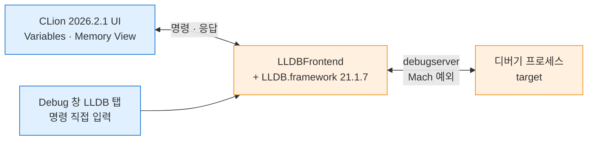

---
tags:
  - lang/c
  - c/debugging
  - lldb
  - clion
  - memory
  - watchpoint
  - endianness
  - status/verified
aliases:
  - lldb 메모리 조회
  - CLion 디버깅
  - memory read
created: 2026-08-18
updated: 2026-08-18
---

# lldb로 메모리 주소 값 조회하기 (CLion 2026.2.1)

> CLion 디버거는 **lldb 프론트엔드**. UI 버튼으로 안 되는 조회는 LLDB 콘솔에 명령 직접 입력

## 검증 환경

| 항목 | 값 |
|---|---|
| CLion 버전 | **2026.2.1** |
| 빌드 번호 | `CL-262.9437.136` |
| 메이저 릴리스 | 2026-07-16 |
| 설정 디렉토리 | `~/Library/Application Support/JetBrains/CLion2026.2/` |
| 플랫폼 | macOS (arm64) |

## 구조

CLion은 자체 디버거를 보유하지 않고 **번들 디버거**를 구동해 결과를 UI로 표시



### 번들 디버거 실측

| 구성 요소 | 경로 · 버전 |
|---|---|
| lldb 본체 | `Contents/bin/lldb/mac/aarch64/LLDB.framework/Resources/lldb` |
| lldb 버전 | **21.1.7** (JetBrains IDE bundle; build 274) |
| 프론트엔드 | `Contents/bin/lldb/mac/aarch64/LLDBFrontend` |
| 원격 스텁 | `LLDB.framework/Resources/debugserver` |
| gdb (동봉) | `Contents/bin/gdb/mac/aarch64/bin/gdb` — **GNU gdb 17.1** (build 80) |

- CLion 번들 lldb는 **LLVM 업스트림 21.1.7** 기반. 시스템 lldb(`/usr/bin/lldb` = Apple `lldb-2100.0.17.108`)와 **별개 바이너리**
- 버전 차이로 출력 서식·지원 명령이 미세하게 상이 가능. 본 문서 명령은 **양쪽 모두 동작 확인 완료**
- CLion은 gdb도 동봉 — 툴체인 설정에서 선택 가능. macOS 기본은 lldb
- UI에서 제공하지 않는 기능도 **LLDB 콘솔로 전부 접근 가능**
- 아래 명령은 전부 CLion의 LLDB 콘솔 탭에 그대로 입력 가능. 터미널 `lldb`와 동일

번들 lldb를 터미널에서 직접 호출해 CLion과 동일 환경 재현 가능

```bash
/Applications/CLion.app/Contents/bin/lldb/mac/aarch64/LLDB.framework/Resources/lldb ./target
```

- CLion 디버그 세션과 **같은 lldb 바이너리** 사용 → 동작 차이 제거
- 시스템 lldb와 결과가 다를 때 원인 격리에 유효

## 빌드 전제

디버그 정보 없이는 변수명·행 번호 조회 불가

```bash
cc -Wall -Wextra -g -O0 target.c -o target
```

- `-Wall` — 주요 경고 활성. 미초기화 변수·타입 불일치 등 검출
- `-Wextra` — `-Wall` 미포함 추가 경고 활성
- `-g` — **디버그 심볼 포함**. 변수명·행 번호·타입 정보 확보에 필수
- `-O0` — 최적화 비활성. 변수 제거·행 재배치 방지
- `-o target` — 출력 파일명을 `target`으로 지정. 미지정 시 `a.out`

CMake 사용 시 `Debug` 프로파일이 `-g -O0` 상당 옵션 적용. CLion 기본값 그대로 사용 가능

## 실습 대상

```c
#include <stdio.h>
#include <stdlib.h>
#include <string.h>

typedef struct {
    int  id;
    char name[16];
    double score;
} Rec;

static int g_counter = 100;

static char *make_buf(const char *src) {
    char *p = malloc(32);
    strcpy(p, src);
    return p;
}

int main(void) {
    int      local = 0x41424344;          /* 'ABCD' 바이트 확인용 */
    char     arr[8] = "hi";
    Rec      r = { 7, "alice", 95.5 };
    char    *heap = make_buf("HELLO");

    g_counter++;                          /* watchpoint 대상 */
    local++;

    printf("local=%d arr=%s r.name=%s heap=%s g=%d\n",
           local, arr, r.name, heap, g_counter);

    free(heap);
    printf("free 완료\n");
    return 0;
}
```

## 명령 요약

| 명령 | 축약 | 용도 |
|---|---|---|
| `frame variable` | `fr v` | 현재 프레임 지역 변수 전체 |
| `print <식>` | `p` | 식 평가. 변수·주소·`sizeof` |
| `print &<변수>` | `p &x` | 변수의 **주소** 확인 |
| `memory read <주소>` | `x` | 지정 주소의 **원시 바이트** |
| `watchpoint set variable <변수>` | `w s v` | 값 변경 시 정지 |
| `breakpoint set -f <파일> -l <행>` | `b` | 행 브레이크포인트 |
| `thread step-over` | `n` | 한 줄 실행 |
| `bt` | — | 호출 스택 |

`memory read` 옵션

| 옵션 | 의미 |
|---|---|
| `-s<n>` | 항목 하나의 바이트 수. `-s1` = 바이트 단위 |
| `-f<c>` | 표시 형식. `x`=16진, `c`=문자, `d`=10진 |
| `-c<n>` | 읽을 항목 개수 |

## 실습 1 — 스택 변수와 리틀 엔디안

배치 모드로 재현 가능. CLion에서는 브레이크포인트를 걸고 콘솔에 같은 명령 입력

```bash
lldb -b \
  -o "breakpoint set -f target.c -l 31" \
  -o "run" \
  -o "frame variable" \
  -o "p &local" \
  -o "memory read -s1 -fx -c8 &local" \
  ./target
```

- `lldb` — 디버거 실행
- `-b` — 배치 모드. 명령 전부 수행 후 자동 종료. 대화형 입력 불요
- `-o "<명령>"` — 시작 시 실행할 lldb 명령 지정. 여러 개 나열 가능
- `breakpoint set -f target.c -l 31` — `target.c` 31행에 브레이크포인트 설정
- `run` — 프로그램 실행. 브레이크포인트에서 정지
- `frame variable` — 현재 프레임 지역 변수 일괄 출력
- `p &local` — `local`의 주소 출력
- `memory read -s1 -fx -c8 &local` — `local` 주소부터 1바이트 단위 16진으로 8개 읽기
- `./target` — 디버깅 대상 실행 파일

```
(lldb) frame variable
(int) local = 1094861637
(char[8]) arr = "hi"
(Rec) r = (id = 7, name = "alice", score = 95.5)
(char *) heap = 0x0000000100615270 "HELLO"
(lldb) p &local
(int *) 0x000000016fdfe668
(lldb) memory read -s1 -fx -c8 &local
0x16fdfe668: 0x45 0x43 0x42 0x41 0x00 0x00 0x00 0x00
```

- `local` = 1094861637 = `0x41424345` (`0x41424344` 초기화 후 `local++`)
- 메모리 바이트 순서 — `45 43 42 41` → **역순 저장**. arm64·x86_64 공통 **리틀 엔디안**
- 값과 메모리 배치가 다르게 보이는 이유가 여기 있음. 네트워크 전송·이진 파일 교환 시 주의 지점
- 주소 `0x16fd…` — 스택 영역. 힙(`0x1006…`)과 자릿수 상이

## 실습 2 — 배열 (주소 표현 함정)

배열 이름을 그대로 넘기면 오류 발생

```
(lldb) memory read -s1 -fx -c8 arr
error: invalid start address expression.
error: address expression "arr" resulted in a value whose type can't be converted to an address: char[8]
```

- 원인 — `memory read`는 **주소 값**을 요구. `arr`은 `char[8]` 타입 그 자체
- 해결 — `&arr` 사용

```
(lldb) memory read -s1 -fx -c8 &arr
0x16fdfe6c0: 0x68 0x69 0x00 0x00 0x00 0x00 0x00 0x00
(lldb) memory read -fc -c8 &arr
0x16fdfe6c0: hi\0\0\0\0\0\0
```

- `-fc` — 문자 형식 표시. 널 종단(`\0`)과 미사용 영역 육안 확인
- `68 69` = `'h'`·`'i'`, 이후 전부 `0x00` — 초기화되지 않은 나머지가 아니라 **초기화자가 0으로 채움**
- 포인터 변수(`char *heap`)는 값 자체가 주소이므로 `&` 불요

## 실습 3 — 힙 블록

```
(lldb) p heap
(char *) 0x0000000100665270 "HELLO"
(lldb) memory read -s1 -fx -c16 heap
0x100665270: 0x48 0x45 0x4c 0x4c 0x4f 0x00 0x00 0x00
0x100665278: 0x00 0x00 0x00 0x00 0x00 0x00 0x00 0x00
(lldb) memory read -fc -c16 heap
0x100665270: HELLO\0\0\0\0\0\0\0\0\0\0\0
```

- `48 45 4c 4c 4f` = `"HELLO"`, 이어서 널 종단
- `malloc(32)` 중 6바이트만 사용 — 나머지는 이 시점에 0이나 **보장 부재**. `malloc`은 미초기화

## 실습 4 — 구조체 패딩과 IEEE 754

정렬 규칙으로 삽입된 빈 공간을 바이트 단위로 확인

```
(lldb) p sizeof(Rec)
(unsigned long) 32
(lldb) memory read -s1 -fx -c32 &r
0x16fdfe6a0: 0x07 0x00 0x00 0x00 0x61 0x6c 0x69 0x63
0x16fdfe6a8: 0x65 0x00 0x00 0x00 0x00 0x00 0x00 0x00
0x16fdfe6b0: 0x00 0x00 0x00 0x00 0x00 0x00 0x00 0x00
0x16fdfe6b8: 0x00 0x00 0x00 0x00 0x00 0xe0 0x57 0x40
```

| 오프셋 | 크기 | 내용 |
|---|---|---|
| +0 | 4 | `id` = `07 00 00 00` = 7 (리틀 엔디안) |
| +4 | 16 | `name` = `61 6c 69 63 65 00 …` = `"alice"` + 널 + 잔여 0 |
| +20 | 4 | **패딩** — 접근 불가 빈 공간 |
| +24 | 8 | `score` = `00 00 00 00 00 e0 57 40` |

- 합계 — 4 + 16 + 4(패딩) + 8 = **32바이트**. `sizeof(Rec)` 결과와 일치
- 패딩 이유 — `double`은 8바이트 정렬 필요. `id`+`name` = 20에서 시작 불가 → 24로 밀림
- `score` = 95.5 → IEEE 754 배정밀도 `0x4057E00000000000`. 리틀 엔디안이라 `00 00 00 00 00 E0 57 40`로 역순 저장
- 멤버 순서를 크기 내림차순으로 배치하면 패딩 축소 가능 — 구조체 배열 대량 사용 시 유효

## 실습 5 — `free` 전후 비교

`free` 호출 전후로 같은 주소를 읽어 할당자 동작 확인

```bash
lldb -b \
  -o "breakpoint set -f target.c -l 31" \
  -o "run" \
  -o "memory read -s1 -fx -c16 heap" \
  -o "thread step-over" \
  -o "memory read -s1 -fx -c16 0x100665270" \
  ./target
```

- `-b` — 배치 모드
- `-o "<명령>"` — 시작 시 실행할 명령
- `breakpoint set -f target.c -l 31` — `free(heap)` 행에 정지
- `run` — 실행
- `memory read -s1 -fx -c16 heap` — 해제 **전** 16바이트
- `thread step-over` — `free(heap)` 한 줄만 실행
- `memory read -s1 -fx -c16 0x100665270` — 해제 **후** 같은 주소. `heap` 변수 대신 **주소 리터럴** 사용
- `./target` — 대상 실행 파일

해제 전

```
0x100665270: 0x48 0x45 0x4c 0x4c 0x4f 0x00 0x00 0x00
```

해제 후

```
0x100665270: 0x00 0x00 0x00 0x00 0x00 0x00 0x00 0x00
0x100665278: 0x00 0x00 0x00 0x00 0x00 0x00 0x00 0x00
```

- `"HELLO"` 소멸 확인 — 할당자가 블록을 회수하며 내용 파괴
- 주소는 여전히 **읽기 가능** — 프로세스 주소 공간에서 해제되지 않았기 때문. use-after-free가 즉시 크래시하지 않는 이유
- 해제 후에는 `heap` 변수 대신 **미리 확인한 주소 리터럴** 사용 권장. 변수 경유 시 댕글링 상태 의존
- 상세 배경 → [[C/docs/02-memory/heap-and-free|free의 실제 동작]]

## 실습 6 — watchpoint (값이 언제 바뀌는가)

"이 변수를 누가 언제 바꿨는지" 추적. 브레이크포인트로 잡기 어려운 문제에 유효

```bash
lldb -b \
  -o "breakpoint set -f target.c -l 20" \
  -o "run" \
  -o "watchpoint set variable g_counter" \
  -o "continue" \
  -o "bt" \
  ./target
```

- `-b` — 배치 모드
- `-o "<명령>"` — 시작 시 실행할 명령
- `breakpoint set -f target.c -l 20` — `main` 진입 후 지점에 정지. **watchpoint 설정 전 변수 존재 확보** 목적
- `run` — 실행
- `watchpoint set variable g_counter` — `g_counter` 값 변경 감시 등록
- `continue` — 실행 재개. 값 변경 시 자동 정지
- `bt` — 정지 시점 호출 스택 출력
- `./target` — 대상 실행 파일

```
Watchpoint 1 hit:
old value: 100
new value: 101
Process 18832 stopped
* thread #1, queue = 'com.apple.main-thread', stop reason = watchpoint 1
    frame #0: 0x00000001000005d4 target`main at target.c:26:10
   25  	    g_counter++;                          /* watchpoint 대상 */
-> 26  	    local++;
(lldb) bt
* thread #1, queue = 'com.apple.main-thread', stop reason = watchpoint 1
  * frame #0: 0x00000001000005d4 target`main at target.c:26:10
```

- `old value` · `new value` **양쪽 제시** — 변경 전후 비교 가능
- 정지 위치는 변경을 일으킨 줄(25)이 아니라 **그 다음 줄(26)** — 쓰기 완료 후 정지하는 특성
- `bt`로 호출 경로 확인 → 어느 함수가 변경했는지 추적
- 하드웨어 watchpoint는 개수 제한 존재(arm64 통상 4개 이하). 초과 시 설정 실패
- 주소 기준 감시 — `watchpoint set expression -- <주소>` 형태 사용

## 최적화가 디버깅에 미치는 영향

같은 소스·같은 브레이크포인트 요청이 최적화 수준에 따라 다르게 동작

```bash
cc -Wall -Wextra -g -O0 target.c -o target
cc -Wall -Wextra -g -O2 target.c -o target_o2
lldb -b -o "breakpoint set -f target.c -l 26" -o "run" ./target
lldb -b -o "breakpoint set -f target.c -l 26" -o "run" ./target_o2
```

- `-g` — 디버그 심볼 포함. 양쪽 공통
- `-O0` — 최적화 비활성
- `-O2` — 최적화 활성. 인라인·재배치·변수 제거 수행
- `-o target` / `-o target_o2` — 출력 파일명 구분
- `breakpoint set -f target.c -l 26` — 양쪽에 **동일한 26행** 요청

`-O0` 결과

```
Breakpoint 1: where = target`main + 140 at target.c:26:10
```

`-O2` 결과

```
Breakpoint 1: where = target_o2`main + 112 at target.c:28:5
frame #0: 0x00000001000005b8 target_o2`main at target.c:28:5 [opt]
```

- 26행 요청이 **28행으로 이동** — 최적화로 해당 코드가 병합·제거되어 대응 주소 부재
- `[opt]` 표시 — 최적화된 프레임임을 알림
- 변수가 레지스터에만 존재하거나 완전 제거되면 `frame variable`에서 미표시 가능
- 결론 — 디버깅은 **`-O0` 빌드**로 수행. CLion `Debug` 프로파일 사용

## CLion UI 대응

콘솔 명령은 **검증 완료**, UI 조작 경로는 화면 확인이 필요한 영역. 아래 표의 검색어로 각자 환경에서 위치·단축키 확인 권장

| 목적 | LLDB 콘솔 (검증 완료) | UI 기능 검색어 (영문 UI 기준) |
|---|---|---|
| 지역 변수 확인 | `frame variable` | Variables (디버그 창 기본 패널) |
| 주소 확인 | `p &x` | — 포인터 값이 Variables에 직접 표시 |
| 원시 바이트 조회 | `memory read -s1 -fx -c16 <주소>` | `Memory View` |
| 임의 식 평가 | `p <식>` | `Evaluate Expression` |
| 감시 목록 추가 | `frame variable <변수>` 반복 | `Add to Watches` |
| 값 변경 감시 | `watchpoint set variable <변수>` | `View Breakpoints` 내 watchpoint 항목 |

### 단축키 확인 절차

CLion 2026.2.1 기준, 단축키는 **선택된 keymap에 종속**. 아래 경로에서 직접 확인이 확실

1. `Settings`(macOS는 `CLion | Settings`) → `Keymap`
2. 우측 상단 검색창에 위 표의 검색어 입력 (예: `Memory View`)
3. 항목 우측에 현재 keymap의 단축키 표시. 부재 시 우클릭 → `Add Keyboard Shortcut`으로 지정 가능

- 본 환경은 사용자 `keymap.xml` 부재 → **기본 keymap** 사용 중 (macOS 기본값)
- 기본 keymap 단축키 목록은 앱 번들에서 추출 불가 → 문서에 **개별 단축키 미기재**. 위 절차로 확인
- 액션명은 UI 언어 설정에 따라 번역 표시 가능 — 영문 검색어로 안 잡히면 한글명으로 재검색

### 콘솔 우선 권장 이유

- 버전·keymap·UI 언어와 **무관하게 동일 동작**
- Memory View가 제공하지 않는 형식 지정(`-fc` 문자 표시 등) 사용 가능
- 명령·출력을 그대로 문서·이슈에 인용 가능 → 재현성 확보
- Memory View 사용 시에도 `p &변수`로 얻은 주소를 입력란에 붙여넣는 방식이 확실

## 함정 · 주의점

- `-g` 누락 → 변수명·행 번호 조회 불가. 어셈블리 수준만 확인 가능
- `-O2`·`-O3` 빌드 디버깅 → 행 재배치·변수 소실. `-O0` 사용
- 배열에 `memory read arr` → 타입 오류. `&arr` 사용
- 포인터에 `memory read &heap` → **포인터 변수 자체**의 바이트를 읽음. 가리키는 대상은 `memory read heap`
- 해제 후 `heap` 변수로 조회 → 댕글링 포인터 의존. 주소 리터럴 사용
- watchpoint 개수 초과 → 설정 실패. 불필요한 watchpoint 삭제(`watchpoint delete`)
- 스택 변수에 watchpoint 설정 후 함수 반환 → 해당 주소가 재사용되어 무관한 정지 발생
- 리틀 엔디안 착각 → 메모리 덤프 바이트 순서가 값 표기와 역순. 다중 바이트 타입 해석 시 주의
- CLion 실행 창은 파이프 연결 → `stdout` 전 버퍼. 출력 시점이 터미널과 상이 → [[C/docs/07-stdlib/06-stdio-buffering|버퍼링 문서]] 참조

## 검증

- [x] `frame variable`로 지역 변수 일괄 조회
- [x] `p &local`로 주소 확인 후 `memory read`로 바이트 조회
- [x] 리틀 엔디안 바이트 역순 저장 확인 (`0x41424345` → `45 43 42 41`)
- [x] 배열 이름 직접 전달 시 오류 메시지 확인
- [x] 구조체 패딩 4바이트·IEEE 754 배치 확인
- [x] `free` 전후 힙 블록 내용 변화 확인
- [x] watchpoint `old value`·`new value` 및 정지 위치 확인
- [x] `-O2`에서 브레이크포인트 행 재배치 확인
- [x] CLion 2026.2.1 버전·빌드 번호 확인 (`CL-262.9437.136`)
- [x] 번들 lldb 21.1.7·gdb 17.1 버전 확인
- [x] 번들 lldb로 동일 명령 실행해 시스템 lldb와 같은 결과 확인
- [ ] CLion UI 메뉴 위치·기본 단축키 — 앱 번들에서 추출 불가. `Settings | Keymap` 검색으로 확인 필요

## 관련 문서

- [[C/docs/02-memory/heap-and-free|free의 실제 동작]] — 해제 후 블록 상태의 배경 원리
- [[C/docs/01-basics/c-program-execution-model|C 프로그램의 동작 및 컴파일 방식]] — 스택·힙·데이터 세그먼트 주소 범위
- [[C/docs/03-build/gcc-compile-and-run|gcc 컴파일 · 실행 명령어]] — `-g`·`-O` 옵션 전반
- [[C/docs/08-syntax/sizeof-and-array-subscript|sizeof 연산자와 배열 첨자]] — 구조체 크기와 정렬
- [[C/docs/07-stdlib/06-stdio-buffering|표준 입출력 버퍼링과 fflush]] — 디버그 콘솔 출력 시점 차이
- [[C/docs/README|학습 문서 인덱스]] — 카테고리별 전체 문서 목록
