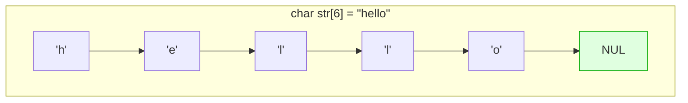

---
tags:
  - lang/c
  - c/stdlib
  - string
  - strtok
  - memcpy
  - null-termination
  - status/verified
aliases:
  - string.h
  - 문자열 함수
created: 2026-08-14
updated: 2026-08-14
---

# `<string.h>` — 문자열 · 메모리 처리

> C 문자열은 널(`'\0'`) 종단 `char` 배열. 길이 정보 미보유 → 모든 함수가 종단 문자에 의존

## 헤더 포함

```c
#include <string.h>
```

## C 문자열의 실체



- `"hello"` 저장에 **6바이트** 필요 (널 종단 포함)
- `strlen`은 널까지 순회하여 계산 → **O(n)**. 반복문 조건에 넣으면 O(n²)
- 널 종단 소실 → 모든 문자열 함수가 버퍼 밖으로 폭주

## Java와의 차이

| 항목    | Java                | C                          |
| ----- | ------------------- | -------------------------- |
| 타입    | `String` 객체         | `char` 배열 + 널 종단           |
| 길이    | `length()` O(1) 저장됨 | `strlen()` O(n) 계산         |
| 불변성   | 불변                  | 가변 (버퍼면)                   |
| 연결    | `+` 연산자             | `strcat` (버퍼 직접 관리)        |
| 비교    | `equals()`          | `strcmp() == 0`            |
| 범위 검사 | 예외 발생               | **검사 부재** → 오버플로           |
| 메모리   | GC                  | 배열이면 자동, `strdup`이면 `free` |

## 길이 · 복사 · 연결

| 함수 | 시그니처 | 비고 |
|---|---|---|
| `strlen` | `size_t strlen(const char *s)` | 널 제외 길이 |
| `strcpy` | `char *strcpy(char *dst, const char *src)` | 크기 검사 부재 |
| `strncpy` | `char *strncpy(char *dst, const char *src, size_t n)` | **널 종단 미보장** |
| `strcat` | `char *strcat(char *dst, const char *src)` | 크기 검사 부재 |
| `strncat` | `char *strncat(char *dst, const char *src, size_t n)` | 널 종단 보장 |
| `strdup` | `char *strdup(const char *s)` | 힙 복사본. **`free` 필요** |

```c
#include <stdio.h>
#include <string.h>

int main(void) {
    char dst[32];
    printf("strlen(\"hello\") = %zu\n", strlen("hello"));
    strcpy(dst, "hello");                     printf("strcpy → %s\n", dst);
    strncpy(dst, "abcdefgh", 4); dst[4]='\0'; printf("strncpy(4) → %s\n", dst);
    strcpy(dst, "foo"); strcat(dst, "bar");   printf("strcat → %s\n", dst);
    return 0;
}
```

```
strlen("hello") = 5
strcpy → hello
strncpy(4) → abcd
strcat → foobar
```

### `strncpy` 널 종단 함정 (중요)

`strncpy`는 이름과 달리 **안전하지 않음**. `n`바이트를 정확히 복사할 때 널 종단 미추가

```c
#include <stdio.h>
#include <string.h>

int main(void) {
    char buf[8];
    memset(buf, 'Z', sizeof(buf));       // 눈에 보이게 채움
    strncpy(buf, "abcdefgh", 8);         // 정확히 8자 → 널 종단 자리 없음
    printf("널 종단 미보장: ");
    for (int i = 0; i < 8; i++) printf("%c", buf[i]);
    printf("  (buf[7]=='%c', '\\0' 아님)\n", buf[7]);

    char safe[8];
    strncpy(safe, "abcdefgh", sizeof(safe) - 1);
    safe[sizeof(safe) - 1] = '\0';       // ← 수동 종단 필수
    printf("수동 종단 후: %s (길이 %zu)\n", safe, strlen(safe));
    return 0;
}
```

```
널 종단 미보장: abcdefgh  (buf[7]=='h', '\0' 아님)
수동 종단 후: abcdefg (길이 7)
```

- 상단 `buf`를 `%s`로 출력하면 널을 만날 때까지 **버퍼 밖까지 읽음**
- 안전 패턴 — `strncpy(dst, src, sizeof(dst)-1); dst[sizeof(dst)-1] = '\0';`
- 대안 — `snprintf(dst, sizeof(dst), "%s", src)` 가 더 안전하고 직관적

### 안전한 복사 요약

```c
// 권장 1 — snprintf
snprintf(dst, sizeof(dst), "%s", src);

// 권장 2 — strncpy + 수동 종단
strncpy(dst, src, sizeof(dst) - 1);
dst[sizeof(dst) - 1] = '\0';

// 금지 — 크기 검사 부재
strcpy(dst, src);
```

## 비교

| 함수 | 용도 |
|---|---|
| `strcmp` | `int strcmp(const char *a, const char *b)` |
| `strncmp` | 앞 `n`바이트만 비교 |
| `strcasecmp` | 대소문자 무시 (POSIX, `<strings.h>`) |

```c
printf("strcmp(abc,abd) = %d\n", strcmp("abc","abd"));
printf("strcmp(abc,abc) = %d\n", strcmp("abc","abc"));
printf("strcmp(abd,abc) = %d\n", strcmp("abd","abc"));
printf("strncmp(abcXX,abcYY,3) = %d\n", strncmp("abcXX","abcYY",3));
```

```
strcmp(abc,abd) = -1
strcmp(abc,abc) = 0
strcmp(abd,abc) = 1
strncmp(abcXX,abcYY,3) = 0
```

- 반환값 — 음수(a<b), **0(같음)**, 양수(a>b). 구체 값은 구현 종속
- **같으면 0** — Java의 `equals()`와 반대 감각. `if (strcmp(a,b) == 0)` 형태로 작성
- `if (strcmp(a,b))` → "다를 때 참". 의도와 반대되기 쉬움
- 포인터 비교(`a == b`)는 주소 비교. 내용 비교 아님

## 탐색

| 함수 | 용도 |
|---|---|
| `strchr` | `char *strchr(const char *s, int c)` — 문자 첫 위치 |
| `strrchr` | 문자 마지막 위치 |
| `strstr` | 부분 문자열 위치 |
| `strspn` | 지정 문자 집합으로만 구성된 앞부분 길이 |
| `strcspn` | 지정 문자 집합이 처음 나오는 위치 |
| `strpbrk` | 지정 문자 집합 중 아무거나 첫 위치 |

```c
char *p = strchr("hello world", 'o');
printf("strchr 'o' 첫위치 offset = %ld\n", p - "hello world");
p = strrchr("hello world", 'o');
printf("strrchr 'o' 마지막 offset = %ld\n", p - "hello world");
p = strstr("hello world", "wor");
printf("strstr \"wor\" offset = %ld\n", p - "hello world");
printf("strspn(\"abcdef\",\"abc\") = %zu\n", strspn("abcdef","abc"));
printf("strcspn(\"abcdef\",\"de\") = %zu\n", strcspn("abcdef","de"));
```

```
strchr 'o' 첫위치 offset = 4
strrchr 'o' 마지막 offset = 7
strstr "wor" offset = 6
strspn("abcdef","abc") = 3
strcspn("abcdef","de") = 3
```

- 미발견 시 `NULL` 반환 → 역참조 전 검사 필수
- 반환값은 **포인터**. 인덱스가 필요하면 `p - s` 연산
- `strcspn` 활용 — `fgets` 개행 제거에 관용적으로 사용
  ```c
  line[strcspn(line, "\n")] = '\0';   // 개행 없어도 안전 (길이 반환)
  ```

## 분해 — `strtok_r`

```c
char csv[] = "a,b,c";                    // 배열이어야 함 (수정됨)
char *sp, *tok = strtok_r(csv, ",", &sp);
printf("strtok_r:");
while (tok) { printf(" [%s]", tok); tok = strtok_r(NULL, ",", &sp); }
printf("\n");
```

```
strtok_r: [a] [b] [c]
```

- **원본을 파괴적으로 수정** — 구분자를 `'\0'`으로 치환
- 2회차부터 첫 인자 `NULL`
- 문자열 리터럴 전달 금지 → 읽기 전용 영역 수정 → 크래시
- `strtok`(`_r` 없음)은 내부 정적 상태 사용 → 중첩·스레드 불가. **`strtok_r` 권장**
- 연속 구분자는 자동 건너뜀 → 빈 필드 미생성 (CSV 파싱 시 주의)

## 메모리 조작

| 함수 | 시그니처 | 용도 |
|---|---|---|
| `memset` | `void *memset(void *p, int c, size_t n)` | 값 채우기 |
| `memcpy` | `void *memcpy(void *d, const void *s, size_t n)` | 복사 (**겹침 불가**) |
| `memmove` | `void *memmove(void *d, const void *s, size_t n)` | 복사 (**겹침 허용**) |
| `memcmp` | `int memcmp(const void *a, const void *b, size_t n)` | 바이트 비교 |
| `memchr` | `void *memchr(const void *p, int c, size_t n)` | 바이트 탐색 |

```c
char buf[16];
memset(buf, 'A', 5); buf[5]='\0';  printf("memset → %s\n", buf);
memcpy(buf, "XYZ", 3);             printf("memcpy → %s\n", buf);
char ov[16] = "abcdef";
memmove(ov+2, ov, 4); ov[6]='\0';  printf("memmove 겹침 → %s\n", ov);
printf("memcmp(abc,abd,3) = %d\n", memcmp("abc","abd",3));
```

```
memset → AAAAA
memcpy → XYZAA
memmove 겹침 → ababcd
memcmp(abc,abd,3) = -1
```

- `memset`으로 구조체 0 초기화 — `memset(&s, 0, sizeof(s))`
- **`memset(arr, 1, n)`은 각 바이트를 1로 채움** → `int` 배열을 1로 채우는 것 아님 (0x01010101)
- `memcpy` 영역 겹침 → 정의되지 않은 동작. 겹침 가능성 있으면 `memmove`
- 문자열이 아닌 데이터(구조체·배열)에는 `mem*` 계열 사용

## 오류 메시지 — `strerror`

```c
printf("strerror(2) = %s\n", strerror(2));
```

```
strerror(2) = No such file or directory
```

- `errno` 값 → 사람이 읽는 메시지
- `perror("컨텍스트")` — `stderr`에 `컨텍스트: 메시지` 형태 출력
- 사용 패턴
  ```c
  #include <errno.h>
  if (fopen(path, "r") == NULL)
      fprintf(stderr, "%s: %s\n", path, strerror(errno));
  ```

## 함수 요약표

| 분류 | 함수 | 한 줄 요약 |
|---|---|---|
| 길이 | `strlen` | 널 제외 길이 (O(n)) |
| 복사 | `strcpy` `strncpy` `strdup` `memcpy` `memmove` | `strdup`은 `free` 필요 |
| 연결 | `strcat` `strncat` | 대상 버퍼 여유 필수 |
| 비교 | `strcmp` `strncmp` `memcmp` | **0 = 같음** |
| 탐색 | `strchr` `strrchr` `strstr` `strspn` `strcspn` `strpbrk` `memchr` | 미발견 시 `NULL` |
| 분해 | `strtok_r` | 원본 파괴 |
| 채우기 | `memset` | 바이트 단위 |
| 오류 | `strerror` | `errno` → 메시지 |

## 함정 · 주의점

- `strcpy`·`strcat`·`sprintf` — 크기 검사 부재. 버퍼 오버플로 주원인
- `strncpy` 널 종단 미보장 → 수동 종단 필수 (위 실증 참조)
- 버퍼 크기 계산 시 **널 종단 자리 누락** → `char buf[5]`에 `"hello"`(6B) 복사 시 오버플로
- `strcmp` 반환 0을 "거짓"으로 오해 → `if (strcmp(a,b))`는 "다를 때 참"
- `strlen`을 루프 조건에 배치 → 매 반복 O(n) 재계산
  ```c
  for (size_t i = 0; i < strlen(s); i++)   // ← O(n²)
  size_t len = strlen(s);
  for (size_t i = 0; i < len; i++)         // ← O(n)
  ```
- 문자열 리터럴을 수정 시도 → 읽기 전용 영역 → 크래시
  ```c
  char *p = "hello"; p[0] = 'H';      // ← 크래시
  char a[] = "hello"; a[0] = 'H';     // ← 정상
  ```
- `strdup` 결과 `free` 누락 → 누수. 반환값 `NULL` 검사도 필요
- `memcpy`로 겹친 영역 복사 → 정의되지 않은 동작. `memmove` 사용
- `memset(arr, 1, n)`으로 정수 배열 초기화 → 의도와 다른 값
- `sizeof` vs `strlen` 혼동
  ```c
  char a[10] = "hi";
  sizeof(a)  // 10 (배열 크기)
  strlen(a)  // 2  (문자열 길이)
  char *p = "hi";
  sizeof(p)  // 8  (포인터 크기!) ← 함정
  ```
- 함수 인자로 받은 배열에 `sizeof` 사용 → 포인터 크기 반환. 크기를 별도 인자로 전달 필요
- `strtok_r`에 리터럴 전달 → 크래시
- UTF-8 한글은 문자당 3바이트 → `strlen`이 글자 수 아닌 **바이트 수** 반환

## 검증

- [ ] 각 함수 실행 결과 확인
- [ ] `strncpy` 널 종단 미보장 재현
- [ ] `strcmp` 반환값 부호 확인
- [ ] `memmove` 겹침 처리 확인
- [ ] `sizeof` vs `strlen` 차이 확인
- [ ] 문자열 리터럴 수정 시 크래시 재현

## 다음 문서

- [[C/docs/07-stdlib/03-stdlib|`<stdlib.h>` 메모리 · 변환 · 유틸리티]]

## 관련 문서

- [[C/docs/07-stdlib/01-stdio|`<stdio.h>` 표준 입출력]] — 입출력 함수와 서식 지정자
- [[C/docs/07-stdlib/README|라이브러리 시리즈 개요]] — 빈출 함수 30선과 통합 예제
