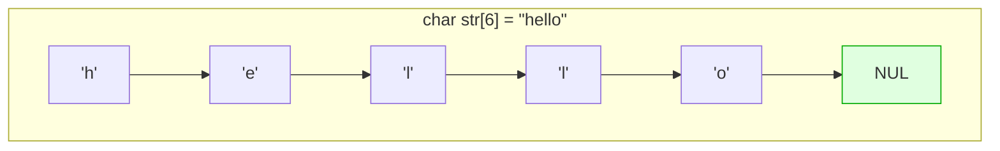

---
tags:
  - lang/c
  - c/stdlib
  - string
  - strtok
  - memcpy
  - null-termination
  - status/verified
aliases:
  - string.h
  - 문자열 함수
created: 2026-08-14
updated: 2026-08-24
---

# `<string.h>` — 문자열 · 메모리 처리

> C 문자열은 널(`'\0'`) 종단 `char` 배열. 길이 정보 미보유 → 모든 함수가 종단 문자에 의존

## 헤더 포함

```c
#include <string.h>
```

## C 문자열의 실체


```mermaid
flowchart TD
    subgraph M["char str[6] = &quot;hello&quot;"]
        c0["'h'"] --> c1["'e'"] --> c2["'l'"] --> c3["'l'"] --> c4["'o'"] --> c5["NUL"]
    end

    classDef term fill:#e0ffe0,stroke:#0a0
    class c5 term
```

- `"hello"` 저장에 **6바이트** 필요 (널 종단 포함)
- `strlen`은 널까지 순회하여 계산 → **O(n)**. 반복문 조건에 넣으면 O(n²)
- 널 종단 소실 → 모든 문자열 함수가 버퍼 밖으로 폭주

## Java와의 차이

| 항목    | Java                | C                          |
| ----- | ------------------- | -------------------------- |
| 타입    | `String` 객체         | `char` 배열 + 널 종단           |
| 길이    | `length()` O(1) 저장됨 | `strlen()` O(n) 계산         |
| 불변성   | 불변                  | 가변 (버퍼면)                   |
| 연결    | `+` 연산자             | `strcat` (버퍼 직접 관리)        |
| 비교    | `equals()`          | `strcmp() == 0`            |
| 범위 검사 | 예외 발생               | **검사 부재** → 오버플로           |
| 메모리   | GC                  | 배열이면 자동, `strdup`이면 `free` |

## 길이 · 복사 · 연결

| 함수 | 시그니처 | 비고 |
|---|---|---|
| `strlen` | `size_t strlen(const char *s)` | 널 제외 길이 |
| `strcpy` | `char *strcpy(char *dst, const char *src)` | 크기 검사 부재 |
| `strncpy` | `char *strncpy(char *dst, const char *src, size_t n)` | **널 종단 미보장** |
| `strcat` | `char *strcat(char *dst, const char *src)` | 크기 검사 부재 |
| `strncat` | `char *strncat(char *dst, const char *src, size_t n)` | 널 종단 보장 |
| `strdup` | `char *strdup(const char *s)` | 힙 복사본. **`free` 필요** |

```c
#include <stdio.h>
#include <string.h>

int main(void) {
    char dst[32];
    printf("strlen(\"hello\") = %zu\n", strlen("hello"));
    strcpy(dst, "hello");                     printf("strcpy → %s\n", dst);
    strncpy(dst, "abcdefgh", 4); dst[4]='\0'; printf("strncpy(4) → %s\n", dst);
    strcpy(dst, "foo"); strcat(dst, "bar");   printf("strcat → %s\n", dst);
    return 0;
}
```

```
strlen("hello") = 5
strcpy → hello
strncpy(4) → abcd
strcat → foobar
```

### `strncpy` 널 종단 함정 (중요)

`strncpy`는 이름과 달리 **안전하지 않음**. `n`바이트를 정확히 복사할 때 널 종단 미추가

```c
#include <stdio.h>
#include <string.h>

int main(void) {
    char buf[8];
    memset(buf, 'Z', sizeof(buf));       // 눈에 보이게 채움
    strncpy(buf, "abcdefgh", 8);         // 정확히 8자 → 널 종단 자리 없음
    printf("널 종단 미보장: ");
    for (int i = 0; i < 8; i++) printf("%c", buf[i]);
    printf("  (buf[7]=='%c', '\\0' 아님)\n", buf[7]);

    char safe[8];
    strncpy(safe, "abcdefgh", sizeof(safe) - 1);
    safe[sizeof(safe) - 1] = '\0';       // ← 수동 종단 필수
    printf("수동 종단 후: %s (길이 %zu)\n", safe, strlen(safe));
    return 0;
}
```

```
널 종단 미보장: abcdefgh  (buf[7]=='h', '\0' 아님)
수동 종단 후: abcdefg (길이 7)
```

- 상단 `buf`를 `%s`로 출력하면 널을 만날 때까지 **버퍼 밖까지 읽음**
- 안전 패턴 — `strncpy(dst, src, sizeof(dst)-1); dst[sizeof(dst)-1] = '\0';`
- 대안 — `snprintf(dst, sizeof(dst), "%s", src)` 가 더 안전하고 직관적

### 안전한 복사 요약

```c
// 권장 1 — snprintf
snprintf(dst, sizeof(dst), "%s", src);

// 권장 2 — strncpy + 수동 종단
strncpy(dst, src, sizeof(dst) - 1);
dst[sizeof(dst) - 1] = '\0';

// 금지 — 크기 검사 부재
strcpy(dst, src);
```

### 안티패턴 — `strncpy(dst, src, strlen(src))`

`n` 자리에 **소스 길이**를 넣으면 상한이 소스 크기가 됨 → `strcpy` 와 완전히 동일. 이름만 안전해 보이는 가장 흔한 위장 형태

```c
#include <stdio.h>
#include <string.h>

int main(void) {
    char dst[8];
    const char *src = "abcdefghijklmnop";   // 16자, dst 보다 김

    memset(dst, 0, sizeof(dst));
    /* 안티패턴 — 상한이 src 길이라서 dst 크기를 전혀 보지 않음 */
    strncpy(dst, src, strlen(src));          // ← strcpy 와 동일. 8바이트 버퍼에 16바이트
    printf("도달\n");
    return 0;
}
```

```bash
cc -Wall -Wextra -g -fsanitize=address antipattern.c -o antipattern && ./antipattern
```

- `-Wall` — 주요 경고 활성
- `-Wextra` — 추가 경고 활성
- `-g` — 디버그 심볼 포함. ASan 행 번호 표시에 필요
- `-fsanitize=address` — 메모리 오류 검사 코드 삽입. 스택 오버플로 즉시 탐지
- `-o antipattern` — 출력 파일명 지정

```
=================================================================
==51777==ERROR: AddressSanitizer: stack-buffer-overflow on address 0x00016d89df48 at pc 0x000102e871b0 bp 0x00016d89df10 sp 0x00016d89d6c0
WRITE of size 16 at 0x00016d89df48 thread T0
    #0 0x000102e871ac in strncpy+0x414 (libclang_rt.asan_osx_dynamic.dylib:arm64e+0x3b1ac)
    #1 0x000102560928 in main antipattern.c:10
```

- `WRITE of size 16` — `dst[8]` 에 16바이트 기록. **상한이 전혀 작동하지 않음**
- `-Wall -Wextra` 만으로는 경고 부재 → 눈으로 잡아야 하는 패턴
- 판별 기준 — `strncpy`·`strncat`·`memcpy` 의 `n` 이 **목적지 크기에서 유도되지 않으면 전부 의심**

동일 구조의 변형:

```c
strncpy(dst, src, strlen(src));      // 상한 = 소스 길이
strncat(dst, src, strlen(src));      // 동일
memcpy(dst, src, strlen(src) + 1);   // 동일
dst[strlen(src)] = '\0';             // 종단 위치까지 소스 기준 → 범위 밖 쓰기
```

`n` 은 항상 `sizeof(dst)` 또는 `sizeof(dst) - 1` 에서 출발해야 함.

### 안티패턴 — `snprintf` 누적 시 크기 인자 고정

버퍼에 여러 조각을 이어 붙일 때, 두 번째 인자를 **매번 `sizeof(buf) - 1` 로 고정**하면 남은 공간을 반영하지 못함

```c
#include <stdio.h>
#include <string.h>

int main(void) {
    char buf[16];
    int n = 0;

    memset(buf, 0, sizeof(buf));

    /* 안티패턴 — 두 번째 인자가 매번 sizeof(buf)-1 고정. 남은 공간을 반영 못 함 */
    n += snprintf(buf + n, sizeof(buf) - 1, "%s", "AAAAAAAA");    // 8자, n=8
    printf("1회차 n=%d buf=\"%s\"\n", n, buf);
    n += snprintf(buf + n, sizeof(buf) - 1, "%s", "BBBBBBBB");    // ← buf+8 에 15바이트 허용
    printf("2회차 n=%d buf=\"%s\"\n", n, buf);

    return 0;
}
```

```bash
cc -Wall -Wextra -g -fsanitize=address snprintf_acc.c -o snprintf_acc && ./snprintf_acc
```

- 옵션 역할은 위 블록과 동일

```
=================================================================
==51813==ERROR: AddressSanitizer: stack-buffer-overflow on address 0x00016fbd9f50 at pc 0x0001008df378 bp 0x00016fbd9ec0 sp 0x00016fbd9670
WRITE of size 9 at 0x00016fbd9f50 thread T0
    #0 0x0001008df374 in vsnprintf+0x28c
    #1 0x0001008dfb5c in snprintf+0x44
    #2 0x0001002249a0 in main snprintf_acc.c:13
```

- 1회차는 `n == 0` 이라 우연히 맞음 → **첫 호출만 보면 정상으로 보임**
- 2회차에서 `buf + 8` 에 최대 15바이트 허용 → 총 23바이트. `buf[16]` 초과
- ASan 없이 컴파일해도 스택 보호 장치가 종료 코드 `134`(SIGABRT) 로 중단. 다만 진단 메시지 부재

올바른 형태 — 남은 공간을 계산하고 잘림 여부를 반환값으로 확인:

```c
#include <stdio.h>
#include <string.h>

int main(void) {
    char buf[16];
    int n = 0, r;

    memset(buf, 0, sizeof(buf));

    /* 올바른 형태 — 남은 공간 sizeof(buf)-n 을 넘기고, 잘림 여부를 반환값으로 확인 */
    r = snprintf(buf + n, sizeof(buf) - n, "%s", "AAAAAAAA");
    if (r < 0 || (size_t)r >= sizeof(buf) - n) { printf("잘림 발생\n"); }
    n += r;
    printf("1회차 n=%d buf=\"%s\"\n", n, buf);

    r = snprintf(buf + n, sizeof(buf) - n, "%s", "BBBBBBBB");
    if (r < 0 || (size_t)r >= sizeof(buf) - n) { printf("잘림 발생 (요청 %d, 남은 %zu)\n", r, sizeof(buf) - n); }
    printf("2회차 buf=\"%s\"\n", buf);

    return 0;
}
```

```bash
cc -Wall -Wextra -g -fsanitize=address snprintf_ok.c -o snprintf_ok && ./snprintf_ok
```

- 옵션 역할은 위 블록과 동일

```
1회차 n=8 buf="AAAAAAAA"
잘림 발생 (요청 8, 남은 8)
2회차 buf="AAAAAAAABBBBBBB"
```

- 오버플로 부재. 대신 **잘림 발생**을 반환값으로 탐지
- `snprintf` 반환값 = **잘림이 없었다면 필요했을 길이**. 실제 기록 바이트 수가 아님
- 판정식 — `r >= 남은_크기` 이면 잘림. `r < 0` 은 인코딩 오류

### 안티패턴 — 배열에 대한 `== NULL` 검사

```c
#include <stdio.h>

int main(void) {
    char buf[32] = {0};

    if (buf == NULL) {              // ← 배열 주소는 절대 NULL 아님
        printf("도달 불가\n");
        return 1;
    }
    printf("항상 여기로 옴\n");
    return 0;
}
```

```bash
cc -Wall -Wextra -Waddress -g deadnull.c -o deadnull && ./deadnull
```

- `-Wall` — 주요 경고 활성
- `-Wextra` — 추가 경고 활성
- `-Waddress` — 주소 비교가 항상 참·거짓인 경우 경고
- `-g` — 디버그 심볼 포함
- `-o deadnull` — 출력 파일명 지정

```
deadnull.c:6:9: warning: comparison of array 'buf' equal to a null pointer is always false [-Wtautological-pointer-compare]
    6 |     if (buf == NULL) {              // ← 배열 주소는 절대 NULL 아님
      |         ^~~    ~~~~
1 warning generated.
항상 여기로 옴
```

- 배열명은 첫 원소 주소로 감쇠 → **주소가 존재하므로 항상 참**
- 함수 실패 검사를 의도한 코드라면 **검사 대상이 잘못됨**. 아래 중 하나로 교체

```c
if (buf[0] == '\0') { /* 내용이 비었는지 */ }
if (some_fill(buf, sizeof(buf)) < 0) { /* 함수 반환값으로 판정 */ }
```

- 이 형태가 남아 있으면 **오류 처리가 통째로 죽어 있다는 신호**. 경고를 켜서 전수 검색 권장

## 비교

| 함수 | 용도 |
|---|---|
| `strcmp` | `int strcmp(const char *a, const char *b)` |
| `strncmp` | 앞 `n`바이트만 비교 |
| `strcasecmp` | 대소문자 무시 (POSIX, `<strings.h>`) |

```c
printf("strcmp(abc,abd) = %d\n", strcmp("abc","abd"));
printf("strcmp(abc,abc) = %d\n", strcmp("abc","abc"));
printf("strcmp(abd,abc) = %d\n", strcmp("abd","abc"));
printf("strncmp(abcXX,abcYY,3) = %d\n", strncmp("abcXX","abcYY",3));
```

```
strcmp(abc,abd) = -1
strcmp(abc,abc) = 0
strcmp(abd,abc) = 1
strncmp(abcXX,abcYY,3) = 0
```

- 반환값 — 음수(a<b), **0(같음)**, 양수(a>b). 구체 값은 구현 종속
- **같으면 0** — Java의 `equals()`와 반대 감각. `if (strcmp(a,b) == 0)` 형태로 작성
- `if (strcmp(a,b))` → "다를 때 참". 의도와 반대되기 쉬움
- 포인터 비교(`a == b`)는 주소 비교. 내용 비교 아님

## 탐색

| 함수 | 용도 |
|---|---|
| `strchr` | `char *strchr(const char *s, int c)` — 문자 첫 위치 |
| `strrchr` | 문자 마지막 위치 |
| `strstr` | 부분 문자열 위치 |
| `strspn` | 지정 문자 집합으로만 구성된 앞부분 길이 |
| `strcspn` | 지정 문자 집합이 처음 나오는 위치 |
| `strpbrk` | 지정 문자 집합 중 아무거나 첫 위치 |

```c
char *p = strchr("hello world", 'o');
printf("strchr 'o' 첫위치 offset = %ld\n", p - "hello world");
p = strrchr("hello world", 'o');
printf("strrchr 'o' 마지막 offset = %ld\n", p - "hello world");
p = strstr("hello world", "wor");
printf("strstr \"wor\" offset = %ld\n", p - "hello world");
printf("strspn(\"abcdef\",\"abc\") = %zu\n", strspn("abcdef","abc"));
printf("strcspn(\"abcdef\",\"de\") = %zu\n", strcspn("abcdef","de"));
```

```
strchr 'o' 첫위치 offset = 4
strrchr 'o' 마지막 offset = 7
strstr "wor" offset = 6
strspn("abcdef","abc") = 3
strcspn("abcdef","de") = 3
```

- 미발견 시 `NULL` 반환 → 역참조 전 검사 필수
- 반환값은 **포인터**. 인덱스가 필요하면 `p - s` 연산
- `strcspn` 활용 — `fgets` 개행 제거에 관용적으로 사용
  ```c
  line[strcspn(line, "\n")] = '\0';   // 개행 없어도 안전 (길이 반환)
  ```

## 분해 — `strtok_r`

```c
char csv[] = "a,b,c";                    // 배열이어야 함 (수정됨)
char *sp, *tok = strtok_r(csv, ",", &sp);
printf("strtok_r:");
while (tok) { printf(" [%s]", tok); tok = strtok_r(NULL, ",", &sp); }
printf("\n");
```

```
strtok_r: [a] [b] [c]
```

- **원본을 파괴적으로 수정** — 구분자를 `'\0'`으로 치환
- 2회차부터 첫 인자 `NULL`
- 문자열 리터럴 전달 금지 → 읽기 전용 영역 수정 → 크래시
- `strtok`(`_r` 없음)은 내부 상태 사용 → **중첩 호출 불가**. 스레드 안전성도 표준 미보장 → **`strtok_r` 권장**
- 연속 구분자는 자동 건너뜀 → 빈 필드 미생성 (CSV 파싱 시 주의). 빈 필드 보존은 `strsep`
- 내부 동작 단계별 추적·중첩 실패 재현·`strsep` 비교 → [07 strtok 내부 동작](07-strtok-internals.md)

## 메모리 조작

| 함수 | 시그니처 | 용도 |
|---|---|---|
| `memset` | `void *memset(void *p, int c, size_t n)` | 값 채우기 |
| `memcpy` | `void *memcpy(void *d, const void *s, size_t n)` | 복사 (**겹침 불가**) |
| `memmove` | `void *memmove(void *d, const void *s, size_t n)` | 복사 (**겹침 허용**) |
| `memcmp` | `int memcmp(const void *a, const void *b, size_t n)` | 바이트 비교 |
| `memchr` | `void *memchr(const void *p, int c, size_t n)` | 바이트 탐색 |

```c
char buf[16];
memset(buf, 'A', 5); buf[5]='\0';  printf("memset → %s\n", buf);
memcpy(buf, "XYZ", 3);             printf("memcpy → %s\n", buf);
char ov[16] = "abcdef";
memmove(ov+2, ov, 4); ov[6]='\0';  printf("memmove 겹침 → %s\n", ov);
printf("memcmp(abc,abd,3) = %d\n", memcmp("abc","abd",3));
```

```
memset → AAAAA
memcpy → XYZAA
memmove 겹침 → ababcd
memcmp(abc,abd,3) = -1
```

- `memset`으로 구조체 0 초기화 — `memset(&s, 0, sizeof(s))`
- **`memset(arr, 1, n)`은 각 바이트를 1로 채움** → `int` 배열을 1로 채우는 것 아님 (0x01010101)
- `memcpy` 영역 겹침 → 정의되지 않은 동작. 겹침 가능성 있으면 `memmove`
- 문자열이 아닌 데이터(구조체·배열)에는 `mem*` 계열 사용

## 오류 메시지 — `strerror`

```c
printf("strerror(2) = %s\n", strerror(2));
```

```
strerror(2) = No such file or directory
```

- `errno` 값 → 사람이 읽는 메시지
- `perror("컨텍스트")` — `stderr`에 `컨텍스트: 메시지` 형태 출력
- 사용 패턴
  ```c
  #include <errno.h>
  if (fopen(path, "r") == NULL)
      fprintf(stderr, "%s: %s\n", path, strerror(errno));
  ```

## 함수 요약표

| 분류 | 함수 | 한 줄 요약 |
|---|---|---|
| 길이 | `strlen` | 널 제외 길이 (O(n)) |
| 복사 | `strcpy` `strncpy` `strdup` `memcpy` `memmove` | `strdup`은 `free` 필요 |
| 연결 | `strcat` `strncat` | 대상 버퍼 여유 필수 |
| 비교 | `strcmp` `strncmp` `memcmp` | **0 = 같음** |
| 탐색 | `strchr` `strrchr` `strstr` `strspn` `strcspn` `strpbrk` `memchr` | 미발견 시 `NULL` |
| 분해 | `strtok_r` | 원본 파괴 |
| 채우기 | `memset` | 바이트 단위 |
| 오류 | `strerror` | `errno` → 메시지 |

## 함정 · 주의점

- `strcpy`·`strcat`·`sprintf` — 크기 검사 부재. 버퍼 오버플로 주원인
- `strncpy` 널 종단 미보장 → 수동 종단 필수 (위 실증 참조)
- `strncpy(dst, src, strlen(src))` → 상한이 소스 기준. `strcpy` 와 동일한 오버플로 (위 실증 참조)
- `snprintf` 누적 시 크기 인자를 `sizeof(buf) - 1` 로 고정 → 첫 호출만 정상. `sizeof(buf) - n` 필요
- 배열에 대한 `== NULL` 검사 → 항상 거짓. 오류 처리가 죽어 있는 신호. `-Waddress` 로 전수 검색
- 버퍼 크기 계산 시 **널 종단 자리 누락** → `char buf[5]`에 `"hello"`(6B) 복사 시 오버플로
- `strcmp` 반환 0을 "거짓"으로 오해 → `if (strcmp(a,b))`는 "다를 때 참"
- `strlen`을 루프 조건에 배치 → 매 반복 O(n) 재계산
  ```c
  for (size_t i = 0; i < strlen(s); i++)   // ← O(n²)
  size_t len = strlen(s);
  for (size_t i = 0; i < len; i++)         // ← O(n)
  ```
- 문자열 리터럴을 수정 시도 → 읽기 전용 영역 → 크래시
  ```c
  char *p = "hello"; p[0] = 'H';      // ← 크래시
  char a[] = "hello"; a[0] = 'H';     // ← 정상
  ```
- `strdup` 결과 `free` 누락 → 누수. 반환값 `NULL` 검사도 필요
- `memcpy`로 겹친 영역 복사 → 정의되지 않은 동작. `memmove` 사용
- `memset(arr, 1, n)`으로 정수 배열 초기화 → 의도와 다른 값
- `sizeof` vs `strlen` 혼동
  ```c
  char a[10] = "hi";
  sizeof(a)  // 10 (배열 크기)
  strlen(a)  // 2  (문자열 길이)
  char *p = "hi";
  sizeof(p)  // 8  (포인터 크기!) ← 함정
  ```
- 함수 인자로 받은 배열에 `sizeof` 사용 → 포인터 크기 반환. 크기를 별도 인자로 전달 필요
- `strtok_r`에 리터럴 전달 → 크래시
- UTF-8 한글은 문자당 3바이트 → `strlen`이 글자 수 아닌 **바이트 수** 반환

## 검증

- [ ] 각 함수 실행 결과 확인
- [ ] `strncpy` 널 종단 미보장 재현
- [ ] `strcmp` 반환값 부호 확인
- [ ] `memmove` 겹침 처리 확인
- [ ] `sizeof` vs `strlen` 차이 확인
- [ ] 문자열 리터럴 수정 시 크래시 재현
- [x] `strncpy(dst, src, strlen(src))` 가 8바이트 버퍼에 16바이트 기록함을 ASan으로 확인
- [x] `snprintf` 크기 인자 고정 시 2회차에서 스택 오버플로 발생 확인
- [x] `sizeof(buf) - n` 형태에서 오버플로 부재·잘림 탐지 동작 확인
- [x] 배열 `== NULL` 검사에 `-Wtautological-pointer-compare` 경고 발생 확인

## 다음 문서

- [[C/docs/07-stdlib/03-stdlib|`<stdlib.h>` 메모리 · 변환 · 유틸리티]]

## 관련 문서

- [[C/docs/07-stdlib/01-stdio|`<stdio.h>` 표준 입출력]] — 입출력 함수와 서식 지정자
- [[C/docs/07-stdlib/README|라이브러리 시리즈 개요]] — 빈출 함수 30선과 통합 예제
- [[C/docs/08-syntax/sizeof-and-array-subscript|sizeof 연산자와 배열 첨자]] — `sizeof` vs `strlen` 차이
- [[C/docs/07-stdlib/07-strtok-internals|strtok · strtok_r 내부 동작과 차이]] — 구분자 치환 추적·중첩 실패 재현·`strsep` 비교
- [[C/docs/02-memory/api-ownership-convention|반환 포인터 소유권 규약]] — `strdup` 등 할당형 반환값의 해제 책임
- [[C/docs/08-syntax/flexible-array-member|가변 길이 구조체]] — 직렬화 버퍼 크기 계산과 `memcpy` 상한
