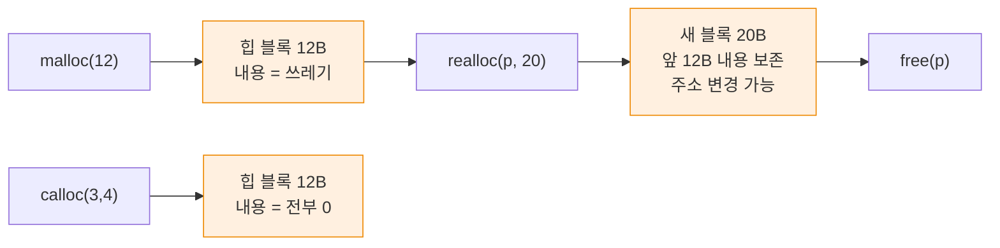

---
tags:
  - lang/c
  - c/stdlib
  - stdlib
  - malloc
  - strtol
  - qsort
  - status/verified
aliases:
  - stdlib.h
  - 동적 메모리
created: 2026-08-14
updated: 2026-08-18
---

# `<stdlib.h>` — 메모리 · 변환 · 유틸리티

> 동적 메모리 할당, 문자열↔숫자 변환, 정렬·탐색, 프로세스 종료, 환경변수

## 헤더 포함

```c
#include <stdlib.h>
```

## 동적 메모리 할당

| 함수        | 시그니처                                  | 초기화            | 용도    |
| --------- | ------------------------------------- | -------------- | ----- |
| `malloc`  | `void *malloc(size_t n)`              | **없음** (쓰레기 값) | 기본 할당 |
| `calloc`  | `void *calloc(size_t cnt, size_t sz)` | **0으로 채움**     | 배열 할당 |
| `realloc` | `void *realloc(void *p, size_t n)`    | 기존 내용 보존       | 크기 변경 |
| `free`    | `void free(void *p)`                  | —              | 해제    |

```c
int *p = malloc(3 * sizeof(int));
p[0]=3; p[1]=1; p[2]=2;

int *c = calloc(3, sizeof(int));
printf("calloc 0 초기화: %d %d %d\n", c[0], c[1], c[2]);

int *r = realloc(p, 5 * sizeof(int));
if (r) { p = r; p[3]=5; p[4]=4; }        // ← 반환값 검사 후 재대입
printf("realloc 후: %d %d %d %d %d\n", p[0],p[1],p[2],p[3],p[4]);

free(p); free(c);
```

```
calloc 0 초기화: 0 0 0
realloc 후: 3 1 2 5 4
```

### 사용 규칙

```c
// 1. 크기 계산은 sizeof 사용
int *arr = malloc(n * sizeof(int));        // sizeof(int) 하드코딩 금지
int *arr = malloc(n * sizeof *arr);        // 타입 변경에 안전한 관용 표현

// 2. 반환값 검사
if (arr == NULL) { /* 할당 실패 처리 */ }

// 3. realloc은 임시 변수 경유
int *tmp = realloc(arr, newsize);
if (tmp == NULL) { free(arr); return -1; }  // 원본 유지 → 해제 필요
arr = tmp;

// 4. 해제 후 NULL 대입 (선택)
free(arr);
arr = NULL;        // 이중 free·use-after-free 예방
```

- `malloc` 반환은 `void *` → C에서 캐스팅 불필요 (C++는 필요)
- `calloc(n, sz)` vs `malloc(n*sz)` — 전자는 0 초기화 + 곱셈 오버플로 검사
- `free(NULL)` — 안전. 아무 동작 없음
- 할당·해제 짝 유지가 전부. 자세한 내용은 [make-shell 02단계](../../projects/make-shell/02-dynamic-input.md)



## 문자열 → 숫자 변환

| 함수                   | 반환                 | 오류 검출  | 권장    |
| -------------------- | ------------------ | ------ | ----- |
| `atoi`               | `int`              | **불가** | 아니오   |
| `atol` `atoll`       | `long` `long long` | 불가     | 아니오   |
| `atof`               | `double`           | 불가     | 아니오   |
| `strtol`             | `long`             | **가능** | **예** |
| `strtoul`            | `unsigned long`    | 가능     | 예     |
| `strtoll` `strtoull` | `long long` 계열     | 가능     | 예     |
| `strtod` `strtof`    | `double` `float`   | 가능     | 예     |

```c
printf("atoi(\"42abc\") = %d\n", atoi("42abc"));
printf("atof(\"3.14\") = %.2f\n", atof("3.14"));
```

```
atoi("42abc") = 42
atof("3.14") = 3.14
```

- `atoi("abc")` → `0` 반환. **입력 `"0"`과 구분 불가** → 오류 검출 불가
- 신뢰할 수 없는 입력에는 `strtol` 사용

### `strtol` — 오류 검출 가능

```c
#include <errno.h>
#include <limits.h>

char *end;
errno = 0;
long v = strtol("123xyz", &end, 10);
printf("strtol → %ld, 남은문자 \"%s\"\n", v, end);

errno = 0;
v = strtol("99999999999999999999", &end, 10);
printf("오버플로 → %ld, errno==ERANGE? %s\n", v, errno==ERANGE ? "예":"아니오");

printf("strtol 16진 \"ff\" = %ld\n", strtol("ff", NULL, 16));
```

```
strtol → 123, 남은문자 "xyz"
오버플로 → 9223372036854775807, errno==ERANGE? 예
strtol 16진 "ff" = 255
```

- 2번째 인자 — 파싱 중단 위치 반환. 남은 문자로 유효성 판단
- 3번째 인자 `base` — 진법. `0` 지정 시 접두사 자동 인식(`0x`=16진, `0`=8진)
- 오버플로 시 `LONG_MAX`/`LONG_MIN` 반환 + `errno = ERANGE`

**완전한 검증 패턴**

```c
#include <errno.h>
#include <limits.h>

int parse_int(const char *s, int *out) {
    char *end;
    errno = 0;
    long v = strtol(s, &end, 10);

    if (end == s)            return -1;   // 숫자 전무
    if (*end != '\0')        return -1;   // 뒤에 잔여 문자
    if (errno == ERANGE)     return -1;   // long 범위 초과
    if (v > INT_MAX || v < INT_MIN) return -1;  // int 범위 초과

    *out = (int)v;
    return 0;
}
```

- `errno`는 성공 시 초기화되지 않음 → 호출 **전에 `errno = 0`** 설정 필수

## 정렬 · 탐색

| 함수 | 시그니처 |
|---|---|
| `qsort` | `void qsort(void *base, size_t n, size_t sz, int (*cmp)(const void *, const void *))` |
| `bsearch` | `void *bsearch(const void *key, const void *base, size_t n, size_t sz, cmp)` |

```c
static int cmp_int(const void *a, const void *b) {
    int x = *(const int *)a, y = *(const int *)b;
    return (x > y) - (x < y);        // 오버플로 없는 비교
}

qsort(p, 5, sizeof(int), cmp_int);
printf("qsort: "); for (int i=0;i<5;i++) printf("%d ", p[i]); printf("\n");

int key = 4;
int *f = bsearch(&key, p, 5, sizeof(int), cmp_int);
printf("bsearch(4) → %s (값 %d)\n", f ? "발견" : "부재", f ? *f : -1);
```

```
qsort: 1 2 3 4 5 
bsearch(4) → 발견 (값 4)
```

### 비교 함수 규약

- 반환 — 음수(a<b), 0(같음), 양수(a>b)
- 인자는 `const void *` → **실제 타입으로 캐스팅 후 역참조**
- `return x - y;` 는 **오버플로 위험** → `(x > y) - (x < y)` 관용 표현 사용
- `bsearch`는 **정렬된 배열** 전제. 미정렬이면 결과 무의미

문자열 배열 정렬 예시

```c
static int cmp_str(const void *a, const void *b) {
    // 배열 원소가 char* 이므로 인자는 char** 
    return strcmp(*(const char **)a, *(const char **)b);
}

const char *names[] = {"charlie", "alice", "bob"};
qsort(names, 3, sizeof(char *), cmp_str);
```

```
alice bob charlie 
```

- 배열 원소가 `char *` → 비교 함수 인자는 `char **`. 이중 포인터 역참조 필요

구조체 정렬 예시

```c
typedef struct { int id; double score; } Rec;

static int cmp_score_desc(const void *a, const void *b) {
    double x = ((const Rec *)a)->score, y = ((const Rec *)b)->score;
    return (y > x) - (y < x);      // 내림차순 (x·y 반전)
}
```

## 프로세스 종료

| 함수 | 동작 |
|---|---|
| `exit(int)` | stdio 플러시 + `atexit` 핸들러 실행 후 종료 |
| `_Exit(int)` | 즉시 종료. 플러시·핸들러 미실행 |
| `abort()` | `SIGABRT` 발생. 비정상 종료 (코어 덤프 가능) |
| `atexit(fn)` | 종료 시 실행할 함수 등록 (최대 32개 이상 보장) |

```c
#include <stdlib.h>

static void cleanup(void) { printf("정리 작업\n"); }

int main(void) {
    atexit(cleanup);
    printf("작업 중\n");
    exit(EXIT_SUCCESS);    // = exit(0)
}
```

```
작업 중
정리 작업
```

- `EXIT_SUCCESS`(0) · `EXIT_FAILURE`(1) 상수 제공
- `main`의 `return n` = `exit(n)`
- `fork` 후 자식에서는 `_exit`/`_Exit` 사용 — 상속된 버퍼 중복 플러시 방지
- `atexit` 등록 함수는 `exit` 시점에 **역순** 실행

## 정수 연산

```c
printf("abs(-5)=%d labs(-5L)=%ld\n", abs(-5), labs(-5L));
div_t d = div(17, 5);
printf("div(17,5) → 몫 %d 나머지 %d\n", d.quot, d.rem);
```

```
abs(-5)=5 labs(-5L)=5
div(17,5) → 몫 3 나머지 2
```

| 함수 | 용도 |
|---|---|
| `abs` `labs` `llabs` | 절댓값 (정수) |
| `div` `ldiv` `lldiv` | 몫·나머지 동시 계산 (`div_t` 구조체) |

- 실수 절댓값은 `fabs`(`<math.h>`)

## 환경변수 · 시스템

| 함수 | 용도 |
|---|---|
| `getenv(name)` | 환경변수 값. 미설정 시 `NULL` |
| `setenv(name, val, overwrite)` | 설정 (POSIX) |
| `unsetenv(name)` | 제거 (POSIX) |
| `system(cmd)` | 셸 명령 실행 |

```c
printf("getenv(\"HOME\") 존재? %s\n", getenv("HOME") ? "예" : "아니오");
```

```
getenv("HOME") 존재? 예
```

- `getenv` 반환 문자열 — 환경 블록 소유. **`free` 금지**, 수정 금지
- 반환값 `NULL` 검사 필수 (cron 등 환경에서 미설정 가능)
- `system` — 셸 경유 실행. **사용자 입력 전달 시 명령 주입 위험**. `fork`+`execvp` 권장

## 난수

```c
printf("RAND_MAX = %d\n", RAND_MAX);
srand(42);
printf("srand(42) 후 rand 3회: %d %d %d\n", rand()%100, rand()%100, rand()%100);
```

```
RAND_MAX = 2147483647
srand(42) 후 rand 3회: 94 23 9
```

- `srand(seed)` — 시드 설정. **같은 시드 → 같은 수열** (재현 가능, 테스트에 유용)
- `srand` 미호출 시 시드 1 고정 → 매 실행 동일 수열
- 실제 난수성 필요 시 `srand(time(NULL))` (`<time.h>`)
- `rand() % n` — 하위 비트 편향 존재. 암호학적 용도 부적합
- 보안 용도 — `arc4random()`(BSD·macOS) 또는 `getrandom()`(Linux)

## 함수 요약표

| 분류 | 함수 | 요약 |
|---|---|---|
| 할당 | `malloc` `calloc` `realloc` `free` | `calloc`만 0 초기화 |
| 변환(비권장) | `atoi` `atol` `atof` | 오류 검출 불가 |
| 변환(권장) | `strtol` `strtoul` `strtod` | `errno`·`end` 검사 |
| 정렬·탐색 | `qsort` `bsearch` | 비교 함수 필요 |
| 종료 | `exit` `_Exit` `abort` `atexit` | `EXIT_SUCCESS`/`EXIT_FAILURE` |
| 정수 | `abs` `labs` `div` | 실수는 `<math.h>` |
| 환경 | `getenv` `setenv` `system` | `getenv` 결과 `free` 금지 |
| 난수 | `rand` `srand` `RAND_MAX` | 암호 용도 부적합 |

## Java와의 차이

| 항목 | Java | C |
|---|---|---|
| 객체 생성 | `new` + GC | `malloc` + `free` |
| 초기화 | 필드 자동 0/null | `malloc`은 쓰레기, `calloc`만 0 |
| 배열 크기 변경 | `Arrays.copyOf` | `realloc` |
| 정렬 | `Arrays.sort` + `Comparator` | `qsort` + 함수 포인터 |
| 문자열→숫자 | `Integer.parseInt` (예외) | `strtol` (`errno` 검사) |
| 종료 훅 | `Runtime.addShutdownHook` | `atexit` |
| 환경변수 | `System.getenv` | `getenv` |

## 함정 · 주의점

- `malloc` 반환값 미검사 → `NULL` 역참조 크래시
- `malloc` 결과를 초기화 없이 읽음 → 쓰레기 값. `calloc` 또는 명시적 초기화
- `realloc(p, n)`을 `p`에 직접 대입 → 실패 시 원본 주소 유실 → 누수
- `realloc` 후 이전 포인터 사용 → use-after-free (주소 이동 가능)
- `free` 2회 호출 → 힙 손상
- `free` 후 포인터 사용 → use-after-free
- `malloc`한 것을 `delete`로 해제 (C++ 혼용) → 정의되지 않은 동작
- `atoi`로 사용자 입력 파싱 → 오류 무시. `strtol` 사용
- `strtol` 호출 전 `errno = 0` 누락 → 이전 오류 값 오판
- `qsort` 비교 함수에서 `return x - y` → 정수 오버플로 시 오정렬
- `bsearch`를 미정렬 배열에 사용 → 잘못된 결과
- `getenv` 반환값 `free` 호출 → 힙 손상
- `system()`에 사용자 입력 결합 → 명령 주입 취약점
- `rand() % n`으로 균등 분포 기대 → 편향 존재
- `sizeof(int)` 하드코딩(예: `malloc(n * 4)`) → 이식성 저하

## 검증

- [ ] `malloc`·`calloc` 초기화 차이 확인
- [ ] `realloc` 후 기존 내용 보존 확인
- [ ] `strtol` 오버플로 시 `ERANGE` 확인
- [ ] `qsort`·`bsearch` 동작 확인
- [ ] `atoi("abc")`가 0 반환 확인 (오류 구분 불가)
- [ ] ASan으로 누수·이중 해제 검출 확인

## 다음 문서

- [[C/docs/07-stdlib/04-ctype-math-time|`<ctype.h>` · `<math.h>` · `<time.h>` 등]]

## 관련 문서

- [[C/docs/07-stdlib/02-string|`<string.h>` 문자열 처리]] — 문자열·메모리 조작 함수
- [[C/docs/07-stdlib/README|라이브러리 시리즈 개요]] — 빈출 함수 30선과 통합 예제
- [[C/docs/08-syntax/size-t-type|size_t 타입]] — `malloc` 인자 타입의 부호 없음 특성과 곱셈 오버플로
