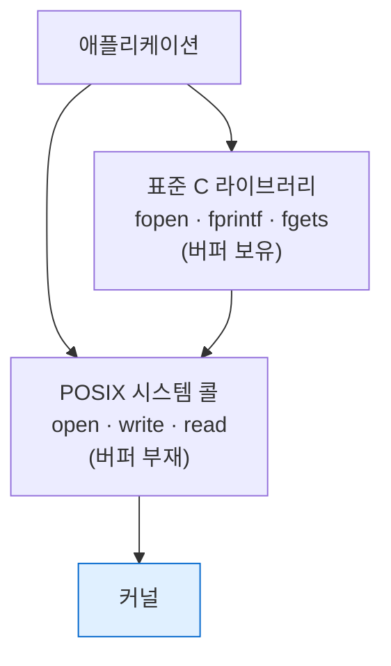

---
tags:
  - lang/c
  - c/system
  - posix
  - syscall
  - file-descriptor
  - fork
  - unistd
  - status/wip
aliases:
  - POSIX
  - 시스템 콜
created: 2026-08-14
updated: 2026-08-14
---

# POSIX 시스템 호출 — `<unistd.h>` · `<fcntl.h>` 외

> 표준 C 라이브러리 밖의 OS 기능. 저수준 파일 I/O, 프로세스, 디렉토리. Unix 계열 전용

## 표준 C vs POSIX

| 구분  | 표준 C               | POSIX                                |
| --- | ------------------ | ------------------------------------ |
| 이식성 | 모든 플랫폼             | Unix 계열 (macOS·Linux). Windows 부분 지원 |
| 파일  | `FILE *` (`fopen`) | 파일 디스크립터 (`open`)                    |
| 버퍼링 | 라이브러리 버퍼 존재        | **버퍼 부재** — 시스템 콜 직접                 |
| 헤더  | `<stdio.h>` 등      | `<unistd.h>` `<fcntl.h>` `<sys/*.h>` |

- `fopen`·`fprintf` = 고수준. 대부분 상황에서 권장
- `open`·`write` = 저수준. 리다이렉션·파이프·정밀 제어 필요 시



## `<unistd.h>` — 핵심 시스템 호출

### 프로세스 정보

```c
#include <unistd.h>

printf("getpid=%d getppid=%d\n", getpid(), getppid());
```

```
getpid=38834 getppid=38828
```

| 함수 | 반환 |
|---|---|
| `getpid()` | 자신의 프로세스 ID |
| `getppid()` | 부모 프로세스 ID |
| `getuid()` `geteuid()` | 실제·유효 사용자 ID |
| `getcwd(buf, n)` | 현재 작업 디렉토리 |
| `chdir(path)` | 작업 디렉토리 변경 |

### 저수준 파일 I/O

| 함수 | 시그니처 |
|---|---|
| `open` | `int open(const char *path, int flags, ...)` — `<fcntl.h>` |
| `read` | `ssize_t read(int fd, void *buf, size_t n)` |
| `write` | `ssize_t write(int fd, const void *buf, size_t n)` |
| `close` | `int close(int fd)` |
| `lseek` | `off_t lseek(int fd, off_t off, int whence)` |
| `dup` `dup2` | fd 복제 |
| `unlink` | 파일 삭제 |
| `access` | 존재·권한 확인 |

```c
#include <fcntl.h>
#include <unistd.h>

int fd = open("p.txt", O_WRONLY|O_CREAT|O_TRUNC, 0644);
if (fd < 0) { perror("open"); return 1; }
const char *msg = "저수준 입출력\n";
ssize_t w = write(fd, msg, strlen(msg));
printf("write %zd 바이트\n", w);
close(fd);

fd = open("p.txt", O_RDONLY);
char buf[64];
ssize_t r = read(fd, buf, sizeof(buf)-1);
buf[r] = '\0';                             // read는 널 종단 미추가
printf("read %zd 바이트: %s", r, buf);
close(fd);
```

```
write 20 바이트
read 20 바이트: 저수준 입출력
```

- 한글 7자 + 개행 = 20바이트 (UTF-8 다중 바이트)
- `read`는 **널 종단 미추가** → 직접 처리 필요
- 반환값 — 실제 처리한 바이트 수. **요청보다 적을 수 있음** (부분 읽기/쓰기)

부분 쓰기 대응 관용 패턴

```c
ssize_t write_all(int fd, const void *buf, size_t n) {
    const char *p = buf;
    size_t left = n;
    while (left > 0) {
        ssize_t w = write(fd, p, left);
        if (w < 0) {
            if (errno == EINTR) continue;   // 시그널 중단 → 재시도
            return -1;
        }
        p += w; left -= (size_t)w;
    }
    return (ssize_t)n;
}
```

```
write_all 성공
반환 17
```

- `EINTR` 재시도 + 부분 쓰기 누적 처리. 저수준 I/O의 필수 패턴

### `open` 플래그

| 플래그 | 의미 |
|---|---|
| `O_RDONLY` `O_WRONLY` `O_RDWR` | 접근 모드 (택 1, 필수) |
| `O_CREAT` | 없으면 생성 (**`mode` 인자 필수**) |
| `O_TRUNC` | 기존 내용 삭제 |
| `O_APPEND` | 끝에 추가 |
| `O_EXCL` | `O_CREAT`와 함께 — 이미 있으면 실패 |
| `O_NONBLOCK` | 논블로킹 |

`fopen` 모드 대응

| `fopen` | `open` 플래그 |
|---|---|
| `"r"` | `O_RDONLY` |
| `"w"` | `O_WRONLY \| O_CREAT \| O_TRUNC` |
| `"a"` | `O_WRONLY \| O_CREAT \| O_APPEND` |

권한 `0644` — 소유자 읽기·쓰기, 그룹·기타 읽기 (8진수)

### 표준 fd 상수

| 상수 | 값 | 대응 |
|---|---|---|
| `STDIN_FILENO` | 0 | `stdin` |
| `STDOUT_FILENO` | 1 | `stdout` |
| `STDERR_FILENO` | 2 | `stderr` |

- `dup2(fd, STDOUT_FILENO)` — 리다이렉션 구현 핵심. [make-shell 06단계](../../projects/make-shell/06-redirection.md) 참조

## 프로세스 — `fork` · `exec` · `wait`

```c
#include <unistd.h>
#include <sys/wait.h>

fflush(stdout);                            // fork 전 버퍼 플러시 필수
pid_t pid = fork();
if (pid == 0) {
    execlp("echo", "echo", "자식이 실행한 echo", NULL);
    _exit(127);                            // exec 실패 시에만 도달
}
int status;
waitpid(pid, &status, 0);
printf("자식 종료코드 = %d\n", WEXITSTATUS(status));
```

```
자식이 실행한 echo
자식 종료코드 = 0
```

### `exec` 계열

| 함수 | 인자 형태 | `PATH` 탐색 | 환경변수 |
|---|---|---|---|
| `execl` | 가변 인자 | 아니오 | 상속 |
| `execlp` | 가변 인자 | **예** | 상속 |
| `execle` | 가변 인자 | 아니오 | 직접 지정 |
| `execv` | 배열 | 아니오 | 상속 |
| `execvp` | 배열 | **예** | 상속 |
| `execve` | 배열 | 아니오 | 직접 지정 |

- `l` = list(가변 인자), `v` = vector(배열), `p` = PATH 탐색, `e` = 환경 지정
- 가변 인자 형태는 **`NULL`로 종료** 필수
- 배열 형태는 마지막 원소 `NULL`
- 성공 시 **반환 부재** (프로세스 이미지 교체) → 반환 = 실패

### `wait` 계열

| 함수 | 용도 |
|---|---|
| `wait(&status)` | 아무 자식이나 대기 |
| `waitpid(pid, &status, opts)` | 특정 자식 대기 |
| `waitpid(-1, &status, WNOHANG)` | 논블로킹 확인 |

상태 매크로

| 매크로 | 의미 |
|---|---|
| `WIFEXITED(st)` | 정상 종료 여부 |
| `WEXITSTATUS(st)` | 종료 코드 (0~255) |
| `WIFSIGNALED(st)` | 시그널 종료 여부 |
| `WTERMSIG(st)` | 종료시킨 시그널 번호 |

- 상세 내용 — [make-shell 04단계](../../projects/make-shell/04-process-exec.md)

### 기타 프로세스 함수

| 함수 | 용도 |
|---|---|
| `pipe(fd)` | 파이프 생성 |
| `sleep(sec)` `usleep(usec)` | 대기 |
| `kill(pid, sig)` | 시그널 전송 |
| `alarm(sec)` | `SIGALRM` 예약 |
| `getenv` `setenv` | 환경변수 (`<stdlib.h>`) |

## `<sys/stat.h>` — 파일 정보

```c
#include <sys/stat.h>

struct stat st;
if (stat("p.txt", &st) == 0) {
    printf("크기 %lld 바이트, 권한 %o, 일반파일? %s\n",
           (long long)st.st_size, st.st_mode & 0777,
           S_ISREG(st.st_mode) ? "예" : "아니오");
}
```

```
크기 20 바이트, 권한 644, 일반파일? 예
```

| 필드 | 내용 |
|---|---|
| `st_size` | 크기 (바이트) |
| `st_mode` | 파일 종류 + 권한 |
| `st_mtime` | 최종 수정 시각 (`time_t`) |
| `st_uid` `st_gid` | 소유자·그룹 |
| `st_nlink` | 하드 링크 수 |
| `st_ino` | inode 번호 |

종류 판별 매크로

| 매크로 | 종류 |
|---|---|
| `S_ISREG` | 일반 파일 |
| `S_ISDIR` | 디렉토리 |
| `S_ISLNK` | 심볼릭 링크 (`lstat` 필요) |
| `S_ISFIFO` | 파이프 |
| `S_ISCHR` `S_ISBLK` | 문자·블록 장치 |

관련 함수

| 함수 | 차이 |
|---|---|
| `stat(path, &st)` | 심볼릭 링크 **따라감** |
| `lstat(path, &st)` | 링크 자체 정보 |
| `fstat(fd, &st)` | 열린 fd 대상 |
| `chmod(path, mode)` | 권한 변경 |
| `mkdir(path, mode)` | 디렉토리 생성 |
| `rmdir(path)` | 빈 디렉토리 삭제 |

## `<dirent.h>` — 디렉토리 순회

```c
#include <dirent.h>

char cwd[1024];
getcwd(cwd, sizeof(cwd));
printf("cwd = %s\n", cwd);

DIR *d = opendir(".");
struct dirent *ent;
int cnt = 0;
while ((ent = readdir(d)) != NULL) cnt++;
closedir(d);
printf("현재 디렉토리 항목 수: %d\n", cnt);
```

```
cwd = /private/tmp/cdocs
현재 디렉토리 항목 수: 43
```

| 함수 | 용도 |
|---|---|
| `opendir(path)` | 디렉토리 열기 → `DIR *` |
| `readdir(dp)` | 다음 항목 → `struct dirent *` |
| `closedir(dp)` | 닫기 |
| `rewinddir(dp)` | 처음으로 |

- `struct dirent`의 `d_name` — 파일명. **`.`과 `..` 포함** → 필터링 필요
- 반환 순서 무보장 → 정렬 필요 시 직접 처리
- `readdir` 반환 포인터는 다음 호출 시 무효화 가능 → 즉시 사용 또는 복사

파일명만 나열하는 패턴

```c
while ((ent = readdir(d)) != NULL) {
    if (strcmp(ent->d_name, ".") == 0 || strcmp(ent->d_name, "..") == 0)
        continue;
    printf("%s\n", ent->d_name);
}
```

## `<signal.h>` — 시그널

| 함수 | 용도 |
|---|---|
| `sigaction(sig, &act, &old)` | 핸들러 등록 (**권장**) |
| `signal(sig, handler)` | 간이 등록 (플랫폼별 동작 상이) |
| `kill(pid, sig)` | 시그널 전송 |
| `raise(sig)` | 자신에게 전송 |
| `sigemptyset` `sigaddset` | 시그널 집합 조작 |

주요 시그널

| 시그널 | 번호 | 발생 원인 |
|---|---|---|
| `SIGINT` | 2 | `Ctrl-C` |
| `SIGQUIT` | 3 | `Ctrl-\` |
| `SIGKILL` | 9 | 강제 종료 (**차단 불가**) |
| `SIGSEGV` | 11 | 세그멘테이션 폴트 |
| `SIGPIPE` | 13 | 닫힌 파이프에 쓰기 |
| `SIGTERM` | 15 | 정상 종료 요청 |
| `SIGCHLD` | 20 | 자식 상태 변화 |

- 핸들러에서는 **async-signal-safe 함수만** 호출 가능 — `printf`·`malloc` 금지
- 상세 — [make-shell 08단계](../../projects/make-shell/08-signals-history.md)

## `<pthread.h>` — 스레드 (개요)

| 함수 | 용도 |
|---|---|
| `pthread_create(&t, attr, fn, arg)` | 스레드 생성 |
| `pthread_join(t, &ret)` | 종료 대기 |
| `pthread_mutex_lock` `unlock` | 상호 배제 |
| `pthread_cond_wait` `signal` | 조건 변수 |

- Linux — `-lpthread` 링크 필요. macOS는 불필요
- 검증 미완료 — 본 문서에서 실행 예제 미확인. 별도 학습 필요

## 저수준 vs 고수준 선택 기준

| 상황 | 권장 |
|---|---|
| 일반적인 텍스트 파일 읽기쓰기 | `fopen` 계열 |
| 서식 있는 출력 | `fprintf` |
| 리다이렉션·파이프 구현 | `open` `dup2` `pipe` |
| 정확한 바이트 수 제어 | `read` `write` |
| 시그널 핸들러 내부 출력 | `write` (async-signal-safe) |
| 성능 임계 대용량 I/O | `read` `write` (버퍼 직접 관리) |

- `FILE *`와 fd 혼용 시 버퍼 불일치 → 출력 순서 꼬임. `fileno(fp)`로 fd 획득 가능하나 주의

## 함정 · 주의점

- `read` 결과에 널 종단 미추가 → 문자열로 사용 시 직접 추가
- `read`·`write` 반환값을 요청 크기와 같다고 가정 → 부분 처리 발생. 루프 필요
- `open`에 `O_CREAT` 지정 시 `mode` 인자 누락 → 권한 미정의
- `close` 누락 → fd 누수 → `EMFILE`(too many open files)
- `fork` 전 `fflush(stdout)` 누락 → 버퍼 복제로 출력 중복
- 자식에서 `exit` 사용 → 상속 버퍼 재플러시. `_exit` 사용
- `waitpid` 누락 → 좀비 프로세스 누적
- `readdir` 결과에서 `.`·`..` 미필터 → 재귀 순회 시 무한 루프
- `stat` 반환값 미검사 → 구조체가 쓰레기 값
- `errno`는 성공 시 미초기화 → 실패 반환 시에만 검사
- `EINTR` 미처리 → 시그널 발생 시 시스템 콜 실패. 재시도 루프 필요
- Windows 이식 → POSIX 함수 대부분 미지원. `_open`·`_read` 등 별도 API

## 검증

- [ ] `open`·`write`·`read`·`close` 전 과정 동작
- [ ] `stat`으로 파일 크기·권한 확인
- [ ] `opendir`·`readdir`로 디렉토리 순회
- [ ] `fork`·`exec`·`waitpid`로 자식 실행 및 종료 코드 확인
- [ ] `unlink` 후 `access`로 삭제 확인
- [ ] fd 누수 부재 (`lsof -p <pid>`)

## 관련 문서

- [[C/docs/07-stdlib/01-stdio|`<stdio.h>` 표준 입출력]] — 고수준 대응 함수
- [[C/docs/07-stdlib/README|라이브러리 시리즈 개요]] — 빈출 함수 30선과 통합 예제
- [[C/projects/make-shell/README|make-shell 프로젝트]] — 본 문서 함수들의 실전 활용
- [[C/docs/07-stdlib/04-ctype-math-time|문자 · 수학 · 시간]] — 문자 분류·수학·시간 함수
