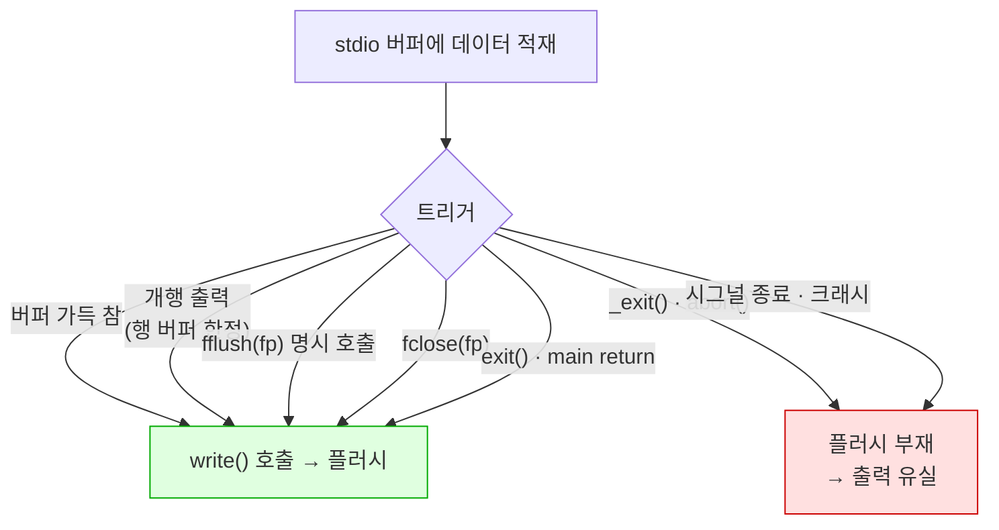

---
tags:
  - lang/c
  - c/stdlib
  - stdio
  - buffering
  - fflush
  - setvbuf
  - stream
  - status/verified
aliases:
  - 표준 입출력 버퍼링
  - fflush
  - setvbuf
created: 2026-08-18
updated: 2026-08-18
---

# 표준 입출력 버퍼링과 `fflush`

> `printf` 출력이 즉시 나가지 않는 이유 — stdio 버퍼의 3가지 모드와 플러시 시점 제어

## 개념

버퍼 — 표준 라이브러리가 **사용자 공간**에 보유한 임시 저장 영역. `printf` 호출 시 즉시 커널로 넘기지 않고 버퍼에 축적 후 일괄 전송

존재 이유 — `write` 시스템 콜은 사용자↔커널 모드 전환 비용 발생. 1바이트씩 1000회 호출 대신 1000바이트 1회 호출로 전환 횟수 축소

`fflush` — 버퍼에 남은 내용을 **강제로 하위 계층에 전달**. 자동 플러시 시점 이전에 출력이 필요한 경우 사용

## 버퍼 계층

`printf` 호출부터 실제 장치까지 **두 단계 버퍼** 경유. `fflush`가 담당하는 구간은 첫 단계뿐


파란 = 사용자 공간(`fflush` 관할) · 주황 = 커널 공간(`fsync` 관할)

- `fflush` — stdio 버퍼 → 커널. **디스크 기록 보장 부재**
- `fsync(fd)` — 커널 버퍼 → 물리 장치. 전원 차단 대비 시 필요
- 프로세스 크래시 → stdio 버퍼 내용 유실. 커널 버퍼 내용은 생존

## 버퍼링 모드 3종

| 모드 | 상수 | 값 | 플러시 시점 |
|---|---|---|---|
| 전 버퍼 | `_IOFBF` | 0 | 버퍼 가득 참 · 명시 플러시 · 정상 종료 |
| 행 버퍼 | `_IOLBF` | 1 | **개행(`\n`) 출력 시** · 위 조건 전부 |
| 무버퍼 | `_IONBF` | 2 | 매 출력마다 즉시 |

상수 값은 구현 종속. macOS 실측값 기재

## 기본 모드 결정 규칙

프로그램 시작 시 libc가 **연결 대상을 보고 자동 결정**. 개발자가 정하지 않음

| 스트림 | 연결 대상 | 기본 모드 |
|---|---|---|
| `stdout` | 터미널(tty) | 행 버퍼 |
| `stdout` | 파이프 · 파일 | **전 버퍼** |
| `stderr` | 무관 | **무버퍼** |
| `stdin` | 터미널 | 행 버퍼 |

핵심 함정 — 터미널에서 정상 동작하던 프로그램이 파이프·리다이렉션 시 출력 시점 변화. 모드가 바뀌기 때문

### 버퍼 크기 실측

`BUFSIZ`는 참고값일 뿐, 실제 stdout 버퍼는 **연결 대상의 `st_blksize`** 기준으로 잡힘

```c
#include <stdio.h>
#include <unistd.h>
#include <sys/stat.h>

int main(void) {
    struct stat st;
    printf("BUFSIZ = %d\n", BUFSIZ);
    if (fstat(1, &st) == 0)
        printf("stdout st_blksize = %ld\n", (long)st.st_blksize);
    printf("_IOFBF=%d _IOLBF=%d _IONBF=%d\n", _IOFBF, _IOLBF, _IONBF);
    printf("fflush(stdout) 반환 = %d\n", fflush(stdout));
    printf("fflush(NULL) 반환 = %d\n", fflush(NULL));
    return 0;
}
```

```bash
cc -Wall -Wextra more.c -o more
script -q /dev/null ./more < /dev/null    # 터미널(pty)로 실행
./more | cat                              # 파이프로 실행
./more > m.txt                            # 파일로 리다이렉션
```

- `-Wall` — 주요 경고 활성. 미초기화 변수·타입 불일치 등 검출
- `-Wextra` — `-Wall` 미포함 추가 경고 활성
- `-o more` — 출력 파일명을 `more`로 지정. 미지정 시 `a.out`
- `script -q /dev/null <명령>` — 가짜 터미널(pty)을 만들어 명령 실행. `stdout`을 tty로 인식시켜 행 버퍼 동작 재현
- `-q` — `script` 자체의 시작·종료 안내 문구 억제
- `/dev/null` — `script`의 기록 파일 경로. 저장 불필요 → 버림
- `< /dev/null` — 표준 입력 차단. 미지정 시 입력 대기
- `| cat` — 출력을 파이프로 연결. `stdout`이 tty가 아니게 되어 전 버퍼 전환

터미널(pty) 실행 결과

```
BUFSIZ = 1024
stdout st_blksize = 65536
_IOFBF=0 _IOLBF=1 _IONBF=2
fflush(stdout) 반환 = 0
fflush(NULL) 반환 = 0
```

파이프 실행 결과 — `st_blksize`만 상이

```
stdout st_blksize = 16384
```

파일 리다이렉션 결과

```
stdout st_blksize = 4096
```

- `BUFSIZ` = 1024 (macOS) — 실제 할당 크기와 무관. `setvbuf` 사용 시의 권장 최소치 성격
- 실제 버퍼 — 터미널 64 KiB · 파이프 16 KiB · 파일 4 KiB
- 200000바이트 연속 출력 후 파이프 오프셋 측정 시 196608 = **16384 × 12** → 버퍼 크기 배수 단위로 자동 플러시 확인

## 플러시 트리거

버퍼 비움이 일어나는 전 경로. 마지막 두 갈래는 **플러시 부재** → 출력 유실



- `exit` — 등록된 정리 루틴 수행 → 전 스트림 플러시
- `_exit` · `abort` — 정리 루틴 우회 → **버퍼 내용 소멸**
- `main`의 `return` = `exit` 호출과 동등

## `fflush` 시그니처

```c
#include <stdio.h>

int fflush(FILE *fp);
```

| 인자 | 동작 |
|---|---|
| `fflush(stdout)` | 해당 스트림만 플러시 |
| `fflush(NULL)` | **열린 전 출력 스트림** 플러시 |
| `fflush(stdin)` | 표준 미정의 동작 — 사용 금지 |

- 반환값 — 성공 `0`, 실패 `EOF`(-1). 실패 시 `errno` 설정
- 출력 스트림·최근 연산이 출력인 갱신 스트림에만 정의됨 (C99 7.19.5.2)

## 실험 1 — 출력 순서 역전

`stdout`과 `stderr`의 버퍼링 모드 차이로 **소스 코드 순서와 실제 출력 순서 불일치** 발생

```c
#include <stdio.h>
#include <unistd.h>

int main(void) {
    printf("stdout이 터미널인가: %s\n", isatty(1) ? "예" : "아니오");
    printf("A(stdout 개행없음)");
    fprintf(stderr, "B(stderr 개행없음)");
    printf("C(stdout 개행)\n");
    fprintf(stderr, "D(stderr 개행)\n");
    printf("E(stdout 마지막 개행없음)");
    return 0;
}
```

```bash
cc -Wall -Wextra order.c -o order
./order 2>&1 | cat
```

- `-Wall` — 주요 경고 활성. 미초기화 변수·타입 불일치 등 검출
- `-Wextra` — `-Wall` 미포함 추가 경고 활성
- `-o order` — 출력 파일명을 `order`로 지정. 미지정 시 `a.out`
- `2>&1` — `stderr`를 `stdout`과 같은 목적지로 병합. 두 스트림의 상대 순서 관찰 목적
- `| cat` — 파이프 연결 → `stdout`이 전 버퍼로 전환

파이프(전 버퍼) 출력

```
B(stderr 개행없음)D(stderr 개행)
stdout이 터미널인가: 아니오
A(stdout 개행없음)C(stdout 개행)
E(stdout 마지막 개행없음)
```

- `stderr`(B·D)가 **전부 먼저** 출력. 무버퍼라 즉시 통과
- `stdout`(첫 줄·A·C·E)은 종료 시점에 **한꺼번에** 방출
- 개행 유무 무관 — 전 버퍼에서는 `\n`이 플러시 트리거 아님

터미널(pty) 실행

```bash
script -q /dev/null ./order < /dev/null 2>&1 | cat
```

- `script -q /dev/null <명령>` — pty 생성 후 명령 실행. `isatty(1)`을 참으로 만듦
- `-q` — `script` 안내 문구 억제
- `< /dev/null` — 표준 입력 차단
- `2>&1 | cat` — 두 스트림 병합 후 파이프로 캡처

```
stdout이 터미널인가: 예
B(stderr 개행없음)A(stdout 개행없음)C(stdout 개행)
D(stderr 개행)
E(stdout 마지막 개행없음)
```

- 첫 줄 — 개행 포함 → **즉시** 플러시
- A — 개행 부재 → 버퍼 잔류 → C의 `\n` 시점에 `AC` 함께 방출
- E — 개행 부재 → 프로그램 종료 시 플러시
- 실행 시 `script`가 EOF 표시로 `^D`를 앞에 남김. 프로그램 출력 아님

## 실험 2 — 모드별 인터리브

`setvbuf`로 모드를 강제한 뒤 `stdout`·`stderr` 교차 출력 순서 비교

```c
#include <stdio.h>
#include <string.h>

int main(int argc, char *argv[]) {
    const char *m = (argc == 2) ? argv[1] : "default";

    if (strcmp(m, "nb") == 0)      setvbuf(stdout, NULL, _IONBF, 0);
    else if (strcmp(m, "lb") == 0) setvbuf(stdout, NULL, _IOLBF, 0);
    else if (strcmp(m, "fb") == 0) setvbuf(stdout, NULL, _IOFBF, BUFSIZ);

    printf("<1>");
    fprintf(stderr, "[E1]");
    printf("<2>\n");
    fprintf(stderr, "[E2]");
    printf("<3>");
    fprintf(stderr, "[E3]");
    printf("\n");
    return 0;
}
```

```bash
cc -Wall -Wextra svb.c -o svb
for m in default fb lb nb; do printf "[%-7s] " "$m"; ./svb $m 2>&1 | cat | tr '\n' '~'; echo ""; done
```

- `-Wall` — 주요 경고 활성. 미초기화 변수·타입 불일치 등 검출
- `-Wextra` — `-Wall` 미포함 추가 경고 활성
- `-o svb` — 출력 파일명을 `svb`로 지정. 미지정 시 `a.out`
- `for m in ...; do ... done` — 4개 모드를 순차 실행
- `printf "[%-7s] "` — 모드명을 7칸 좌측 정렬로 라벨 출력
- `2>&1` — `stderr`를 `stdout`에 병합
- `| cat` — 파이프 연결 → 기본 모드가 전 버퍼가 되도록 고정
- `| tr '\n' '~'` — 개행을 `~`로 치환. 한 줄에 순서를 나열해 비교 용이

```
[default] [E1][E2][E3]<1><2>~<3>~
[fb     ] [E1][E2][E3]<1><2>~<3>~
[lb     ] [E1]<1><2>~[E2][E3]<3>~
[nb     ] <1>[E1]<2>~[E2]<3>[E3]~
```

- `default` = `fb` — 파이프 연결 시 기본이 전 버퍼임을 확인
- `lb` — `<1><2>\n`이 개행에서 한 묶음 방출. `<3>`는 마지막 `\n`까지 대기
- `nb` — 소스 순서와 출력 순서 완전 일치. 대신 `write` 호출 6회로 증가
- 디버깅 시 `nb` 유용 — 크래시 직전 출력까지 보존

## 실험 3 — 프롬프트 (make-shell 실전)

개행 없는 프롬프트 출력 → 버퍼 잔류 → **입력 대기 중 프롬프트 미표시**. 셸 구현 시 최초로 만나는 버퍼 문제

```c
#include <stdio.h>

int main(void) {
    printf("mysh> ");                        /* 개행 없음 → 버퍼에 잔류 */
#ifdef WITH_FLUSH
    fflush(stdout);                          /* ← 강제로 화면에 밀어냄 */
#endif
    fprintf(stderr, "[이 시점의 화면 상태]");  /* stderr = 무버퍼 → 즉시 */
    printf("\n");
    return 0;
}
```

```bash
cc -Wall -Wextra prompt.c -o p_no
cc -Wall -Wextra -DWITH_FLUSH prompt.c -o p_yes
./p_no 2>&1 | cat
./p_yes 2>&1 | cat
```

- `-Wall` — 주요 경고 활성. 미초기화 변수·타입 불일치 등 검출
- `-Wextra` — `-Wall` 미포함 추가 경고 활성
- `-DWITH_FLUSH` — 매크로 `WITH_FLUSH`를 정의된 상태로 컴파일. `#ifdef` 블록의 `fflush` 포함
- `-o p_no` / `-o p_yes` — 출력 파일명 지정. 두 버전을 구분해 보관
- `2>&1 | cat` — 두 스트림 병합 후 파이프 캡처. 상대 순서 관찰

`fflush` 부재

```
[이 시점의 화면 상태]mysh> 
```

`fflush` 존재

```
mysh> [이 시점의 화면 상태]
```

- 부재 시 — 프롬프트가 **뒤늦게** 도착. 사용자는 빈 화면에서 입력하게 됨
- 존재 시 — 프롬프트 선행. 의도한 대화형 동작
- 터미널 실행(행 버퍼)에서도 동일 — 개행이 없어 플러시 트리거 미발생

현재 `make-shell` 구현이 이 패턴 적용

```c
while (1) {
    printf("mysh> ");
    fflush(stdout);        // ← 개행 없는 출력 → 명시 플러시 필수
    if (fgets(line, sizeof(line), stdin) == NULL) break;
    /* ... */
}
```

- 대안 — `fprintf(stderr, "mysh> ")`. `stderr` 무버퍼 특성 이용. 단 프롬프트가 리다이렉션에서 분리됨

## 실험 4 — `fork` 시 버퍼 복제

`fork`는 **버퍼 내용까지 복제**. 미플러시 상태로 분기 → 부모·자식이 각각 플러시 → 출력 중복

```c
#include <stdio.h>
#include <stdlib.h>
#include <unistd.h>
#include <string.h>
#include <sys/wait.h>

int main(int argc, char *argv[]) {
    int use_flush = (argc > 1 && strcmp(argv[1], "flush") == 0);
    int use_uexit = (argc > 1 && strcmp(argv[1], "_exit") == 0);

    printf("PREFIX ");                 /* 개행 없음 → 버퍼 잔류 */
    if (use_flush) fflush(stdout);     /* ← 분기 전 비움 */

    if (fork() == 0) {
        if (use_uexit) { write(1, "[child]\n", 8); _exit(0); }
        printf("[child]\n");
        exit(0);                       /* 상속 버퍼까지 플러시 */
    }
    wait(NULL);
    printf("[parent]\n");
    return 0;
}
```

```bash
cc -Wall -Wextra childexit.c -o childexit
for m in none flush _exit; do echo "[$m]"; ./childexit $m | cat; done
```

- `-Wall` — 주요 경고 활성. 미초기화 변수·타입 불일치 등 검출
- `-Wextra` — `-Wall` 미포함 추가 경고 활성
- `-o childexit` — 출력 파일명을 `childexit`로 지정. 미지정 시 `a.out`
- `for m in none flush _exit; do ... done` — 3가지 분기 조건 순차 실행
- `| cat` — 파이프 연결 → 전 버퍼 고정. 중복이 드러나는 조건 재현

```
[none]
PREFIX [child]
PREFIX [parent]
[flush]
PREFIX [child]
[parent]
[_exit]
[child]
PREFIX [parent]
```

- `none` — `PREFIX ` **2회 출력**. 버퍼가 복제된 뒤 양쪽에서 각각 방출
- `flush` — `fork` 전 비움 → 중복 소멸. **권장 해법**
- `_exit` — 자식이 정리 루틴 우회 → 상속 버퍼 미방출. 중복은 없으나 자식 자신의 `printf`도 유실되므로 `write` 직접 사용 필요
- 터미널 실행 시 행 버퍼여도 **개행 없는 출력은 동일하게 중복**

## 연관 함수

### `setvbuf` — 모드·버퍼 지정

```c
int setvbuf(FILE *fp, char *buf, int mode, size_t size);
```

| 인자 | 설명 |
|---|---|
| `buf` | 사용할 버퍼. `NULL` → libc가 자동 할당 |
| `mode` | `_IOFBF` · `_IOLBF` · `_IONBF` |
| `size` | 버퍼 크기. `_IONBF`면 무시 |

- 반환 — 성공 `0`, 실패 0 이외
- **호출 시점 제약** — 스트림 개방 직후, **첫 I/O 수행 이전**에만 호출. 이후 호출은 미정의 동작
- 직접 버퍼 전달 시 해당 배열의 생존 기간이 스트림보다 길어야 함 → 지역 배열 금지, `static`·전역·힙 사용

```c
static char mybuf[8192];                      /* ← 스트림보다 오래 생존 */
setvbuf(stdout, mybuf, _IOFBF, sizeof(mybuf));
```

### `setbuf` — 축약형

```c
void setbuf(FILE *fp, char *buf);
```

- `buf != NULL` → `setvbuf(fp, buf, _IOFBF, BUFSIZ)`와 동등. 버퍼는 **`BUFSIZ` 크기 필수**
- `buf == NULL` → `setvbuf(fp, NULL, _IONBF, 0)`와 동등 (무버퍼)
- 반환값 부재 → 실패 감지 불가. **`setvbuf` 사용 권장**

### 함수 요약

| 함수 | 헤더 | 역할 |
|---|---|---|
| `fflush(fp)` | `<stdio.h>` | 출력 버퍼 비움 |
| `fflush(NULL)` | `<stdio.h>` | 전 출력 스트림 비움 |
| `setvbuf` | `<stdio.h>` | 모드·버퍼·크기 지정 |
| `setbuf` | `<stdio.h>` | `setvbuf` 축약. 실패 감지 불가 |
| `fclose(fp)` | `<stdio.h>` | 플러시 후 스트림 해제 |
| `fsync(fd)` | `<unistd.h>` | 커널 버퍼 → 물리 장치 |
| `fileno(fp)` | `<stdio.h>` | `FILE *` → fd 변환. `fsync` 연계용 |
| `_exit(n)` | `<unistd.h>` | 플러시 **없이** 종료 |
| `write(fd, ...)` | `<unistd.h>` | stdio 버퍼 우회 직접 출력 |

디스크 기록 보장이 필요한 경우 2단계 필수

```c
fflush(fp);              /* stdio 버퍼 → 커널 */
fsync(fileno(fp));       /* 커널 → 물리 장치 */
```

## 함정 — `fflush(stdin)`

입력 스트림 대상 `fflush`는 **C 표준 미정의**. 구현별 동작 상이 → 이식 불가

```c
#include <stdio.h>

int main(void) {
    char a[64], b[64];
    if (fgets(a, sizeof(a), stdin) == NULL) return 1;
    printf("1번째 줄: %s", a);

    int r = fflush(stdin);            /* ← 표준 미정의 */
    printf("fflush(stdin) 반환 = %d\n", r);

    if (fgets(b, sizeof(b), stdin) != NULL)
        printf("다음 줄: %s", b);
    else
        printf("다음 줄: NULL (버려짐)\n");
    return 0;
}
```

```bash
cc -Wall -Wextra flushin.c -o flushin
printf 'first\nsecond\nthird\n' | ./flushin
```

- `-Wall` — 주요 경고 활성. 미초기화 변수·타입 불일치 등 검출
- `-Wextra` — `-Wall` 미포함 추가 경고 활성
- `-o flushin` — 출력 파일명을 `flushin`으로 지정. 미지정 시 `a.out`
- `printf 'first\nsecond\nthird\n' |` — 3줄을 표준 입력으로 주입. 대화형 입력 없이 재현

macOS 실행 결과

```
1번째 줄: first
fflush(stdin) 반환 = 0
다음 줄: second
```

- macOS — 반환 `0`(성공)이나 **입력 버퍼 유지**. `second`가 그대로 읽힘 → 사실상 무효과
- glibc — 입력 버퍼를 폐기하는 확장 동작 제공 (본 환경 미검증)
- 동일 코드가 플랫폼별로 다른 결과 → **사용 금지**

### 대체 방법 — 남은 줄 소비

```c
int c;
while ((c = getchar()) != '\n' && c != EOF)
    ;                      /* 개행까지 읽어 버림 */
```

- 표준 함수만 사용 → 전 플랫폼 동일 동작
- 근본 해법 — `scanf` 대신 `fgets` + `sscanf` 조합 사용. 스트림에 잔여물을 남기지 않음

## Java와의 차이

| 항목 | Java | C |
|---|---|---|
| 버퍼 계층 | `BufferedWriter` 명시 래핑 | `FILE *`에 **기본 내장** |
| 모드 결정 | 개발자가 래퍼 선택 | libc가 **연결 대상 보고 자동 결정** |
| 플러시 | `flush()` 메서드 | `fflush(fp)` 함수 |
| 표준 출력 | `System.out` = `PrintStream`, autoflush 설정 가능 | `stdout` — tty면 행 버퍼, 아니면 전 버퍼 |
| 표준 오류 | `System.err` autoflush 기본 활성 | `stderr` **무버퍼** |
| 종료 시 처리 | JVM 종료 훅·`PrintStream` 처리 | `exit`는 플러시, `_exit`는 미플러시 |
| 디스크 보장 | `FileDescriptor.sync()` | `fflush` + `fsync` **2단계** |
| 버퍼 크기 | 생성자 인자 | `setvbuf` — 첫 I/O 이전에만 |

## 함정 · 주의점

- 개행 없는 `printf` 후 입력 대기 → 프롬프트 미표시 → `fflush(stdout)` 호출
- 터미널에서 정상, 파이프·리다이렉션에서 순서 이상 → 모드가 행 버퍼에서 전 버퍼로 전환된 것. 터미널 검증만으로 불충분
- `fork` 전 미플러시 → **출력 중복**. 분기 직전 `fflush(NULL)` 관용
- 자식 프로세스에서 `exit` 사용 → 상속 버퍼 재방출. `_exit` 사용 또는 사전 플러시
- 크래시 디버깅 중 마지막 `printf` 미출력 → 버퍼 유실. `setvbuf(stdout, NULL, _IONBF, 0)`를 `main` 첫 줄에 배치
- `setvbuf`를 첫 `printf` 이후 호출 → 미정의 동작. **`main` 진입 직후** 배치
- `setvbuf`에 지역 배열 전달 → 함수 반환 후 댕글링 포인터. `static`·전역·힙 사용
- `fflush(stdin)` → 이식 불가. 남은 입력은 `getchar` 루프로 소비
- `fflush` 성공을 디스크 기록 완료로 오해 → 전원 차단 시 유실. `fsync` 별도 필요
- `FILE *`와 fd(`write`) 혼용 → 버퍼 불일치로 순서 꼬임. 혼용 지점마다 `fflush`
- 시그널 핸들러에서 `printf` 호출 → 비동기 시그널 안전 부재. `write` 사용

## 검증

- [x] 파이프·터미널·파일별 `st_blksize` 차이 확인
- [x] 전 버퍼·행 버퍼·무버퍼 인터리브 순서 비교
- [x] `fflush` 유무에 따른 프롬프트 출력 시점 변화
- [x] `fork` 버퍼 복제로 인한 출력 중복 재현
- [x] `fflush(stdin)` macOS 무효과 확인
- [ ] glibc(Linux)에서 `fflush(stdin)` 동작 — 미검증

## CLion 팁

- 실행 창은 pty가 아닌 파이프 연결 → **전 버퍼**. 터미널과 출력 시점 상이
- 디버깅 중 출력 순서 혼란 시 `main` 첫 줄에 `setvbuf(stdout, NULL, _IONBF, 0)` 배치
- 브레이크포인트 정지 시점의 미플러시 버퍼는 콘솔에 미표시. 유실 아님

## 관련 문서

- [[C/docs/07-stdlib/01-stdio|표준 입출력]] — `FILE *` 스트림과 입출력 함수 전반
- [[C/docs/07-stdlib/05-posix|POSIX 시스템 호출]] — `write`·`fsync`·`fork` 등 저수준 계층
- [[C/docs/07-stdlib/README|라이브러리 시리즈 개요]] — 빈출 함수 30선과 통합 예제
- [[C/projects/make-shell/01-repl-skeleton|REPL 골격]] — 프롬프트 플러시의 실전 적용
- [[C/docs/README|학습 문서 인덱스]] — 카테고리별 전체 문서 목록
