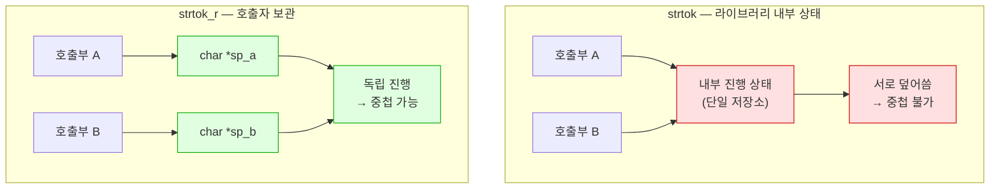

---
tags:
  - lang/c
  - c/stdlib
  - string
  - strtok
  - reentrancy
  - thread-safety
  - status/verified
aliases:
  - strtok 내부 동작
  - strtok_r 차이
  - strsep
created: 2026-08-19
updated: 2026-08-19
---

# `strtok` · `strtok_r` 내부 동작과 차이

> 두 함수 모두 **원본을 잘라 쓰는** 파괴적 분해. 차이는 **진행 상태를 어디에 보관하는가** 한 가지

## 개념

문자열 분해 방식 — 새 문자열을 만들지 않고 **원본의 구분자를 `'\0'`으로 덮어써** 조각냄. 각 조각의 시작 주소를 순차 반환

| 항목 | 내용 |
|---|---|
| 반환값 | 원본 **내부**를 가리키는 포인터. 별도 할당 부재 |
| 원본 | 구분자 위치가 `'\0'`으로 **파괴** |
| 진행 상태 | `strtok` = 라이브러리 내부 / `strtok_r` = 호출자의 `saveptr` |
| 메모리 비용 | 0 — 복사 부재 |

```c
char *strtok(char *str, const char *delim);
char *strtok_r(char *str, const char *delim, char **saveptr);
```

- 2회차 이후 첫 인자에 **`NULL`** 전달 — "이어서 진행" 신호
- `delim`은 **문자 집합**. `" \t"`는 공백 또는 탭 (문자열이 아니라 각 문자가 개별 구분자)

## 내부 동작 추적

원본 배열의 바이트 변화와 반환 주소를 단계별로 관찰

```c
#include <stdio.h>
#include <string.h>

static void dump(const char *tag, const char *base, size_t n) {
    printf("%-14s", tag);
    for (size_t i = 0; i < n; i++) {
        unsigned char c = (unsigned char)base[i];
        printf("%c", c == 0 ? '.' : c);          /* NUL은 점으로 표시 */
    }
    printf("   ");
    for (size_t i = 0; i < n; i++) printf("%02x ", (unsigned char)base[i]);
    putchar('\n');
}

int main(void) {
    char s[] = "ab,,cd,e";
    const size_t n = sizeof s;
    printf("원본 %p (배열 크기 %zu)\n\n", (void *)s, n);
    dump("초기:", s, n);

    char *sp = NULL;
    char *t = strtok_r(s, ",", &sp);
    int i = 0;
    while (t) {
        printf("\n토큰 %d: \"%s\"  시작 = 원본+%td\n", i++, t, t - s);
        if (sp) printf("   saveptr = 원본+%td (\"%s\")\n", sp - s, sp);
        else    printf("   saveptr = NULL (더 읽을 것 없음)\n");
        dump("   상태:", s, n);
        t = strtok_r(NULL, ",", &sp);
    }
    printf("\n완료 후 strlen(s) = %zu\n", strlen(s));
    return 0;
}
```

```bash
cc -Wall -Wextra internals.c -o internals && ./internals
```

- `-Wall` — 주요 경고 활성. 미초기화 변수·타입 불일치 등 검출
- `-Wextra` — `-Wall` 미포함 추가 경고 활성
- `-o internals` — 출력 파일명을 `internals`로 지정. 미지정 시 `a.out`
- `&& ./internals` — 컴파일 성공 시에만 실행

```
원본 0x16b8fa848 (배열 크기 9)

초기:       ab,,cd,e.   61 62 2c 2c 63 64 2c 65 00 

토큰 0: "ab"  시작 = 원본+0
   saveptr = 원본+3 (",cd,e")
   상태:    ab.,cd,e.   61 62 00 2c 63 64 2c 65 00 

토큰 1: "cd"  시작 = 원본+4
   saveptr = 원본+7 ("e")
   상태:    ab.,cd.e.   61 62 00 2c 63 64 00 65 00 

토큰 2: "e"  시작 = 원본+7
   saveptr = NULL (더 읽을 것 없음)
   상태:    ab.,cd.e.   61 62 00 2c 63 64 00 65 00 

완료 후 strlen(s) = 2
```

단계별 해석

| 단계 | 동작 |
|---|---|
| 토큰 0 | `+0`부터 시작. `+2`의 `,`(0x2c)를 **`00`으로 치환** → `saveptr`는 `+3` |
| 토큰 1 | `+3`이 또 `,` → **건너뜀**. `+4`부터 시작, `+6`의 `,`를 치환 → `saveptr`는 `+7` |
| 토큰 2 | `+7`부터 시작. 이후 구분자 부재 → **원본 변화 없음**, `saveptr`는 `NULL` |

- 치환된 바이트는 `2c` → `00` 두 곳뿐. **나머지 바이트 전부 불변**
- 연속 구분자 `,,`가 **빈 토큰을 만들지 않음** — 토큰 1이 `+3`이 아니라 `+4`에서 시작
- `strlen(s)`가 8 → **2**로 축소. 첫 `'\0'`까지만 세기 때문
- 원본 문자열을 이후에 통째로 쓰려면 **분해 전에 사본 확보** 필요

동작 규칙 3단계 — 매 호출이 이 순서 수행

1. 현재 위치부터 **구분자를 건너뜀** (선행·연속 구분자 소비)
2. 구분자가 아닌 문자부터 **토큰 시작**
3. 다음 구분자를 `'\0'`으로 치환하고 그 **다음 위치를 상태에 저장**

## 유일한 차이 — 상태 보관 위치



- `strtok` — 진행 위치가 **라이브러리 안에 하나**. 동시 진행 중인 분해가 둘이면 충돌
- `strtok_r` — 호출자가 `char *saveptr`를 선언해 **분해 단위마다 독립** 보관
- `_r` = **reentrant**(재진입 가능). 상태를 외부화한 함수의 관례적 접미사

## 중첩 분해 — 차이가 드러나는 지점

행을 `;`로 나누고 각 행을 `,`로 다시 나누는 2단 분해

```c
#include <stdio.h>
#include <string.h>

static void with_strtok(char *data) {
    printf("[strtok — 내부 정적 상태 공유]\n");
    char *row = strtok(data, ";");
    while (row) {
        printf("  행 \"%s\" → 필드:", row);
        char *f = strtok(row, ",");            /* ← 같은 정적 상태를 덮어씀 */
        while (f) { printf(" [%s]", f); f = strtok(NULL, ","); }
        putchar('\n');
        row = strtok(NULL, ";");               /* ← 행 진행 상태가 이미 파괴됨 */
    }
}

static void with_strtok_r(char *data) {
    printf("[strtok_r — 상태를 호출자가 분리 보관]\n");
    char *rsp, *fsp;                            /* 루프별 독립 saveptr */
    char *row = strtok_r(data, ";", &rsp);
    while (row) {
        printf("  행 \"%s\" → 필드:", row);
        char *f = strtok_r(row, ",", &fsp);
        while (f) { printf(" [%s]", f); f = strtok_r(NULL, ",", &fsp); }
        putchar('\n');
        row = strtok_r(NULL, ";", &rsp);
    }
}

int main(void) {
    char a[] = "1,2;3,4;5,6";
    char b[] = "1,2;3,4;5,6";
    printf("입력: \"1,2;3,4;5,6\" (기대: 3행 × 2필드)\n\n");
    with_strtok(a);
    putchar('\n');
    with_strtok_r(b);
    return 0;
}
```

```bash
cc -Wall -Wextra nest.c -o nest && ./nest
```

- `-Wall` — 주요 경고 활성. 미초기화 변수·타입 불일치 등 검출
- `-Wextra` — `-Wall` 미포함 추가 경고 활성
- `-o nest` — 출력 파일명을 `nest`로 지정. 미지정 시 `a.out`
- `&& ./nest` — 컴파일 성공 시에만 실행

```
입력: "1,2;3,4;5,6" (기대: 3행 × 2필드)

[strtok — 내부 정적 상태 공유]
  행 "1,2" → 필드: [1] [2]

[strtok_r — 상태를 호출자가 분리 보관]
  행 "1,2" → 필드: [1] [2]
  행 "3,4" → 필드: [3] [4]
  행 "5,6" → 필드: [5] [6]
```

- `strtok` — **첫 행만 처리하고 종료**. 안쪽 `strtok(row, ",")`가 행 진행 상태를 덮어씀
- 이후 `strtok(NULL, ";")`가 이미 소진된 상태를 읽어 `NULL` 반환 → 루프 종료
- **경고·오류 부재**. 조용한 오동작이라 발견이 늦음
- `strtok_r` — `rsp`·`fsp` 분리로 3행 전부 정상 처리
- 중첩이 겉보기에 없어도 **호출한 함수 내부에서 `strtok`을 쓰면** 동일 문제 발생 → 라이브러리 함수에서 `strtok` 사용이 위험한 이유

## 스레드 안전성 — 실측과 표준의 간극

```c
#include <stdio.h>
#include <string.h>
#include <pthread.h>

static void *worker(void *arg) {
    char local[64];
    const char *src = (const char *)arg;
    int mismatch = 0;
    for (int rep = 0; rep < 2000; rep++) {
        strcpy(local, src);
        int n = 0;
        for (char *t = strtok(local, ","); t; t = strtok(NULL, ",")) n++;
        if (n != 3) mismatch++;          /* 기대 토큰 수 3 */
    }
    printf("  스레드[%s] 기대(3개) 불일치 횟수 = %d / 2000\n", src, mismatch);
    return NULL;
}

int main(void) {
    printf("strtok 을 두 스레드에서 동시 사용:\n");
    pthread_t a, b;
    char s1[] = "a,b,c", s2[] = "x,y,z";
    pthread_create(&a, NULL, worker, s1);
    pthread_create(&b, NULL, worker, s2);
    pthread_join(a, NULL);
    pthread_join(b, NULL);
    return 0;
}
```

```bash
cc -Wall -Wextra -pthread thr.c -o thr && ./thr
```

- `-Wall` — 주요 경고 활성. 미초기화 변수·타입 불일치 등 검출
- `-Wextra` — `-Wall` 미포함 추가 경고 활성
- `-pthread` — POSIX 스레드 지원 활성. 컴파일·링크 양쪽에 필요
- `-o thr` — 출력 파일명을 `thr`로 지정. 미지정 시 `a.out`
- `&& ./thr` — 컴파일 성공 시에만 실행

```
strtok 을 두 스레드에서 동시 사용:
  스레드[a,b,c] 기대(3개) 불일치 횟수 = 0 / 2000
  스레드[x,y,z] 기대(3개) 불일치 횟수 = 0 / 2000
```

- macOS 실측 — 2000회 반복 × 2스레드에서 **충돌 0회**. 내부 상태를 스레드별로 보관하는 구현으로 추정
- 그러나 **C 표준·POSIX는 `strtok`의 스레드 안전성을 보장하지 않음** → 구현 종속. 이식 불가
- 중요 — 스레드 안전 여부와 **중첩 문제는 별개**. 같은 스레드 안에서는 위 중첩 실패가 그대로 발생
- 결론 — "스레드를 안 쓰니 `strtok`도 괜찮다"는 판단은 **성립하지 않음**

## 연속·선행·후행 구분자 처리

`strtok_r`은 빈 토큰을 만들지 않음. 빈 필드가 의미를 갖는 형식(CSV)에는 부적합

```c
#include <stdio.h>
#include <string.h>

int main(void) {
    char a[] = "ab,,cd,";
    char b[] = "ab,,cd,";
    printf("입력: \"ab,,cd,\" (연속 구분자 + 후행 구분자)\n\n");

    printf("strtok_r :");
    char *sp, *t = strtok_r(a, ",", &sp);
    int n1 = 0;
    while (t) { printf(" [%s]", t); n1++; t = strtok_r(NULL, ",", &sp); }
    printf("   → 토큰 %d개 (빈 토큰 건너뜀)\n", n1);

    printf("strsep   :");
    char *rest = b, *f;
    int n2 = 0;
    while ((f = strsep(&rest, ",")) != NULL) { printf(" [%s]", f); n2++; }
    printf("   → 토큰 %d개 (빈 토큰 보존)\n", n2);
    return 0;
}
```

```bash
cc -Wall -Wextra sep.c -o sep && ./sep
```

- `-Wall` — 주요 경고 활성. 미초기화 변수·타입 불일치 등 검출
- `-Wextra` — `-Wall` 미포함 추가 경고 활성
- `-o sep` — 출력 파일명을 `sep`으로 지정. 미지정 시 `a.out`
- `&& ./sep` — 컴파일 성공 시에만 실행

```
입력: "ab,,cd," (연속 구분자 + 후행 구분자)

strtok_r : [ab] [cd]   → 토큰 2개 (빈 토큰 건너뜀)
strsep   : [ab] [] [cd] []   → 토큰 4개 (빈 토큰 보존)
```

- `strtok_r` — 연속 구분자를 하나로 취급. 후행 구분자는 토큰 미생성
- `strsep` — 구분자마다 정확히 한 번 분리 → **빈 토큰 보존**
- 쉘 명령 분해(`ls   -l`)에는 `strtok_r`이 적합 — 연속 공백을 자동 처리
- CSV·설정 파일 파싱에는 `strsep`이 적합 — 빈 필드가 데이터
- `strsep`은 **BSD 계열 확장**. 표준 C·POSIX 미포함 → Linux(glibc) 사용 가능하나 이식성 주의

## 선택 기준

| 상황 | 선택 | 근거 |
|---|---|---|
| 일반 분해 | **`strtok_r`** | 재진입 가능. 기본 선택 |
| 빈 필드 보존 필요 | `strsep` | 구분자당 1회 분리 |
| 원본 보존 필요 | `strdup` 후 분해 | 두 함수 모두 파괴적 |
| 라이브러리·재사용 함수 내부 | **`strtok_r` 필수** | 호출자의 분해와 충돌 방지 |
| 따옴표·이스케이프 처리 | 수동 파서 | 두 함수 모두 처리 불가 |
| `strtok` | **회피** | 대체 불가한 이점 부재 |

- `strtok`은 상태 외부화가 없다는 점 외에 `strtok_r`과 동일 → **선택 이점 부재**
- 예외 — C89 환경. `strtok_r`은 POSIX(및 C11 Annex K 대안) 함수

## Java와의 차이

| 항목 | Java | C |
|---|---|---|
| 분해 결과 | `String[]` **새 객체** | 원본 내부 포인터들 |
| 원본 | 불변 | **파괴적 수정** |
| 빈 토큰 | `split`이 생성 (후행은 기본 제거) | `strtok_r` 미생성 / `strsep` 생성 |
| 정규식 | `split("\\s+")` 지원 | **미지원**. 문자 집합만 |
| 상태 | 호출마다 독립 | `strtok`은 공유 상태 |
| 개수 | `arr.length` | **직접 계수** 필요 |
| 메모리 | GC 대상 객체 생성 | 할당 0 |

- Java `split`은 새 배열을 만들어 원본이 안전. C는 원본을 희생해 **복사 비용 0** 달성
- `str.split(",")`에 대응하는 C 코드는 `strsep` 쪽이 의미상 가까움 (빈 필드 처리)

## 함정 · 주의점

- 리터럴 전달 → 읽기 전용 영역 수정 시도로 크래시
  ```c
  char **t = strtok_r("a,b", ",", &sp);      // ← SIGBUS/SIGSEGV
  ```
  → 상세 [[C/docs/08-syntax/pointer-types|포인터 자료형 — 읽기 전용 문자열]]
- 2회차에 원본 포인터 재전달 → 처음부터 다시 분해. **`NULL` 전달 필수**
- 분해 후 원본을 통째로 사용 → 첫 `'\0'`까지만 남음. `strdup` 사본 확보
- 반환 포인터를 `free` → 별도 할당이 아님. **해제 대상은 원본 버퍼 하나**
- 반환 포인터를 원본 해제 후 사용 → 댕글링. 원본과 수명 동일
- `strtok_r`의 `saveptr` 미초기화 상태로 2회차 호출 → 미정의 동작. 첫 호출이 설정하므로 순서 준수
- 라이브러리 함수 안에서 `strtok` 사용 → 호출자의 분해를 파괴. `strtok_r` 고정
- `delim`을 문자열로 오해 → `", "`는 쉼표·공백 **각각**이 구분자. `", "` 두 글자 연속을 뜻하지 않음
- 따옴표 묶음(`echo "a b"`) 처리 → 두 함수 모두 불가. 수동 파서 필요

## 검증

- [x] 구분자 `2c` → `00` 치환 및 나머지 바이트 불변 확인
- [x] 연속 구분자에서 빈 토큰 미생성(토큰 시작이 `+3` 아닌 `+4`) 확인
- [x] `saveptr` 진행(`+3` → `+7` → `NULL`) 확인
- [x] 분해 후 `strlen`이 8 → 2로 축소 확인
- [x] `strtok` 중첩 시 첫 행만 처리되고 경고 부재 확인
- [x] `strtok_r` 중첩 시 3행 × 2필드 정상 처리 확인
- [x] macOS에서 `strtok` 2스레드 동시 사용 시 불일치 0회 확인
- [x] `strsep`이 빈 토큰 4개 보존 확인
- [ ] glibc(Linux)의 `strtok` 스레드 동작 — 미검증

## 관련 문서

- [[C/docs/07-stdlib/02-string|`<string.h>` 문자열 처리]] — `str*` 계열 전반과 널 종단 규약
- [[C/projects/make-shell/03-tokenizer|03 토크나이저]] — `strtok_r`로 `char **argv` 구성하는 실전 적용
- [[C/docs/08-syntax/double-pointer|이중 포인터]] — `saveptr`가 `char **`인 이유와 `tokenize` 전체 분석
- [[C/docs/08-syntax/pointer-types|포인터 자료형]] — 읽기 전용 문자열 전달 시 크래시하는 이유
- [[C/docs/08-syntax/function-parameters|함수 인자 전달]] — 상태를 외부화하는 out-parameter 설계
- [[C/docs/README|학습 문서 인덱스]] — 카테고리별 전체 문서 목록
