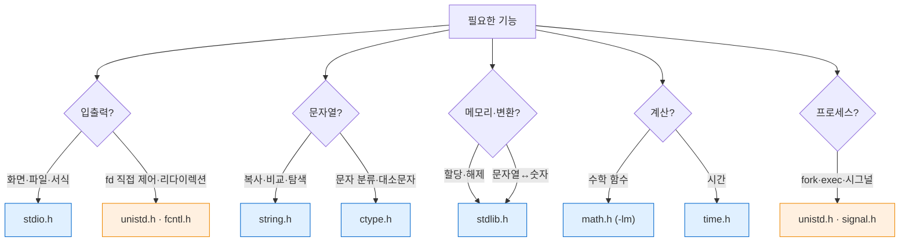

---
tags:
  - lang/c
  - c/stdlib
  - index
  - moc
  - standard-library
  - status/verified
aliases:
  - 표준 라이브러리 인덱스
created: 2026-08-14
updated: 2026-08-14
---

# C 표준 라이브러리 시리즈

> 자주 사용하는 헤더별 함수 정리. 전 예제 컴파일·실행 검증 완료

## 문서 목록

| 문서 | 헤더 | 주요 내용 |
|---|---|---|
| [01 표준 입출력](01-stdio.md) | `<stdio.h>` | `printf` 서식, 파일 I/O, 스트림 |
| [02 문자열 처리](02-string.md) | `<string.h>` | `str*`·`mem*` 계열, 널 종단 |
| [03 메모리 · 변환](03-stdlib.md) | `<stdlib.h>` | `malloc`, `strtol`, `qsort` |
| [04 문자 · 수학 · 시간](04-ctype-math-time.md) | `<ctype.h>` `<math.h>` `<time.h>` `<limits.h>` 외 | 분류·연산·시각·한계값 |
| [05 POSIX 시스템 호출](05-posix.md) | `<unistd.h>` `<fcntl.h>` 외 | 저수준 I/O, 프로세스, 디렉토리 |

## 헤더 선택 기준



파란 = 표준 C (모든 플랫폼) · 주황 = POSIX (Unix 계열)

## 빈출 함수 30선

| 함수 | 헤더 | 한 줄 요약 |
|---|---|---|
| `printf` | stdio | 서식 출력 |
| `fprintf` | stdio | 스트림·파일 서식 출력 |
| `snprintf` | stdio | 안전한 문자열 조립 |
| `fgets` | stdio | 한 줄 입력 (크기 제한) |
| `fopen` `fclose` | stdio | 파일 열기·닫기 |
| `perror` | stdio | 오류 메시지 출력 |
| `strlen` | string | 문자열 길이 |
| `strcmp` | string | 문자열 비교 (**0=같음**) |
| `strncpy` | string | 복사 (**널 종단 수동**) |
| `strcat` | string | 연결 |
| `strchr` `strstr` | string | 문자·부분 문자열 탐색 |
| `strtok_r` | string | 분해 (원본 파괴) |
| `strdup` | string | 힙 복사 (**`free` 필요**) |
| `memset` `memcpy` `memmove` | string | 메모리 채우기·복사 |
| `malloc` `calloc` `realloc` `free` | stdlib | 동적 메모리 |
| `strtol` | stdlib | 안전한 문자열→정수 |
| `qsort` | stdlib | 정렬 |
| `exit` | stdlib | 프로그램 종료 |
| `getenv` | stdlib | 환경변수 |
| `isdigit` `isalpha` `isspace` | ctype | 문자 분류 |
| `toupper` `tolower` | ctype | 대소문자 변환 |
| `sqrt` `pow` `fabs` | math | 수학 연산 |
| `time` `localtime` `strftime` | time | 시각 처리 |
| `open` `read` `write` `close` | unistd/fcntl | 저수준 I/O |
| `fork` `execvp` `waitpid` | unistd/wait | 프로세스 |
| `dup2` `pipe` | unistd | fd 조작 |
| `stat` | sys/stat | 파일 정보 |
| `opendir` `readdir` | dirent | 디렉토리 순회 |
| `sigaction` | signal | 시그널 처리 |
| `assert` | assert | 개발 중 조건 검증 |

## 통합 실전 예제 — 단어 빈도 계산

여러 헤더의 함수를 결합한 CLI 프로그램. 파일을 읽어 단어 출현 횟수를 집계 후 상위 5개 출력

사용 함수 — `fopen`·`fgets`·`fclose`·`fprintf`·`perror`(stdio), `strtok_r`·`strcmp`·`strncpy`(string), `tolower`(ctype), `qsort`(stdlib)

```c
#include <stdio.h>
#include <stdlib.h>
#include <string.h>
#include <ctype.h>

#define MAX_WORDS 1024
#define MAX_LEN   64

typedef struct { char word[MAX_LEN]; int count; } Entry;

static Entry table[MAX_WORDS];
static int   n_entries = 0;

// 이미 있으면 증가, 없으면 추가 (선형 탐색 — 소규모 전제)
static void add_word(const char *w) {
    for (int i = 0; i < n_entries; i++)
        if (strcmp(table[i].word, w) == 0) { table[i].count++; return; }
    if (n_entries >= MAX_WORDS) return;
    strncpy(table[n_entries].word, w, MAX_LEN - 1);
    table[n_entries].word[MAX_LEN - 1] = '\0';   // ← 널 종단 수동 보장
    table[n_entries].count = 1;
    n_entries++;
}

// 횟수 내림차순, 동수면 사전순
static int cmp_desc(const void *a, const void *b) {
    const Entry *x = a, *y = b;
    if (x->count != y->count) return y->count - x->count;
    return strcmp(x->word, y->word);
}

int main(int argc, char *argv[]) {
    if (argc != 2) {
        fprintf(stderr, "사용법: %s <파일>\n", argv[0]);
        return 1;
    }
    FILE *fp = fopen(argv[1], "r");
    if (fp == NULL) { perror(argv[1]); return 1; }

    char line[512];
    while (fgets(line, sizeof(line), fp) != NULL) {
        char *sp, *tok = strtok_r(line, " \t\n.,!?;:\"'", &sp);
        while (tok != NULL) {
            char low[MAX_LEN];
            size_t j = 0;
            for (size_t i = 0; tok[i] && j < MAX_LEN - 1; i++)
                low[j++] = (char)tolower((unsigned char)tok[i]);   // ← 캐스팅
            low[j] = '\0';
            if (j > 0) add_word(low);
            tok = strtok_r(NULL, " \t\n.,!?;:\"'", &sp);
        }
    }
    fclose(fp);

    qsort(table, (size_t)n_entries, sizeof(Entry), cmp_desc);

    printf("총 %d개 고유 단어, 상위 5개:\n", n_entries);
    for (int i = 0; i < n_entries && i < 5; i++)
        printf("%3d회  %s\n", table[i].count, table[i].word);
    return 0;
}
```

### 컴파일 · 실행

```bash
cc -Wall -Wextra -g wordcount.c -o wordcount
printf 'the quick brown fox\njumps over the lazy dog.\nThe DOG barks! the fox runs.\n' > sample.txt
./wordcount sample.txt
```

- `-Wall` — 주요 경고 활성. 미초기화 변수·타입 불일치 등 검출
- `-Wextra` — `-Wall` 미포함 추가 경고 활성
- `-g` — 디버그 심볼 포함. lldb 추적·ASan 행 번호 표시에 필요
- `-o wordcount` — 출력 파일명을 `wordcount`로 지정. 미지정 시 `a.out`

```
총 10개 고유 단어, 상위 5개:
  4회  the
  2회  dog
  2회  fox
  1회  barks
  1회  brown
```

인자 누락 시

```bash
./wordcount; echo "종료코드=$?"
```

```
사용법: ./wordcount <파일>
종료코드=1
```

- 대소문자 통일 확인 — `the`·`The` 합산 4회, `dog`·`DOG` 합산 2회
- 오류 시 `stderr` 출력 + 0 이외 종료 코드 → CLI 프로그램 관례 준수

### 이 예제에서 지킨 안전 규칙

- `argc` 검사 후 `argv[1]` 접근
- `fopen` 반환값 `NULL` 검사
- `fgets`로 크기 제한 입력
- `strncpy` 후 **수동 널 종단**
- `tolower`에 `(unsigned char)` 캐스팅
- 배열 인덱스 상한 검사 (`n_entries >= MAX_WORDS`)
- `fclose` 호출

### 개선 여지 (학습 과제)

- 선형 탐색 O(n²) → 해시 테이블
- 고정 배열 → `malloc` 기반 동적 확장
- `MAX_LEN` 초과 단어 절삭 → 동적 문자열
- UTF-8 한글 미지원 — `tolower`가 바이트 단위 처리

## 학습 순서 권장

1. [01 표준 입출력](01-stdio.md) — 모든 프로그램의 기본
2. [02 문자열 처리](02-string.md) — C에서 가장 실수가 잦은 영역
3. [03 메모리 · 변환](03-stdlib.md) — 동적 할당 규율
4. [04 문자 · 수학 · 시간](04-ctype-math-time.md) — 필요 시 참조
5. [05 POSIX](05-posix.md) — 시스템 프로그래밍 진입

## 공통 안전 규칙

- 반환값 검사 — `fopen`·`malloc`·`strtol`·시스템 콜 전부
- 버퍼 크기 명시 — `sizeof(buf)` 전달, 널 종단 자리 확보
- `-Wall -Wextra` 경고 0건 유지
- 개발 중 `-fsanitize=address` 상시 사용
- 할당한 것은 반드시 해제, 연 것은 반드시 닫기

## 관련 문서

- [[C/docs/01-basics/c-program-execution-model|C 프로그램의 동작 및 컴파일 방식]] — 소스가 실행 파일이 되는 과정
- [[C/docs/03-build/gcc-compile-and-run|gcc 컴파일 · 실행 명령어]] — 컴파일 명령과 옵션 전반
- [[C/docs/README|학습 문서 인덱스]] — 카테고리별 전체 문서 목록
- [[C/docs/07-stdlib/01-stdio|표준 입출력]] — 입출력 함수와 서식 지정자
- [[C/docs/07-stdlib/02-string|문자열 처리]] — 문자열·메모리 조작 함수
- [[C/docs/07-stdlib/03-stdlib|메모리 · 변환]] — 동적 메모리와 변환·정렬
- [[C/docs/07-stdlib/04-ctype-math-time|문자 · 수학 · 시간]] — 문자 분류·수학·시간 함수
- [[C/docs/07-stdlib/05-posix|POSIX 시스템 호출]] — 저수준 I/O와 프로세스 시스템 콜
