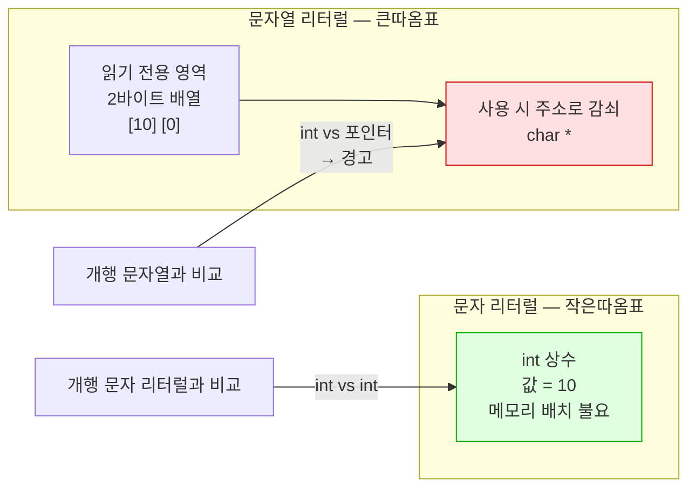

---
tags:
  - lang/c
  - c/syntax
  - character-literal
  - string-literal
  - ascii
  - escape-sequence
  - status/verified
aliases:
  - 문자 리터럴
  - 작은따옴표
  - 이스케이프 시퀀스
created: 2026-08-18
updated: 2026-08-18
---

# 문자 리터럴 `'x'` 와 문자열 리터럴 `"x"`

> C에서 문자는 **작은 정수**. `'\n'`의 타입은 `char`가 아니라 **`int`**, 값은 10

## 개념

`'x'` — **문자 리터럴**(character literal). 작은따옴표. 실체는 **정수 상수**

`"x"` — **문자열 리터럴**(string literal). 큰따옴표. 실체는 널 종단 `char` 배열 → 사용 시 **주소**로 감쇠

| 표기 | 정체 | 타입 | 평가 결과 |
|---|---|---|---|
| `'A'` | 문자 리터럴 | **`int`** (C 기준) | 65 (문자 코드) |
| `"A"` | 문자열 리터럴 | `char[2]` | 메모리 **주소** |

핵심 — 이름이 "문자"일 뿐 **정수와 구별되는 별도 타입 부재**. `'A'`와 `65`는 완전히 동등

## 타입 확인

`sizeof`로 실제 타입 판별. C에서 문자 리터럴은 `int` 크기

```c
#include <stdio.h>

int main(void) {
    printf("sizeof('\\n') = %zu\n", sizeof('\n'));   /* 문자 리터럴 */
    printf("sizeof(char)  = %zu\n", sizeof(char));
    printf("sizeof(\"\\n\") = %zu\n", sizeof("\n"));   /* 문자열 리터럴 */
    printf("'\\n' 값 = %d\n", '\n');
    printf("'A'  값 = %d\n", 'A');
    printf("EOF  값 = %d\n", EOF);
    return 0;
}
```

```bash
cc -Wall -Wextra lit.c -o lit && ./lit
```

- `-Wall` — 주요 경고 활성. 미초기화 변수·타입 불일치 등 검출
- `-Wextra` — `-Wall` 미포함 추가 경고 활성
- `-o lit` — 출력 파일명을 `lit`로 지정. 미지정 시 `a.out`
- `&& ./lit` — 컴파일 성공 시에만 실행

```
sizeof('\n') = 4
sizeof(char)  = 1
sizeof("\n") = 2
'\n' 값 = 10
'A'  값 = 65
EOF  값 = -1
```

- `sizeof('\n')` = **4** → `int`. `char`(1)와 상이
- `sizeof("\n")` = **2** → `'\n'` + 널 종단 `'\0'` 2바이트 배열
- **C++와 상이** — C++에서 문자 리터럴은 `char` → `sizeof('\n')` = 1

## 동작 구조

같은 개행을 나타내도 메모리 표현이 근본적으로 상이



초록 = 값 비교(정상) · 빨강 = 주소 비교(오류)

## 정수 비교가 성립하는 이유

`fgetc` 반환값과의 비교가 타입 불일치 없이 동작

```c
int c;
while ((c = fgetc(stdin)) != EOF && c != '\n') { ... }
```

- `c` — `int`
- `EOF` — `int` 상수 매크로, 값 `-1`
- `'\n'` — `int` 상수, 값 `10`
- 결과 — **셋 다 `int`**. 승격·변환 부재, 순수 정수 비교

`c`를 `int`로 선언하는 이유는 `'\n'`이 아니라 **`EOF` 구분** 목적. 상세 → [표준 입출력 — `EOF`와 반환 타입](../07-stdlib/01-stdio.md)

## 이스케이프 시퀀스

역슬래시로 시작하는 특수 문자 표기. 값은 전부 정수

```c
#include <stdio.h>

int main(void) {
    printf("'\\n' = %d\n", '\n');
    printf("'\\t' = %d\n", '\t');
    printf("'\\0' = %d\n", '\0');
    printf("'\\\\' = %d\n", '\\');
    printf("'0'  = %d\n", '0');
    printf("'A'  = %d\n", 'A');
    printf("'a'-'A' = %d\n", 'a' - 'A');

    char c = 'B';
    printf("'B'+1 = %c\n", c + 1);          /* 정수 연산 가능 */
    printf("숫자문자 '7' → %d\n", '7' - '0');
    return 0;
}
```

```bash
cc -Wall -Wextra esc.c -o esc && ./esc
```

- `-Wall` — 주요 경고 활성. 미초기화 변수·타입 불일치 등 검출
- `-Wextra` — `-Wall` 미포함 추가 경고 활성
- `-o esc` — 출력 파일명을 `esc`로 지정. 미지정 시 `a.out`
- `&& ./esc` — 컴파일 성공 시에만 실행

```
'\n' = 10
'\t' = 9
'\0' = 0
'\\' = 92
'0'  = 48
'A'  = 65
'a'-'A' = 32
'B'+1 = C
숫자문자 '7' → 7
```

### 주요 이스케이프

| 표기 | 의미 | 값 |
|---|---|---|
| `'\n'` | 개행(LF) | 10 |
| `'\t'` | 탭 | 9 |
| `'\r'` | 캐리지 리턴 | 13 |
| `'\0'` | 널 문자 — **문자열 종단** | 0 |
| `'\\'` | 역슬래시 | 92 |
| `'\''` | 작은따옴표 | 39 |
| `'\"'` | 큰따옴표 | 34 |
| `'\xFF'` | 16진 지정 | 255 |

- `'\0'`(값 0)과 `'0'`(값 48) — **완전히 다른 값**. 혼동 시 문자열 종단 오류

## 문자 산술 관용 표현

문자가 정수이므로 연산 가능. ASCII 연속 배치를 이용

```c
'7' - '0'          /* 숫자 문자 → 정수 7 */
'a' - 'A'          /* 32 — 대소문자 코드 차이 */
c + ('a' - 'A')    /* 대문자 → 소문자 (ASCII 전제) */
c >= '0' && c <= '9'   /* 숫자 판별 */
```

- 이식성 우선 시 `<ctype.h>`의 `isdigit`·`tolower` 사용 권장. ASCII 비전제 환경 대응
- `tolower` 인자에 `(unsigned char)` 캐스팅 필요 → [문자 · 수학 · 시간](../07-stdlib/04-ctype-math-time.md)

## Java와의 차이

| 항목 | Java | C |
|---|---|---|
| 문자 리터럴 타입 | `char` — **독립 타입** | **`int`** — 정수 상수 |
| `char` 크기 | 2바이트 (UTF-16 코드 단위) | 1바이트 |
| 정수와의 관계 | 명시적 캐스팅 필요 | **자유롭게 혼용** |
| 문자열 타입 | `String` 객체 | `char[]` → 주소 |
| 문자열 비교 | `equals()` (`==`는 참조 비교) | `strcmp()` (`==`는 주소 비교) |
| `'a' + 1` | `int` 98로 승격 | `int` 98 |
| 유니코드 | `char`가 코드 단위 표현 | **바이트 단위**. 한글은 UTF-8 3바이트 |

- Java도 `'a' + 1`이 `int`가 되지만, 이는 **승격 결과**. C는 애초에 `int`
- Java `char c = 'A' + 1;` → 컴파일 오류(명시적 캐스팅 필요). C는 통과

## 함정 · 주의점

- `'\n'` 대신 `"\n"` 사용 → 포인터와 정수 비교. `-Wall`이 경고
  ```c
  if (c != "\n") { }        // ← 잘못됨
  ```
  ```
  warning: result of comparison against a string literal is unspecified [-Wstring-compare]
  warning: comparison between pointer and integer ('int' and 'char *') [-Wpointer-integer-compare]
  ```
- `'0'`(48)과 `'\0'`(0) 혼동 → 문자열 종단 실패 또는 오판
- `strcmp` 대신 `==`로 문자열 비교 → 주소 비교가 되어 항상 거짓
- 다중 문자 리터럴 `'ab'` → 컴파일은 통과하나 **값이 구현 종속**
  ```
  warning: multi-character character constant [-Wmultichar]
  ```
  ```
  24930
  ```
  `24930` = `0x6162` = `'a'`·`'b'` 바이트 결합. 이식성 부재 → 사용 금지
- 한글을 `char` 하나에 저장 시도 → UTF-8에서 **3바이트** 차지. 단일 문자 변수에 부적합
- `char`의 부호 여부가 구현 종속 → `0x80` 이상 값 비교 시 플랫폼별 상이. `unsigned char` 명시 권장

## 검증

- [x] `sizeof('\n')` = 4로 `int` 타입 확인
- [x] `sizeof("\n")` = 2로 배열 크기 확인
- [x] 이스케이프 시퀀스 값 전수 확인
- [x] 문자 산술(`'a'-'A'`, `'7'-'0'`) 동작 확인
- [x] 문자열 리터럴 비교 시 경고 원문 확인
- [x] 다중 문자 리터럴 경고·값 확인

## 관련 문서

- [[C/docs/07-stdlib/01-stdio|표준 입출력]] — `EOF`와 `fgetc` 반환 타입을 `int`로 받는 이유
- [[C/docs/07-stdlib/02-string|문자열 처리]] — 널 종단과 `strcmp` 비교
- [[C/docs/07-stdlib/04-ctype-math-time|문자 · 수학 · 시간]] — `isdigit`·`tolower` 문자 분류 함수
- [[C/docs/08-syntax/sizeof-and-array-subscript|sizeof 연산자와 배열 첨자]] — 배열 감쇠와 `sizeof` 평가
- [[C/docs/08-syntax/pointer-types|포인터 자료형]] — 리터럴을 `char *`로 받아 수정 시 크래시하는 이유
- [[C/docs/README|학습 문서 인덱스]] — 카테고리별 전체 문서 목록
