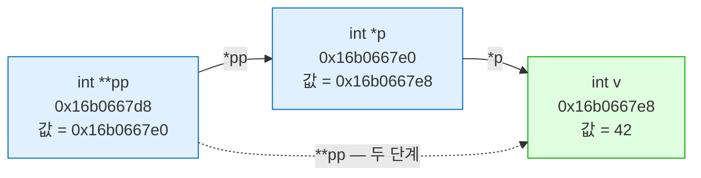
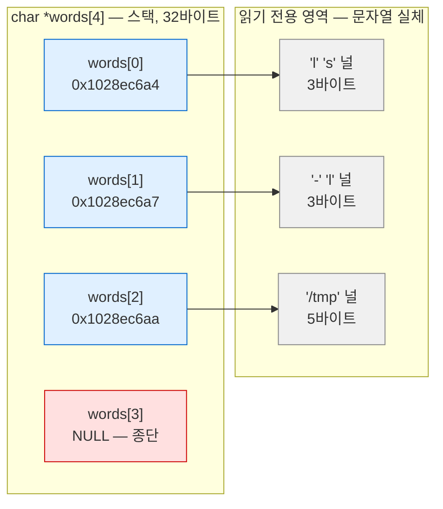
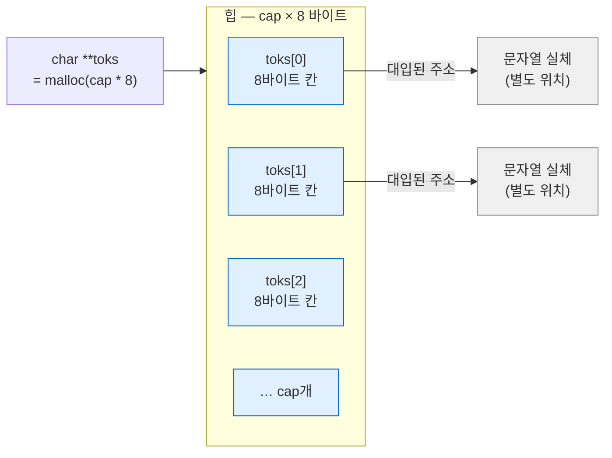
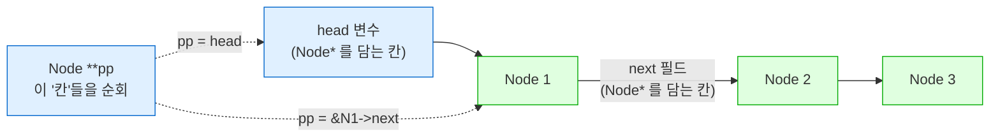
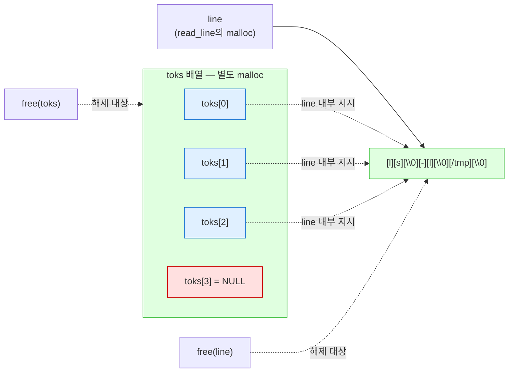

---
tags:
  - lang/c
  - c/syntax
  - pointer
  - double-pointer
  - out-parameter
  - linked-list
  - status/verified
aliases:
  - 이중 포인터
  - 포인터의 포인터
  - char **
created: 2026-08-18
updated: 2026-08-18
---

# 이중 포인터 `**`

> **포인터 변수 자체를 바꿔야 할 때** 필요. C에 참조 전달이 없어 생기는 유일한 우회로

## 개념

`int **pp` — `int *`를 담는 포인터. 한 단계 더 들어가는 것이 아니라 **가리키는 대상이 포인터**

| 표기 | 담는 값 | 역참조 결과 |
|---|---|---|
| `int v` | 정수 | — |
| `int *p` | `v`의 주소 | `*p` = 정수 |
| `int **pp` | `p`의 주소 | `*pp` = 포인터, `**pp` = 정수 |

핵심 질문 — **무엇을 바꾸려 하는가**

- 가리키는 **값**을 바꿈 → 단일 포인터(`int *`)로 충분
- **포인터 변수 자체**를 바꿈(할당·재할당·재연결) → 이중 포인터 필요

## 주소 관계

```c
#include <stdio.h>

int main(void) {
    int   v  = 42;
    int  *p  = &v;
    int **pp = &p;

    printf("v   = %d\n", v);
    printf("&v  = %p   (변수 v의 주소)\n", (void *)&v);
    printf("p   = %p   (p가 담은 값 = v의 주소)\n", (void *)p);
    printf("&p  = %p   (변수 p 자신의 주소)\n", (void *)&p);
    printf("pp  = %p   (pp가 담은 값 = p의 주소)\n", (void *)pp);
    printf("&pp = %p   (변수 pp 자신의 주소)\n", (void *)&pp);
    printf("\n");
    printf("*p   = %d      (p가 가리키는 곳의 값)\n", *p);
    printf("*pp  = %p   (pp가 가리키는 곳의 값 = p)\n", (void *)*pp);
    printf("**pp = %d      (두 번 따라가면 v)\n", **pp);

    **pp = 99;                      /* 두 단계 거쳐 v 변경 */
    printf("\n**pp = 99 대입 후 v = %d\n", v);

    printf("\nsizeof: int=%zu  int*=%zu  int**=%zu\n",
           sizeof(int), sizeof(int *), sizeof(int **));
    return 0;
}
```

```bash
cc -Wall -Wextra addr.c -o addr && ./addr
```

- `-Wall` — 주요 경고 활성. 미초기화 변수·타입 불일치 등 검출
- `-Wextra` — `-Wall` 미포함 추가 경고 활성
- `-o addr` — 출력 파일명을 `addr`로 지정. 미지정 시 `a.out`
- `&& ./addr` — 컴파일 성공 시에만 실행

```
v   = 42
&v  = 0x16b0667e8   (변수 v의 주소)
p   = 0x16b0667e8   (p가 담은 값 = v의 주소)
&p  = 0x16b0667e0   (변수 p 자신의 주소)
pp  = 0x16b0667e0   (pp가 담은 값 = p의 주소)
&pp = 0x16b0667d8   (변수 pp 자신의 주소)

*p   = 42      (p가 가리키는 곳의 값)
*pp  = 0x16b0667e8   (pp가 가리키는 곳의 값 = p)
**pp = 42      (두 번 따라가면 v)

**pp = 99 대입 후 v = 99

sizeof: int=4  int*=8  int**=8
```

- `p == &v`, `pp == &p` — 각 단계가 **앞 변수의 주소** 보관
- `**pp = 99`로 두 단계 거쳐 `v` 변경 확인
- `sizeof(int *)` = `sizeof(int **)` = **8** — 포인터는 몇 겹이든 주소 크기 동일. 단계 수는 **타입 정보일 뿐**



## 용법 1 — 함수에서 포인터 자체 변경

가장 중요한 용도. C는 **전부 값 전달**이므로 포인터를 넘겨도 그 사본이 전달됨

```c
#include <stdio.h>
#include <stdlib.h>
#include <string.h>

/* 단일 포인터 — 호출자의 포인터를 바꾸지 못함 */
static void alloc_bad(char *p) {
    p = malloc(16);
    strcpy(p, "BAD");
}

/* 이중 포인터 — 호출자의 포인터 자체를 변경 */
static void alloc_good(char **pp) {
    *pp = malloc(16);
    strcpy(*pp, "GOOD");
}

int main(void) {
    char *a = NULL;
    alloc_bad(a);
    printf("alloc_bad  후: a = %p (%s)\n", (void *)a, a ? a : "NULL 그대로");

    char *b = NULL;
    alloc_good(&b);
    printf("alloc_good 후: b = %p (%s)\n", (void *)b, b ? b : "NULL");

    free(b);
    return 0;
}
```

```bash
cc -Wall -Wextra why.c -o why && ./why
```

- `-Wall` — 주요 경고 활성. 미초기화 변수·타입 불일치 등 검출
- `-Wextra` — `-Wall` 미포함 추가 경고 활성
- `-o why` — 출력 파일명을 `why`로 지정. 미지정 시 `a.out`
- `&& ./why` — 컴파일 성공 시에만 실행

```
alloc_bad  후: a = 0x0 (NULL 그대로)
alloc_good 후: b = 0x104f899a0 (GOOD)
```

- `alloc_bad` — 매개변수 `p`는 `a`의 **사본**. `p = malloc(...)`은 사본만 변경 → `a`는 `NULL` 유지
- 부작용 — 할당한 16바이트가 **누수**. 아무도 그 주소를 모름
- `alloc_good` — `&b`로 **`b` 자신의 주소** 전달 → `*pp = ...`가 `b`를 직접 변경

판단 기준

| 함수가 하려는 일 | 필요한 타입 |
|---|---|
| 가리키는 배열·구조체 **내용** 수정 | `T *` |
| 포인터에 **새 주소 대입**(할당·재할당·재연결) | `T **` |

## 용법 2 — 문자열 배열 `char **argv`

`char *`들의 배열. 배열 이름이 함수 인자로 전달될 때 `char **`로 감쇠

```c
#include <stdio.h>

static void print_all(char **argv, int argc) {
    for (int i = 0; i < argc; i++)
        printf("  argv[%d] = %p → \"%s\"\n", i, (void *)argv[i], argv[i]);
}

/* NULL 종단 규약 — 개수를 안 넘겨도 순회 가능 */
static void print_until_null(char **argv) {
    for (char **p = argv; *p != NULL; p++)
        printf("  %s", *p);
    printf("\n");
}

int main(void) {
    char *words[] = { "ls", "-l", "/tmp", NULL };   /* 배열 이름 → char ** 감쇠 */

    printf("words 배열 자체 주소 = %p\n", (void *)words);
    printf("sizeof(words) = %zu (포인터 4개)\n\n", sizeof(words));

    print_all(words, 3);
    printf("\nNULL 종단 순회:");
    print_until_null(words);

    printf("\n포인터 산술: *(words+1) = \"%s\", words[1] = \"%s\"\n",
           *(words + 1), words[1]);
    return 0;
}
```

```bash
cc -Wall -Wextra argv.c -o argv && ./argv
```

- `-Wall` — 주요 경고 활성. 미초기화 변수·타입 불일치 등 검출
- `-Wextra` — `-Wall` 미포함 추가 경고 활성
- `-o argv` — 출력 파일명을 `argv`로 지정. 미지정 시 `a.out`
- `&& ./argv` — 컴파일 성공 시에만 실행

```
words 배열 자체 주소 = 0x16d5127e0
sizeof(words) = 32 (포인터 4개)

  argv[0] = 0x1028ec6a4 → "ls"
  argv[1] = 0x1028ec6a7 → "-l"
  argv[2] = 0x1028ec6aa → "/tmp"

NULL 종단 순회:  ls  -l  /tmp

포인터 산술: *(words+1) = "-l", words[1] = "-l"
```

- `sizeof(words)` = 32 = 포인터 8바이트 × 4개(`NULL` 포함). **문자열 길이 총합과 무관**
- 문자열 주소 `…6a4`·`…6a7`·`…6aa` — 읽기 전용 영역에 연속 배치. `"ls\0"` 3바이트씩 간격
- `argv[i]`는 `*(argv + i)`와 동등 — 배열 첨자가 포인터 산술의 문법 설탕
- **`NULL` 종단** — 개수 인자 없이 순회 가능. `execvp`·`main(int argc, char **argv)` 규약



배열은 **주소만** 보관. 문자열 실체는 별도 영역 — 2단계 구조가 이중 포인터가 필요한 이유

## 핵심 표현 해부 — `malloc(cap * sizeof(char *))`

문자열 배열을 동적으로 만드는 정석 공식. `make-shell`의 `tokenize`가 이 형태

```c
char **toks = malloc(cap * sizeof(char *));
```

네 조각으로 분해

| 조각 | 의미 |
|---|---|
| `sizeof(char *)` | **포인터 하나**의 크기 = 8바이트 (64비트) |
| `cap * sizeof(char *)` | 포인터 `cap`개분 총 바이트 수 |
| `malloc(...)` | 그만큼 힙에 확보 |
| `char **toks =` | 확보한 **배열의 시작 주소**를 보관 |

- 확보되는 것 — 문자열 **실체가 아니라 주소를 담을 칸 `cap`개**
- `cap = 8`이면 8 × 8 = **64바이트**. 각 칸에 문자열 시작 주소 하나씩 대입 가능
- 문자열 실체는 별도 위치(원본 버퍼·리터럴 영역·별도 `malloc`)에 존재
- `toks`가 `char **`인 근거 — 담긴 값이 **`char *`들의 배열 주소** → 2단계 참조



`malloc`이 확보하는 범위는 파란 부분뿐. 회색 문자열 실체는 **별도 관리**

### `sizeof(char)` 오기 — 8배 부족

가장 빈번한 실수. `sizeof(char)`는 1이므로 필요량의 **1/8만 확보**

```c
size_t cap = 4;
char **ok  = malloc(cap * sizeof(char *));   /* 32바이트 — 올바름 */
char **bad = malloc(cap * sizeof(char));     /*  4바이트 — 잘못됨 */
bad[0] = "boom";                             /* 8바이트 기록 → 이미 초과 */
```

```bash
cc -Wall -Wextra -g -fsanitize=address sizebug.c -o sizebug && ./sizebug
```

- `-Wall` — 주요 경고 활성. 미초기화 변수·타입 불일치 등 검출
- `-Wextra` — `-Wall` 미포함 추가 경고 활성
- `-g` — 디버그 심볼 포함. ASan 리포트에 행 번호 표시에 필요
- `-fsanitize=address` — 메모리 오류 검사 코드 삽입. 경계 초과 검출 목적
- `-o sizebug` — 출력 파일명을 `sizebug`로 지정. 미지정 시 `a.out`
- `&& ./sizebug` — 컴파일 성공 시에만 실행

```
==42864==ERROR: AddressSanitizer: heap-buffer-overflow on address 0x6020000000f0
WRITE of size 8 at 0x6020000000f0 thread T0
    #0 0x0001048c8a94 in main sizebug.c:24

0x6020000000f4 is located 0 bytes after 4-byte region [0x6020000000f0,0x6020000000f4)
allocated by thread T0 here:
    #1 0x0001048c8820 in main sizebug.c:11

SUMMARY: AddressSanitizer: heap-buffer-overflow sizebug.c:24 in main
```

- `WRITE of size 8` vs `4-byte region` — **8바이트 기록을 4바이트 공간에** 시도한 상황 명시
- **컴파일 경고 0건** — 타입은 맞고 크기만 틀리므로 컴파일러 미검출
- 원소 1개 대입만으로 이미 초과 → 조용히 인접 메모리 손상 가능
- 예방 관용 표현 — 타입명 대신 **역참조 표기** 사용

```c
char **toks = malloc(cap * sizeof *toks);    /* sizeof(char *)와 동등 */
```

- `sizeof *toks` — `toks`가 가리키는 대상(`char *`)의 크기. 타입 변경 시에도 자동 정합
- `int **`로 바꿔도 수정 불필요 → 실수 여지 제거

## 용법 3 — `realloc` 성장 버퍼

`realloc`이 **주소를 옮길 수 있으므로** 호출자 포인터 갱신 필수. `make-shell`의 `read_line`이 이 구조

```c
#include <stdio.h>
#include <stdlib.h>

/* realloc은 주소를 옮길 수 있음 → 호출자 포인터 갱신 위해 ** 필요 */
static int push_char(char **buf, size_t *len, size_t *cap, char c) {
    if (*len + 1 >= *cap) {
        size_t ncap = *cap * 2;
        char *tmp = realloc(*buf, ncap);
        if (tmp == NULL) return -1;          /* 원본 유지 → 호출자가 free */
        *buf = tmp;                          /* ← 호출자 포인터 갱신 */
        *cap = ncap;
        printf("  [확장] cap %zu → %zu, 주소 %p\n", ncap / 2, ncap, (void *)*buf);
    }
    (*buf)[(*len)++] = c;
    (*buf)[*len] = '\0';
    return 0;
}

int main(void) {
    size_t cap = 4, len = 0;
    char *buf = malloc(cap);
    buf[0] = '\0';
    printf("초기 주소 %p (cap %zu)\n", (void *)buf, cap);

    for (char c = 'a'; c <= 'j'; c++)
        if (push_char(&buf, &len, &cap, c) != 0) { free(buf); return 1; }

    printf("결과 \"%s\" (len %zu, cap %zu)\n", buf, len, cap);
    free(buf);
    return 0;
}
```

```bash
cc -Wall -Wextra grow.c -o grow && ./grow
```

- `-Wall` — 주요 경고 활성. 미초기화 변수·타입 불일치 등 검출
- `-Wextra` — `-Wall` 미포함 추가 경고 활성
- `-o grow` — 출력 파일명을 `grow`로 지정. 미지정 시 `a.out`
- `&& ./grow` — 컴파일 성공 시에만 실행

```
초기 주소 0x1029a1ae0 (cap 4)
  [확장] cap 4 → 8, 주소 0x1029a1ae0
  [확장] cap 8 → 16, 주소 0x1029a1ae0
결과 "abcdefghij" (len 10, cap 16)
```

- `(*buf)[*len]` — **괄호 필수**. `*buf[*len]`은 `*(buf[*len])`로 해석되어 전혀 다른 동작
- `len`·`cap`도 호출자 변수를 갱신해야 하므로 `size_t *`로 전달
- `realloc` 실패 시 원본 유지 → `tmp` 경유 후 성공 시에만 `*buf` 갱신

### 주소 이동 실증 — 단일 포인터 버그가 숨는 이유

위 실행에서는 주소가 유지되어(`0x1029a1ae0` 고정) **단일 포인터로도 우연히 동작**. 확장을 방해하면 이동 발생

```c
#include <stdio.h>
#include <stdlib.h>

int main(void) {
    size_t cap = 8;
    char *buf = malloc(cap);
    char *block = malloc(64);        /* 뒤를 막아 in-place 확장 방해 */
    printf("최초      %p\n", (void*)buf);
    for (int i = 0; i < 6; i++) {
        cap *= 8;
        char *tmp = realloc(buf, cap);
        if (!tmp) { free(buf); free(block); return 1; }
        printf("cap %7zu %p %s\n", cap, (void*)tmp, tmp == buf ? "(제자리)" : "← 주소 이동");
        buf = tmp;
    }
    free(buf); free(block);
    return 0;
}
```

```bash
cc -Wall -Wextra move.c -o move && ./move
```

- `-Wall` — 주요 경고 활성. 미초기화 변수·타입 불일치 등 검출
- `-Wextra` — `-Wall` 미포함 추가 경고 활성
- `-o move` — 출력 파일명을 `move`로 지정. 미지정 시 `a.out`
- `&& ./move` — 컴파일 성공 시에만 실행

```
최초      0x101329ae0
cap      64 0x1013299f0 ← 주소 이동
cap     512 0x10132af40 ← 주소 이동
cap    4096 0x10132b140 ← 주소 이동
cap   32768 0xcb0c08000 ← 주소 이동
cap  262144 0xcb1000000 ← 주소 이동
cap 2097152 0xcb1000000 (제자리)
```

- 대부분 **주소 이동**. `0x1013…` → `0xcb0c…`는 힙 경로에서 `mmap` 경로로 전환된 결과
- 결론 — "작은 입력에서는 잘 되던 코드"가 입력이 커지면 붕괴. **제자리 확장은 우연**
- 이중 포인터 미사용 시 갱신 누락 → 해제된 옛 주소 참조 → use-after-free

## 용법 4 — 연결 리스트 삭제

"다음을 가리키는 자리"를 직접 다뤄 **첫 노드 특수 처리 제거**

```c
/* 단일 포인터 + prev 추적 — 분기 필요 */
static void remove_prev(Node **head, int v) {
    Node *cur = *head, *prev = NULL;
    while (cur) {
        if (cur->val == v) {
            if (prev) prev->next = cur->next;   /* 중간 노드 */
            else      *head = cur->next;        /* 첫 노드 — 별도 처리 */
            free(cur);
            return;
        }
        prev = cur;
        cur = cur->next;
    }
}

/* 이중 포인터 — "다음을 가리키는 자리"를 직접 다룸. 분기 부재 */
static void remove_dptr(Node **head, int v) {
    for (Node **pp = head; *pp; pp = &(*pp)->next) {
        if ((*pp)->val == v) {
            Node *dead = *pp;
            *pp = dead->next;                   /* 첫 노드든 중간이든 동일 */
            free(dead);
            return;
        }
    }
}
```

```bash
cc -Wall -Wextra list.c -o list && ./list
```

- `-Wall` — 주요 경고 활성. 미초기화 변수·타입 불일치 등 검출
- `-Wextra` — `-Wall` 미포함 추가 경고 활성
- `-o list` — 출력 파일명을 `list`로 지정. 미지정 시 `a.out`
- `&& ./list` — 컴파일 성공 시에만 실행

```
초기:         1 2 3 
prev 방식:    2 3 
이중포인터:   2 3 
3 삭제 후:    2 
정리 후 a=0x0 b=0x0
```

- `pp`가 가리키는 것 — 노드가 아니라 **"노드 주소를 담은 칸"**. 처음엔 `head` 변수, 이후엔 각 노드의 `next` 필드
- 첫 노드 삭제든 중간·마지막 삭제든 `*pp = dead->next` **한 줄로 통일**
- `prev` 방식 대비 분기 1개·변수 1개 감소
- `push`도 `Node **head` 필요 — `*head`에 새 노드 주소를 대입해야 하므로



`head`와 `next`가 **같은 타입의 칸**(`Node *`)이라는 점이 통일의 근거

## 용법 5 — 2차원 동적 배열

행 포인터 배열 + 각 행 실체. 2단계 할당·2단계 해제

```c
int rows = 3, cols = 4;
int **m = malloc((size_t)rows * sizeof *m);      /* 행 포인터 배열 */
for (int i = 0; i < rows; i++) {
    m[i] = malloc((size_t)cols * sizeof **m);    /* 각 행 실체 */
    for (int j = 0; j < cols; j++) m[i][j] = i * 10 + j;
}
/* ... 사용 ... */
for (int i = 0; i < rows; i++) free(m[i]);       /* 역순 해제 — 행 먼저 */
free(m);
```

```
2차원 배열:
  m[0] = 0x1029a1ae0 →   0  1  2  3
  m[1] = 0x1029a19d0 →  10 11 12 13
  m[2] = 0x1029a19e0 →  20 21 22 23
```

- 각 행 주소가 **불연속** — 진짜 2차원 배열(`int m[3][4]`)과 메모리 배치 상이
- `sizeof *m` = `sizeof(int *)`, `sizeof **m` = `sizeof(int)` — 타입명 하드코딩 회피 관용 표현
- **해제 순서** — 행 먼저, 배열 나중. 역순 시 행 주소 유실 → 누수
- 연속 메모리가 필요하면 1차원 할당 후 `m[i * cols + j]` 색인 방식이 유리

## 실전 — `tokenize` 전체 분석

`make-shell`의 토크나이저. 지금까지의 용법이 한 함수에 모두 등장

```c
static char **tokenize(char *line, size_t *out_count) {
    size_t cap = INIT_CAP;
    size_t n = 0;
    char **toks = malloc(cap * sizeof(char *));      /* ① 주소 칸 cap개 */
    if (toks == NULL) return NULL;

    char *saveptr;                                   /* ② 분해 상태 보관 */
    char *tok = strtok_r(line, " \t", &saveptr);

    while (tok != NULL) {
        if (n + 1 >= cap) {                          /* +1 = NULL 종단 자리 */
            cap *= 2;
            char **tmp = realloc(toks, cap * sizeof(char *));
            if (tmp == NULL) { free(toks); return NULL; }
            toks = tmp;                              /* ③ 주소 이동 대응 */
        }
        toks[n++] = tok;                             /* ④ 주소만 복사 */
        tok = strtok_r(NULL, " \t", &saveptr);
    }
    toks[n] = NULL;                                  /* ⑤ NULL 종단 */
    if (out_count) *out_count = n;                   /* ⑥ 개수 반환 */
    return toks;
}
```

### 이중 포인터가 등장하는 3곳

| 위치 | 타입 | 이유 |
|---|---|---|
| `char **toks` | 반환·지역 | `char *`들의 배열을 지시 |
| `char **tmp` | `realloc` 수신 | 같은 배열 타입 유지 |
| `size_t *out_count` | 매개변수 | 호출자 변수에 개수 기록 (이중 포인터는 아니나 동일 원리) |

`out_count`는 `size_t *` — **값을 밖으로 내보내는 out-parameter**. `char **`와 동기가 같음

### `strtok_r`의 파괴적 동작

`strtok_r`은 구분자를 `'\0'`으로 **덮어써서** 원본을 조각냄. 새 문자열 할당 부재

```
호출 전 line: [l][s][ ][-][l][ ][/][t][m][p][\0]
호출 후 line: [l][s][\0][-][l][\0][/][t][m][p][\0]
                     ↑          ↑
                  덮어써짐    덮어써짐
```

- `toks[0]`·`toks[1]`·`toks[2]` — 각각 `line` 내부의 `l`·`-`·`/` 위치를 가리킴
- **별도 할당 부재** → 메모리 절약. 대신 `line`과 수명이 묶임
- `saveptr` — 다음 탐색 시작 위치 보관. 2회차부터 첫 인자를 `NULL`로 전달
- `strtok`(비-`_r`)은 이 상태를 전역에 보관 → **재진입 불가**. `strtok_r` 사용이 정석

### 소유권 구조



- `malloc` 호출 **2회** → `free` 호출 **2회**: `free(toks)`·`free(line)`
- `toks[i]`는 `line` 내부 주소 → **개별 `free` 금지**. 별도 할당이 아니므로 힙 손상 유발
- 해제 순서 — `toks` 먼저든 `line` 먼저든 무관. 단 **해제 후 `toks[i]` 접근 금지**
- `line`을 먼저 해제하면 `toks[i]` 전부 댕글링 → 사용 종료 후 해제 원칙 유지

### `NULL` 종단과 `n + 1 >= cap`

```c
if (n + 1 >= cap) { ... }      /* n번째 대입 + 종단 NULL 한 칸 확보 */
toks[n] = NULL;
```

- `execvp(path, argv)` 규약 — `argv` 마지막 원소가 **`NULL`이어야 함**. 개수 인자 부재
- `n + 1`의 `+1` — 종단 `NULL` 자리 예약. `n >= cap`으로 쓰면 `toks[n] = NULL`이 경계 초과
- 종단 덕분에 호출자가 개수 없이 순회 가능 → `for (char **p = argv; *p; p++)`

### 실행 확인

```bash
cc -Wall -Wextra -g -fsanitize=address src/main.c -o mysh
printf 'ls -l /tmp\nhello   world\nexit\n' | ./mysh
```

- `-Wall` — 주요 경고 활성. 미초기화 변수·타입 불일치 등 검출
- `-Wextra` — `-Wall` 미포함 추가 경고 활성
- `-g` — 디버그 심볼 포함. ASan 리포트 행 번호 표시에 필요
- `-fsanitize=address` — 누수·경계 초과 검사. 소유권 규약 검증 목적
- `-o mysh` — 출력 파일명을 `mysh`로 지정. 미지정 시 `a.out`
- `printf '...' | ./mysh` — 3줄을 표준 입력으로 주입. 대화형 입력 없이 재현

```
mysh>argc=3
 argv[0] = "ls"
 argv[1] = "-l"
 argv[2] = "/tmp"
echo: ls (len=2)
mysh>argc=2
 argv[0] = "hello"
 argv[1] = "world"
echo: hello (len=5)
mysh>
```

- 분해 정상 — 연속 공백(`hello   world`)도 토큰 2개로 처리. `strtok_r`이 연속 구분자를 묶어 취급
- **`echo: ls (len=2)`** — 입력이 `ls -l /tmp`였음에도 `line`이 `"ls"`로 출력
- 원인 — `strtok_r`이 첫 공백을 `'\0'`으로 덮어씀 → `line`이 `"ls"`에서 종단
- `strlen(line)`도 2 — 파괴적 동작의 직접 증거
- 원본 보존이 필요하면 **`strdup`으로 사본을 만들어 분해** 필요
- ASan 오류·누수 0건 — 소유권 규약(`free(toks)`·`free(line)`, `toks[i]` 미해제) 정합 확인

### 읽기 전용 문자열 전달 금지

`strtok_r`이 원본에 기록하므로 **쓰기 가능한 버퍼만** 전달 가능

```c
char **t = tokenize("ls -l", &n);          /* ← 리터럴 → SIGBUS/SIGSEGV */

char buf[] = "ls -l";
char **t2 = tokenize(buf, &n);             /* ← 배열 복사 → 정상 */
```

- 리터럴은 읽기 전용 영역 → 수정 시 크래시. 상세 → [[C/docs/08-syntax/pointer-types|포인터 자료형 — 함정 2]]
- `make-shell`은 `read_line`이 `malloc` 버퍼를 반환 → 쓰기 가능. 설계 정합

## Java와의 차이

Java에 이중 포인터가 없는 이유 — **참조 재대입을 메서드가 할 수 없도록** 설계됨

| 항목 | Java | C |
|---|---|---|
| 인자 전달 | 값 전달(참조도 값으로 복사) | 값 전달 — **동일** |
| 메서드에서 인자 재대입 | 호출자에 **미반영** | 단일 포인터도 미반영 |
| 우회 수단 | 반환값·배열·wrapper 객체 | **이중 포인터** |
| 문자열 배열 | `String[]` | `char **` |
| 2차원 배열 | `int[][]` — 실체도 배열 객체 | `int **` — 수동 2단계 할당 |
| 크기 정보 | `arr.length` 내장 | **별도 전달** 또는 `NULL` 종단 |

Java에서 같은 문제를 만나는 지점

```java
void alloc(String s) { s = "GOOD"; }   // 호출자 변수 불변 — C의 alloc_bad와 동일
String alloc() { return "GOOD"; }      // 반환값으로 해결 — Java의 정석
```

- Java는 **반환값**으로 해결. C도 단순한 경우 반환값이 더 명료
- C에서 이중 포인터가 필요한 경우 — 반환값을 **오류 코드**로 쓰면서 결과도 넘겨야 할 때
  ```c
  int read_line(char **out);   /* 반환 = 성공 여부, *out = 결과 버퍼 */
  ```

## 함정 · 주의점

- 단일 포인터로 호출자 포인터 변경 시도 → 무반응 + **누수**. `&` 붙여 전달했는지 확인
- `*buf[i]` vs `(*buf)[i]` — 우선순위상 `[]`가 `*`보다 강함. **괄호 필수**
  ```c
  (*buf)[0] = 'a';    // ← 버퍼 첫 바이트
  *buf[0]   = 'a';    // ← buf[0]이 가리키는 곳. 전혀 다름
  ```
- `char **`에 `char (*)[N]` 전달 → 타입 불일치. 2차원 배열과 포인터 배열은 **별개 타입**
  ```c
  char grid[3][10];
  char **pp = grid;   // ← 컴파일 오류. 메모리 배치가 다름
  ```
- `realloc` 결과를 `*buf`에 **직접 대입** → 실패 시 원본 주소 유실. `tmp` 경유 필수
- 2차원 배열 해제 시 `free(m)` 먼저 → 행 주소 전부 유실. **행 먼저 해제**
- `NULL` 종단 배열에서 종단 원소 누락 → 순회가 배열 밖으로 진행. 할당 시 `+1` 확보
- 삼중 포인터(`***`) 등장 → 대개 설계 문제. 구조체로 묶는 편이 명료
- `void **`로 임의 포인터 타입 수용 시도 → `void *`와 달리 **자동 변환 부재**. 명시적 캐스팅 필요

## 검증

- [x] 단일 포인터 out-parameter 실패·이중 포인터 성공 확인
- [x] `p`·`pp` 주소 관계와 `**pp` 대입 반영 확인
- [x] `sizeof(int *)` = `sizeof(int **)` = 8 확인
- [x] `char *words[]` 크기 32바이트·문자열 주소 분리 확인
- [x] `realloc` 주소 이동 실증 (in-place 확장이 우연임을 확인)
- [x] 연결 리스트 첫 노드·중간 노드 동일 코드 삭제 확인
- [x] 2차원 배열 행 주소 불연속 확인
- [x] `sizeof(char)` 오기 시 ASan `heap-buffer-overflow` 검출 확인
- [x] `tokenize` 실행으로 분해·`NULL` 종단·소유권 규약 확인
- [x] `strtok_r` 파괴적 동작 확인 (`strlen(line)`이 2로 축소)
- [x] 전 예제 ASan 무오류·무누수 통과

## 관련 문서

- [[C/docs/08-syntax/pointer-types|포인터 자료형]] — `sizeof(char *)`가 8인 근거와 `char **`의 보폭
- [[C/docs/08-syntax/function-parameters|함수 인자 전달]] — 값 전달 원칙과 `const T *`·`T *`·`T **` 선택 기준
- [[C/projects/make-shell/03-tokenizer|03 토크나이저]] — `char **argv` 구성 실전 적용
- [[C/projects/make-shell/02-dynamic-input|02 동적 입력 버퍼]] — `realloc` 성장 버퍼와 소유권 규약
- [[C/docs/08-syntax/sizeof-and-array-subscript|sizeof 연산자와 배열 첨자]] — 배열 감쇠와 포인터 산술
- [[C/docs/07-stdlib/03-stdlib|메모리 · 변환]] — `malloc`·`realloc` 사용 규칙
- [[C/docs/02-memory/heap-and-free|free의 실제 동작]] — 해제 후 주소 상태와 use-after-free
- [[C/docs/05-debugging/lldb-memory-inspection|lldb로 메모리 주소 값 조회하기]] — 포인터 관계를 디버거로 직접 확인
- [[C/docs/README|학습 문서 인덱스]] — 카테고리별 전체 문서 목록
