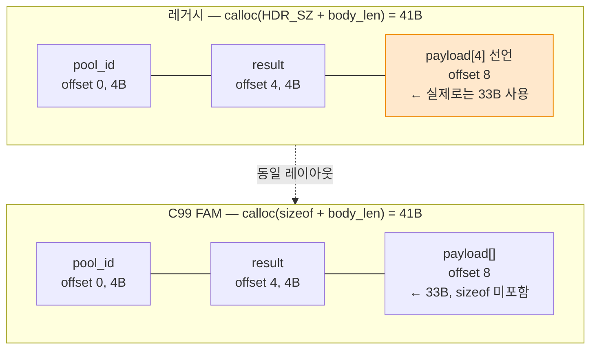

---
tags:
  - lang/c
  - c/syntax
  - struct
  - flexible-array-member
  - variable-length
  - serialization
  - status/verified
aliases:
  - 가변 길이 구조체
  - FAM
  - flexible array member
created: 2026-08-24
updated: 2026-08-24
---

# 가변 길이 구조체 — flexible array member와 레거시 placeholder

> 헤더 필드 + 길이가 매번 다른 본문을 **한 덩어리 메모리**로 다루는 관용구. C99는 `arr[]`, 그 이전 코드는 `arr[N]` placeholder + `HDR_SZ` 매크로

## 개념

- 네트워크 메시지·IPC 페이로드 — 고정 헤더 뒤에 **길이가 매번 다른 본문**이 붙는 형태
- 헤더와 본문을 별도 할당하면 포인터 2개 관리 필요 + 전송 시 2회 복사
- 단일 할당으로 묶으면 `write(fd, p, msg_len)` 한 번에 전송 가능
- 문제 — C 구조체는 크기가 컴파일 시점 고정 → 마지막 멤버만 예외 처리

두 가지 방식:

| 방식 | 선언 | 헤더 크기 | 표준 |
|---|---|---|---|
| C99 FAM | `unsigned char payload[];` | `sizeof(struct)` | C99 이상 |
| 레거시 placeholder | `unsigned char payload[LONG_SZ];` | `sizeof(struct) - LONG_SZ` | 전 버전 |

## Java에 대응 개념 부재

Java는 배열 길이가 런타임 결정이며 객체가 항상 참조. 구조체 뒤에 본문을 이어 붙이는 메모리 레이아웃 제어 수단 자체가 없음. `ByteBuffer` 수동 오프셋 조작이 가장 가까우나 타입 안전성 상실.

## 코드

```c
#include <stdio.h>
#include <stdlib.h>
#include <string.h>

#define LONG_SZ sizeof(int)

/* 레거시 관용구 — 마지막 멤버를 4바이트 placeholder로 선언 */
typedef struct {
    int   pool_id;
    int   result;
    unsigned char payload[LONG_SZ];   /* 실제로는 가변 길이 */
} legacy_msg_t;

#define LEGACY_HDR_SZ (sizeof(legacy_msg_t) - LONG_SZ)

/* C99 flexible array member */
typedef struct {
    int   pool_id;
    int   result;
    unsigned char payload[];          /* 크기 0, sizeof 에 미포함 */
} fam_msg_t;

int main(void) {
    const char *body = "REGISTER sip:example.com SIP/2.0";
    size_t body_len = strlen(body) + 1;

    printf("sizeof(legacy_msg_t) = %zu, LEGACY_HDR_SZ = %zu\n",
           sizeof(legacy_msg_t), (size_t)LEGACY_HDR_SZ);
    printf("sizeof(fam_msg_t)    = %zu\n", sizeof(fam_msg_t));

    /* 레거시 방식 — 헤더 크기를 직접 계산해 뒤에 본문을 붙임 */
    size_t msg_len = LEGACY_HDR_SZ + body_len;
    legacy_msg_t *p = calloc(1, msg_len);
    if (p == NULL) return 1;
    p->pool_id = 42;
    p->result  = 0;
    memcpy((unsigned char *)p + LEGACY_HDR_SZ, body, body_len);  // ← payload 직접 접근 대신 오프셋 계산
    printf("legacy  총 %zu바이트, 본문: %s\n", msg_len, (char *)p + LEGACY_HDR_SZ);
    free(p);

    /* C99 방식 — 헤더 크기가 곧 sizeof */
    fam_msg_t *q = calloc(1, sizeof(fam_msg_t) + body_len);
    if (q == NULL) return 1;
    q->pool_id = 42;
    memcpy(q->payload, body, body_len);
    printf("fam     총 %zu바이트, 본문: %s\n", sizeof(fam_msg_t) + body_len, (char *)q->payload);
    free(q);
    return 0;
}
```

레거시 방식은 `payload` 멤버를 **직접 쓰지 않고** `(unsigned char *)p + HDR_SZ` 로 접근. 멤버명으로 접근하면 컴파일러가 `[LONG_SZ]` 크기만 인지해 `-Wstringop-overflow` 경고 발생 가능.

## 컴파일 · 실행

```bash
cc -Wall -Wextra -g fam.c -o fam && ./fam
```

- `-Wall` — 주요 경고 활성
- `-Wextra` — 추가 경고 활성. 구조체 멤버 접근 범위 문제 탐지에 필요
- `-g` — 디버그 심볼 포함
- `-o fam` — 출력 파일명 지정

```
sizeof(legacy_msg_t) = 12, LEGACY_HDR_SZ = 8
sizeof(fam_msg_t)    = 8
legacy  총 41바이트, 본문: REGISTER sip:example.com SIP/2.0
fam     총 41바이트, 본문: REGISTER sip:example.com SIP/2.0
```

- `sizeof(legacy_msg_t)` = 12 — `int` 2개(8) + `payload[4]`
- `LEGACY_HDR_SZ` = 8 — placeholder 4바이트를 뺀 값. **실질 헤더 크기**
- `sizeof(fam_msg_t)` = 8 — FAM은 `sizeof` 에 미포함 → 계산 불필요

## 메모리 배치



두 방식의 **실제 메모리 레이아웃은 동일**. 차이는 `sizeof` 가 placeholder를 세는지 여부뿐.

## 두 방식 비교

| 항목 | 레거시 `[N]` | C99 `[]` |
|---|---|---|
| 헤더 크기 계산 | `sizeof(s) - N` 매크로 필요 | `sizeof(s)` 그대로 |
| 멤버명 직접 접근 | 경고 위험 → 오프셋 계산 권장 | 안전 |
| `sizeof(struct)` 의미 | 헤더 + placeholder | 헤더만 |
| 빈 본문(길이 0) | placeholder 만큼 낭비 | 낭비 없음 |
| 구조체 배열 선언 | 가능 (의미 없음) | **불가** (컴파일 오류) |
| 표준 | 전 버전 | C99 이상 |

## 함정 · 주의점

- **`sizeof(struct)` 를 헤더 크기로 오인** → 레거시 방식에서 placeholder 크기만큼 오프셋이 밀림. `HDR_SZ` 매크로를 항상 경유
- **`HDR_SZ` 를 `offsetof` 로 대체하지 않음** → `offsetof(legacy_msg_t, payload)` 가 더 명확하지만 레거시 코드는 뺄셈 사용. 두 값이 다를 수 있음 (구조체 끝 패딩) → 혼용 금지
- **FAM 구조체를 값으로 복사** → `*q2 = *q;` 는 헤더만 복사. 본문 유실. `memcpy(q2, q, msg_len)` 필요
- **FAM을 구조체 배열 원소로 사용** → 컴파일 오류. `fam_msg_t arr[10];` 불가
- **FAM을 다른 구조체의 중간 멤버로 사용** → 컴파일 오류. 항상 마지막 멤버여야 함
- **길이 계산 함수와 직렬화 함수의 계약 불일치** → `get_len()` 이 반환한 크기보다 `serialize()` 가 더 쓰면 힙 오버플로. 두 함수를 같은 커밋에서 관리

## 실전 — IPC 메시지 송신 패턴

```c
size_t body_len = get_body_len(obj);
size_t msg_len  = LEGACY_HDR_SZ + body_len;

legacy_msg_t *p = calloc(1, msg_len);
if (p == NULL) { /* 오류 처리 */ return -1; }

if (serialize(obj, (unsigned char *)p + LEGACY_HDR_SZ) == NULL) {
    free(p);                       // ← 실패 시에도 반드시 해제
    return -1;
}
p->pool_id = id;

if (send_ipc(p, msg_len) < 0) {
    free(p);
    return -1;
}
free(p);                           // ← 성공 경로에서도 해제
return 0;
```

모든 경로에서 `free` 필요. `goto` 정리 레이블로 묶는 편이 누락 위험 감소.

## 관련 문서

- [[C/docs/08-syntax/sizeof-and-array-subscript|sizeof 연산자와 배열 첨자]] — `sizeof` 컴파일 시점 평가와 배열 감쇠
- [[C/docs/08-syntax/preprocessor-macro|전처리기 매크로]] — `HDR_SZ` 같은 계산 매크로의 괄호 규칙
- [[C/docs/02-memory/heap-and-free|free의 실제 동작]] — 단일 할당 해제 시점 관리
- [[C/docs/02-memory/api-ownership-convention|반환 포인터 소유권 규약]] — 직렬화 함수 반환값의 해제 책임
- [[C/docs/05-debugging/lldb-memory-inspection|lldb로 메모리 주소 값 조회하기]] — 구조체 패딩과 실제 오프셋 확인
