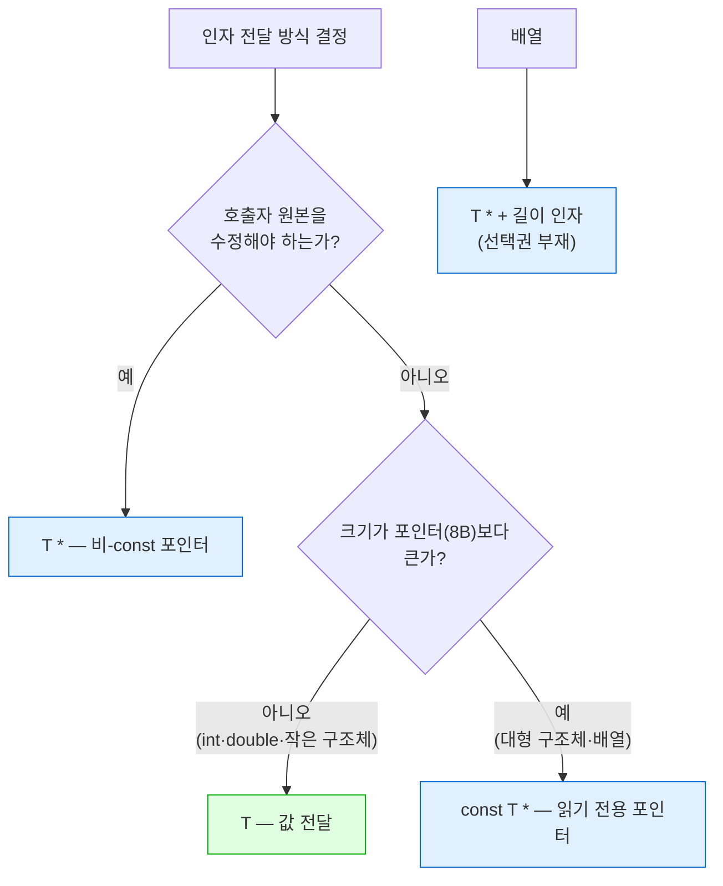

---
tags:
  - lang/c
  - c/syntax
  - function
  - parameter
  - pass-by-value
  - const
  - struct
  - status/verified
aliases:
  - 값 전달
  - 인자 전달 방식
  - const 포인터
created: 2026-08-19
updated: 2026-08-19
---

# 함수 인자 전달 — 값 vs 포인터

> C는 **예외 없이 값 전달**. 포인터 전달도 "주소라는 값"의 복사. 값 자체를 넘기는 경우가 오히려 기본

## 개념

C의 인자 전달 방식은 **단 하나** — 값 전달(pass by value). 참조 전달 문법 부재

| 넘기는 것 | 복사되는 것 | 호출자 원본 |
|---|---|---|
| `int n` | 정수 값 | 변경 불가 |
| `Rec r` | **구조체 전체** | 변경 불가 |
| `int *p` | **주소 값** | `*p`로 변경 가능 |
| `const Rec *r` | 주소 값 | 변경 불가(컴파일 차단) |

- "포인터 전달"도 값 전달 — 전달되는 값이 **주소**일 뿐
- 포인터를 쓰는 이유는 전달 방식이 달라서가 아니라, **주소를 알면 원본에 접근 가능**하기 때문
- 따라서 질문은 "포인터냐 값이냐"가 아니라 **"원본 접근이 필요한가 · 복사 비용이 큰가"**

## 스칼라는 값 전달이 기본

```c
static void by_value(int n) { n = 999; }
static void by_ptr(int *n)  { *n = 999; }

int a = 1, b = 1;
by_value(a);
by_ptr(&b);
```

```
1. 스칼라: by_value 후 a=1 / by_ptr 후 b=999
```

- `int`·`double`·`char`·포인터 등은 **값 전달이 정석**. 복사 비용이 포인터 크기 이하
- `int`(4B)를 `int *`(8B)로 넘기면 오히려 **손해** — 복사량 증가 + 역참조 비용 추가
- 컴파일러가 값 전달 매개변수 수정만 하면 경고

```
warning: parameter 'n' set but not used [-Wunused-but-set-parameter]
```

- 이 경고 등장 = "호출자에 반영될 것으로 착각했을 가능성" 신호

## 구조체도 값 전달 가능

Java와 갈리는 결정적 지점. C 구조체는 **통째로 복사**됨

```c
#include <stdio.h>
#include <string.h>

typedef struct { int id; char name[16]; double score; } Rec;   /* 32바이트 */

/* 구조체 값 전달 — 통째로 복사됨 */
static void rec_by_value(Rec r) {
    printf("   [함수 안] 받은 주소 %p, id=%d\n", (void *)&r, r.id);
    r.id = 999;                       /* 사본만 변경 */
    strcpy(r.name, "CHANGED");
}

/* const 포인터 — 복사 없이 읽기 전용 */
static double rec_by_cptr(const Rec *r) {
    return r->score;
}

/* 구조체 값 반환 */
static Rec make_rec(int id, const char *name, double score) {
    Rec r;
    r.id = id;
    strncpy(r.name, name, sizeof r.name - 1);
    r.name[sizeof r.name - 1] = '\0';
    r.score = score;
    return r;                          /* 값으로 반환 */
}

int main(void) {
    Rec r = { 7, "alice", 95.5 };
    printf("\n2. 구조체 값 전달 (sizeof=%zu)\n", sizeof(Rec));
    printf("   [호출 전] 원본 주소 %p, id=%d\n", (void *)&r, r.id);
    rec_by_value(r);
    printf("   [호출 후] 원본 id=%d, name=%s → 원본 불변\n", r.id, r.name);

    printf("\n3. const 포인터로 읽기: score=%.1f\n", rec_by_cptr(&r));

    Rec r2 = make_rec(9, "bob", 88.0);
    printf("4. 구조체 값 반환: id=%d name=%s score=%.1f\n", r2.id, r2.name, r2.score);
    return 0;
}
```

```bash
cc -Wall -Wextra basic.c -o basic && ./basic
```

- `-Wall` — 주요 경고 활성. 미사용 매개변수·타입 불일치 등 검출
- `-Wextra` — `-Wall` 미포함 추가 경고 활성
- `-o basic` — 출력 파일명을 `basic`으로 지정. 미지정 시 `a.out`
- `&& ./basic` — 컴파일 성공 시에만 실행

```
2. 구조체 값 전달 (sizeof=32)
   [호출 전] 원본 주소 0x16d296810, id=7
   [함수 안] 받은 주소 0x16d2967f0, id=7
   [호출 후] 원본 id=7, name=alice → 원본 불변

3. const 포인터로 읽기: score=95.5
4. 구조체 값 반환: id=9 name=bob score=88.0
```

- 원본 주소 `0x16d296810` vs 함수 안 `0x16d2967f0` — **주소 상이** → 32바이트 통째 복사 증거
- 함수 안에서 `id`·`name` 변경해도 **원본 불변**
- 구조체 **값 반환**도 가능 — Java에서 객체를 반환하면 참조가 가나, C는 값이 복사됨
- 작은 구조체(좌표·색상·날짜 등)는 값 전달이 오히려 명료. 소유권 문제 부재

## 복사 비용 — 크기가 커지면 역전

```c
#include <stdio.h>
#include <time.h>

typedef struct { char data[4096]; int sum; } Big;   /* 4KB+ */

static long by_value(Big b) { return b.sum; }
static long by_ptr(const Big *b) { return b->sum; }

int main(void) {
    Big big = {{0}, 42};
    const int N = 2000000;
    clock_t t0, t1;
    volatile long acc = 0;

    printf("sizeof(Big) = %zu 바이트\n", sizeof(Big));

    t0 = clock();
    for (int i = 0; i < N; i++) acc += by_value(big);
    t1 = clock();
    double v = (double)(t1 - t0) / CLOCKS_PER_SEC;

    t0 = clock();
    for (int i = 0; i < N; i++) acc += by_ptr(&big);
    t1 = clock();
    double p = (double)(t1 - t0) / CLOCKS_PER_SEC;

    printf("값 전달   %d회: %.3f초\n", N, v);
    printf("포인터    %d회: %.3f초\n", N, p);
    printf("배율: %.1f배\n", p > 0 ? v / p : 0.0);
    return 0;
}
```

```bash
cc -Wall -Wextra -O0 cost.c -o cost && ./cost
```

- `-Wall` — 주요 경고 활성. 미초기화 변수·타입 불일치 등 검출
- `-Wextra` — `-Wall` 미포함 추가 경고 활성
- `-O0` — 최적화 비활성. 복사 제거 최적화를 막아 실제 비용 관찰
- `-o cost` — 출력 파일명을 `cost`로 지정. 미지정 시 `a.out`
- `&& ./cost` — 컴파일 성공 시에만 실행

```
sizeof(Big) = 4100 바이트
값 전달   2000000회: 0.082초
포인터    2000000회: 0.001초
배율: 56.6배
```

- 4100바이트 복사 × 200만 회 → **56배 차이**
- 값 전달은 매 호출마다 스택에 전체 복사 → 크기에 비례한 비용
- 포인터는 크기 무관 8바이트 고정
- `-O0` 기준 측정. 최적화 시 컴파일러가 복사를 제거할 수 있으나 **의존 불가**

## `const T *` — 세 번째 선택지

읽기만 하면서 복사도 피하는 방법. **대형 읽기 전용 인자의 정석**

```c
static double rec_by_cptr(const Rec *r) {
    r->id = 1;          /* ← 컴파일 오류 */
    return r->score;
}
```

```
error: cannot assign to variable 'r' with const-qualified type 'const Rec *'
    2 | static void f(const Rec *r) { r->id = 1; }
      |                               ~~~~~ ^
note: variable 'r' declared const here
```

- 수정 시도가 **컴파일 시점에 차단** → 값 전달과 동등한 안전성
- 복사 비용은 포인터와 동일
- 함수 시그니처가 **의도를 문서화** — `const` 유무로 수정 여부 즉시 판별
- 표준 함수도 이 규약 준수 — `strlen(const char *)`, `strcmp(const char *, const char *)`

## 배열은 값 전달 불가

배열만은 선택권 부재. 인자로 쓰면 **자동으로 포인터로 감쇠**

```c
#include <stdio.h>

typedef struct { int v[4]; } Wrap;      /* 배열을 구조체로 감싸면 복사 가능 */

static void take_arr(int a[4]) {        /* 실제로는 int * */
    printf("   함수 안 sizeof(a) = %zu (포인터 크기)\n", sizeof(a));
    a[0] = 999;                          /* 원본 수정됨 */
}
static void take_wrap(Wrap w) {
    printf("   함수 안 sizeof(w) = %zu (구조체 통째 복사)\n", sizeof(w));
    w.v[0] = 999;                        /* 사본만 수정 */
}

int main(void) {
    int  a[4] = {1,2,3,4};
    Wrap w    = {{1,2,3,4}};

    printf("배열 직접 전달 (호출부 sizeof(a) = %zu)\n", sizeof(a));
    take_arr(a);
    printf("   호출 후 a[0] = %d → 원본 변경됨\n\n", a[0]);

    printf("구조체로 감싸 전달 (호출부 sizeof(w) = %zu)\n", sizeof(w));
    take_wrap(w);
    printf("   호출 후 w.v[0] = %d → 원본 불변\n", w.v[0]);
    return 0;
}
```

```bash
cc -Wall -Wextra arr.c -o arr && ./arr
```

- `-Wall` — 주요 경고 활성. **배열 매개변수 `sizeof` 오용 검출에 필요**
- `-Wextra` — `-Wall` 미포함 추가 경고 활성
- `-o arr` — 출력 파일명을 `arr`로 지정. 미지정 시 `a.out`
- `&& ./arr` — 컴파일 성공 시에만 실행

```
warning: sizeof on array function parameter will return size of 'int *' instead of 'int[4]' [-Wsizeof-array-argument]
```

```
배열 직접 전달 (호출부 sizeof(a) = 16)
   함수 안 sizeof(a) = 8 (포인터 크기)
   호출 후 a[0] = 999 → 원본 변경됨

구조체로 감싸 전달 (호출부 sizeof(w) = 16)
   함수 안 sizeof(w) = 16 (구조체 통째 복사)
   호출 후 w.v[0] = 1 → 원본 불변
```

- `int a[4]` 매개변수 표기는 **`int *`와 완전 동등**. 크기 `4`는 문서 효과뿐, 컴파일러 미검사
- 호출부 `sizeof` 16 → 함수 안 8 → 길이 정보 상실. **길이를 별도 인자로 전달** 필수
- 원본이 변경됨 — 값 전달처럼 보이나 실제로는 주소 전달
- 배열을 **값으로 넘기고 싶으면 구조체로 감싸기** — 유일한 방법
- 상세 → [[C/docs/08-syntax/sizeof-and-array-subscript|sizeof 연산자와 배열 첨자]]

## 판단 기준



| 상황 | 권장 | 근거 |
|---|---|---|
| 정수·실수·문자 | `int n` | 복사 비용이 포인터 이하 |
| 작은 구조체(≤ 16~32B) | `Rec r` | 명료성 우선. 소유권 문제 부재 |
| 대형 구조체 읽기만 | `const Rec *r` | 복사 회피 + 수정 차단 |
| 원본 수정 필요 | `Rec *r` | 값 전달로는 불가능 |
| 포인터 자체 변경 | `Rec **r` | [[C/docs/08-syntax/double-pointer\|이중 포인터]] |
| 배열 | `Rec *r, size_t n` | 감쇠로 선택권 부재 |
| 문자열 읽기만 | `const char *s` | 표준 라이브러리 관례 |

- 경계값(16~32바이트)은 절대 기준 부재 — 플랫폼·호출 규약 종속. **측정 후 판단**
- 소형 구조체 값 전달은 레지스터로 전달될 수 있어 포인터보다 빠른 경우도 존재

## Java와의 차이

| 항목 | Java | C |
|---|---|---|
| 전달 방식 | 값 전달(참조도 값으로 복사) | 값 전달 — **동일** |
| 객체 전달 | **참조만 복사**. 원본 공유 | 구조체는 **전체 복사** |
| 객체 수정 반영 | 필드 수정은 반영 | 값 전달 시 **미반영** |
| 참조 재대입 반영 | 미반영 | 미반영 (이중 포인터로 우회) |
| 읽기 전용 표현 | 관례·불변 클래스 | **`const` 한정자**로 컴파일 강제 |
| 배열 전달 | 참조 복사. `length` 보존 | 포인터 감쇠. **길이 상실** |
| 큰 객체 비용 | 참조라 항상 저렴 | 값 전달 시 크기 비례 비용 |

- Java 감각으로 구조체를 넘기면 **원본이 안 바뀌어 당황**하는 지점 — Java 객체는 참조가 복사되지만 C 구조체는 실체가 복사됨
- Java에 `const` 대응 부재 → C는 시그니처만으로 수정 여부 보증 가능
- `make-shell`의 `tokenize(char *line, size_t *out_count)` — 각각 원본 수정·결과 반환 목적의 포인터

## 함정 · 주의점

- 값 전달 매개변수를 수정하고 호출자 반영 기대 → 미반영. `-Wunused-but-set-parameter` 경고 확인
- 대형 구조체를 값으로 전달 → 호출마다 전체 복사. `const T *`로 전환
- `const` 누락 → 의도치 않은 수정이 컴파일 통과. 읽기 전용 인자에 **항상 `const` 부착**
- `const T *`와 `T * const` 혼동 — 전자는 **대상 불변**, 후자는 **포인터 자체 불변**
  ```c
  const Rec *a;    /* a->id 수정 불가, a = 다른주소 가능 */
  Rec * const b;   /* b->id 수정 가능, b = 다른주소 불가 */
  ```
- 배열 매개변수에 `sizeof` 사용 → 포인터 크기 반환. `-Wsizeof-array-argument` 경고
- `int a[4]` 표기를 크기 검사로 오해 → 컴파일러 미검사. 호출자가 `int[2]` 전달해도 통과
- 지역 구조체 주소 반환 → 스택 소멸. 값 반환은 안전, 포인터 반환은 위험 → [[C/docs/08-syntax/pointer-types|포인터 자료형]]
- 구조체 값 전달 시 내부 포인터 멤버는 **얕은 복사** — 두 사본이 같은 힙 블록 지시. 이중 `free` 위험

## 검증

- [x] 스칼라 값 전달 시 호출자 불변·포인터 전달 시 변경 확인
- [x] 구조체 값 전달 시 주소 상이(복사)·원본 불변 확인
- [x] 4100바이트 구조체 값 전달이 포인터 대비 56.6배 소요 확인
- [x] `const T *` 수정 시도 컴파일 오류 원문 확인
- [x] 배열 매개변수 `sizeof`가 8 반환·원본 변경 확인
- [x] 구조체 래핑 시 값 전달 성립 확인
- [ ] 소형 구조체의 레지스터 전달 여부 — 어셈블리 확인 미실시

## 관련 문서

- [[C/docs/08-syntax/double-pointer|이중 포인터]] — 포인터 자체를 바꿔야 할 때의 전달 방식
- [[C/docs/08-syntax/pointer-types|포인터 자료형]] — 포인터 크기와 역참조 규칙
- [[C/docs/08-syntax/sizeof-and-array-subscript|sizeof 연산자와 배열 첨자]] — 배열 감쇠 상세
- [[C/docs/02-memory/heap-and-free|free의 실제 동작]] — 얕은 복사와 소유권 문제
- [[C/docs/07-stdlib/02-string|문자열 처리]] — `const char *` 규약 사용 예
- [[C/docs/README|학습 문서 인덱스]] — 카테고리별 전체 문서 목록
