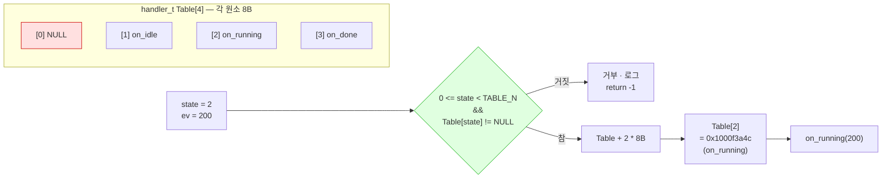

---
tags:
  - lang/c
  - c/syntax
  - function-pointer
  - dispatch-table
  - state-machine
  - enum
  - status/verified
aliases:
  - 디스패치 테이블
  - 함수 포인터 배열
  - jump table
created: 2026-08-24
updated: 2026-08-24
---

# 함수 포인터 테이블 — 디스패치와 인덱스 안전성

> `switch` 대신 배열 첨자로 핸들러를 고르는 관용구. 상태 추가가 배열 원소 추가로 끝나는 대신, **인덱스 검증 부재 시 임의 주소 호출**로 직결

## 개념

- 상태·명령·메시지 종류마다 처리 함수가 다른 경우, `switch` 분기를 배열 조회로 대체
- `Table[state](args)` 한 줄로 디스패치 → 상태 추가 시 배열 원소만 추가
- 대가 — 인덱스가 범위를 벗어나면 컴파일러도 런타임도 막지 않음. **함수 포인터로 해석된 쓰레기 값을 호출**

## Java와의 차이

| 항목 | Java | C |
|---|---|---|
| 다형 디스패치 | 인터페이스 + vtable. JVM이 관리 | 함수 포인터 배열. 개발자가 관리 |
| 배열 범위 검사 | `ArrayIndexOutOfBoundsException` | **부재**. 임의 주소 읽기 |
| null 호출 | `NullPointerException` | **SIGSEGV** 또는 정의되지 않은 동작 |
| 테이블 크기 불일치 | 컴파일 시점 타입 검사 | 초기화 부족분은 조용히 `NULL` |

Java의 `switch` → 인터페이스 리팩터링이 안전한 이유는 런타임 검사 덕분. C는 그 검사를 직접 써야 함.

## 코드

```c
#include <stdio.h>

typedef enum { ST_IDLE = 1, ST_RUNNING = 2, ST_DONE = 3 } state_t;
typedef void (*handler_t)(int);

static void on_idle(int ev)    { printf("IDLE 처리: ev=%d\n", ev); }
static void on_running(int ev) { printf("RUNNING 처리: ev=%d\n", ev); }
static void on_done(int ev)    { printf("DONE 처리: ev=%d\n", ev); }

/* 인덱스 0은 유효 상태가 아니므로 NULL */
static handler_t Table[] = { NULL, on_idle, on_running, on_done };
#define TABLE_N ((int)(sizeof(Table) / sizeof(Table[0])))

/* 안전한 디스패치 — 범위 + NULL 이중 검사 */
static int dispatch(int state, int ev) {
    if (state < 0 || state >= TABLE_N || Table[state] == NULL) {
        printf("잘못된 상태 거부: state=%d\n", state);
        return -1;
    }
    Table[state](ev);
    return 0;
}

int main(void) {
    printf("TABLE_N = %d\n", TABLE_N);
    dispatch(ST_IDLE, 100);
    dispatch(ST_RUNNING, 200);
    dispatch(0, 300);      // NULL 슬롯
    dispatch(99, 400);     // 범위 밖
    return 0;
}
```

`enum` 값이 `1`부터 시작 → 인덱스 `0` 은 의도적으로 `NULL`. **enum 시작값과 배열 인덱스를 맞추는 것이 관용구의 전제**.

## 컴파일 · 실행

```bash
cc -Wall -Wextra -g dispatch.c -o dispatch && ./dispatch
```

- `-Wall` — 주요 경고 활성
- `-Wextra` — 추가 경고 활성
- `-g` — 디버그 심볼 포함
- `-o dispatch` — 출력 파일명 지정

```
TABLE_N = 4
IDLE 처리: ev=100
RUNNING 처리: ev=200
잘못된 상태 거부: state=0
잘못된 상태 거부: state=99
```

## 디스패치 구조



## 검사를 생략했을 때

```c
Table[state](ev);        // ← 범위·NULL 검사 없음
```

| `state` 값 | 결과 |
|---|---|
| `0` | `NULL()` 호출 → **SIGSEGV** |
| `4` ~ `TABLE_N` 초과 | 배열 범위 밖 메모리를 함수 포인터로 해석 → **임의 주소 호출** |
| 초기화 부족분 | C는 나머지 원소를 `NULL` 로 채움 → SIGSEGV |

특히 `state` 가 **외부에서 온 값**(IPC 페이로드, 공유메모리, 파일)이면 신뢰 불가. 범위 밖 호출은 단순 크래시를 넘어 제어 흐름 탈취로 이어질 수 있음.

## 배열 크기 상수 선택

```c
typedef enum { FN_MAIN = 0, FN_PROC, FN_SEND, NUM_OF_FUNC } funcNo_t;   /* 파일 식별용 */
typedef enum { ST_IDLE = 1, ST_RUNNING, ST_DONE } state_t;              /* 상태 */

static handler_t Table[NUM_OF_FUNC] = { ... };   /* ← 무관한 상수. 우연히 동작 */
static handler_t Table[ST_DONE + 1] = { ... };   /* ← 의미가 맞는 크기 */
```

- 배열 크기는 **인덱싱에 쓰는 enum**에서 유도. 다른 enum 상수를 쓰면 두 enum이 각자 늘어날 때 조용히 어긋남
- `enum` 이 `0` 부터 시작하면 `NUM_OF_*` 센티널 관용구가 자연스러움
- `1` 부터 시작하면 `MAX_VALUE + 1` 사용 + 인덱스 `0` 은 `NULL` 로 명시

## 지정 초기화자로 순서 의존 제거 (C99)

```c
static handler_t Table[ST_DONE + 1] = {
    [ST_IDLE]    = on_idle,
    [ST_RUNNING] = on_running,
    [ST_DONE]    = on_done,
};
```

- 나열 순서와 무관하게 enum 값 위치에 배치 → **enum 값 변경 시 자동 추종**
- 누락된 인덱스는 `NULL` 로 자동 초기화 → 검사 로직이 그대로 잡아냄
- 순차 나열 방식은 원소 하나만 빠져도 이후 전체가 한 칸씩 밀림 → 지정 초기화자 권장

## 함정 · 주의점

- **인덱스 범위·NULL 검사 생략** → 외부 입력이 인덱스가 되는 순간 임의 주소 호출. 가장 흔하고 가장 위험
- **enum 시작값과 배열 인덱스 불일치** → `ST_IDLE = 1` 인데 `Table[0] = on_idle` 로 채우면 전체가 한 칸 밀림
- **배열 크기를 무관한 enum 상수로 지정** → 두 enum이 독립적으로 변경될 때 조용히 어긋남
- **`unsigned char` 상태 필드** → 값 범위 `0~255`. `state > MAX` 검사를 빠뜨리면 배열 밖 접근
- **함수 시그니처 불일치를 캐스팅으로 우회** → `(handler_t)some_other_fn` 은 컴파일은 통과하나 호출 규약 불일치로 스택 손상
- **테이블을 `static` 없이 선언** → 다른 번역 단위와 심볼 충돌 가능. 파일 지역이면 `static` 명시

## 언제 `switch` 를 쓰는가

| 상황 | 선택 |
|---|---|
| 분기 수 적음(3~5), 인덱스가 비연속 | `switch` — 컴파일러가 최적화 |
| 분기 수 많음, 인덱스가 연속 정수 | 테이블 — 코드 길이 일정 |
| 상태가 런타임에 바뀜(플러그인) | 테이블 — 원소 재대입 가능 |
| 각 분기가 짧고 공통 로직 많음 | `switch` — 함수 분리 오버헤드 회피 |
| 상태 추가가 잦음 | 테이블 — 추가 지점이 한 곳 |

`switch` 는 처리 못 하는 값이 `default` 로 안전하게 떨어짐. 테이블은 그 안전망을 직접 만들어야 함 — 이것이 유일하면서 가장 큰 비용.

## 검증

- [x] `Table[state](ev)` 형태로 정상 디스패치 동작 확인
- [x] `sizeof(Table) / sizeof(Table[0])` 로 원소 수 4 산출 확인
- [x] 인덱스 `0`(NULL 슬롯) 거부 확인
- [x] 인덱스 `99`(범위 밖) 거부 확인
- [x] `-Wall -Wextra` 경고 0건 — 컴파일러가 인덱스 위험을 탐지하지 않음을 확인

## 관련 문서

- [[C/docs/08-syntax/pointer-types|포인터 자료형]] — 함수 포인터와 객체 포인터의 구분
- [[C/docs/08-syntax/sizeof-and-array-subscript|sizeof 연산자와 배열 첨자]] — `sizeof(arr)/sizeof(arr[0])` 원소 수 계산
- [[C/docs/08-syntax/static-keyword|static 키워드]] — 파일 지역 테이블·핸들러 선언
- [[C/docs/07-stdlib/03-stdlib|메모리 · 변환 · 유틸리티]] — `qsort` 비교 함수로서의 함수 포인터
- [[C/docs/08-syntax/preprocessor-macro|전처리기 매크로]] — `TABLE_N` 같은 크기 계산 매크로
