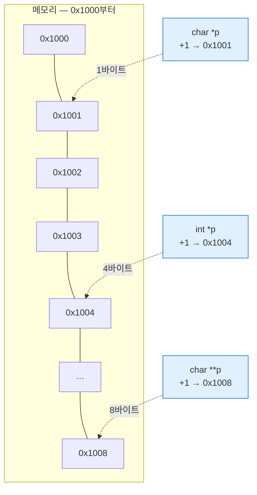

---
tags:
  - lang/c
  - c/syntax
  - pointer
  - pointer-arithmetic
  - void-pointer
  - type-casting
  - status/verified
aliases:
  - 포인터 자료형
  - void 포인터
  - 포인터 보폭
created: 2026-08-18
updated: 2026-08-18
---

# 포인터 자료형 — `char *` vs `int *`

> 포인터 크기는 **전부 8바이트로 동일**. 자료형이 정하는 것은 **읽을 바이트 수**와 **`+1` 보폭**

## 개념

포인터가 담는 것 — 주소 하나. 주소는 그냥 숫자이므로 타입이 달라도 **크기 동일**

그렇다면 `char *`·`int *`를 구분하는 이유 — 주소에 도착한 뒤의 **행동 규칙** 2가지를 지정하기 위함

| 역할 | 내용 |
|---|---|
| ① 역참조 폭 | `*p` 수행 시 **몇 바이트를 묶어 읽고 어떻게 해석**할지 |
| ② 산술 보폭 | `p + 1` 수행 시 **몇 바이트 전진**할지 |

포인터 = `주소` + `해석 규칙`. 주소는 값에 담기고, 해석 규칙은 **타입에 담김**

## 크기는 전부 동일

```c
#include <stdio.h>

typedef struct { int a; double b; } Rec;   /* 16바이트 */

int main(void) {
    printf("=== 포인터 자체의 크기 — 전부 동일 ===\n");
    printf("sizeof(char *)   = %zu\n", sizeof(char *));
    printf("sizeof(int *)    = %zu\n", sizeof(int *));
    printf("sizeof(double *) = %zu\n", sizeof(double *));
    printf("sizeof(char **)  = %zu\n", sizeof(char **));
    printf("sizeof(Rec *)    = %zu\n", sizeof(Rec *));
    printf("sizeof(void *)   = %zu\n", sizeof(void *));

    printf("\n=== 가리키는 대상의 크기 — 전부 상이 ===\n");
    printf("sizeof(char)  = %zu\n", sizeof(char));
    printf("sizeof(int)   = %zu\n", sizeof(int));
    printf("sizeof(char*) = %zu  (char** 가 가리키는 대상)\n", sizeof(char *));
    printf("sizeof(Rec)   = %zu\n", sizeof(Rec));

    printf("\n=== +1 의 보폭 — 대상 크기만큼 점프 ===\n");
    char   *pc = (char *)0x1000;
    int    *pi = (int *)0x1000;
    double *pd = (double *)0x1000;
    char  **pp = (char **)0x1000;
    Rec    *pr = (Rec *)0x1000;

    printf("char   *p: %p → +1 = %p  (+%td)\n", (void*)pc, (void*)(pc+1), (char*)(pc+1)-(char*)pc);
    printf("int    *p: %p → +1 = %p  (+%td)\n", (void*)pi, (void*)(pi+1), (char*)(pi+1)-(char*)pi);
    printf("double *p: %p → +1 = %p  (+%td)\n", (void*)pd, (void*)(pd+1), (char*)(pd+1)-(char*)pd);
    printf("char  **p: %p → +1 = %p  (+%td)\n", (void*)pp, (void*)(pp+1), (char*)(pp+1)-(char*)pp);
    printf("Rec    *p: %p → +1 = %p  (+%td)\n", (void*)pr, (void*)(pr+1), (char*)(pr+1)-(char*)pr);
    return 0;
}
```

```bash
cc -Wall -Wextra stride.c -o stride && ./stride
```

- `-Wall` — 주요 경고 활성. 미초기화 변수·타입 불일치 등 검출
- `-Wextra` — `-Wall` 미포함 추가 경고 활성
- `-o stride` — 출력 파일명을 `stride`로 지정. 미지정 시 `a.out`
- `&& ./stride` — 컴파일 성공 시에만 실행

```
=== 포인터 자체의 크기 — 전부 동일 ===
sizeof(char *)   = 8
sizeof(int *)    = 8
sizeof(double *) = 8
sizeof(char **)  = 8
sizeof(Rec *)    = 8
sizeof(void *)   = 8

=== 가리키는 대상의 크기 — 전부 상이 ===
sizeof(char)  = 1
sizeof(int)   = 4
sizeof(char*) = 8  (char** 가 가리키는 대상)
sizeof(Rec)   = 16

=== +1 의 보폭 — 대상 크기만큼 점프 ===
char   *p: 0x1000 → +1 = 0x1001  (+1)
int    *p: 0x1000 → +1 = 0x1004  (+4)
double *p: 0x1000 → +1 = 0x1008  (+8)
char  **p: 0x1000 → +1 = 0x1008  (+8)
Rec    *p: 0x1000 → +1 = 0x1010  (+16)
```

| 타입 | 포인터 크기 | 대상 크기 | `+1` 보폭 |
|---|---|---|---|
| `char *` | 8 | 1 | **+1** |
| `int *` | 8 | 4 | **+4** |
| `double *` | 8 | 8 | **+8** |
| `char **` | 8 | 8 (`char *`) | **+8** |
| `Rec *` | 8 | 16 | **+16** |

- 왼쪽 열(포인터 크기) 전부 8 — 64비트 주소를 담는 바구니라 동일
- 오른쪽 열(보폭) 전부 상이 — **가리키는 대상 크기 = 보폭**
- `char **`의 보폭이 8인 근거 — 가리키는 대상이 `char *`(8바이트)이기 때문. `char`(1)이 아님
- `arr[i]` = `*(arr + i)` → 첨자 접근이 정확한 위치를 짚는 것도 이 보폭 규칙 덕분



같은 `0x1000`에서 출발해도 `+1`의 도착지가 타입마다 상이

## `void *` — 해석 규칙이 빠진 포인터

`void *` — 주소는 담되 **타입 정보 부재**. 어떤 포인터든 받을 수 있는 대신, 그대로는 사용 불가

```c
#include <stdio.h>
int main(void) {
    int a = 10;
    void *p = &a;
    printf("%d\n", *p);      /* 역참조 시도 */
    p = p + 1;               /* 산술 시도 */
    return 0;
}
```

```bash
cc -Wall -Wextra -pedantic voidp.c -o voidp
```

- `-Wall` — 주요 경고 활성. 미초기화 변수·타입 불일치 등 검출
- `-Wextra` — `-Wall` 미포함 추가 경고 활성
- `-pedantic` — ISO C 표준 위반을 경고. GNU 확장 사용 지점 노출 목적
- `-o voidp` — 출력 파일명을 `voidp`로 지정. 미지정 시 `a.out`

```
voidp.c:5:20: warning: ISO C does not allow indirection on operand of type 'void *' [-Wvoid-ptr-dereference]
voidp.c:5:20: error: argument type 'void' is incomplete
voidp.c:6:11: warning: arithmetic on a pointer to void is a GNU extension [-Wgnu-pointer-arith]
2 warnings and 1 error generated.
```

- 역참조 → **컴파일 오류**. 읽을 바이트 수를 알 수 없음
- 산술 → clang은 GNU 확장으로 허용하나 **ISO C 위반**. `-pedantic`으로 노출
- 결론 — `void *`는 **운반 전용**. 사용 시점에 캐스팅으로 해석 규칙 부여 필요

### 정상 사용법

```c
#include <stdio.h>
#include <stdlib.h>
#include <string.h>

/* void* 로 임의 타입을 받아 크기만큼 복사 — memcpy 원리 */
static void swap_any(void *a, void *b, size_t sz) {
    unsigned char tmp[64];
    memcpy(tmp, a, sz);
    memcpy(a, b, sz);
    memcpy(b, tmp, sz);
}

static int cmp_int(const void *a, const void *b) {
    int x = *(const int *)a;          /* 캐스팅 후 역참조 */
    int y = *(const int *)b;
    return (x > y) - (x < y);
}

int main(void) {
    int a = 10;
    void *p = &a;
    printf("void* 로 받은 뒤 캐스팅: %d\n", *(int *)p);

    int x = 1, y = 2;
    swap_any(&x, &y, sizeof x);
    printf("swap_any(int): x=%d y=%d\n", x, y);

    char c1 = 'A', c2 = 'B';
    swap_any(&c1, &c2, sizeof c1);
    printf("swap_any(char): c1=%c c2=%c\n", c1, c2);

    int arr[] = {5, 2, 9, 1};
    qsort(arr, 4, sizeof *arr, cmp_int);   /* qsort도 void* 기반 */
    printf("qsort: ");
    for (int i = 0; i < 4; i++) printf("%d ", arr[i]);
    putchar('\n');
    return 0;
}
```

```bash
cc -Wall -Wextra voidok.c -o voidok && ./voidok
```

- `-Wall` — 주요 경고 활성. 미초기화 변수·타입 불일치 등 검출
- `-Wextra` — `-Wall` 미포함 추가 경고 활성
- `-o voidok` — 출력 파일명을 `voidok`로 지정. 미지정 시 `a.out`
- `&& ./voidok` — 컴파일 성공 시에만 실행

```
void* 로 받은 뒤 캐스팅: 10
swap_any(int): x=2 y=1
swap_any(char): c1=B c2=A
qsort: 1 2 5 9
```

- `*(int *)p` — 캐스팅으로 해석 규칙 부여 후 역참조. **괄호 위치 주의**
- `swap_any` — 타입 대신 **크기(`sz`)를 인자로 받아** 임의 타입 처리. C의 제네릭 대체 수단
- 표준 함수가 이 방식을 사용하는 예 — `malloc`(반환 `void *`), `qsort`·`bsearch`(비교 함수 `const void *`), `memcpy`·`memset`

| 함수 | `void *` 사용 지점 | 크기 정보 출처 |
|---|---|---|
| `malloc` | 반환값 | 인자 `size_t n` |
| `qsort` | `base`·비교 함수 인자 | 인자 `size_t sz` |
| `memcpy` | `dest`·`src` | 인자 `size_t n` |

- 공통 구조 — **타입을 지우고 크기를 인자로 받음**
- `malloc` 반환값은 C에서 **캐스팅 불필요** (`void *` → 임의 객체 포인터 자동 변환). C++는 필요
- `void **`는 `void *`와 달리 **자동 변환 부재** → 임의 이중 포인터 수용 불가

## 함정 1 — 배열과 포인터는 다른 타입

비슷하게 동작하나 **실체가 상이**. 배열은 메모리 그 자체, 포인터는 주소를 담은 별도 변수

```c
char arr[100];
char *p = arr;                /* 배열 → 포인터 감쇠 */

sizeof(arr)   /* 100 — 배열 전체 크기 */
sizeof(p)     /* 8   — 포인터 변수 크기 */
```

- 함수 매개변수의 `char arr[]`는 컴파일러가 `char *`로 **변환**. 배열 전체 복사 부재
- 결과 — 함수 안에서 `sizeof`로 원래 길이 조회 불가 → **길이를 별도 인자로 전달** 필수
- 상세 → [[C/docs/08-syntax/sizeof-and-array-subscript|sizeof 연산자와 배열 첨자]]

2차원 배열과 이중 포인터도 **별개 타입**

```c
char grid[3][10];
char **pp = grid;             /* ← 컴파일 오류. 메모리 배치 상이 */
```

- `char [3][10]` — 30바이트 연속 블록
- `char **` — 포인터 배열 경유 2단계 참조
- 상세 → [[C/docs/08-syntax/double-pointer|이중 포인터]]

## 함정 2 — 읽기 전용 문자열 수정

```c
#include <stdio.h>
int main(void) {
    char  arr[] = "Hello";      /* 스택에 복사 — 쓰기 가능 */
    char *str   = "Hello";      /* 읽기 전용 영역 지시 */
    printf("arr 주소 %p / str 주소 %p\n", (void*)arr, (void*)str);
    arr[0] = 'h';
    printf("arr 수정 성공: %s\n", arr);
    fflush(stdout);
    str[0] = 'h';               /* 크래시 지점 */
    printf("str 수정 성공: %s\n", str);
    return 0;
}
```

```bash
cc -Wall -Wextra readonly.c -o readonly
./readonly; echo "종료코드=$?"
```

- `-Wall` — 주요 경고 활성. 미초기화 변수·타입 불일치 등 검출
- `-Wextra` — `-Wall` 미포함 추가 경고 활성
- `-o readonly` — 출력 파일명을 `readonly`로 지정. 미지정 시 `a.out`
- `echo "종료코드=$?"` — 직전 명령의 종료 코드 출력. 시그널 종료 여부 판별

```
arr 주소 0x16f95e7f4 / str 주소 0x1004a0540
arr 수정 성공: hello
종료코드=138
```

- `arr` 주소 `0x16f9…`(스택) vs `str` 주소 `0x1004…`(읽기 전용) — **자릿수부터 상이**
- `arr[0] = 'h'` 성공, `str[0] = 'h'`에서 **종료 코드 138**(= 128 + 10, `SIGBUS`)
- **컴파일 경고 0건** — `-Wall -Wextra`로도 미검출. 실행 시점에 발현
- `fflush(stdout)` 배치 이유 — 크래시로 버퍼 유실 방지. 미배치 시 앞 출력도 소실 → [[C/docs/07-stdlib/06-stdio-buffering|버퍼링 문서]]
- 수정 필요 시 — `char arr[] = "..."`(배열 복사) 또는 `malloc` + `strcpy`
- 방어 습관 — 수정하지 않을 문자열은 `const char *`로 선언. 쓰기 시도가 **컴파일 오류**로 전환

## 함정 3 — 지역 변수 주소 반환

```c
#include <stdio.h>

static char *bad_local(void) {
    char msg[16] = "Hi";
    return msg;                  /* 스택 주소 반환 — UB */
}
static char *ok_literal(void) {
    return "Hi";                 /* 읽기 전용 영역 — 유효 */
}

int main(void) {
    char *p = bad_local();
    printf("반환된 주소 %p\n", (void*)p);
    printf("바로 출력: [%s]\n", p);
    printf("printf 호출 후 재출력: [%s]\n", p);
    printf("리터럴 반환: [%s]\n", ok_literal());
    return 0;
}
```

```bash
cc -Wall -Wextra dangle.c -o dangle && ./dangle
```

- `-Wall` — 주요 경고 활성. **스택 주소 반환 검출에 필요**
- `-Wextra` — `-Wall` 미포함 추가 경고 활성
- `-o dangle` — 출력 파일명을 `dangle`로 지정. 미지정 시 `a.out`
- `&& ./dangle` — 컴파일 성공 시에만 실행

```
dangle.c:5:12: warning: address of stack memory associated with local variable 'msg' returned [-Wreturn-stack-address]
    5 |     return msg;                  /* 스택 주소 반환 — UB */
      |            ^~~
1 warning generated.
```

```
반환된 주소 0x16b18a7b0
바로 출력: [Чk]
printf 호출 후 재출력: [Чk]
리터럴 반환: [Hi]
```

- 출력 `[Чk]` — `"Hi"` 소멸. 함수 종료로 스택 프레임 회수 후 **다른 호출이 재사용**
- `-Wall`이 `-Wreturn-stack-address`로 **경고 제공** → 경고 0건 유지 시 예방 가능
- 문자열 리터럴 반환은 **유효** — 읽기 전용 영역은 프로그램 전체 생존
- 해결 — `malloc` 반환(호출자가 `free`) 또는 호출자 버퍼를 인자로 받기
- `make-shell`의 `read_line`이 `malloc` 반환 방식 채택 → 소유권이 호출자에게 이전

## 함정 4 — 범위 초과 접근

C는 경계 검사 부재. `malloc(5 * sizeof(int))`에 `p[5]` 접근이 **조용히 통과**

- 진단 수단 — `-fsanitize=address` 상시 사용
- 상세 → [[C/docs/02-memory/heap-and-free|free의 실제 동작]]

## 참고 — 주소를 직접 대입

```c
char *p = (char *)0x123456;    /* 숫자를 주소로 강제 해석 */
```

| 환경 | 결과 |
|---|---|
| 일반 PC (macOS·Linux·Windows) | 접근 시 `SIGSEGV`. OS가 미매핑 주소 차단 |
| MMU 부재 임베디드 (마이크로컨트롤러) | **정상 기법**. 특정 주소가 하드웨어 레지스터와 직결 |

- 문자열 `"0x123456"`(따옴표)은 **주소가 아니라 글자 8개**. 전혀 다른 의미 → [[C/docs/08-syntax/character-literal|문자 리터럴 문서]]
- 위 실험의 `(char *)0x1000`도 **산술만 수행**하고 역참조 미수행 → 크래시 부재

### 일반 PC 주소는 가상 주소

`printf("%p")`로 보이는 값은 **물리 RAM 위치가 아님**. OS가 프로세스별로 부여한 가상 주소

- MMU가 페이지 테이블 참조해 가상 주소 → 물리 주소 변환
- 프로세스마다 독립 주소 공간 → 같은 주소 값이 서로 다른 물리 위치 지시
- 미매핑 주소 접근 시 OS가 차단 → `SIGSEGV`의 실체
- 실행마다 주소가 달라지는 이유 — ASLR(주소 공간 배치 무작위화)
- 임베디드(MMU 부재)에서는 포인터 값 = 물리 주소 → 하드웨어 직접 제어 가능

## Java와의 차이

| 항목 | Java | C |
|---|---|---|
| 참조 타입의 역할 | 대상 클래스 지정 | **읽을 바이트 수 + 산술 보폭** 지정 |
| 참조 산술 | **불가** | `p + 1`이 타입 크기만큼 전진 |
| 타입 소거 | 제네릭(컴파일 시점) | `void *` + 크기 인자 |
| 캐스팅 검사 | 런타임 검사 → `ClassCastException` | **검사 부재**. 잘못된 캐스팅도 통과 |
| 배열 경계 | 런타임 검사 → 예외 | **검사 부재**. ASan 등 도구 필요 |
| 문자열 수정 | `String` 불변, `StringBuilder` 사용 | 리터럴 수정 시 `SIGBUS`/`SIGSEGV` |
| 주소 노출 | 부재 | `%p`로 가상 주소 확인 가능 |

- Java 제네릭은 컴파일러가 타입 안전을 보증. C의 `void *`는 **개발자가 크기를 정확히 넘겨야** 성립
- Java의 `ClassCastException`에 대응하는 안전망이 C에 부재 → 캐스팅이 곧 책임

## 함정 · 주의점

- `sizeof(char)`와 `sizeof(char *)` 혼동 → 할당량 8배 부족. 상세 → [[C/docs/08-syntax/double-pointer|이중 포인터]]
- `void *` 역참조·산술 → 컴파일 오류 또는 비표준. 캐스팅 후 사용
- `*(int *)p`를 `*(int)*p` 등으로 오기 → 전혀 다른 해석. 캐스팅 괄호 확인
- 포인터 산술 결과를 바이트 단위로 기대 → 타입 보폭만큼 곱해짐. 바이트 단위 이동은 `char *`로 캐스팅
  ```c
  (char *)p + 3      /* 3바이트 전진 */
  (int *)p + 3       /* 12바이트 전진 */
  ```
- 서로 다른 타입 포인터 간 캐스팅 후 역참조 → 정렬 위반·오해석 위험
- 함수 포인터와 객체 포인터 간 캐스팅 → 표준 미보장. POSIX에서만 `dlsym` 목적 허용
- `char`의 부호 여부가 구현 종속 → 바이트 값 비교 시 `unsigned char *` 사용
- 배열을 함수에 넘기고 `sizeof` 사용 → 포인터 크기 반환. 길이 별도 전달
- 문자열 리터럴을 `char *`로 받아 수정 → 크래시. `const char *` 선언으로 컴파일 시점 차단

## 검증

- [x] 포인터 6종 크기 전부 8바이트 확인
- [x] `char *`·`int *`·`double *`·`char **`·`Rec *` 보폭 1·4·8·8·16 확인
- [x] `void *` 역참조 컴파일 오류·산술 GNU 확장 경고 확인
- [x] `void *` 캐스팅 후 정상 사용 및 `qsort` 동작 확인
- [x] 읽기 전용 문자열 수정 시 종료 코드 138(`SIGBUS`) 확인
- [x] 스택 주소 반환 시 `-Wreturn-stack-address` 경고·쓰레기 값 확인
- [ ] MMU 부재 임베디드 환경의 직접 주소 접근 — 장비 부재로 미검증

## 관련 문서

- [[C/docs/08-syntax/double-pointer|이중 포인터]] — `char **`가 필요한 이유와 `sizeof(char *)` 할당 공식
- [[C/docs/08-syntax/function-parameters|함수 인자 전달]] — 값·포인터·`const` 포인터 선택 기준과 복사 비용
- [[C/docs/08-syntax/sizeof-and-array-subscript|sizeof 연산자와 배열 첨자]] — 배열 감쇠와 첨자·산술 등가 관계
- [[C/docs/08-syntax/character-literal|문자 리터럴과 문자열 리터럴]] — `'x'`와 `"x"`의 타입 차이
- [[C/docs/02-memory/heap-and-free|free의 실제 동작]] — 해제 후 포인터 상태와 경계 초과 검출
- [[C/docs/05-debugging/lldb-memory-inspection|lldb로 메모리 주소 값 조회하기]] — 리틀 엔디안 바이트 배치 실측
- [[C/docs/07-stdlib/03-stdlib|메모리 · 변환]] — `malloc`·`qsort`의 `void *` 활용
- [[C/docs/README|학습 문서 인덱스]] — 카테고리별 전체 문서 목록
