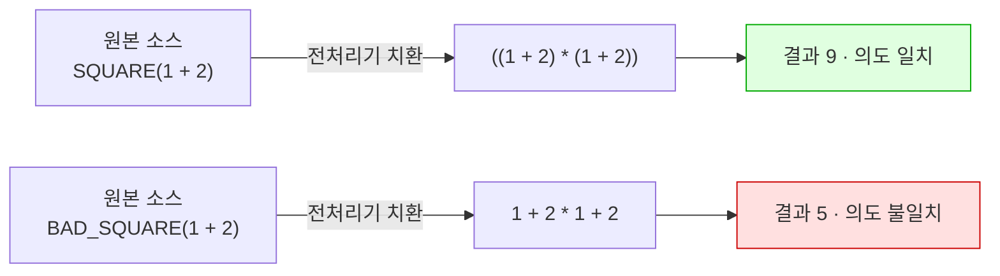

---
tags:
  - lang/c
  - c/syntax
  - preprocessor
  - macro
  - define
  - status/verified
aliases:
  - "#define"
  - 매크로
created: 2026-08-14
updated: 2026-08-14
---

# 전처리기 매크로 — `#define`

> 컴파일 이전 **텍스트 치환**. 타입 검사·스코프 부재 → 괄호와 부작용 주의

## 개념

- 전처리기 — 컴파일 **이전** 단계. 소스를 텍스트 수준에서 조작
- `#define` — 이름을 지정 텍스트로 치환. **함수 호출 아님**, 코드 삽입
- 두 형태
  - 객체형(object-like) — `#define MAX_LINE 1024`
  - 함수형(function-like) — `#define SQUARE(x) ((x) * (x))`
- 타입 검사 부재. 스코프 부재 — 파일 끝 또는 `#undef`까지 유효
- 세미콜론 미포함. `#define MAX 100;` 형태는 `;`까지 치환되어 문법 오류 유발

## Java와의 차이

| 항목 | Java | C |
|---|---|---|
| 상수 정의 | `static final int MAX = 1024` | `#define MAX 1024` 또는 `const int` |
| 처리 시점 | 컴파일·런타임 | **컴파일 이전 텍스트 치환** |
| 타입 | 존재 | **없음** (치환 결과가 타입 결정) |
| 스코프 | 클래스·메서드 | 파일 전역 (`#undef`까지) |
| 디버깅 | 변수로 관찰 가능 | 치환 후 원본 이름 소실 |
| 조건부 컴파일 | 대응 개념 부재 | `#ifdef`·`#if` |

**Java 대응 없음** — 조건부 컴파일(`#ifdef`)은 Java에 대응 개념 부재. 빌드 시점에 코드 자체를 포함·제외

## 코드

치환 동작과 괄호 함정 실증

```c
#include <stdio.h>

#define MAX_LINE 1024                  // 객체형 매크로 — 텍스트 치환
#define SQUARE(x) ((x) * (x))          // 함수형 매크로 — 인자 괄호 필수
#define BAD_SQUARE(x) x * x            // 괄호 없음 → 우선순위 붕괴

int main(void) {
    char line[MAX_LINE];
    printf("MAX_LINE = %d, sizeof(line) = %zu\n", MAX_LINE, sizeof(line));

    printf("SQUARE(3)      = %d\n", SQUARE(3));
    printf("SQUARE(1+2)    = %d  (기대 9)\n", SQUARE(1 + 2));
    printf("BAD_SQUARE(1+2)= %d  (1 + 2*1 + 2 = 5)\n", BAD_SQUARE(1 + 2));

    int i = 3;
    printf("SQUARE(i++)    = %d  (i가 두 번 증가 → 정의되지 않은 동작)\n", SQUARE(i++));
    return 0;
}
```

## 동작 구조

치환 과정 — 컴파일러는 치환 **결과만** 봄



- `BAD_SQUARE`는 곱셈이 덧셈보다 우선 → `1 + (2*1) + 2` = 5

## 컴파일 · 실행

```bash
cc -Wall -Wextra macro.c -o macro && ./macro
```

- `-Wall` — 주요 경고 활성. 매크로 부작용 경고 포함
- `-Wextra` — `-Wall` 미포함 추가 경고 활성
- `-o macro` — 출력 파일명을 `macro`로 지정. 미지정 시 `a.out`
- `&& ./macro` — 컴파일 성공 시에만 실행

```
MAX_LINE = 1024, sizeof(line) = 1024
SQUARE(3)      = 9
SQUARE(1+2)    = 9  (기대 9)
BAD_SQUARE(1+2)= 5  (1 + 2*1 + 2 = 5)
SQUARE(i++)    = 12  (i가 두 번 증가 → 정의되지 않은 동작)
```

- `SQUARE(i++)` = 12 — `((i++) * (i++))`로 치환되어 `i`가 두 번 증가. 값·평가 순서 미보장

컴파일러 경고 원문

```
t1.c:16:99: warning: multiple unsequenced modifications to 'i' [-Wunsequenced]
   16 |     printf("SQUARE(i++)    = %d ...", SQUARE(i++));
      |                                                                                    ^~
t1.c:4:21: note: expanded from macro 'SQUARE'
    4 | #define SQUARE(x) ((x) * (x))
```

- `expanded from macro` — 오류가 매크로 전개 결과에서 발생했음을 표시. 매크로 디버깅의 핵심 단서

치환 결과 직접 확인

```bash
cc -E macro.c | tail -20
```

- `-E` — 전처리까지만 수행 → 치환 결과를 표준 출력으로. 매크로 문제 진단에 유효

## 주요 전처리기 지시자

| 지시자 | 역할 |
|---|---|
| `#define` | 매크로 정의 |
| `#undef` | 매크로 해제 |
| `#include` | 파일 전개 |
| `#ifdef` `#ifndef` | 정의 여부 조건 |
| `#if` `#elif` `#else` `#endif` | 값 기반 조건 |
| `#error` | 컴파일 중단 + 메시지 |
| `#pragma` | 컴파일러 고유 지시 |

조건부 컴파일 활용

```c
#ifdef DEBUG
#define LOG(fmt, ...) fprintf(stderr, "[%s:%d] " fmt "\n", __FILE__, __LINE__, ##__VA_ARGS__)
#else
#define LOG(fmt, ...) ((void)0)      // 릴리스에서 코드 완전 제거
#endif
```

- `-DDEBUG` 컴파일 시에만 로그 활성 → [[C/docs/03-build/gcc-compile-and-run|gcc 컴파일 · 실행 명령어]] 참조

## 미리 정의된 매크로

| 매크로 | 값 |
|---|---|
| `__FILE__` | 현재 파일명 |
| `__LINE__` | 현재 행 번호 |
| `__func__` | 현재 함수명 (C99, 엄밀히는 식별자) |
| `__DATE__` `__TIME__` | 컴파일 일시 |
| `__STDC_VERSION__` | C 표준 버전 |

## `#define` vs `const` vs `enum`

| 방식 | 타입 검사 | 스코프 | 디버거 관찰 | 배열 크기 지정 |
|---|---|---|---|---|
| `#define MAX 100` | 없음 | 파일 전역 | 불가 | 가능 |
| `const int MAX = 100` | 있음 | 블록 | 가능 | **C에서 불가** |
| `enum { MAX = 100 }` | 정수 한정 | 블록 | 가능 | 가능 |

- C의 `const int`는 "읽기 전용 변수"이지 컴파일 시점 상수 아님 → `int arr[MAX]`에 사용 불가 (C99 가변 길이 배열로는 가능하나 별개 기능)
- 정수 상수 — `enum` 권장 (타입 안전 + 배열 크기 사용 가능)
- 문자열·조건부 컴파일 — `#define` 필요

## 함정 · 주의점

- 매크로 인자·전체에 **괄호 누락** → 연산자 우선순위 붕괴. `#define SQ(x) ((x)*(x))` 형태 고정
- 인자에 **부작용 있는 식** 전달 (`i++`, 함수 호출) → 다중 평가. 위 실증 참조
- `#define MAX 100;` — 세미콜론 포함 → 치환 결과에 `;` 삽입되어 문법 오류
- 매크로명이 지역 변수·필드명과 충돌 → 예기치 않은 치환. **매크로명은 대문자** 관례로 회피
- 여러 문장 매크로를 `if` 아래 사용 → 첫 문장만 조건에 걸림. `do { ... } while (0)` 관용구 사용
  ```c
  #define SWAP(a,b) do { int t=(a); (a)=(b); (b)=t; } while (0)
  ```
- 헤더에서 매크로 정의 후 `#undef` 누락 → 포함한 모든 파일에 누출
- 타입 검사 부재 → 잘못된 타입 전달해도 컴파일 통과. 인라인 함수(`static inline`)가 더 안전한 경우 다수

## 검증

- [ ] `-E`로 치환 결과 확인
- [ ] 괄호 유무에 따른 결과 차이 재현
- [ ] 부작용 인자 전달 시 경고 발생 확인
- [ ] `-DDEBUG` 유무에 따른 동작 전환 확인

## 관련 문서

- [[C/docs/08-syntax/sizeof-and-array-subscript|sizeof 연산자와 배열 첨자]] — 매크로로 정의한 배열 크기 다루기
- [[C/docs/01-basics/c-program-execution-model|C 프로그램의 동작 및 컴파일 방식]] — 전처리가 속한 컴파일 4단계
- [[C/docs/03-build/gcc-compile-and-run|gcc 컴파일 · 실행 명령어]] — `-D`·`-E` 옵션
- [[C/docs/04-project-layout/source-file-types|C 소스코드 구성 요소]] — 인클루드 가드에서의 매크로 활용
- [[C/docs/README|학습 문서 인덱스]] — 카테고리별 전체 문서 목록
