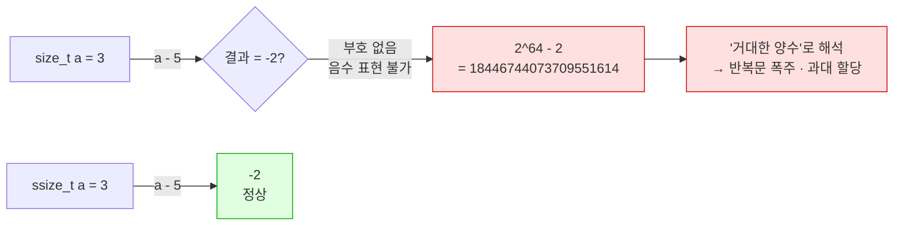

---
tags:
  - lang/c
  - c/syntax
  - size-t
  - unsigned
  - integer-type
  - underflow
  - status/verified
aliases:
  - size_t
  - ssize_t
  - "%zu"
created: 2026-08-18
updated: 2026-08-18
---

# `size_t` 타입

> 크기·개수·인덱스 표현 전용 **부호 없는** 정수. 음수 부재 → 뺄셈이 언더플로로 직결

## 개념

`size_t` — `<stddef.h>` 정의 `typedef`. 실체는 플랫폼별 부호 없는 정수 타입

- 용도 — **메모리 크기·배열 인덱스·요소 개수**. 음수가 의미 없는 값 전부
- 보장 — 그 환경에서 **표현 가능한 최대 객체 크기**를 담을 수 있는 크기
- 반환 타입으로 사용하는 표준 함수 — `sizeof` 연산자, `strlen`, `fread`·`fwrite`
- 매개변수로 요구하는 함수 — `malloc(size_t)`, `memcpy(..., size_t)`, `snprintf(..., size_t, ...)`

포함 헤더 — `<stddef.h>` 정본. 단 `<stdio.h>`·`<stdlib.h>`·`<string.h>` 포함 시 자동 가시화

## 특성

| 항목 | 내용 |
|---|---|
| 부호 | **없음**(unsigned) — 음수 표현 불가 |
| 크기 | 플랫폼 종속. 64비트 = 8바이트, 32비트 = 4바이트 |
| `printf` 서식 | **`%zu`** — `z`가 `size_t` 길이 수식어 |
| 최대값 | `SIZE_MAX` (`<stdint.h>`) |
| 부호 있는 대응 | `ssize_t` (POSIX. 표준 C 아님) |

## 코드

크기·최대값·언더플로를 한 번에 확인

```c
#include <stdio.h>
#include <stdint.h>
#include <string.h>

int main(void) {
    printf("sizeof(size_t) = %zu 바이트\n", sizeof(size_t));
    printf("sizeof(int)    = %zu 바이트\n", sizeof(int));
    printf("SIZE_MAX       = %zu\n", SIZE_MAX);

    const char *s = "";
    printf("strlen(\"\") - 1 = %zu\n", strlen(s) - 1);   /* ← 언더플로 */

    size_t a = 3, b = 5;
    printf("3 - 5 (size_t) = %zu\n", a - b);             /* ← 언더플로 */

    if (a - b > 0) printf("a-b > 0 판정: 참 (부호 없음)\n");
    return 0;
}
```

```bash
cc -Wall -Wextra sizet.c -o sizet && ./sizet
```

- `-Wall` — 주요 경고 활성. 미초기화 변수·타입 불일치 등 검출
- `-Wextra` — `-Wall` 미포함 추가 경고 활성
- `-o sizet` — 출력 파일명을 `sizet`로 지정. 미지정 시 `a.out`
- `&& ./sizet` — 컴파일 성공 시에만 실행

```
sizeof(size_t) = 8 바이트
sizeof(int)    = 4 바이트
SIZE_MAX       = 18446744073709551615
strlen("") - 1 = 18446744073709551615
3 - 5 (size_t) = 18446744073709551614
a-b > 0 판정: 참 (부호 없음)
```

- `size_t` 8바이트 vs `int` 4바이트 — **동일 취급 불가**. 64비트에서 `int`로 받으면 상위 비트 절단
- `3 - 5` → `-2`가 아닌 **18446744073709551614** = `SIZE_MAX - 1`. 음수가 최대값 근처로 순환
- `a - b > 0` 판정이 **참** — 부호 없는 타입에 음수 개념 부재
- 경고 0건 — 컴파일러가 미검출. **논리로만 방어 가능**

## 동작 구조

부호 없는 뺄셈의 순환 구조. `0` 아래로 내려가면 최대값으로 되돌아옴



빨강 = `size_t` 언더플로 경로 · 초록 = 부호 있는 타입 경로

## 함정 1 — 뺄셈 후 비교

`strlen` 결과에서 빼는 순간 언더플로 위험 발생

```c
for (size_t i = 0; i < strlen(s) - 1; i++)   // ← 빈 문자열이면 무한 루프
```

- `strlen("")` = 0 → `0 - 1` = `SIZE_MAX` → 사실상 무한 반복
- 안전한 형태 — **뺄셈을 덧셈으로 이항**

```c
for (size_t i = 0; i + 1 < strlen(s); i++)   // ← 언더플로 부재
```

## 함정 2 — 역순 순회

부호 없는 타입은 `>= 0` 조건이 **항상 참** → 종료 불가

```c
for (size_t i = n - 1; i >= 0; i--)          // ← 무한 루프
```

- `i`가 0에서 `i--` 수행 → `SIZE_MAX`로 순환 → 조건 계속 참
- 안전한 형태 3종

```c
for (size_t i = n; i-- > 0; )                /* 관용 표현. 조건 검사 후 감소 */
    use(arr[i]);

for (size_t i = n; i > 0; i--)               /* 인덱스를 i-1로 사용 */
    use(arr[i - 1]);

for (ssize_t i = (ssize_t)n - 1; i >= 0; i--) /* 부호 있는 타입 전환 */
    use(arr[i]);
```

## 함정 3 — 서식 불일치

`%d`로 `size_t` 출력 → 타입 불일치. `-Wall`이 검출

```c
printf("%d\n", strlen("hello"));      // ← 잘못됨
```

```bash
cc -Wall -Wextra badfmt.c -o badfmt
```

- `-Wall` — 주요 경고 활성. 서식·인자 타입 불일치 검출에 필요
- `-Wextra` — `-Wall` 미포함 추가 경고 활성
- `-o badfmt` — 출력 파일명을 `badfmt`로 지정. 미지정 시 `a.out`

```
badfmt.c:4:20: warning: format specifies type 'int' but the argument has type 'unsigned long' [-Wformat]
    4 |     printf("%d\n", strlen("hello"));
      |             ~~     ^~~~~~~~~~~~~~~
      |             %lu
1 warning generated.
```

- 컴파일러 제안이 `%lu` — macOS(arm64)에서 `size_t`가 `unsigned long`인 결과
- `%lu` 사용 시 32비트 플랫폼에서 재차 불일치 → **`%zu` 사용이 정답**. 플랫폼 무관

## `ssize_t`와의 구분

| 타입 | 부호 | 출처 | 용도 |
|---|---|---|---|
| `size_t` | 없음 | 표준 C | 크기·개수·인덱스 |
| `ssize_t` | **있음** | POSIX (`<sys/types.h>`) | 크기 또는 **오류(-1)** 반환 |

```c
ssize_t n = read(fd, buf, sizeof(buf));
if (n < 0) { perror("read"); }        /* -1 = 오류 → 부호 필요 */
```

- `read`·`write`가 `ssize_t` 반환 — 오류 시 `-1` 표현이 필요하기 때문
- `size_t`로 받으면 `-1`이 `SIZE_MAX`가 되어 **오류 검출 실패**

## Java와의 차이

| 항목 | Java | C |
|---|---|---|
| 부호 없는 정수 | **부재** (`char` 제외) | `unsigned` 계열 상시 사용 |
| 크기·길이 타입 | `int` (`length`·`size()`) | `size_t` |
| 배열 최대 길이 | `int` 범위 = 약 21억 | `SIZE_MAX` = 64비트에서 약 1.8×10¹⁹ |
| 음수 인덱스 | 런타임 예외 | **예외 부재** — 거대 양수로 해석 후 폭주 |
| 타입 크기 | 플랫폼 무관 고정 | **플랫폼 종속** |
| 오버플로 | 조용히 순환(부호 있음) | 부호 없음은 순환 정의, 부호 있음은 미정의 동작 |

- Java `arr.length - 1`은 빈 배열에서 `-1` → 조건 검사로 방어 가능
- C `strlen(s) - 1`은 빈 문자열에서 `SIZE_MAX` → **조건 검사가 무력화**

## 함정 · 주의점

- `size_t` 뺄셈 결과를 음수로 기대 → 언더플로. 덧셈 이항 또는 부호 있는 타입 사용
- `for (size_t i = n-1; i >= 0; i--)` → 무한 루프. `i-- > 0` 관용 표현 사용
- `%d`·`%lu`로 출력 → 플랫폼 이식성 상실. **`%zu` 고정**
- `int`와 `size_t` 혼합 비교 → 부호 있는 쪽이 부호 없는 쪽으로 승격 → 음수가 거대 양수화
  ```c
  int i = -1;
  if (i < sizeof(arr)) { }      // ← 참이 아님. i가 SIZE_MAX로 변환됨
  ```
- `read`·`write` 반환을 `size_t`로 받음 → `-1` 오류 검출 실패. `ssize_t` 사용
- `malloc(n * sizeof(T))`에서 `n`이 거대 → 곱셈 오버플로 → 과소 할당. `calloc(n, sizeof(T))`가 검사 수행
- `sizeof` 결과를 `int`에 대입 → 64비트에서 절단 가능

## 검증

- [x] `sizeof(size_t)` = 8, `sizeof(int)` = 4 확인
- [x] `SIZE_MAX` 값 확인
- [x] `strlen("") - 1` 언더플로 재현
- [x] `a - b > 0` 판정 참 확인
- [x] `%d` 서식 불일치 경고 원문 확인

## 관련 문서

- [[C/docs/08-syntax/sizeof-and-array-subscript|sizeof 연산자와 배열 첨자]] — `sizeof` 반환 타입이 `size_t`
- [[C/docs/07-stdlib/03-stdlib|메모리 · 변환]] — `malloc(size_t)`·`calloc` 곱셈 오버플로 검사
- [[C/docs/07-stdlib/02-string|문자열 처리]] — `strlen` 반환 타입과 널 종단
- [[C/docs/08-syntax/static-keyword|static 키워드]] — 링키지·저장 기간 제어
- [[C/docs/README|학습 문서 인덱스]] — 카테고리별 전체 문서 목록
