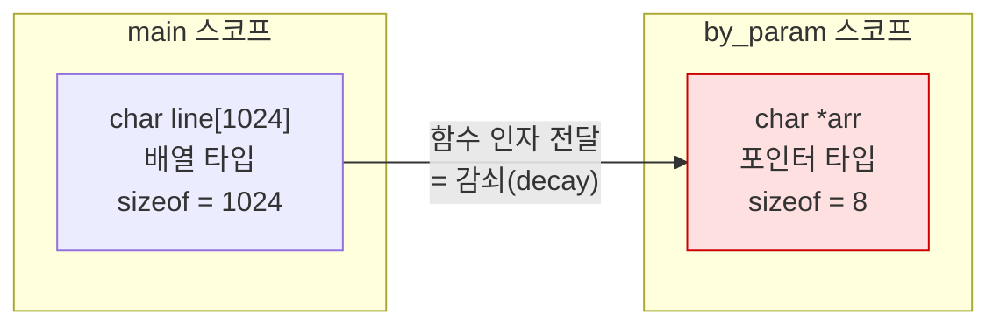
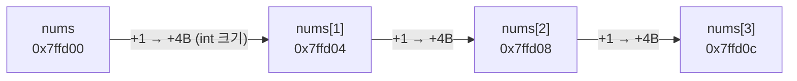

---
tags:
  - lang/c
  - c/syntax
  - sizeof
  - array
  - pointer
  - array-decay
  - status/verified
aliases:
  - sizeof 연산자
  - 배열 첨자
created: 2026-08-14
updated: 2026-08-18
---

# `sizeof` 연산자와 배열 첨자 `[]`

> `sizeof`는 함수 아닌 **컴파일 시점 연산자**. 배열 첨자는 포인터 산술의 문법 설탕

## 개념

### `sizeof`

- **연산자**(함수 아님) — 컴파일 시점에 크기 확정. 런타임 비용 부재
- 반환 타입 `size_t` — 부호 없는 정수. 출력 서식 **`%zu`**
- 두 형태 — `sizeof(타입)`, `sizeof 식`(괄호 선택)
- 피연산자 식은 **평가되지 않음** → `sizeof(i++)`에서 `i` 미증가

### 배열 첨자 `[]`

- `arr[i]` ≡ `*(arr + i)` — 컴파일러가 후자로 변환
- 배열명은 대부분 문맥에서 **첫 원소 포인터로 감쇠**(decay)
- 감쇠 예외 — `sizeof`, `&` 연산자, 문자열 리터럴 초기화

## Java와의 차이

| 항목 | Java | C |
|---|---|---|
| 배열 길이 | `arr.length` 저장됨 | **미저장** → `sizeof` 계산 또는 별도 전달 |
| 범위 검사 | 예외 발생 | **검사 부재** → 인접 메모리 침범 |
| 함수 전달 | 참조 전달, `length` 유지 | **포인터로 감쇠**, 크기 정보 소실 |
| 첨자 의미 | 배열 전용 문법 | 포인터 산술 축약 |
| 크기 조회 | 런타임 | **컴파일 시점** |

## 코드

배열 감쇠와 `sizeof` 동작 실증

```c
#include <stdio.h>
#include <string.h>

static void by_param(char arr[]) {                 // 배열 매개변수 = 포인터로 감쇠
    printf("  함수 내부 sizeof(arr) = %zu  ← 포인터 크기\n", sizeof(arr));
}

int main(void) {
    char line[1024];
    int  nums[5] = {10, 20, 30, 40, 50};

    printf("sizeof(line)  = %zu  (배열 전체 바이트)\n", sizeof(line));
    printf("sizeof(nums)  = %zu  (int 4B × 5)\n", sizeof(nums));
    printf("원소 개수      = %zu\n", sizeof(nums) / sizeof(nums[0]));
    by_param(line);

    strcpy(line, "hello");
    printf("\nsizeof(line)  = %zu  ← 배열 크기 (내용 무관)\n", sizeof(line));
    printf("strlen(line)  = %zu  ← 문자열 길이\n", strlen(line));

    printf("\nnums[2]       = %d\n", nums[2]);
    printf("*(nums + 2)   = %d  ← 동일. 첨자는 포인터 산술의 문법 설탕\n", *(nums + 2));
    printf("2[nums]       = %d  ← 교환 가능 (권장하지 않음)\n", 2[nums]);
    return 0;
}
```

## 동작 구조

배열 감쇠 — 함수 경계에서 크기 정보 소실



- 함수가 크기를 알아야 하면 **별도 인자로 전달** 필요 — `void f(char *buf, size_t n)`

첨자와 포인터 산술의 등가 관계



- 포인터 산술 `+1` = **타입 크기만큼** 이동. 바이트 1개 아님

## 컴파일 · 실행

```bash
cc -Wall -Wextra array.c -o array && ./array
```

- `-Wall` — 주요 경고 활성. 배열 감쇠 관련 경고 포함
- `-Wextra` — `-Wall` 미포함 추가 경고 활성
- `-o array` — 출력 파일명을 `array`로 지정. 미지정 시 `a.out`
- `&& ./array` — 컴파일 성공 시에만 실행

```
sizeof(line)  = 1024  (배열 전체 바이트)
sizeof(nums)  = 20  (int 4B × 5)
원소 개수      = 5
  함수 내부 sizeof(arr) = 8  ← 포인터 크기

sizeof(line)  = 1024  ← 배열 크기 (내용 무관)
strlen(line)  = 5  ← 문자열 길이

nums[2]       = 30
*(nums + 2)   = 30  ← 동일. 첨자는 포인터 산술의 문법 설탕
2[nums]       = 30  ← 교환 가능 (권장하지 않음)
```

컴파일러가 감쇠 실수를 직접 지목

```
array.c:5:79: warning: sizeof on array function parameter will return size of 'char *' instead of 'char[]' [-Wsizeof-array-argument]
```

- `-Wall` 미사용 시 이 경고 부재 → 버그 방치. 경고 상시 활성이 필수인 근거

## 관용 표현

배열 원소 개수

```c
#define ARRAY_LEN(a) (sizeof(a) / sizeof((a)[0]))
```

- **배열 타입인 스코프에서만** 유효. 함수 매개변수에 사용 시 잘못된 값
- 매크로 괄호 규칙 — [[C/docs/08-syntax/preprocessor-macro|전처리기 매크로]] 참조

버퍼 크기 안전 전달

```c
char line[1024];
fgets(line, sizeof(line), stdin);          // 배열 스코프 → 정상
snprintf(dst, sizeof(dst), "%s", src);     // 동일
```

- 하드코딩(`fgets(line, 1024, stdin)`) 금지 — 배열 크기 변경 시 불일치

구조체 0 초기화

```c
struct config cfg;
memset(&cfg, 0, sizeof(cfg));              // sizeof(cfg) — 변수명 사용이 타입명보다 안전
```

동적 할당 크기 계산

```c
int *arr = malloc(n * sizeof *arr);        // 타입 변경에 안전한 관용 표현
```

## `sizeof` vs `strlen`

| 항목 | `sizeof` | `strlen` |
|---|---|---|
| 성격 | 연산자 (컴파일 시점) | 함수 (런타임) |
| 대상 | 타입·변수의 **메모리 크기** | 문자열의 **문자 수** |
| 널 종단 | 포함 | 미포함 |
| 포인터 인자 | 포인터 크기(8) | 가리키는 문자열 길이 |
| 비용 | 0 | O(n) |

```c
char a[10] = "hi";
sizeof(a)   // 10 — 배열 크기
strlen(a)   // 2  — 문자열 길이

char *p = "hi";
sizeof(p)   // 8  — 포인터 크기 (함정)
strlen(p)   // 2
```

## 함정 · 주의점

- **함수 매개변수에 `sizeof` 사용** → 포인터 크기 반환. 크기를 별도 인자로 받을 것
- `sizeof` 결과를 `%d`로 출력 → 타입 불일치. **`%zu`** 사용
- `sizeof` 결과에 뺄셈 후 음수 기대 → `size_t`는 부호 없음 → 언더플로로 거대한 값
  ```c
  for (size_t i = 0; i < strlen(s) - 1; i++)   // 빈 문자열이면 무한 루프
  ```
- 포인터에 `sizeof` 사용해 배열 크기 기대 → 항상 8(64비트)
- 배열 범위 밖 첨자 접근 → 검사 부재. ASan으로 검출 → [[C/projects/make-shell/10-debugging|10 디버깅 · 검증]] 참조
- `sizeof(arr)/sizeof(arr[0])`를 포인터에 적용 → 8/4 = 2 등 무의미한 값
- 포인터 산술을 바이트 단위로 오해 → `p + 1`은 타입 크기만큼 이동
- `2[nums]` 문법은 유효하나 **가독성 저해** → 실무 사용 금지

## 검증

- [ ] 배열과 함수 매개변수의 `sizeof` 차이 확인
- [ ] `-Wall`로 감쇠 경고 발생 확인
- [ ] `arr[i]`와 `*(arr+i)` 결과 일치 확인
- [ ] `sizeof` vs `strlen` 차이 확인

## 관련 문서

- [[C/docs/08-syntax/size-t-type|size_t 타입]] — `sizeof` 반환 타입의 부호 없음 특성과 언더플로
- [[C/docs/08-syntax/character-literal|문자 리터럴과 문자열 리터럴]] — `sizeof('x')`와 `sizeof("x")`의 차이
- [[C/docs/08-syntax/preprocessor-macro|전처리기 매크로]] — 배열 크기 매크로 정의
- [[C/docs/07-stdlib/02-string|문자열 처리]] — `strlen`과 널 종단
- [[C/docs/01-basics/c-program-execution-model|C 프로그램의 동작 및 컴파일 방식]] — 스택 배열의 메모리 배치
- [[C/projects/make-shell/03-tokenizer|03 토크나이저]] — 이중 포인터와 배열 실전 활용
- [[C/docs/README|학습 문서 인덱스]] — 카테고리별 전체 문서 목록
- [[C/projects/make-shell/10-debugging|10 디버깅 · 검증]] — 배열 범위 초과 검출
