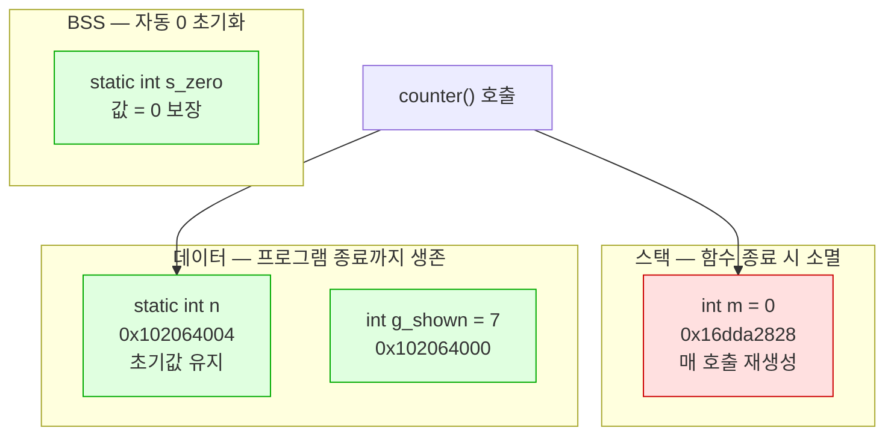

---
tags:
  - lang/c
  - c/syntax
  - static
  - linkage
  - storage-duration
  - scope
  - status/verified
aliases:
  - static 키워드
  - 내부 링키지
  - 정적 지역변수
created: 2026-08-18
updated: 2026-08-18
---

# `static` 키워드

> Java `static`과 **이름만 동일**. C에서는 소속이 아니라 **가시성 축소 + 수명 연장**

## 개념

C의 `static` — 붙는 위치에 따라 두 축 중 하나에 작용

| 축 | 의미 | 대비되는 기본값 |
|---|---|---|
| **링키지**(linkage) | 다른 `.c` 파일에서 이 심볼이 보이는지 | 파일 스코프 기본 = 외부 링키지 |
| **저장 기간**(storage duration) | 값이 언제까지 생존하는지 | 블록 스코프 기본 = 자동(스택) |

핵심 — 하나의 키워드가 **선언 위치에 따라 전혀 다른 효과** 발생

## 3가지 용법

| 선언 위치 | 효과 | 기본값 대비 변화 |
|---|---|---|
| 파일 스코프 **함수** | 내부 링키지 | 외부 노출 → **파일 한정** |
| 파일 스코프 **변수** | 내부 링키지 | 외부 노출 → **파일 한정** |
| 블록 스코프 **변수** | 정적 저장 기간 | 스택 → **데이터/BSS 세그먼트** |

```c
static int helper(void) { ... }   /* 1. 파일 한정 함수 */
static int g_count = 0;           /* 2. 파일 한정 전역 */

void f(void) {
    static int n = 0;             /* 3. 호출 간 값 유지 */
    int m = 0;                    /*    매 호출 재초기화 */
}
```

파일 스코프에서는 **가시성**, 블록 스코프에서는 **수명**에 작용 — 축이 서로 다름

## Java와의 차이

Java 경험자가 가장 오해하기 쉬운 키워드. **의미가 전도됨**

| 항목 | Java `static` | C `static` |
|---|---|---|
| 근본 의미 | 클래스 소속 — 인스턴스 없이 접근 | **가시성 축소** 또는 **수명 연장** |
| 접근 제어와의 관계 | `private`/`public`과 **직교**(조합 가능) | `static` 자체가 접근 제어 수단 |
| 접근 범위 확대 여부 | 확대 (인스턴스 불요) | **축소** (파일 밖에서 접근 불가) |
| 클래스 개념 | 전제 | C에 클래스 부재 → 대응 개념 없음 |

### 대응 관계

| C | Java 근사 대응 |
|---|---|
| `static` 함수 | `private` 메서드 |
| `static` 전역 변수 | `private static` 필드 |
| 비-`static` 전역 변수 | `public static` 필드 |
| 함수 내 `static` 변수 | 직접 대응 **부재**. 그 메서드만 쓰는 `private static` 필드에 근사 |

- Java에서 `public static` = "더 넓게 열기", C에서 `static` = "좁게 닫기" → **방향 반대**
- C의 모든 파일 스코프 함수·변수는 기본이 Java의 `public static`에 해당. `static`을 붙여야 비로소 `private`
- 결론 — **C는 기본이 전역 공개**. `static` 미부착 시 다른 `.c`와 이름 충돌 위험

## 코드 1 — 정적 지역변수

`static` 지역변수는 스택이 아닌 데이터 세그먼트 배치 → 호출 간 값 유지

```c
#include <stdio.h>

static int s_init = 42;      /* 파일 한정 + 데이터 세그먼트 */
static int s_zero;           /* 파일 한정 + BSS (자동 0) */
int g_shown = 7;             /* 외부 노출 */

static int counter(void) {
    static int n = 0;        /* 최초 1회만 초기화. 호출 간 값 유지 */
    int m = 0;               /* 매 호출 재초기화 */
    n++;
    m++;
    return n * 100 + m;
}

int main(void) {
    int local = 1;
    printf("counter: %d %d %d\n", counter(), counter(), counter());
    printf("s_zero 초기값 = %d\n", s_zero);
    printf("지역 변수 주소   %p\n", (void *)&local);
    printf("static 지역 주소 %p\n", (void *)&s_init);
    printf("전역 주소        %p\n", (void *)&g_shown);
    return 0;
}
```

```bash
cc -Wall -Wextra slocal.c -o slocal && ./slocal
```

- `-Wall` — 주요 경고 활성. 미초기화 변수·타입 불일치 등 검출
- `-Wextra` — `-Wall` 미포함 추가 경고 활성
- `-o slocal` — 출력 파일명을 `slocal`로 지정. 미지정 시 `a.out`
- `&& ./slocal` — 컴파일 성공 시에만 실행

```
counter: 101 201 301
s_zero 초기값 = 0
지역 변수 주소   0x16dda2828
static 지역 주소 0x102064004
전역 주소        0x102064000
```

- `n` — 1·2·3으로 **누적**. `static`이라 호출 종료 후에도 생존
- `m` — 매번 1. 자동 변수라 호출마다 재생성
- `s_zero` — 초기값 미지정에도 **0 보장**. BSS 세그먼트 특성
- 주소 비교 — 지역 변수 `0x16dd…`(스택), `static`·전역 `0x1020…`(데이터). **자릿수부터 상이** → 다른 세그먼트 증명
- `static` 지역변수와 전역 변수 주소가 4바이트 차이로 **인접** → 같은 세그먼트 배치 확인

`static` 지역변수 초기화는 **최초 1회만** 수행. 매 호출 재실행 아님

## 동작 구조

세그먼트별 배치와 생존 기간. `static` 부착 시 스택에서 데이터/BSS로 이동



빨강 = 호출마다 소멸 · 초록 = 프로그램 전체 생존

## 코드 2 — 링키지 확인

`nm`으로 심볼 테이블 조회 시 대소문자로 노출 여부 판별

```c
static int hidden = 1;              /* 파일 내부 한정 */
int        shown  = 2;              /* 외부 노출 */

static int helper(void) { return hidden; }
int        api(void)    { return helper() + shown; }
```

```bash
cc -Wall -Wextra -c lib.c -o lib.o && nm lib.o
```

- `-Wall` — 주요 경고 활성. 미초기화 변수·타입 불일치 등 검출
- `-Wextra` — `-Wall` 미포함 추가 경고 활성
- `-c` — 컴파일까지만 수행하고 링크 생략 → 목적 파일(`.o`) 생성
- `-o lib.o` — 출력 파일명을 `lib.o`로 지정. 미지정 시 `a.out`
- `nm lib.o` — 목적 파일의 심볼 테이블 출력

```
0000000000000000 T _api
0000000000000020 t _helper
0000000000000030 d _hidden
000000000000002c D _shown
```

| 문자 | 의미 |
|---|---|
| `T` / `D` **대문자** | 외부 노출. 다른 `.c`에서 참조 가능 |
| `t` / `d` **소문자** | 파일 내부 한정. 링커가 외부에 미노출 |
| `T`·`t` | 코드(text) 세그먼트 — 함수 |
| `D`·`d` | 데이터 세그먼트 — 초기값 있는 변수 |

## 코드 3 — 외부 접근 시 링크 오류

`static` 심볼을 다른 파일에서 `extern` 선언 → **컴파일은 통과, 링크에서 실패**

```c
#include <stdio.h>

extern int shown;
extern int hidden;                  /* ← static이라 링크 불가 */

int api(void);

int main(void) {
    printf("%d %d\n", api(), shown);
    printf("%d\n", hidden);         /* ← 링크 오류 유발 */
    return 0;
}
```

```bash
cc -Wall -Wextra use.c lib.c -o use
```

- `-Wall` — 주요 경고 활성. 미초기화 변수·타입 불일치 등 검출
- `-Wextra` — `-Wall` 미포함 추가 경고 활성
- `use.c lib.c` — 두 소스를 함께 컴파일·링크
- `-o use` — 출력 파일명을 `use`로 지정. 미지정 시 `a.out`

```
Undefined symbols for architecture arm64:
  "_hidden", referenced from:
      _main in use-91b51f.o
ld: symbol(s) not found for architecture arm64
clang: error: linker command failed with exit code 1 (use -v to see invocation)
```

- `Undefined symbols` — **링커** 오류. 컴파일 단계는 정상 통과
- 컴파일러는 `extern` 선언만 보고 "어딘가 존재" 가정 → 실제 부재는 링크 시점에 발각
- Java는 `private` 접근을 **컴파일 시점**에 차단 → 오류 발견 시점 상이

## 사용 지침

- 헤더에 선언하지 않는 보조 함수 전부 `static` 부착
- 파일 내부 전용 전역 변수 `static` 부착
- 효과 — 이름 충돌 방지, 컴파일러 최적화 여지 확대(인라인·미사용 제거)
- 헤더 파일에 `static` 함수 정의 배치 → 포함한 파일마다 사본 생성. 의도적 인라인 목적 외 회피

## 함정 · 주의점

- Java 감각으로 `static` = 공개 확대 해석 → **정반대**. C에서는 은닉
- `static` 미부착 보조 함수 → 다른 `.c`의 동명 함수와 `duplicate symbol` 링크 오류
- 헤더에 `static int x = 0;` 배치 → 포함한 파일마다 **독립 사본** 생성. 값 공유 부재
- `static` 지역변수 초기화식에 변수 사용 → 컴파일 오류. **상수식만** 허용
  ```c
  void f(int n) { static int s = n; }   // ← 오류: 상수식 아님
  ```
  ```
  error: initializer element is not a compile-time constant
  ```
- `static` 지역변수 보유 함수 → **재진입 불가**. 멀티스레드·재귀에서 값 오염
- `static` 함수 주소를 다른 파일에 전달 → **호출 성공**. 링키지는 *이름* 참조만 제한하므로 포인터 경유 호출은 차단 부재 (검증 완료)
- 함수 매개변수에 `static` 부착 → 배열 매개변수 한정 전혀 다른 의미(최소 원소 수 보장). 혼동 주의

## 검증

- [x] `static` 지역변수 호출 간 값 유지 (101·201·301)
- [x] BSS 자동 0 초기화 확인
- [x] 주소 비교로 스택·데이터 세그먼트 분리 확인
- [x] `nm` 대소문자로 링키지 판별
- [x] `static` 전역 외부 참조 시 링크 오류 원문 확인

## 관련 문서

- [[C/docs/04-project-layout/source-file-types|C 소스코드 구성 요소]] — 다중 파일 구성에서의 `static` 활용과 헤더 분리
- [[C/docs/01-basics/c-program-execution-model|C 프로그램의 동작 및 컴파일 방식]] — 데이터·BSS 세그먼트와 초기화 시점
- [[C/docs/08-syntax/size-t-type|size_t 타입]] — 크기·인덱스 표현 타입
- [[C/docs/README|학습 문서 인덱스]] — 카테고리별 전체 문서 목록
