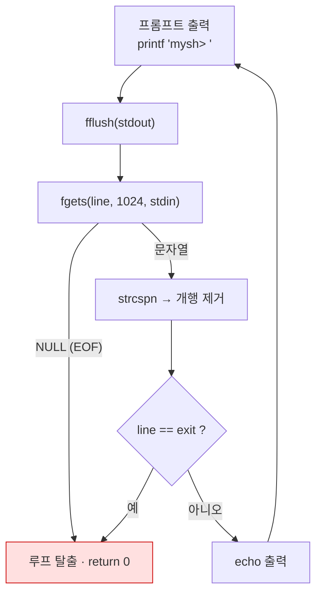

---
tags:
  - lang/c
  - c/basics
  - project/make-shell
  - shell
  - repl
  - stdio
  - fflush
  - status/verified
created: 2026-08-14
updated: 2026-08-18
---

# 01 · REPL 골격

> 프롬프트 출력 → 한 줄 입력 → 되돌려주기 무한 루프. 쉘의 최소 뼈대

## 목표

- 무한 루프 기반 대화형 프롬프트 구성
- 표준 입력 한 줄 읽기 및 개행 처리
- 종료 조건 두 가지 — `exit` 입력, `Ctrl-D`(EOF)

## 개념

- REPL — Read · Eval · Print · Loop. 이 단계에서 Eval은 에코로 대체
- 프롬프트 출력에 개행 부재 → 버퍼에 머무름 → `fflush(stdout)` 명시 필요
- `fgets` — 개행 포함해 읽음. 버퍼 크기 초과 시 잘라서 반환, 오버플로 없음
- EOF(`Ctrl-D`) → `fgets` 반환값 `NULL`. 종료 조건으로 반드시 처리

## Java와의 차이

| 항목     | Java                                               | C                         |
| ------ | -------------------------------------------------- | ------------------------- |
| 한 줄 입력 | `Scanner.nextLine()` / `BufferedReader.readLine()` | `fgets(buf, size, stdin)` |
| 버퍼 소유  | 라이브러리가 `String` 할당                                 | 호출자가 버퍼 제공                |
| 개행 포함  | 제거된 상태로 반환                                         | `\n` 포함 → 수동 제거           |
| EOF 신호 | `null` 반환 / `NoSuchElementException`               | `NULL` 반환                 |
| 출력 플러시 | `System.out.print` 자동 처리 대부분                       | `fflush(stdout)` 명시       |

## 코드

`src/main.c` — 고정 크기 버퍼 기반 최소 REPL

```c
#include <stdio.h>
#include <string.h>

#define MAX_LINE 1024

int main(void) {
    char line[MAX_LINE];

    while (1) {
        printf("mysh> ");
        fflush(stdout);                      // 개행 없는 출력 → 강제 플러시 필요

        if (fgets(line, sizeof(line), stdin) == NULL) {
            printf("\n");                    // Ctrl-D → EOF
            break;
        }

        line[strcspn(line, "\n")] = '\0';    // 개행 제거

        if (strcmp(line, "exit") == 0) break;

        printf("echo: %s\n", line);
    }
    return 0;
}
```

- `strcspn(line, "\n")` — 개행 첫 위치 반환. 개행 부재 시 문자열 길이 반환 → 두 경우 모두 안전
- `sizeof(line)` 전달 — 배열이므로 크기 계산 가능. 포인터로 전달받은 버퍼면 `sizeof` 사용 불가

## 동작 구조



## 컴파일 · 실행

```bash
gcc -Wall -Wextra -g main.c -o mysh && printf 'hello world\nexit\n' | ./mysh
```

- `-Wall` — 주요 경고 활성. 미초기화 변수·타입 불일치 등 검출
- `-Wextra` — `-Wall` 미포함 추가 경고 활성
- `-g` — 디버그 심볼 포함. lldb 추적·ASan 행 번호 표시에 필요
- `-o mysh` — 출력 파일명을 `mysh`로 지정. 미지정 시 `a.out`
- `&& printf 'hello world\nexit\n' | ./mysh` — 컴파일 성공 시에만 실행. 파이프 앞부분이 표준 입력으로 전달됨

```
mysh> echo: hello world
mysh> 
```

EOF 종료 확인 — 개행 없이 입력 후 스트림 종료

```bash
printf 'abc' | ./mysh
```

```
mysh> echo: abc
mysh> 
```

- `-Wall -Wextra` — 경고 최대. 초기부터 켜두어 미초기화·타입 불일치 조기 발견
- `-g` — 디버그 심볼 포함. lldb 사용 전제

## 함정 · 주의점

- `fflush(stdout)` 누락 → 프롬프트가 입력 후에 출력되거나 미출력. 파이프 연결 시 특히 두드러짐
- `gets` 사용 → 버퍼 오버플로. C11에서 제거됨. `fgets` 고정
- 개행 미제거 → `strcmp(line, "exit")` 실패 (`"exit\n" ≠ "exit"`)
- EOF 미처리 → `NULL` 역참조 또는 무한 루프
- 고정 크기 `MAX_LINE` 초과 입력 → 남은 부분이 다음 반복에서 별도 줄로 처리됨. 2단계에서 동적 버퍼로 해결

## CLion 팁

- 실행 구성의 `Run in terminal`(또는 `Emulate terminal in output console`) 활성화 → 대화형 입력 및 `Ctrl-D` 정상 동작
- 미활성 시 표준 입력이 즉시 EOF → 프롬프트 한 번 출력 후 종료

## 검증

- [ ] 프롬프트가 입력 대기 **전에** 출력됨
- [ ] `exit` 입력 시 정상 종료
- [ ] `Ctrl-D` 입력 시 정상 종료 (무한 루프 부재)
- [ ] `-Wall -Wextra` 경고 0건
- [ ] 1024자 초과 입력 시 크래시 부재

## 다음 단계

[[C/projects/make-shell/02-dynamic-input|02 · 동적 입력 버퍼]] — 고정 크기 제약 제거, `malloc`·`realloc` 도입

## 관련 문서

- [[C/projects/make-shell/README|make-shell 로드맵]] — 쉘 구현 10단계 커리큘럼
- [[C/docs/07-stdlib/06-stdio-buffering|표준 입출력 버퍼링과 fflush]] — 프롬프트 플러시가 필요한 이유와 버퍼링 모드 전반
