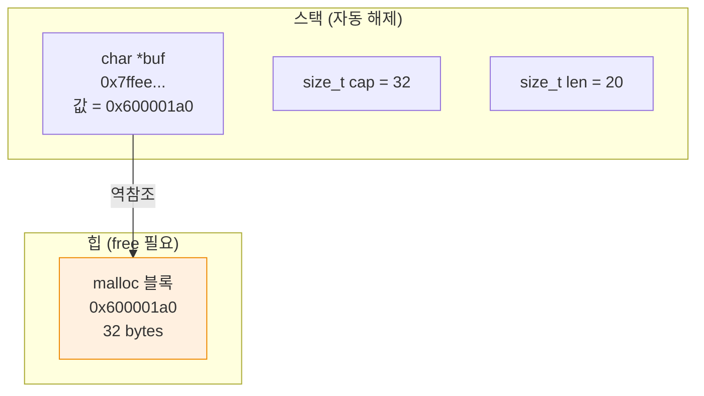
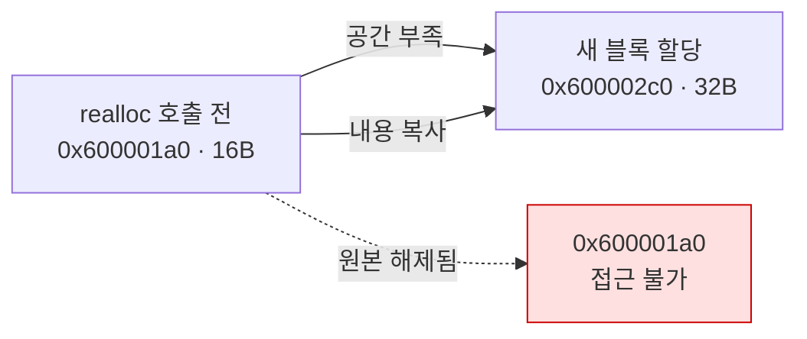

---
tags:
  - lang/c
  - c/memory
  - project/make-shell
  - shell
  - malloc
  - realloc
  - ownership
  - status/verified
created: 2026-08-14
updated: 2026-08-14
---

# 02 · 동적 입력 버퍼

> 고정 크기 배열 제거. `malloc`·`realloc`으로 임의 길이 입력 수용 및 수동 해제 습득

## 목표

- 힙 할당 기반 가변 길이 문자열 읽기 함수 구현
- 용량 부족 시 2배 확장 전략 적용
- 소유권 규약 확립 — 할당자와 해제자 분리, 매 반복 `free`

## 개념

- 스택 배열 `char line[1024]` — 크기 컴파일 시점 고정, 함수 반환 시 자동 소멸
- 힙 할당 `malloc(n)` — 크기 런타임 결정, `free` 호출 전까지 유지
- `realloc(ptr, newsize)` — 기존 내용 보존하며 크기 변경. 이동 발생 가능 → **반환값이 새 주소**
- 확장 전략 — 2배 증가(amortized O(1)). 1씩 증가 시 매 문자마다 복사 → O(n²)
- 소유권(ownership) — 힙 블록마다 해제 책임자 1인 명확화. C에 GC 부재 → 규약이 곧 안전장치

## Java와의 차이

| 항목 | Java | C |
|---|---|---|
| 가변 문자열 | `StringBuilder` 내부 자동 확장 | `realloc` 수동 호출 |
| 해제 | GC 자동 회수 | `free` 명시 호출 |
| 할당 실패 | `OutOfMemoryError` 예외 | `NULL` 반환 → 분기 검사 |
| 배열 크기 | `arr.length` 보유 | 크기 정보 미보유 → 별도 변수 관리 |
| 해제 후 접근 | 불가능 (참조 유효) | 컴파일·실행 통과 후 정의되지 않은 동작 |

## 코드

`read_line` — 개행 또는 EOF까지 읽어 힙 문자열 반환

```c
#include <stdio.h>
#include <stdlib.h>
#include <string.h>

#define INIT_CAP 16

// 개행 또는 EOF까지 읽어 힙 문자열 반환. 호출자가 free 책임.
// EOF이면서 읽은 내용 없음 → NULL 반환
static char *read_line(void) {
    size_t cap = INIT_CAP;
    size_t len = 0;
    char *buf = malloc(cap);
    if (buf == NULL) return NULL;

    int c;
    while ((c = fgetc(stdin)) != EOF && c != '\n') {
        if (len + 1 >= cap) {                    // +1 = 널 종단 자리
            cap *= 2;
            char *tmp = realloc(buf, cap);       // ← 반환값을 별도 변수로 받음
            if (tmp == NULL) {
                free(buf);                       // realloc 실패 시 원본 유효 → 해제 필요
                return NULL;
            }
            buf = tmp;
        }
        buf[len++] = (char)c;
    }

    if (c == EOF && len == 0) {
        free(buf);
        return NULL;
    }

    buf[len] = '\0';
    return buf;
}

int main(void) {
    char *line;

    while (1) {
        printf("mysh> ");
        fflush(stdout);

        line = read_line();
        if (line == NULL) {
            printf("\n");
            break;
        }

        if (strcmp(line, "exit") == 0) {
            free(line);
            break;
        }

        printf("echo: %s (len=%zu)\n", line, strlen(line));
        free(line);                              // 매 반복 해제. 누락 시 누수
    }
    return 0;
}
```

- `int c` 사용 — `fgetc` 반환 타입. `char c`로 받으면 `EOF`(-1)와 유효 문자 구분 실패
- `len + 1 >= cap` — 널 종단 자리 확보. `len >= cap`이면 마지막 `buf[len] = '\0'`이 범위 초과

## 동작 구조

메모리 배치 — 스택의 포인터 변수가 힙 블록 지시



`realloc` 확장 시 주소 이동 가능성



- 이전 주소를 계속 사용 → use-after-free. 반환값 재대입 필수

## 컴파일 · 실행

```bash
gcc -Wall -Wextra -g main.c -o mysh
printf 'short\nthis is a much longer line exceeding sixteen bytes\nexit\n' | ./mysh
```

- `-Wall` — 주요 경고 활성. 미초기화 변수·타입 불일치 등 검출
- `-Wextra` — `-Wall` 미포함 추가 경고 활성
- `-g` — 디버그 심볼 포함. lldb 추적·ASan 행 번호 표시에 필요
- `-o mysh` — 출력 파일명을 `mysh`로 지정. 미지정 시 `a.out`

```
mysh> echo: short (len=5)
mysh> echo: this is a much longer line exceeding sixteen bytes (len=50)
mysh> 
```

- 초기 용량 16 → 50자 입력 정상 처리. 확장 로직 동작 확인

누수 검사 — AddressSanitizer

```bash
gcc -Wall -Wextra -g -fsanitize=address main.c -o mysh_asan
printf 'abcdefghijklmnopqrstuvwxyz0123456789\nexit\n' | ./mysh_asan
```

- `-Wall` — 주요 경고 활성. 미초기화 변수·타입 불일치 등 검출
- `-Wextra` — `-Wall` 미포함 추가 경고 활성
- `-g` — 디버그 심볼 포함. lldb 추적·ASan 행 번호 표시에 필요
- `-fsanitize=address` — AddressSanitizer 활성. 힙 오버플로·use-after-free 즉시 검출
- `-o mysh_asan` — 출력 파일명을 `mysh_asan`로 지정. 미지정 시 `a.out`

```
mysh> echo: abcdefghijklmnopqrstuvwxyz0123456789 (len=36)
mysh> 
```

- 누수 존재 시 종료 시점에 `ERROR: LeakSanitizer: detected memory leaks` 출력. 위 결과는 보고 부재 = 클린
- 주의 — macOS의 LeakSanitizer는 기본 비활성. 누수 탐지 필요 시 `ASAN_OPTIONS=detect_leaks=1` 지정 또는 `leaks` 명령 병용 (환경별 동작 확인 필요)

## 함정 · 주의점

- `buf = realloc(buf, cap)` 직접 대입 → 실패 시 `NULL` 덮어씀 → 원본 주소 유실 → 누수. 임시 변수 경유 필수
- `realloc` 실패 후 원본 미해제 → 누수. 실패 경로에서 `free(buf)` 필요
- `char c = fgetc(...)` → EOF 오판. `int` 고정
- `free(line)` 누락 → 반복마다 누수 누적. 장시간 실행 시 메모리 고갈
- `free` 후 동일 포인터 재사용 → use-after-free. 필요 시 `line = NULL` 대입
- 이중 `free` → 힙 손상. 종료 경로(`exit` 분기)에서 중복 해제 여부 확인
- `malloc` 반환값 미검사 → 할당 실패 시 `NULL` 역참조 크래시

## CLion 팁

- `Run` → `Profile`/`Sanitizers` 설정에서 ASan 활성 가능. CMake 사용 시 `-fsanitize=address`를 `CMAKE_C_FLAGS`에 추가
- 디버거에서 포인터 변수 우클릭 → `View as array` → 힙 버퍼 내용 확인 가능

## 검증

- [ ] 16자 초과 입력 정상 처리 (확장 동작)
- [ ] 빈 줄 입력 시 크래시 부재
- [ ] `Ctrl-D` 즉시 입력 시 정상 종료
- [ ] ASan 실행 시 누수·오류 보고 부재
- [ ] `realloc` 반환값을 임시 변수로 받음

## 다음 단계

[[C/projects/make-shell/03-tokenizer|03 · 토크나이저]] — 입력 문자열을 `char **argv` 배열로 분해

## 관련 문서

- [[C/projects/make-shell/01-repl-skeleton|01 · REPL 골격]] — REPL 루프와 표준 입출력
- [[C/projects/make-shell/10-debugging|10 디버깅 · 검증]] — ASan·lldb·누수 검사
- [[C/projects/make-shell/README|make-shell 로드맵]] — 쉘 구현 10단계 커리큘럼
