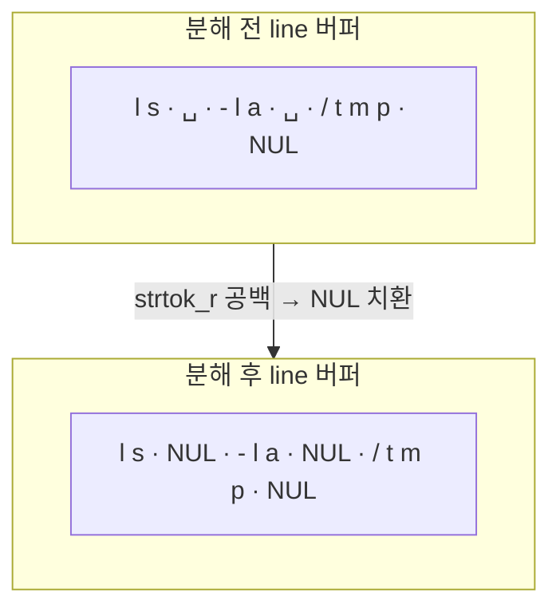
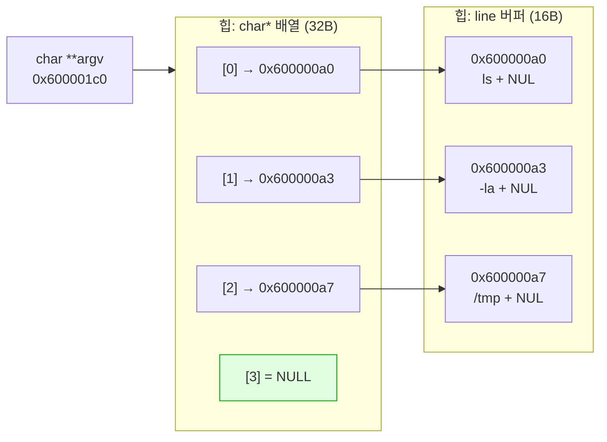

---
tags:
  - lang/c
  - c/memory
  - project/make-shell
  - shell
  - strtok
  - pointer
  - double-pointer
  - status/verified
created: 2026-08-14
updated: 2026-08-14
---

# 03 · 토크나이저

> 입력 한 줄을 공백 기준으로 분해해 `char **argv` 구성. 이중 포인터와 NULL 종단 규약 습득

## 목표

- `strtok_r` 기반 공백 분해 구현
- NULL 종단 `char *` 배열 생성 — `execvp` 인자 규약 대비
- 이중 포인터(`char **`) 및 배열 소유권 구조 이해

## 개념

- `char **argv` — `char *`들의 배열. 각 원소가 문자열 시작 주소 보관
- NULL 종단 규약 — 배열 마지막 원소 `NULL`. 개수 정보 없이 순회 종료 판단. `execvp` 요구사항
- `strtok_r` — 원본 문자열을 **파괴적으로** 수정. 구분자를 `'\0'`으로 치환 후 토큰 시작 주소 반환
- `strtok` vs `strtok_r` — 전자는 내부 정적 상태 사용 → 스레드 안전 미보장·중첩 호출 불가. 후자는 `saveptr` 외부 관리
- 소유권 — 토큰은 `line` 버퍼 내부를 가리킴 → 별도 할당 부재 → **배열만 `free`**, 원소는 `line` 해제 시 함께 소멸

## Java와의 차이

| 항목 | Java | C |
|---|---|---|
| 분해 | `str.split("\\s+")` → 새 `String[]` | `strtok_r` → 원본 파괴적 수정 |
| 원본 보존 | 불변 → 그대로 유지 | 구분자가 `'\0'`으로 치환됨 |
| 결과 소유 | GC 관리 | 배열은 힙, 원소는 원본 버퍼 참조 |
| 배열 길이 | `arr.length` | NULL 종단 또는 별도 카운트 변수 |
| 연속 구분자 | `split`은 빈 문자열 생성 가능 | `strtok_r`은 자동 건너뜀 |

## 코드

`tokenize` — 공백·탭 기준 분해 후 NULL 종단 배열 반환

```c
#include <stdio.h>
#include <stdlib.h>
#include <string.h>

#define INIT_TOK 8

// 공백 기준 분해 → NULL 종단 char* 배열 반환. 호출자가 free 책임.
// 반환 배열의 원소는 line 내부를 가리킴 → 원소 개별 free 금지
static char **tokenize(char *line, size_t *out_count) {
    size_t cap = INIT_TOK;
    size_t n = 0;
    char **toks = malloc(cap * sizeof(char *));
    if (toks == NULL) return NULL;

    char *saveptr;                                  // strtok_r 내부 상태 보관
    char *tok = strtok_r(line, " \t", &saveptr);

    while (tok != NULL) {
        if (n + 1 >= cap) {                         // +1 = NULL 종단 자리
            cap *= 2;
            char **tmp = realloc(toks, cap * sizeof(char *));
            if (tmp == NULL) { free(toks); return NULL; }
            toks = tmp;
        }
        toks[n++] = tok;                            // line 내부를 가리킴. 별도 할당 아님
        tok = strtok_r(NULL, " \t", &saveptr);      // 2회차부터 첫 인자 NULL
    }

    toks[n] = NULL;                                 // execvp 규약: NULL 종단
    if (out_count) *out_count = n;
    return toks;
}
```

- `malloc(cap * sizeof(char *))` — 원소 크기는 포인터 크기(64비트 = 8B). `sizeof(char)`(1B) 아님
- `strtok_r(NULL, ...)` — 2회차 이후 첫 인자 `NULL`. `saveptr`가 진행 위치 보관

`main` 연동 — 2단계 `read_line`과 결합

```c
int main(void) {
    char *line;
    while (1) {
        printf("mysh> ");
        fflush(stdout);
        line = read_line();
        if (line == NULL) { printf("\n"); break; }

        size_t n = 0;
        char **argv = tokenize(line, &n);
        if (argv == NULL) { free(line); continue; }

        if (n > 0 && strcmp(argv[0], "exit") == 0) {
            free(argv); free(line); break;
        }

        printf("argc=%zu\n", n);
        for (size_t i = 0; i < n; i++) printf("  argv[%zu] = \"%s\"\n", i, argv[i]);

        free(argv);                                 // 배열만 해제. 원소는 line 소유
        free(line);
    }
    return 0;
}
```

- 해제 순서 — `argv` 먼저, `line` 나중. 역순 시 `argv` 원소가 해제된 메모리 지시 (출력 후라면 무해하나 규약상 위험)
- `n > 0` 검사 — 빈 줄 입력 시 `argv[0]` 접근 방지

## 동작 구조

`strtok_r` 파괴적 수정 — 구분자가 `'\0'`으로 치환



이중 포인터 지시 관계



- 초록 = NULL 종단. `execvp`가 인자 끝을 판단하는 근거
- 힙 블록 2개 — 배열 1개 + `line` 1개. `free` 호출도 2회

## 컴파일 · 실행

```bash
gcc -Wall -Wextra -g -fsanitize=address main.c -o mysh
printf 'ls -la /tmp\n   spaced   out   args\n\nexit\n' | ./mysh
```

- `-Wall` — 주요 경고 활성. 미초기화 변수·타입 불일치 등 검출
- `-Wextra` — `-Wall` 미포함 추가 경고 활성
- `-g` — 디버그 심볼 포함. lldb 추적·ASan 행 번호 표시에 필요
- `-fsanitize=address` — AddressSanitizer 활성. 힙 오버플로·use-after-free 즉시 검출
- `-o mysh` — 출력 파일명을 `mysh`로 지정. 미지정 시 `a.out`

```
mysh> argc=3
  argv[0] = "ls"
  argv[1] = "-la"
  argv[2] = "/tmp"
mysh> argc=3
  argv[0] = "spaced"
  argv[1] = "out"
  argv[2] = "args"
mysh> argc=0
mysh> 
```

- 연속 공백 → 빈 토큰 미생성 (`strtok_r` 자동 건너뜀)
- 빈 줄 → `argc=0`, 크래시 부재
- ASan 오류 보고 부재

## 함정 · 주의점

- `sizeof(char)` 로 배열 할당 → 8배 부족 → 힙 오버플로. `sizeof(char *)` 필수
- `toks[n] = NULL` 누락 → `execvp`가 배열 끝 판단 실패 → 무작위 메모리 읽기
- 토큰 개별 `free` 호출 → 힙 손상. `line` 내부 주소이지 독립 할당 아님
- `strtok_r` 2회차에 `line` 재전달 → 무한 루프. `NULL` 전달 필수
- 문자열 리터럴 전달 (`tokenize("ls -la", ...)`) → 읽기 전용 세그먼트 수정 → 세그먼테이션 폴트
- `strtok` 사용 → 중첩·스레드 상황에서 상태 충돌. `strtok_r` 고정
- 빈 줄에서 `argv[0]` 접근 → `NULL` 역참조. `n > 0` 선검사

## 확장 과제 (선택)

- 따옴표 처리 — `echo "hello world"` → 토큰 1개. `strtok_r`로 불가 → 수동 문자 순회 파서 필요
- 이스케이프 — `\ ` 를 공백 리터럴로 처리
- 위 확장 시 토큰이 원본과 달라짐 → `strdup`으로 개별 할당 → **해제 규약 변경** (원소 개별 `free` 필요)

## 검증

- [ ] `ls -la /tmp` → `argc=3`, 각 토큰 정확
- [ ] 연속 공백·앞뒤 공백 입력 시 빈 토큰 부재
- [ ] 빈 줄 입력 시 `argc=0`, 크래시 부재
- [ ] `argv[n] == NULL` 성립
- [ ] ASan 누수·오류 보고 부재

## 다음 단계

[[C/projects/make-shell/04-process-exec|04 · 프로세스 실행]] — `fork`·`execvp`·`waitpid`로 실제 명령 실행

## 관련 문서

- [[C/projects/make-shell/02-dynamic-input|02 · 동적 입력 버퍼]] — `malloc`·`realloc` 소유권 규약
- [[C/projects/make-shell/README|make-shell 로드맵]] — 쉘 구현 10단계 커리큘럼
- [[C/docs/08-syntax/sizeof-and-array-subscript|sizeof 연산자와 배열 첨자]] — 배열 감쇠와 포인터 산술
