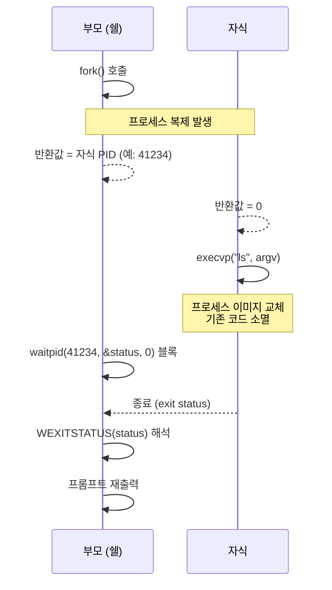
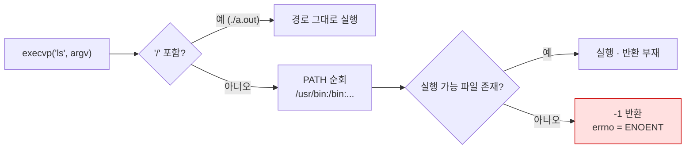
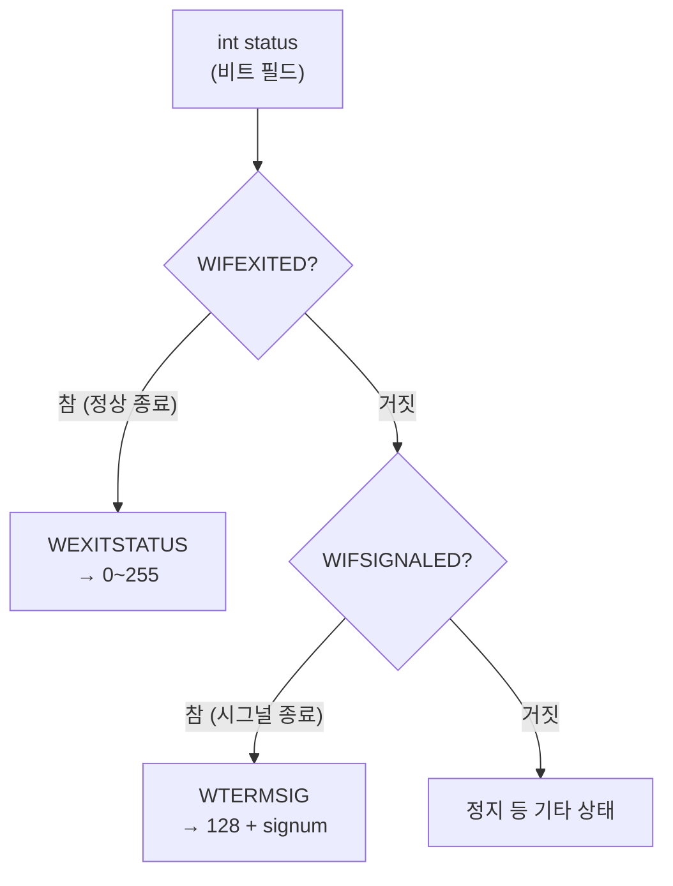

# 04 · 프로세스 실행

> `fork`로 프로세스 복제, `execvp`로 이미지 교체, `waitpid`로 종료 대기. 쉘의 핵심 구간

## 목표

- 자식 프로세스 생성 및 명령 실행
- 부모의 종료 대기 및 종료 상태 해석
- `PATH` 탐색 기반 실행 파일 검색 이해

## 개념

- `fork()` — 호출 프로세스 복제. **한 번 호출 → 두 번 반환**. 부모에 자식 PID, 자식에 `0` 반환
- `execvp(file, argv)` — 현재 프로세스 이미지를 새 프로그램으로 **교체**. 성공 시 반환 부재 → 반환 = 실패
  - `v` = vector(배열 인자), `p` = `PATH` 환경변수 탐색
- `waitpid(pid, &status, 0)` — 지정 자식 종료까지 블록. 미호출 시 자식이 좀비로 잔존
- `status` — 종료 코드가 아닌 **비트 필드**. `WIFEXITED`·`WEXITSTATUS` 등 매크로로 해석
- 종료 코드 관례 — `0` 성공, `127` 명령 없음, `128 + signum` 시그널 종료
- `_exit` vs `exit` — 자식의 `execvp` 실패 경로에서는 `_exit`. `exit`는 부모에서 상속한 stdio 버퍼를 플러시 → 출력 중복

## Java와의 차이

| 항목 | Java | C |
|---|---|---|
| 프로세스 실행 | `ProcessBuilder.start()` 한 번에 처리 | `fork` + `execvp` 2단계 분리 |
| 반환 구조 | `Process` 객체 반환 | `fork`가 두 프로세스에서 각각 반환 |
| 종료 대기 | `process.waitFor()` → int | `waitpid` + 매크로 해석 |
| 실패 처리 | `IOException` 예외 | 반환값·`errno` 검사 |
| PATH 탐색 | 기본 수행 | `execvp`의 `p`만 수행. `execv`는 미수행 |

**fork/exec 분리 이유** — 두 호출 사이가 자식 전용 설정 구간. 리다이렉션(6단계)·파이프(7단계)가 이 지점에서 이루어짐. Java의 통합 API로는 표현 불가한 구조

## 코드

`run_command` — 자식 생성·실행·대기 후 종료 코드 반환

```c
#include <stdio.h>
#include <stdlib.h>
#include <string.h>
#include <unistd.h>
#include <sys/wait.h>

static int run_command(char **argv) {
    pid_t pid = fork();

    if (pid < 0) {
        perror("fork");
        return -1;
    }

    if (pid == 0) {                          // 자식 프로세스
        execvp(argv[0], argv);
        perror(argv[0]);                     // execvp 반환 = 실패
        _exit(127);                          // 셸 관례: 명령 없음 = 127
    }

    int status;
    if (waitpid(pid, &status, 0) < 0) {      // 부모: 자식 종료 대기
        perror("waitpid");
        return -1;
    }

    if (WIFEXITED(status))   return WEXITSTATUS(status);
    if (WIFSIGNALED(status)) return 128 + WTERMSIG(status);
    return -1;
}
```

- `perror(argv[0])` — `errno` 기반 메시지를 `명령어: 사유` 형태로 출력
- 부모 코드에 `if (pid > 0)` 불필요 — 자식은 `_exit`으로 이탈하므로 이후 코드는 부모만 도달

3단계 `tokenize` 연동 — `argv[0]` 존재 시에만 실행

```c
size_t n = 0;
char **argv = tokenize(line, &n);
if (n > 0) {
    int rc = run_command(argv);
    // rc를 $? 구현에 활용 가능 (5단계)
}
free(argv);
free(line);
```

## 동작 구조

`fork` 이후 두 프로세스로 분기



`execvp` 실행 파일 탐색 경로



`status` 비트 필드 해석



- `status`를 직접 출력하면 종료 코드와 불일치. 매크로 경유 필수

## 컴파일 · 실행

검증용 드라이버 — 성공·실패·미존재 명령 3종

```c
int main(void) {
    char *cmds[][4] = {
        {"echo", "hello", "from", NULL},
        {"false", NULL, NULL, NULL},
        {"nosuchcmd", NULL, NULL, NULL},
    };
    for (int i = 0; i < 3; i++) {
        int rc = run_command(cmds[i]);
        printf("[exit status = %d]\n", rc);
    }
    return 0;
}
```

```bash
gcc -Wall -Wextra -g main.c -o mysh && ./mysh
```

- `-Wall` — 주요 경고 활성. 미초기화 변수·타입 불일치 등 검출
- `-Wextra` — `-Wall` 미포함 추가 경고 활성
- `-g` — 디버그 심볼 포함. lldb 추적·ASan 행 번호 표시에 필요
- `-o mysh` — 출력 파일명을 `mysh`로 지정. 미지정 시 `a.out`
- `&& ./mysh` — 컴파일 성공 시에만 실행

```
hello from
nosuchcmd: No such file or directory
[exit status = 0]
[exit status = 1]
[exit status = 127]
```

- `echo` → 0, `false` → 1, 미존재 명령 → 127. 관례 일치
- 출력 순서 주의 — 자식의 `stdout`은 라인 버퍼, 부모의 `printf`는 파이프 연결 시 전체 버퍼 → 순서 역전 가능. 위 실행은 터미널 기준

## 함정 · 주의점

- `execvp` 뒤에 오류 처리 부재 → 실패 시 자식이 부모 코드를 계속 실행 → **쉘 프로세스 2개** 발생. 반드시 `_exit` 호출
- 자식에서 `exit` 사용 → 상속된 stdio 버퍼 플러시 → 이전 출력 중복. `_exit` 고정
- `waitpid` 누락 → 좀비 프로세스 누적. `ps`에서 `Z` 상태 확인 가능
- `status`를 종료 코드로 직접 사용 → 실제 값은 `code << 8`. 매크로 필수
- `fork` 반환값 미검사 → 실패(`-1`) 시 자식 분기 미진입, 부모가 `waitpid(-1, ...)` 호출 → 의도 이탈
- `execv` 사용 → `PATH` 미탐색 → 절대 경로 필요. 쉘 용도에는 `execvp`
- 자식이 `line`·`argv` 해제 미수행해도 무방 — `exec` 성공 시 주소 공간 전체 교체. 단 `exec` 실패 경로에서는 즉시 `_exit`이므로 역시 불필요

## CLion 팁

- 기본 디버거는 부모만 추적 → 자식 코드에 브레이크포인트 미적중
- lldb 콘솔에서 `settings set target.process.follow-fork-mode child` 지정 시 자식 추적 (환경별 지원 여부 확인 필요)
- 대안 — 자식 진입 직후 `fprintf(stderr, ...)` 삽입 후 표준 오류로 흐름 확인

## 검증

- [ ] `ls`·`pwd` 등 외부 명령 정상 실행
- [ ] 미존재 명령 입력 시 오류 메시지 출력 후 쉘 유지 (종료 금지)
- [ ] 명령 실행 후 프롬프트 정상 복귀
- [ ] `ps` 확인 시 좀비(`Z`) 프로세스 부재
- [ ] 종료 코드 0 / 1 / 127 구분 확인

## 다음 단계

[05 · 내장 명령](05-builtins.md) — `cd`·`exit`·`pwd`. 자식이 아닌 부모에서 처리해야 하는 이유

## 관련 문서

- [03 · 토크나이저](03-tokenizer.md)
