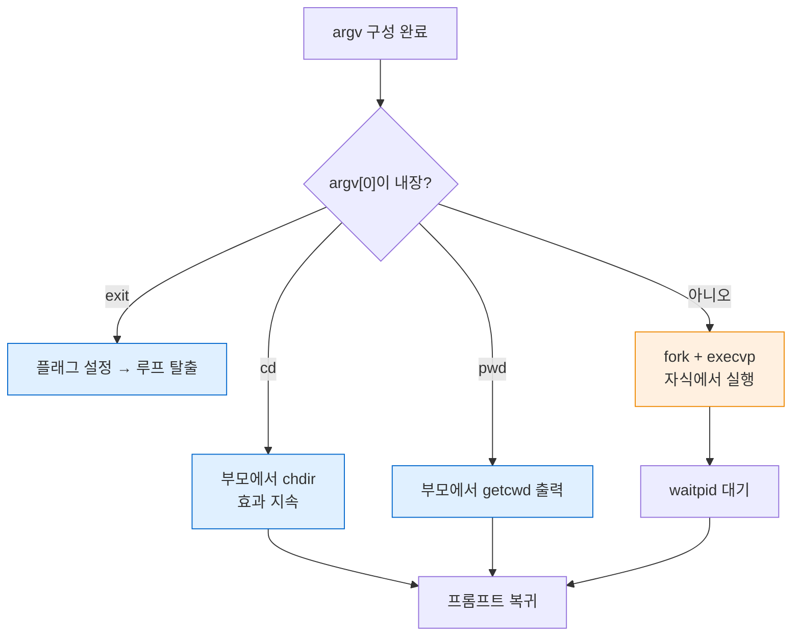
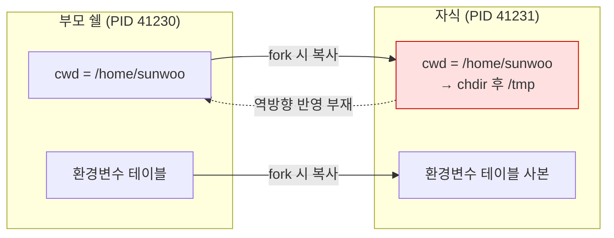

---
tags:
  - lang/c
  - c/system
  - project/make-shell
  - shell
  - builtin
  - chdir
  - process
  - status/verified
created: 2026-08-14
updated: 2026-08-14
---

# 05 · 내장 명령

> `cd`·`exit`·`pwd`를 자식이 아닌 **부모 프로세스**에서 처리. 프로세스 상태 격리 이해

## 목표

- 내장 명령(builtin)과 외부 명령의 분기 처리
- `cd`가 외부 프로그램으로 구현 불가능한 이유 실증
- `chdir`·`getcwd`·`getenv` 활용

## 개념

- 내장 명령 — 쉘 프로세스 **자신의 상태**를 변경하는 명령. 자식에서 실행하면 효과 소멸
- 프로세스 상태 격리 — 작업 디렉토리(cwd), 환경변수, 열린 파일 디스크립터는 프로세스별 소유. `fork` 시 **복사**되며 자식 변경분은 부모에 미반영
- 최소 내장 명령 3종
  - `cd` — cwd 변경 → 부모 필수
  - `exit` — 쉘 자신 종료 → 부모 필수
  - `pwd` — 외부 `/bin/pwd` 존재하나 내장 구현이 일반적 (성능·일관성)
- 분기 위치 — `fork` **이전**. 내장이면 부모에서 즉시 처리 후 반환

## Java와의 차이

Java에 대응 개념 부재. `ProcessBuilder.directory()`는 자식 프로세스의 시작 디렉토리를 지정할 뿐, JVM 자신의 cwd는 변경 불가 (`user.dir` 시스템 프로퍼티 변경은 이후 상대 경로 해석에 미반영). C의 `chdir`은 호출 프로세스 자신의 cwd를 실제로 변경 → 이 차이가 내장 명령 필요성의 근거

## 코드

### 자식에서 `chdir` 시 효과 소멸 실증

```c
#include <stdio.h>
#include <stdlib.h>
#include <string.h>
#include <unistd.h>
#include <sys/wait.h>
#include <limits.h>

// 자식에서 chdir 호출 → 자식 종료와 함께 소멸 → 부모 쉘의 cwd 불변
int main(void) {
    char cwd[PATH_MAX];

    if (getcwd(cwd, sizeof(cwd)) == NULL) { perror("getcwd"); return 1; }
    printf("부모 시작 cwd: %s\n", cwd);

    fflush(stdout);                           // fork 전 플러시 → 버퍼 복제로 인한 중복 방지
    pid_t pid = fork();
    if (pid == 0) {
        if (chdir("/tmp") < 0) { perror("chdir"); _exit(1); }
        getcwd(cwd, sizeof(cwd));
        printf("자식 chdir 후 cwd: %s\n", cwd);
        fflush(stdout);                       // _exit은 버퍼 미플러시
        _exit(0);
    }
    wait(NULL);

    getcwd(cwd, sizeof(cwd));
    printf("부모 종료 cwd: %s  ← 변경 안 됨\n", cwd);
    return 0;
}
```

```bash
gcc -Wall -Wextra -g cd_demo.c -o cd_demo && ./cd_demo
```

- `-Wall` — 주요 경고 활성. 미초기화 변수·타입 불일치 등 검출
- `-Wextra` — `-Wall` 미포함 추가 경고 활성
- `-g` — 디버그 심볼 포함. lldb 추적·ASan 행 번호 표시에 필요
- `-o cd_demo` — 출력 파일명을 `cd_demo`로 지정. 미지정 시 `a.out`
- `&& ./cd_demo` — 컴파일 성공 시에만 실행

```
부모 시작 cwd: /private/tmp/shell-verify
자식 chdir 후 cwd: /private/tmp
부모 종료 cwd: /private/tmp/shell-verify  ← 변경 안 됨
```

- 자식의 cwd만 `/tmp`로 변경. 부모는 원래 위치 유지 → `cd`를 외부 명령으로 구현 불가 확정
- macOS 특성 — `/tmp`는 `/private/tmp` 심볼릭 링크. `getcwd`가 실제 경로 반환

### 내장 명령 디스패치

```c
#include <stdbool.h>

// 내장 명령이면 처리 후 true 반환. 외부 명령이면 false → fork 경로로 진행
static bool run_builtin(char **argv, int *status, bool *should_exit) {
    if (strcmp(argv[0], "exit") == 0) {
        *should_exit = true;
        *status = (argv[1] != NULL) ? atoi(argv[1]) : 0;
        return true;
    }

    if (strcmp(argv[0], "cd") == 0) {
        const char *dir = argv[1];
        if (dir == NULL) {
            dir = getenv("HOME");                  // 인자 없는 cd → 홈 디렉토리
            if (dir == NULL) {
                fprintf(stderr, "cd: HOME 미설정\n");
                *status = 1;
                return true;
            }
        }
        if (chdir(dir) < 0) {                      // ← 부모에서 호출해야 효과 지속
            perror(dir);
            *status = 1;
        } else {
            *status = 0;
        }
        return true;
    }

    if (strcmp(argv[0], "pwd") == 0) {
        char cwd[PATH_MAX];
        if (getcwd(cwd, sizeof(cwd)) == NULL) {
            perror("pwd");
            *status = 1;
        } else {
            printf("%s\n", cwd);
            *status = 0;
        }
        return true;
    }

    return false;                                  // 내장 아님
}
```

- 반환값으로 "처리 여부"를, 출력 파라미터로 "결과"를 분리 전달 — C에 다중 반환 부재로 인한 관용 패턴
- `atoi` — 오류 검출 불가(비숫자 → 0). 엄밀한 처리 필요 시 `strtol` 사용

### 메인 루프 통합

```c
size_t n = 0;
char **argv = tokenize(line, &n);

if (n > 0) {
    bool should_exit = false;
    if (run_builtin(argv, &last_status, &should_exit)) {
        if (should_exit) { free(argv); free(line); break; }
    } else {
        last_status = run_command(argv);           // 4단계 fork/exec 경로
    }
}
free(argv);
free(line);
```

- `last_status` — 직전 명령 종료 코드 보관. `$?` 확장 구현 시 활용

## 동작 구조

내장·외부 분기 — `fork` 이전에 결정



파란 = 부모 프로세스 처리 · 주황 = 자식 프로세스 처리

`fork` 시 프로세스 상태 복사 관계



- 점선 = 자식 변경분이 부모로 전파되지 않음. 내장 명령이 필요한 근본 이유

## 함정 · 주의점

- `cd`를 외부 명령 경로로 넘김 → 자식 cwd만 변경 → 사용자 관점에서 "아무 일도 없음"
- `fork` 전 `fflush(stdout)` 누락 → 미플러시 버퍼가 자식으로 복제 → **동일 출력 2회**. 실제 검증 중 재현됨
- 자식에서 `_exit` 직전 `fflush` 누락 → 자식 출력 소실. `_exit`은 stdio 버퍼 미플러시. 실제 검증 중 재현됨
- `cd` 인자 없음 → `argv[1]`이 `NULL` → `chdir(NULL)` 시 정의되지 않은 동작. `getenv("HOME")` 대체 필요
- `getenv` 반환값 미검사 → `HOME` 미설정 환경(cron 등)에서 `NULL` 역참조
- `getenv` 반환 문자열 `free` 호출 → 환경 블록 소유이므로 힙 손상. 해제 금지
- `chdir` 반환값 미검사 → 존재하지 않는 디렉토리로 이동 실패해도 성공처럼 동작
- `char cwd[PATH_MAX]` 스택 배열 — macOS `PATH_MAX` = 1024. 스택 부담 크지 않으나 재귀 함수 내부에서는 주의

## 확장 과제 (선택)

- `cd -` — 직전 디렉토리 복귀. `OLDPWD` 환경변수 관리 필요
- `export`·`env` — `setenv`·`environ` 활용
- `$?` 확장 — `last_status`를 토큰 치환 단계에서 반영

## 검증

- [ ] `cd /tmp` 후 `pwd` → `/private/tmp` 출력 (변경 지속)
- [ ] 인자 없는 `cd` → 홈 디렉토리 이동
- [ ] `cd /존재하지않음` → 오류 메시지 출력 후 쉘 유지
- [ ] `exit` → 쉘 종료, `exit 3` → 종료 코드 3
- [ ] 내장 명령 실행 시 자식 프로세스 미생성 (`ps` 확인)
- [ ] 출력 중복 부재 (`fork` 전 플러시 확인)

## 다음 단계

[[C/projects/make-shell/06-redirection|06 · 리다이렉션]] — `open`·`dup2`로 파일 디스크립터 조작

## 관련 문서

- [[C/projects/make-shell/04-process-exec|04 · 프로세스 실행]] — `fork`·`execvp`·`waitpid` 실전
- [[C/projects/make-shell/08-signals-history|08 시그널 · 히스토리]] — `sigaction`과 연결 리스트
- [[C/projects/make-shell/README|make-shell 로드맵]] — 쉘 구현 10단계 커리큘럼
