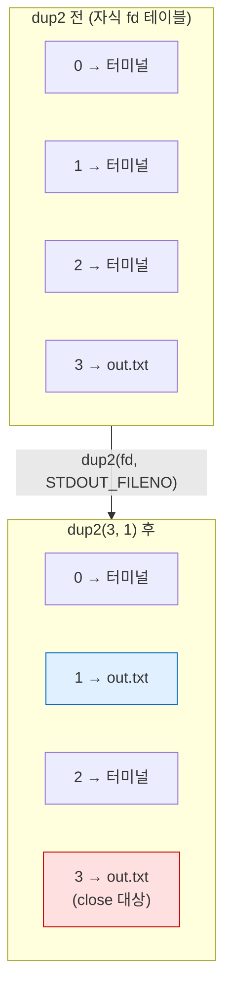
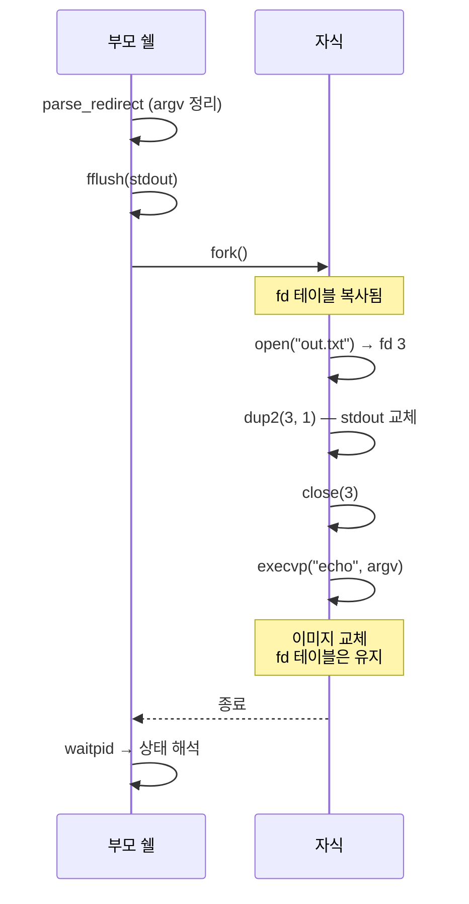

# 06 · 리다이렉션

> `>`·`>>`·`<` 처리. `open`·`dup2`로 파일 디스크립터 교체. `fork`와 `exec` 사이 구간 활용

## 목표

- 파일 디스크립터 개념 및 표준 스트림 3종 이해
- `dup2`를 이용한 fd 재지정
- `argv`에서 리다이렉션 토큰 분리 및 제거

## 개념

- 파일 디스크립터(fd) — 프로세스별 열린 파일 테이블의 **정수 인덱스**. 0 = stdin, 1 = stdout, 2 = stderr
- `open(path, flags, mode)` — 파일 열고 **사용 가능한 최소 번호** fd 반환
- `dup2(oldfd, newfd)` — `newfd`를 닫고 `oldfd`의 복제본으로 만듦. 이후 `newfd`로의 입출력이 `oldfd` 대상으로 향함
- 적용 시점 — `fork` 이후, `execvp` 이전. **fd 테이블은 `exec` 후에도 유지**되므로 새 프로그램이 그대로 상속
- `argv` 정리 필수 — `>`·파일명 토큰이 `argv`에 남으면 실행 대상 명령의 인자로 전달됨. 제거 후 `execvp` 호출
- 플래그 조합
  - `>` → `O_WRONLY | O_CREAT | O_TRUNC` (기존 내용 삭제)
  - `>>` → `O_WRONLY | O_CREAT | O_APPEND` (뒤에 추가)
  - `<` → `O_RDONLY`
- `mode` 인자 `0644` — `O_CREAT` 시 새 파일 권한. 8진수 표기

## Java와의 차이

| 항목 | Java | C |
|---|---|---|
| 리다이렉션 | `ProcessBuilder.redirectOutput(File)` | `open` + `dup2` 수동 조합 |
| 스트림 식별 | `InputStream` 객체 | 정수 fd (0·1·2) |
| 자원 해제 | try-with-resources 자동 | `close` 명시 호출 |
| 상속 제어 | 라이브러리 내부 처리 | fd 테이블이 `exec` 후 자동 유지 |

## 코드

### 리다이렉션 토큰 분리

```c
#include <stdio.h>
#include <stdlib.h>
#include <string.h>
#include <unistd.h>
#include <fcntl.h>
#include <sys/wait.h>

typedef struct {
    char *in_file;      // < 대상. 없으면 NULL
    char *out_file;     // > 또는 >> 대상
    int   append;       // >> 이면 1
} redirect_t;

// argv에서 > < >> 와 파일명 토큰 제거. 남은 인자 개수 반환
static int parse_redirect(char **argv, redirect_t *rd) {
    memset(rd, 0, sizeof(*rd));
    int w = 0;                                   // 기록 위치 (압축용)

    for (int r = 0; argv[r] != NULL; r++) {
        if (strcmp(argv[r], "<") == 0 || strcmp(argv[r], ">") == 0 || strcmp(argv[r], ">>") == 0) {
            if (argv[r + 1] == NULL) {
                fprintf(stderr, "구문 오류: %s 뒤 파일명 없음\n", argv[r]);
                return -1;
            }
            if (argv[r][0] == '<')       rd->in_file  = argv[r + 1];
            else                       { rd->out_file = argv[r + 1];
                                         rd->append   = (strcmp(argv[r], ">>") == 0); }
            r++;                                 // 파일명 토큰 건너뜀
        } else {
            argv[w++] = argv[r];                 // 명령 토큰만 앞으로 압축
        }
    }
    argv[w] = NULL;
    return w;
}
```

- 읽기 인덱스 `r`·쓰기 인덱스 `w` 분리 — 제자리(in-place) 압축 관용 패턴. 추가 할당 부재
- `rd`의 문자열은 `line` 버퍼 내부 지시 → 개별 `free` 금지 (3단계 소유권 규약 유지)

### fd 교체 적용

```c
// 자식에서만 호출. 실패 시 _exit
static void apply_redirect(const redirect_t *rd) {
    if (rd->in_file) {
        int fd = open(rd->in_file, O_RDONLY);
        if (fd < 0) { perror(rd->in_file); _exit(1); }
        dup2(fd, STDIN_FILENO);                  // fd 0을 파일로 교체
        close(fd);                               // 원본 불필요
    }
    if (rd->out_file) {
        int flags = O_WRONLY | O_CREAT | (rd->append ? O_APPEND : O_TRUNC);
        int fd = open(rd->out_file, flags, 0644);
        if (fd < 0) { perror(rd->out_file); _exit(1); }
        dup2(fd, STDOUT_FILENO);                 // fd 1을 파일로 교체
        close(fd);
    }
}
```

- `dup2` 후 `close(fd)` — 동일 파일을 가리키는 fd 2개 중 원본 정리. 미호출 시 fd 누수
- 부모에서 호출 금지 — 쉘 자신의 stdout이 파일로 바뀜 → 프롬프트 소실

### 실행 경로 통합

```c
static int run_command(char **argv, const redirect_t *rd) {
    fflush(stdout);
    pid_t pid = fork();
    if (pid < 0) { perror("fork"); return -1; }
    if (pid == 0) {
        apply_redirect(rd);                      // exec 전에 적용 → 새 프로그램이 그대로 상속
        execvp(argv[0], argv);
        perror(argv[0]);
        _exit(127);
    }
    int status;
    waitpid(pid, &status, 0);
    return WIFEXITED(status) ? WEXITSTATUS(status) : -1;
}
```

## 동작 구조

fd 테이블 변화 — `dup2` 전후



fork · dup2 · exec 순서



- 핵심 — `exec`는 메모리 이미지만 교체. fd 테이블은 보존 → 리다이렉션이 새 프로그램에 그대로 적용

## 컴파일 · 실행

```bash
gcc -Wall -Wextra -g main.c -o mysh && ./mysh
```

검증 시퀀스 — `>` 생성, `>>` 추가, `<` 입력

```
[rc=0]
[rc=0]
       2
[rc=0]
--- out.txt 내용 ---
first line
second line
```

- 1행 `echo "first line" > out.txt` → 파일 생성
- 2행 `echo "second line" >> out.txt` → 추가 (덮어쓰기 부재)
- 3행 `wc -l < out.txt` → `2` 출력 → 표준 입력 교체 확인

## 함정 · 주의점

- 부모에서 `dup2` 호출 → 쉘 자신의 stdout이 파일로 전환 → 프롬프트 소실, 복구 불가. 반드시 자식에서만
- `argv`에서 `>`·파일명 미제거 → `echo hello > out.txt` 가 `echo`에 4개 인자 전달 → 화면에 `hello > out.txt` 출력
- `O_CREAT` 사용 시 `mode` 인자 누락 → 파일 권한 미정의 값. 가변 인자 함수이므로 컴파일 오류 부재
- `dup2` 후 `close(fd)` 누락 → fd 누수. 장시간 실행 시 `EMFILE`(too many open files)
- `open` 반환값 미검사 → 권한 없는 경로에서 `-1` 반환 → `dup2(-1, 1)` 실패 → 출력 소실
- `O_TRUNC` 동작 — `>` 는 명령 실행 **전에** 파일을 비움. `cat a.txt > a.txt` → 내용 소실 (실제 쉘과 동일 동작)
- 리다이렉션 파싱을 `strtok_r` 분해 전에 시도 → `echo hi>out` 처럼 공백 없는 형태 미처리. 본 구현은 공백 구분 전제 (확인 필요 시 문자 단위 렉서로 확장)

## CLion 팁

- `Run` 구성의 `Redirect input from` 으로 stdin 파일 지정 가능 — 쉘 자체 테스트 자동화에 활용
- 디버거에서 fd 상태 직접 확인 불가 → `lsof -p <pid>` 병용

## 검증

- [ ] `echo hello > out.txt` → 파일 생성 및 내용 일치
- [ ] `echo world >> out.txt` → 기존 내용 유지하며 추가
- [ ] `wc -l < out.txt` → 행 수 정확
- [ ] 리다이렉션 후 프롬프트가 터미널에 정상 출력 (부모 stdout 보존)
- [ ] `> /권한없는경로/x` → 오류 메시지 출력 후 쉘 유지
- [ ] `echo a > f.txt` 실행 후 `argv`에 `>` 토큰 부재

## 다음 단계

[07 · 파이프](07-pipes.md) — `pipe`로 프로세스 간 통신 연결

## 관련 문서

- [04 · 프로세스 실행](04-process-exec.md)
- [05 · 내장 명령](05-builtins.md)
