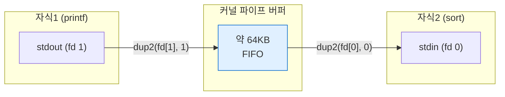
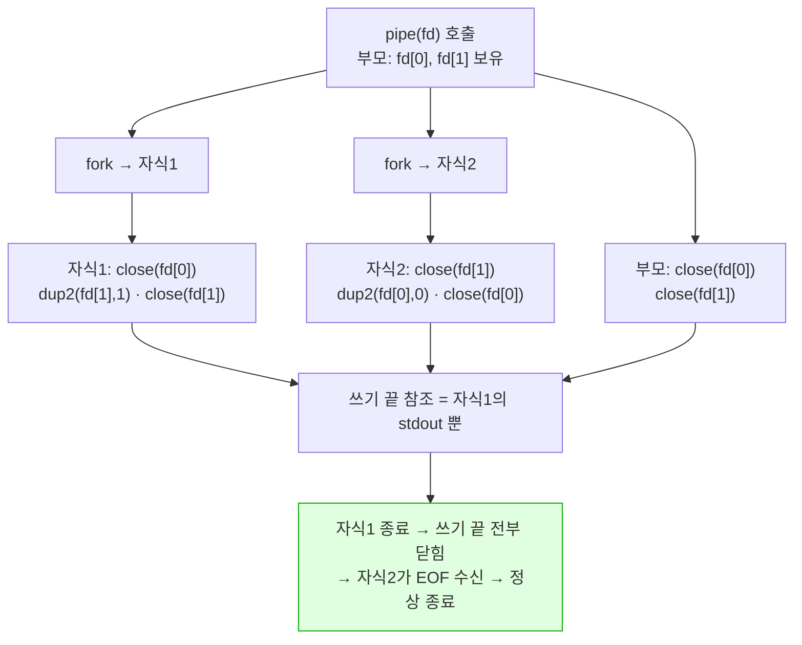
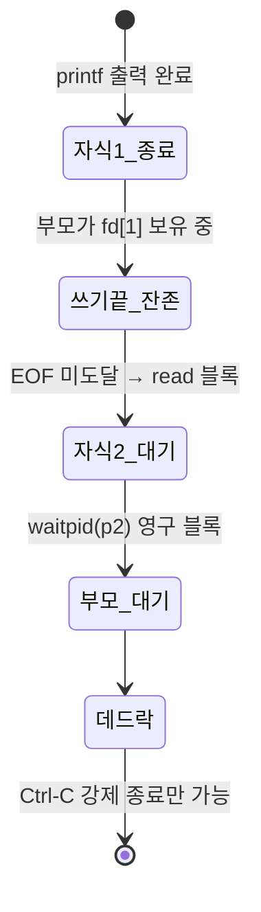

# 07 · 파이프

> `cmd1 | cmd2` 구현. `pipe`로 커널 버퍼 생성 후 두 프로세스 fd 연결. fd 닫기 규율이 핵심

## 목표

- `pipe` 시스템 콜로 단방향 통신 채널 생성
- 두 자식 프로세스의 stdout·stdin 연결
- 사용하지 않는 fd 전량 차단 — 미차단 시 데드락 발생 원리 이해

## 개념

- `pipe(int fd[2])` — 커널 버퍼 생성. `fd[0]` = 읽기 끝, `fd[1]` = 쓰기 끝. 단방향
- 연결 구조 — 왼쪽 명령의 stdout → `fd[1]`, 오른쪽 명령의 stdin → `fd[0]`
- **EOF 조건** — 쓰기 끝을 가리키는 fd가 **모든 프로세스에서** 닫혀야 읽기 측이 EOF 수신
  - 하나라도 열려 있으면 읽기 측이 영원히 대기 → 데드락
  - `fork` 시 fd 테이블 복사 → 부모·자식 양쪽 모두 정리 필요
- 파이프라인 종료 코드 — 관례상 **마지막 명령**의 종료 코드 사용
- 동시 실행 — 왼쪽·오른쪽이 병렬 동작. 순차 실행 아님. 버퍼가 차면 쓰기 측 블록 → 자연스러운 흐름 제어

## Java와의 차이

| 항목 | Java | C |
|---|---|---|
| 프로세스 연결 | `ProcessBuilder.startPipeline(...)` | `pipe` + 다중 `fork` + `dup2` 수동 |
| 버퍼 관리 | 라이브러리 처리 | 커널 버퍼 (기본 64KB 수준, 환경별 상이) |
| 종료 조건 | 스트림 close 자동 처리 | 모든 쓰기 끝 fd 수동 차단 |
| 데드락 위험 | 낮음 | fd 미차단 시 즉시 발생 |

## 코드

`run_pipe` — 파이프 1개, 프로세스 2개

```c
#include <stdio.h>
#include <stdlib.h>
#include <unistd.h>
#include <sys/wait.h>

// left | right 실행. 파이프 1개 = 프로세스 2개
static int run_pipe(char **left, char **right) {
    int fd[2];                                   // fd[0]=읽기, fd[1]=쓰기
    if (pipe(fd) < 0) { perror("pipe"); return -1; }

    fflush(stdout);

    pid_t p1 = fork();
    if (p1 == 0) {                               // 왼쪽: stdout → 파이프 쓰기측
        close(fd[0]);                            // 쓰지 않는 끝 반드시 닫기
        dup2(fd[1], STDOUT_FILENO);
        close(fd[1]);
        execvp(left[0], left);
        perror(left[0]);
        _exit(127);
    }

    pid_t p2 = fork();
    if (p2 == 0) {                               // 오른쪽: stdin ← 파이프 읽기측
        close(fd[1]);                            // ← 미차단 시 EOF 미도달 → 무한 대기
        dup2(fd[0], STDIN_FILENO);
        close(fd[0]);
        execvp(right[0], right);
        perror(right[0]);
        _exit(127);
    }

    close(fd[0]);                                // 부모도 양쪽 모두 닫아야 함
    close(fd[1]);

    int st1, st2;
    waitpid(p1, &st1, 0);
    waitpid(p2, &st2, 0);
    return WIFEXITED(st2) ? WEXITSTATUS(st2) : -1;   // 파이프라인 상태 = 마지막 명령
}
```

- `close` 호출 6회 — 자식 2개 × 2회 + 부모 2회. 하나라도 누락 시 행(hang) 가능
- 부모의 `close`를 `waitpid` **이전에** 배치 — 이후 배치 시 오른쪽 명령이 EOF 미수신 → `waitpid` 영구 블록

## 동작 구조

파이프 연결 관계



fd 닫기 규율 — 총 6회



데드락 발생 경로 — 부모가 `fd[1]` 미차단



## 컴파일 · 실행

```bash
gcc -Wall -Wextra -g main.c -o mysh && ./mysh
```

```
=== printf | sort ===
apple
apple
banana
cherry
[rc=0]
=== printf | wc -l ===
       3
[rc=0]
```

- `printf "banana\napple\ncherry\napple\n" | sort` → 정렬 결과 정확
- `printf "a\nb\nc\n" | wc -l` → `3` → 파이프 통과 데이터 정확
- 두 실행 모두 즉시 종료 → 데드락 부재 확인

## 함정 · 주의점

- 부모가 `fd[1]` 미차단 → 읽기 측 EOF 미도달 → **영구 행**. 파이프 구현 최다 실수
- 자식1이 `fd[0]` 미차단 → 자식1 자신이 읽기 끝 보유 → 자식2 종료 후에도 참조 잔존 (역방향 문제)
- `close`를 `dup2` 이전에 호출 → 복제 대상 소멸 → `dup2` 실패
- 부모의 `close`를 `waitpid` 이후 배치 → 데드락. 순서 고정 필요
- 오른쪽 명령 조기 종료(`head` 등) → 왼쪽 명령이 `SIGPIPE` 수신 → 종료. 정상 동작이나 종료 코드 141(`128+13`) 발생
- `waitpid` 2회 호출 필수 — 1회만 하면 나머지가 좀비 잔존
- 파이프 버퍼 초과 시 쓰기 블록 → 읽기 측이 소비하지 않으면 데드락. 두 자식을 **모두 생성한 후** 대기해야 하는 이유

## 확장 과제 (선택)

N단 파이프라인 (`a | b | c | ...`) — 반복 구조로 일반화

```c
// 개요: 명령 i마다 파이프 생성, 이전 파이프의 읽기 끝을 stdin으로 연결
// prev_read 변수로 직전 파이프 읽기 fd를 넘기며 순회
// 마지막 명령은 파이프 미생성 → stdout 그대로 사용
// 각 반복에서 사용 완료한 fd 즉시 close 필수
```

- 검증 미완료 — N단 구현은 실제 작성 후 별도 확인 필요
- 리다이렉션(6단계)과 결합 시 우선순위 — 파이프 분할 먼저, 각 구간별 리다이렉션 파싱 나중

## 검증

- [ ] `ls | wc -l` 정상 동작 및 즉시 종료
- [ ] `cat 파일 | sort` 결과 정확
- [ ] 파이프 실행 후 프롬프트 정상 복귀 (행 부재)
- [ ] `ps` 확인 시 좀비 프로세스 부재
- [ ] 왼쪽 명령 미존재 시 오른쪽만 실행되고 쉘 유지
- [ ] `lsof -p <쉘 PID>` 확인 시 파이프 fd 누적 부재

## 다음 단계

[08 · 시그널 · 히스토리](08-signals-history.md) — `Ctrl-C` 처리 및 연결 리스트 기반 히스토리

## 관련 문서

- [06 · 리다이렉션](06-redirection.md)
