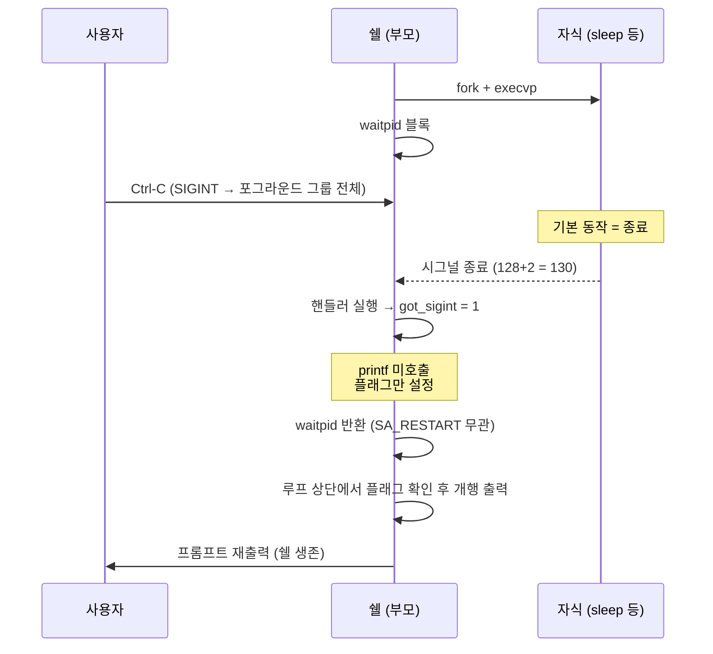
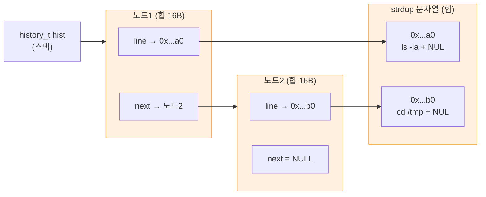
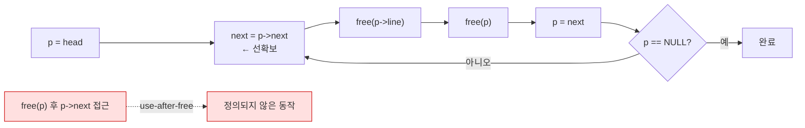

# 08 · 시그널 · 히스토리

> `Ctrl-C`로 쉘이 죽지 않게 처리. 연결 리스트로 입력 이력 관리. 비동기 처리와 자료구조 소유권

## 목표

- `sigaction` 기반 `SIGINT` 처리 — 쉘 유지, 실행 중 자식만 중단
- 시그널 핸들러 제약(async-signal-safe) 이해
- 연결 리스트 구현 및 전량 해제 — `strdup` 소유권 규약

## 개념

### 시그널

- `SIGINT` — `Ctrl-C`. 기본 동작 = 프로세스 종료 → 미처리 시 쉘 자체가 죽음
- `sigaction` vs `signal` — 후자는 플랫폼별 동작 상이(핸들러 재설정 여부 등). `sigaction` 고정 권장
- 핸들러 제약 — 비동기 실행이므로 **async-signal-safe 함수만** 호출 가능. `printf`·`malloc`·`free` 전부 불가
  - 실무 관용 패턴 — 핸들러는 **플래그만 설정**, 실제 처리는 메인 루프에서
- `volatile sig_atomic_t` — 핸들러·메인 간 공유 변수 전용 타입. `volatile` = 컴파일러 최적화 제거, `sig_atomic_t` = 분할 불가 접근 보장
- `SA_RESTART` — 시그널로 중단된 시스템 콜 자동 재시작. 미지정 시 `read`가 `EINTR` 반환 → 별도 처리 필요
- 자식 프로세스 — 터미널 포그라운드 그룹에 속하므로 `Ctrl-C` 자동 수신. 쉘만 무시하면 의도한 동작 성립

### 히스토리

- 단일 연결 리스트 — 노드마다 `char *line` + `next` 포인터
- `strdup` — 문자열 힙 복사본 생성. **원본 `line` 해제와 무관하게 유지** 필요 → 사본 필수
- 소유권 — 노드가 문자열 소유 → 해제 시 `free(p->line)` 후 `free(p)` 2회
- 순회 중 해제 — `free(p)` 전에 `p->next` 별도 변수 확보 필수

## Java와의 차이

| 항목 | Java | C |
|---|---|---|
| 시그널 처리 | `Runtime.addShutdownHook` (종료 시에만) | `sigaction` 임의 시그널 처리 |
| 핸들러 제약 | 일반 코드 실행 가능 | async-signal-safe 함수만 |
| 리스트 | `LinkedList<String>` | 구조체 + 포인터 수동 구현 |
| 노드 해제 | GC 자동 | 노드·문자열 각각 `free` |
| 문자열 복사 | 불변이라 참조 공유 안전 | 원본 소멸 대비 `strdup` 필요 |

## 코드

### SIGINT 핸들러

```c
#include <stdio.h>
#include <stdlib.h>
#include <string.h>
#include <unistd.h>
#include <signal.h>

static volatile sig_atomic_t got_sigint = 0;     // 핸들러-메인 공유 변수 전용 타입

static void on_sigint(int signo) {
    (void)signo;                                 // 미사용 인자 경고 억제
    got_sigint = 1;                              // 플래그만 설정. printf 등 호출 금지
}

// main 진입 직후 등록
struct sigaction sa;
memset(&sa, 0, sizeof(sa));
sa.sa_handler = on_sigint;
sigemptyset(&sa.sa_mask);
sa.sa_flags = SA_RESTART;                        // 중단된 시스템 콜 자동 재시작
sigaction(SIGINT, &sa, NULL);
```

메인 루프에서 플래그 확인

```c
while (1) {
    if (got_sigint) {
        got_sigint = 0;
        printf("\n");                            // 안전한 지점에서 출력
    }
    printf("mysh> ");
    fflush(stdout);
    // ... read_line, tokenize, 실행
}
```

- 자식 실행 중 `Ctrl-C` → 자식이 `SIGINT`로 종료, 쉘은 플래그만 설정 후 프롬프트 복귀

### 히스토리 연결 리스트

```c
typedef struct hist_node {
    char *line;
    struct hist_node *next;
} hist_node;

typedef struct {
    hist_node *head;
    hist_node *tail;                             // 말미 추가 O(1)
    size_t count;
} history_t;

// strdup으로 사본 보관 → 원본 line 해제와 무관하게 유지
static int history_add(history_t *h, const char *line) {
    if (line[0] == '\0') return 0;               // 빈 줄 미기록
    hist_node *n = malloc(sizeof(hist_node));
    if (n == NULL) return -1;
    n->line = strdup(line);                      // ← 사본 생성. 노드가 소유
    if (n->line == NULL) { free(n); return -1; }
    n->next = NULL;
    if (h->tail) h->tail->next = n; else h->head = n;
    h->tail = n;
    h->count++;
    return 0;
}

static void history_print(const history_t *h) {
    size_t i = 1;
    for (hist_node *p = h->head; p != NULL; p = p->next, i++)
        printf("%5zu  %s\n", i, p->line);
}

static void history_free(history_t *h) {
    hist_node *p = h->head;
    while (p != NULL) {
        hist_node *next = p->next;               // 해제 전 다음 주소 확보
        free(p->line);                           // 문자열 먼저
        free(p);                                 // 노드 나중
        p = next;
    }
    h->head = h->tail = NULL;
    h->count = 0;
}
```

- `struct hist_node` 내부에서 자기 타입 포인터 선언 — `typedef` 이름은 아직 미정의이므로 `struct hist_node *` 표기 필수
- `history_t hist = {0};` — 전체 0 초기화. 포인터 미초기화 시 쓰레기 값 역참조

`history` 내장 명령 연동 — 5단계 `run_builtin`에 추가

```c
if (strcmp(argv[0], "history") == 0) {
    history_print(hist);
    *status = 0;
    return true;
}
```

## 동작 구조

시그널 처리 흐름



히스토리 리스트 메모리 구조



- 노드 2개 = 힙 블록 4개(노드 2 + 문자열 2) → `free` 호출 4회 필요

순회 중 해제 — 다음 주소 선확보 필요성



## 컴파일 · 실행

```bash
gcc -Wall -Wextra -g -fsanitize=address main.c -o mysh && ./mysh
```

- `-Wall` — 주요 경고 활성. 미초기화 변수·타입 불일치 등 검출
- `-Wextra` — `-Wall` 미포함 추가 경고 활성
- `-g` — 디버그 심볼 포함. lldb 추적·ASan 행 번호 표시에 필요
- `-fsanitize=address` — AddressSanitizer 활성. 힙 오버플로·use-after-free 즉시 검출
- `-o mysh` — 출력 파일명을 `mysh`로 지정. 미지정 시 `a.out`
- `&& ./mysh` — 컴파일 성공 시에만 실행

히스토리 동작 (빈 줄 제외 확인)

```
    1  ls -la
    2  cd /tmp
    3  history
총 4건
해제 후 count=0
```

- 입력 5건 중 빈 줄 1건 제외 → 리스트 3건 시점 출력, 이후 `echo done` 추가로 최종 4건
- ASan 누수 보고 부재 → `history_free` 전량 해제 확인

시그널 핸들러 동작 — `raise`로 자기 자신에 전송

```bash
gcc -Wall -Wextra -g sig_test.c -o sig_test && ./sig_test
```

- `-Wall` — 주요 경고 활성. 미초기화 변수·타입 불일치 등 검출
- `-Wextra` — `-Wall` 미포함 추가 경고 활성
- `-g` — 디버그 심볼 포함. lldb 추적·ASan 행 번호 표시에 필요
- `-o sig_test` — 출력 파일명을 `sig_test`로 지정. 미지정 시 `a.out`
- `&& ./sig_test` — 컴파일 성공 시에만 실행

```
raise 후 got=1 (핸들러가 종료 대신 플래그 설정)
```

- 기본 동작(종료)이 아닌 핸들러 실행 확인. 프로그램 정상 진행

## 함정 · 주의점

- 핸들러에서 `printf`·`malloc`·`free` 호출 → 재진입 시 힙 손상·데드락. 플래그 설정만 허용
- `int got_sigint` 사용 → 컴파일러 최적화로 루프에서 재읽기 생략 가능. `volatile sig_atomic_t` 필수
- `signal()` 사용 → 플랫폼별 핸들러 재설정 동작 상이. `sigaction` 고정
- `struct sigaction sa;` 미초기화 → `sa_flags`·`sa_mask` 쓰레기 값. `memset` 또는 `= {0}` 필수
- `strdup` 미사용하고 `n->line = line` 대입 → 원본 `line` 해제 후 댕글링 포인터
- `strdup` 반환값 미검사 → 할당 실패 시 `NULL` 저장 → 출력 시 크래시
- `free(p)` 후 `p->next` 접근 → use-after-free. ASan 없으면 우연히 동작하기도 함 (더 위험)
- `history_free` 누락 → 종료 시 전량 누수. `exit` 경로에도 호출 필요
- `tail` 미갱신 → 두 번째 이후 추가가 리스트에 미반영
- `SIGINT` 무시(`SIG_IGN`) 설정 → 자식도 무시 상속 → `Ctrl-C`로 자식 중단 불가. 핸들러 방식 사용

## 확장 과제 (선택)

- 파일 영속화 — 종료 시 `~/.mysh_history` 저장, 시작 시 로드
- 개수 제한 — N건 초과 시 head 제거 (원형 버퍼 또는 이중 연결 리스트)
- 방향키 탐색 — 터미널 raw 모드 + 이스케이프 시퀀스 파싱 필요. `termios` 사용. 난이도 상승 → GNU Readline 연동이 현실적 대안 (외부 라이브러리 도입 검토 필요)
- `SIGCHLD` 처리 — 백그라운드 실행(`&`) 구현 시 좀비 자동 회수

## 검증

- [ ] 실행 중 `Ctrl-C` → 자식만 종료, 쉘 프롬프트 복귀
- [ ] 프롬프트 대기 중 `Ctrl-C` → 개행 후 새 프롬프트 (쉘 생존)
- [ ] `history` → 입력 순서대로 번호와 함께 출력
- [ ] 빈 줄이 히스토리에 미기록
- [ ] ASan 실행 후 누수 보고 부재 (`history_free` 동작)
- [ ] 종료 시 `history_free` 호출 확인

## 다음 단계

[09 · 프로젝트 구조화](09-project-layout.md) — 단일 파일 분할, 헤더 작성, CMake 도입

## 관련 문서

- [04 · 프로세스 실행](04-process-exec.md)
- [05 · 내장 명령](05-builtins.md)
