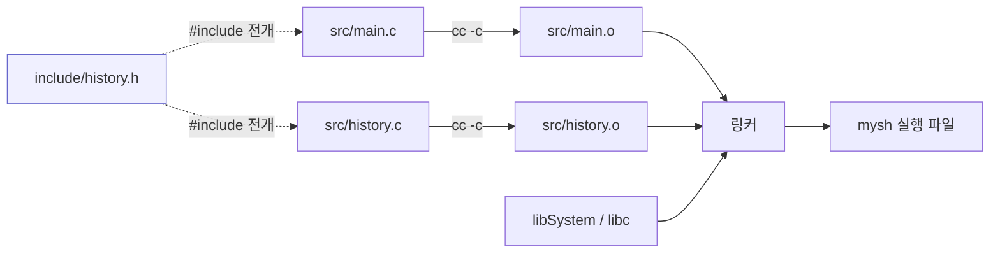
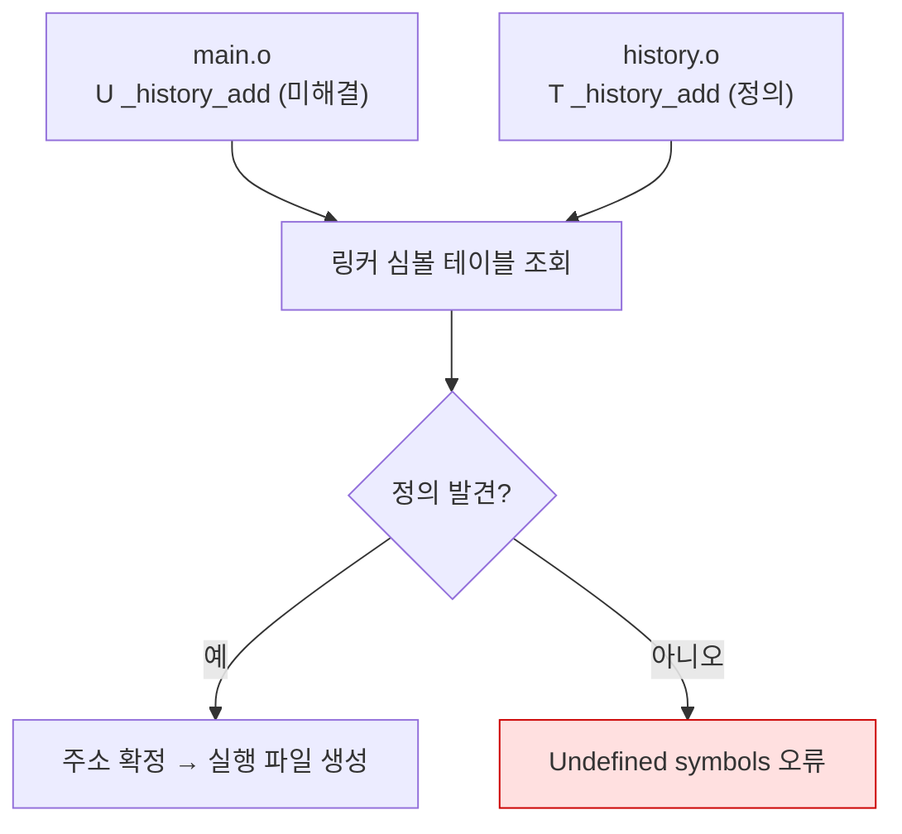

---
tags:
  - lang/c
  - c/project-layout
  - project/make-shell
  - shell
  - header
  - makefile
  - cmake
  - status/wip
created: 2026-08-14
updated: 2026-08-14
---

# 09 · 프로젝트 구조화

> 단일 `main.c` 분할. 헤더·소스 분리, 인클루드 가드, Make·CMake 빌드 시스템 도입

## 목표

- 기능 단위 파일 분할 및 헤더 인터페이스 설계
- 분할 컴파일 → 링크 과정 실증
- Make 증분 빌드 및 CMake 구성 작성

## 개념

- 헤더(`.h`) — **선언**만. 타입 정의, 함수 프로토타입, 매크로. 다른 파일에 노출할 인터페이스
- 소스(`.c`) — **정의**(구현). 외부 미노출 함수는 `static`으로 파일 내부 한정
- 번역 단위(translation unit) — `.c` 1개 + 전개된 헤더 = 독립 컴파일 단위. `.o` 목적 파일 산출
- 인클루드 가드 — 동일 헤더 중복 전개 방지. `#ifndef` / `#define` / `#endif`
- 링크 — 각 `.o`의 미해결 심볼을 상호 연결. 이 시점에 함수 정의 부재 발견
- 증분 빌드 — 변경된 `.c`만 재컴파일 후 재링크. 파일 수 증가 시 효과 확대

## Java와의 차이

| 항목 | Java | C |
|---|---|---|
| 선언·정의 | 한 파일에 통합 | `.h` 선언 / `.c` 정의 분리 |
| 참조 방법 | `import` (클래스패스 탐색) | `#include` (텍스트 치환) |
| 중복 방지 | 언어가 처리 | 인클루드 가드 수동 작성 |
| 가시성 | `public`·`private` 키워드 | `static`(파일 한정) / 기본(외부 노출) |
| 빌드 | Gradle·Maven이 의존성 자동 추적 | Make·CMake에 규칙 기술 |
| 미정의 참조 | 컴파일 시점 오류 | **링크 시점** 오류 |

**`#include`는 텍스트 치환** — 헤더 내용을 그 자리에 그대로 붙여넣음. `import`처럼 심볼 참조가 아님 → 중복 포함 시 타입 재정의 오류 발생 → 가드 필수

## 디렉토리 구조

```
make-shell/
├── CMakeLists.txt
├── Makefile
├── include/            # 공개 헤더
│   ├── history.h
│   ├── parser.h
│   └── executor.h
├── src/                # 구현
│   ├── main.c
│   ├── history.c
│   ├── parser.c        # read_line, tokenize, parse_redirect
│   └── executor.c      # run_command, run_pipe, run_builtin
└── build/              # 빌드 산출물 (git 제외)
```

- `include/` 분리 — 공개 인터페이스 명확화. 소규모 프로젝트는 `src/`에 `.h` 동거도 무방
- `build/` — `.gitignore` 등록 대상. 목적 파일·실행 파일 커밋 금지

## 코드

### 헤더 — `include/history.h`

```c
#ifndef MYSH_HISTORY_H          // 인클루드 가드: 중복 포함 방지
#define MYSH_HISTORY_H

#include <stddef.h>             // size_t

typedef struct hist_node {
    char *line;
    struct hist_node *next;
} hist_node;

typedef struct {
    hist_node *head;
    hist_node *tail;
    size_t count;
} history_t;

int  history_add(history_t *h, const char *line);   // 선언만. 정의는 .c
void history_print(const history_t *h);
void history_free(history_t *h);

#endif  // MYSH_HISTORY_H
```

- 가드 매크로명 — `프로젝트_파일명_H` 관례. 충돌 방지
- 헤더에 필요한 표준 헤더만 포함 (`size_t` → `<stddef.h>`). `<stdio.h>` 등 불필요한 것 미포함
- `#pragma once` 대안 존재 — 비표준이나 주요 컴파일러 지원. 본 문서는 표준 가드 사용

### 소스 — `src/history.c`

```c
#include "history.h"            // 자기 헤더 우선 포함 → 선언·정의 불일치 즉시 발견
#include <stdio.h>
#include <stdlib.h>
#include <string.h>

int history_add(history_t *h, const char *line) {
    if (line[0] == '\0') return 0;
    hist_node *n = malloc(sizeof(hist_node));
    if (n == NULL) return -1;
    n->line = strdup(line);
    if (n->line == NULL) { free(n); return -1; }
    n->next = NULL;
    if (h->tail) h->tail->next = n; else h->head = n;
    h->tail = n;
    h->count++;
    return 0;
}

void history_print(const history_t *h) {
    size_t i = 1;
    for (hist_node *p = h->head; p != NULL; p = p->next, i++)
        printf("%5zu  %s\n", i, p->line);
}

void history_free(history_t *h) {
    hist_node *p = h->head;
    while (p != NULL) {
        hist_node *next = p->next;
        free(p->line);
        free(p);
        p = next;
    }
    h->head = h->tail = NULL;
    h->count = 0;
}
```

- `#include "history.h"` — 따옴표는 소스 기준 상대 경로 우선 탐색. 표준 헤더는 `<>`

### `src/main.c`

```c
#include "history.h"
#include <stdio.h>

int main(void) {
    history_t hist = {0};
    history_add(&hist, "ls -la");
    history_add(&hist, "cd /tmp");
    history_print(&hist);
    printf("count=%zu\n", hist.count);
    history_free(&hist);
    return 0;
}
```

### Makefile

```make
CC      := cc
CFLAGS  := -Wall -Wextra -g -Iinclude
SRCS    := $(wildcard src/*.c)
OBJS    := $(SRCS:.c=.o)
TARGET  := mysh

$(TARGET): $(OBJS)
	$(CC) $(OBJS) -o $@

%.o: %.c
	$(CC) $(CFLAGS) -c $< -o $@

clean:
	rm -f $(OBJS) $(TARGET)

.PHONY: clean
```

- **들여쓰기는 반드시 탭**. 스페이스 사용 시 `missing separator` 오류
- `$@` = 타겟명, `$<` = 첫 의존 파일. `%.o: %.c` = 패턴 규칙
- `.PHONY` — 동명 파일 존재 시에도 규칙 실행 보장
- 한계 — 헤더 변경 미추적. `history.h` 수정 시 재빌드 미발생. 해결책은 `-MMD -MP` 자동 의존성 생성 (확장 과제)

### CMakeLists.txt

```cmake
cmake_minimum_required(VERSION 3.20)
project(mysh C)

set(CMAKE_C_STANDARD 11)
set(CMAKE_C_STANDARD_REQUIRED ON)

add_executable(mysh
        src/main.c
        src/history.c
)

target_include_directories(mysh PRIVATE include)
target_compile_options(mysh PRIVATE -Wall -Wextra)
```

- CLion 기본 빌드 시스템. 프로젝트 열면 자동 인식
- 헤더 의존성 자동 추적 → Make의 한계 없음
- 셸 PATH에 `cmake` CLI 부재. CLion 번들 CMake(4.3.1) 경로 — `/Applications/CLion.app/Contents/bin/cmake/mac/aarch64/bin/cmake`
- `target_include_directories`·`target_compile_options` 반영 확인 완료 → [[C/docs/03-build/cmake-guide|CMakeLists.txt 작성법]]
- **주의** — 위 Makefile과 빌드 디렉토리를 공유하면 산출물 혼재·`make clean` 시 캐시 삭제 발생. 상세는 CMake 문서의 충돌 4종 참조

ASan 옵션 추가

```cmake
target_compile_options(mysh PRIVATE -fsanitize=address)
target_link_options(mysh PRIVATE -fsanitize=address)
```

- 컴파일·링크 **양쪽** 지정 필수. 한쪽만 하면 링크 오류

## 동작 구조

분할 컴파일 → 링크 파이프라인



- 점선 = 텍스트 전개(컴파일 전). 실선 = 산출물 생성

심볼 해결 과정



- `nm` 출력의 `T` = 정의(text 섹션), `U` = 미해결(undefined)

## 컴파일 · 실행

### 수동 분할 컴파일

```bash
cc -Wall -Wextra -g -Iinclude -c src/main.c -o main.o
cc -Wall -Wextra -g -Iinclude -c src/history.c -o history.o
cc main.o history.o -o mysh
./mysh
```

- `-Wall` — 주요 경고 활성. 미초기화 변수·타입 불일치 등 검출
- `-Wextra` — `-Wall` 미포함 추가 경고 활성
- `-g` — 디버그 심볼 포함. lldb 추적·ASan 행 번호 표시에 필요
- `-Iinclude` — `include` 디렉토리를 헤더 탐색 경로에 추가
- `-c` — 컴파일까지만 수행하고 링크 생략 → 목적 파일(`.o`) 생성
- `-o main.o` — 출력 파일명을 `main.o`로 지정. 미지정 시 `a.out`
- `-o history.o` — 출력 파일명을 `history.o`로 지정. 미지정 시 `a.out`
- `-o mysh` — 출력 파일명을 `mysh`로 지정. 미지정 시 `a.out`

```
    1  ls -la
    2  cd /tmp
count=2
```

목적 파일 심볼 확인

```bash
nm -g history.o | grep history_
```

- `-g` — 외부 노출(전역) 심볼만 출력. `static` 함수 제외
- `| grep history_` — `history_` 접두 심볼만 필터링

```
0000000000000000 T _history_add
0000000000000178 T _history_free
00000000000000f4 T _history_print
```

- `T` = 외부 노출 정의. `static` 함수는 목록에서 부재 (또는 `t` 소문자)
- macOS 심볼은 언더스코어 접두 (`_history_add`) — Linux(`history_add`)와 상이

### Make 빌드

```bash
make
```

```
cc -Wall -Wextra -g -Iinclude -c src/history.c -o src/history.o
cc -Wall -Wextra -g -Iinclude -c src/main.c -o src/main.o
cc src/history.o src/main.o -o mysh
```

증분 빌드 확인 — 변경 없음

```bash
make
```

```
make: `mysh' is up to date.
```

`history.c`만 수정 후

```bash
touch src/history.c && make
```

```
cc -Wall -Wextra -g -Iinclude -c src/history.c -o src/history.o
cc src/history.o src/main.o -o mysh
```

- `main.c` 재컴파일 부재 → 증분 빌드 동작 확인
- `main.o` 재사용 후 재링크만 수행

## 함정 · 주의점

- 인클루드 가드 누락 → 중복 포함 시 `redefinition of 'struct ...'` 오류
- 헤더에 함수 **정의** 작성 → 여러 `.c`가 포함 시 `duplicate symbol` 링크 오류. 선언만 배치
- 헤더에 전역 변수 정의 → 동일 문제. `extern` 선언만 헤더, 정의는 `.c` 한 곳
- `-Iinclude` 누락 → `fatal error: 'history.h' file not found`
- 링크 시 `.o` 누락 → `Undefined symbols for architecture arm64: "_history_add"`
- Makefile 들여쓰기에 스페이스 사용 → `Makefile:8: *** missing separator. Stop.`
- Make의 헤더 의존성 미추적 → 헤더 수정 후 `make` 무반응 → 구조체 정의 불일치 상태로 링크 → 실행 시 이상 동작. `make clean` 후 재빌드 또는 자동 의존성 도입
- `build/`·`*.o` 커밋 → 저장소 오염. `.gitignore` 필수
- `static` 미사용 → 파일 내부 전용 함수가 전역 심볼로 노출 → 이름 충돌 위험

## `.gitignore` 권장 항목

```
build/
cmake-build-*/
*.o
*.d
mysh
.idea/
```

- CLion은 `cmake-build-debug/`·`cmake-build-release/` 생성
- `.idea/` — 개인 IDE 설정. 팀 공유 시 일부 파일만 선별 포함하는 방식도 존재

## 확장 과제 (선택)

자동 의존성 추적 — Make의 헤더 미추적 문제 해결

```make
CFLAGS  := -Wall -Wextra -g -Iinclude -MMD -MP
DEPS    := $(OBJS:.o=.d)
-include $(DEPS)
```

- `-MMD` — 컴파일 시 `.d` 의존성 파일 생성
- `-MP` — 헤더 삭제 시 오류 방지용 더미 타겟 추가
- 검증 미완료 — 실제 적용 후 헤더 수정 시 재빌드 여부 확인 필요

## 검증

- [ ] 파일 분할 후 정상 빌드 및 기존 동작 유지
- [ ] 헤더 중복 포함 시 오류 부재 (가드 동작)
- [ ] `make` 재실행 시 `up to date` 출력
- [ ] 단일 `.c` 수정 시 해당 파일만 재컴파일
- [ ] `nm`으로 심볼 노출 범위 확인
- [ ] `.gitignore`에 빌드 산출물 등록
- [ ] CLion에서 CMake 프로젝트 정상 인식 및 빌드

## 다음 단계

[[C/projects/make-shell/10-debugging|10 · 디버깅 · 검증]] — ASan·lldb·회귀 테스트

## 관련 문서

- [[C/projects/make-shell/08-signals-history|08 · 시그널 · 히스토리]] — `sigaction`과 연결 리스트
- [[C/docs/03-build/cmake-guide|CMakeLists.txt 작성법]] — 위 CMakeLists 문법 상세와 Makefile 병행 시 충돌 4종
- [[C/projects/make-shell/README|make-shell 로드맵]] — 쉘 구현 10단계 커리큘럼
