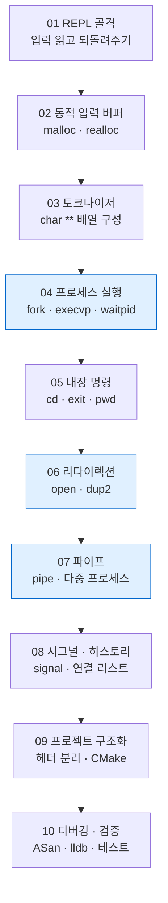

---
tags:
  - lang/c
  - c/system
  - project/make-shell
  - index
  - moc
  - shell
  - status/verified
aliases:
  - make-shell 로드맵
created: 2026-08-14
updated: 2026-08-14
---

# make-shell — C 쉘 개발 로드맵

> 직접 타이핑한 명령을 실행하는 최소 쉘을 단계적으로 구현하며 시스템 프로그래밍 필수 요소 학습

## 목표

- 최종 산출물 — 대화형 프롬프트, 명령 실행, 파이프·리다이렉션, 내장 명령, 히스토리, 시그널 처리를 갖춘 쉘
- 학습 대상 — 문자열·메모리 수동 관리, 동적 자료구조, 프로세스 생성·대기, 파일 디스크립터, 시그널, 빌드 시스템, 디버깅

## 왜 쉘인가

| 시스템 프로그래밍 요소 | 쉘에서 등장하는 지점 |
|---|---|
| 힙 메모리 수동 관리 | 입력 버퍼, 토큰 배열, 히스토리 |
| 포인터·이중 포인터 | `char **argv` 구성 |
| 문자열 처리 | 파싱, 따옴표, 이스케이프 |
| 프로세스 | `fork` · `execvp` · `waitpid` |
| 파일 디스크립터 | `dup2` 리다이렉션, `pipe` |
| 시그널 | `Ctrl-C` 처리, 좀비 회수 |
| 빌드 시스템 | 다중 파일 분할 후 CMake·Make |
| 디버깅 | ASan 누수 추적, lldb 브레이크포인트 |

## 단계 구성



파란 단계 = 시스템 콜 핵심 구간

## 문서 목록

| 단계 | 문서 | 핵심 주제 | 신규 시스템 콜·함수 |
|---|---|---|---|
| 01 | [REPL 골격](01-repl-skeleton.md) | 무한 루프, 표준 입출력 | `fgets` · `printf` · `fflush` |
| 02 | [동적 입력 버퍼](02-dynamic-input.md) | 힙 할당, 크기 확장 | `malloc` · `realloc` · `free` |
| 03 | [토크나이저](03-tokenizer.md) | 문자열 분해, 이중 포인터 | `strtok_r` · `strdup` |
| 04 | [프로세스 실행](04-process-exec.md) | 프로세스 생성·교체·대기 | `fork` · `execvp` · `waitpid` |
| 05 | [내장 명령](05-builtins.md) | 부모 프로세스 상태 변경 | `chdir` · `getcwd` · `getenv` |
| 06 | [리다이렉션](06-redirection.md) | 파일 디스크립터 조작 | `open` · `dup2` · `close` |
| 07 | [파이프](07-pipes.md) | 프로세스 간 통신 | `pipe` · 다중 `fork` |
| 08 | [시그널 · 히스토리](08-signals-history.md) | 비동기 처리, 연결 리스트 | `signal` · `sigaction` |
| 09 | [프로젝트 구조화](09-project-layout.md) | 헤더 분리, 빌드 시스템 | CMake · Make |
| 10 | [디버깅 · 검증](10-debugging.md) | 누수·오류 추적 | ASan · lldb · `valgrind` |

## 진행 방식

- 각 단계 = 동작하는 실행 파일 하나. 단계 완료 시점에 항상 실행 가능 상태 유지
- 이전 단계 코드를 확장하는 방식. 매 단계 새로 작성하지 않음
- 각 문서의 `검증` 절 통과 후 다음 단계 진행
- 막히는 개념 발생 시 해당 개념을 `docs/<카테고리>`에 별도 학습 문서로 분리

## 소스 배치

```
C/projects/make-shell/
├── README.md              # 이 문서
├── 01-repl-skeleton.md    # 단계별 문서
├── ...
└── src/                   # 실제 구현 (단계 진행하며 생성)
    ├── main.c
    └── ...
```

- 단계별 스냅샷 보존이 필요하면 `src/` 대신 `step-01/` … 형태로 분리 가능. 기본은 단일 `src/` 누적 확장

## 선행 지식

- 필수 — C 기본 문법(변수·함수·구조체·배열), `gcc` 단일 파일 컴파일 경험
- 학습하며 습득 — 포인터 산술, 이중 포인터, 힙 관리, 시스템 콜, 빌드 시스템
- 참고 — macOS 기준 작성. Linux 대비 차이 지점은 각 문서에서 별도 표기

## 관련 문서

- [[C/docs/README|학습 문서 인덱스]] — 카테고리별 전체 문서 목록
- [[C/projects/make-shell/01-repl-skeleton|01 REPL 골격]] — REPL 루프와 표준 입출력
- [[C/projects/make-shell/02-dynamic-input|02 동적 입력 버퍼]] — `malloc`·`realloc` 소유권 규약
- [[C/projects/make-shell/03-tokenizer|03 토크나이저]] — `strtok_r`와 이중 포인터
- [[C/projects/make-shell/04-process-exec|04 프로세스 실행]] — `fork`·`execvp`·`waitpid` 실전
- [[C/projects/make-shell/05-builtins|05 내장 명령]] — 내장 명령과 프로세스 상태 격리
- [[C/projects/make-shell/06-redirection|06 리다이렉션]] — `open`·`dup2` 파일 디스크립터 조작
- [[C/projects/make-shell/07-pipes|07 파이프]] — `pipe`와 fd 닫기 규율
- [[C/projects/make-shell/08-signals-history|08 시그널 · 히스토리]] — `sigaction`과 연결 리스트
- [[C/projects/make-shell/09-project-layout|09 프로젝트 구조화]] — 헤더 분리와 Make·CMake
- [[C/projects/make-shell/10-debugging|10 디버깅 · 검증]] — ASan·lldb·누수 검사
