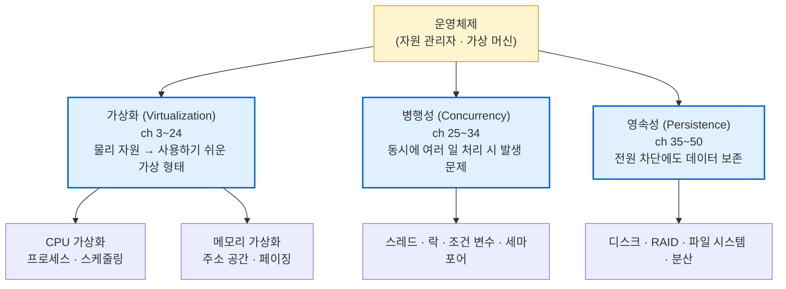
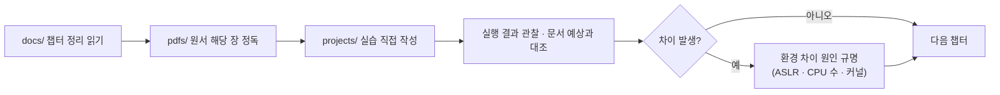

---
tags:
  - topic/os
  - ostep/index
  - moc
aliases:
  - OSTEP
  - 운영체제 아주 쉬운 세 가지 이야기
created: 2026-08-19
updated: 2026-08-19
---

# OSTEP — Operating Systems: Three Easy Pieces

> 위스콘신 대학 Remzi·Andrea Arpaci-Dusseau 저 운영체제 전공서. **가상화 · 병행성 · 영속성** 세 축으로 OS 전체를 관통

## 이 저장소 구성

| 디렉토리 | 역할 | 진입점 |
|---|---|---|
| `pdfs/` | 한국어 번역 원서 PDF 53편 (파트별 분류) | [[OS/ostep/pdfs/README\|원서 PDF 인덱스]] |
| `docs/` | 챕터별 이론 정리. 책의 절 번호·서술 장치를 그대로 대응 | [[OS/ostep/docs/README\|이론 문서 인덱스]] |
| `projects/` | 책 등장 C 코드 기반 실습. 직접 작성·컴파일·실행 | [[OS/ostep/projects/README\|실습 프로젝트 인덱스]] |

## 세 가지 이야기 (Three Easy Pieces)



- **가상화** — 하나의 물리 CPU·메모리를 여러 개인 것처럼 보이게 하는 환상(illusion) 제공
- **병행성** — 환상 제공 과정에서 OS 자신이 먼저 마주친 문제. 현대 멀티스레드 프로그램에서도 동일하게 재현
- **영속성** — 휘발성 메모리와 달리 전원 차단 후에도 남아야 하는 데이터 관리

## 책의 서술 장치 (범례)

원서가 반복 사용하는 5가지 장치. 이론 문서도 동일 장치를 유지 → 원서와 교차 대조 가능.

| 장치    | 원서 표기                           | 문서 표기                          | 의미                    |
| ----- | ------------------------------- | ------------------------------ | --------------------- |
| 핵심 문제 | 음영 박스 `THE CRUX OF THE PROBLEM` | `> [!question] CRUX`           | 해당 챕터가 풀려는 문제 한 줄 정의  |
| 여담    | `ASIDE: ...`                    | `> [!note] ASIDE`              | 본문에 필수는 아니나 관련 있는 배경  |
| 팁     | `TIP: ...`                      | `> [!tip] TIP`                 | 시스템 구축 일반 교훈          |
| 대화    | Dialogue 챕터                     | 별도 문서                          | 교수·학생 문답 형식. 파트 도입·복습 |
| 타임라인  | 시간 순 표                          | 표 또는 Mermaid `sequenceDiagram` | 시간에 따른 동작 전개          |

> [!tip] TIP: 실제 코드로 배울 것 (원서 서문)
> 원서는 의사 코드가 아닌 **실제 C 코드**를 사용. 직접 타이핑하고 실행하는 것이 학습의 최선 → `projects/` 존재 이유

## 학습 순서



1. 이론 문서로 개념·용어 파악
2. 원서 PDF로 세부 논증·그림 확인
3. 실습 프로젝트로 코드 작성·실행
4. 실행 결과가 책과 다르면 그 차이 자체를 학습 대상으로 취급 — macOS·Apple Silicon 환경 차이가 빈번

## 환경

문서 내 모든 실행 결과의 측정 환경.

```bash
uname -mrs
```

```text
Darwin 25.5.0 arm64
```

```bash
gcc --version | head -1
sysctl -n hw.ncpu
```

```text
Apple clang version 21.0.0 (clang-2100.1.1.101)
10
```

- `uname -mrs` — `-m` 하드웨어 아키텍처, `-r` 커널 릴리스, `-s` 커널 이름
- `gcc --version` — macOS에서 `gcc` 는 Apple clang 심볼릭 래퍼. 실제 컴파일러는 clang
- `head -1` — 버전 첫 줄만 추출
- `sysctl -n hw.ncpu` — 논리 CPU 수 조회. `-n` 은 키 이름 생략하고 값만 출력

> [!note] ASIDE: 원서 환경과의 차이
> 원서 예제는 Linux 기준. macOS는 **ASLR 강제 활성**(비활성화 불가), **`/proc` 부재**, **일부 시스템 콜 시그니처 상이** → 재현 결과가 책과 다른 경우 존재. 해당 챕터 문서에서 개별 명시

## 관련 문서

- [[OS/ostep/docs/README|이론 문서 인덱스]] — 챕터별 이론 정리 진입점
- [[OS/ostep/projects/README|실습 프로젝트 인덱스]] — 코드 실습 커리큘럼
- [[OS/ostep/pdfs/README|원서 PDF 인덱스]] — 번역서 원문 53편
- [[C/docs/README|C 학습 문서 인덱스]] — 실습 코드가 전제하는 C 문법·메모리 지식

## 출처

- 원서 — [OSTEP 공식 사이트](https://pages.cs.wisc.edu/~remzi/OSTEP/) (무료 공개)
- 한국어 번역 — Youjip Won · Minkyu Park · Sungjin Lee 역 (원서 표기 그대로), [ostep-translations](https://github.com/remzi-arpacidusseau/ostep-translations/tree/master/korean)
- 공식 코드 — [ostep-code](https://github.com/remzi-arpacidusseau/ostep-code)
