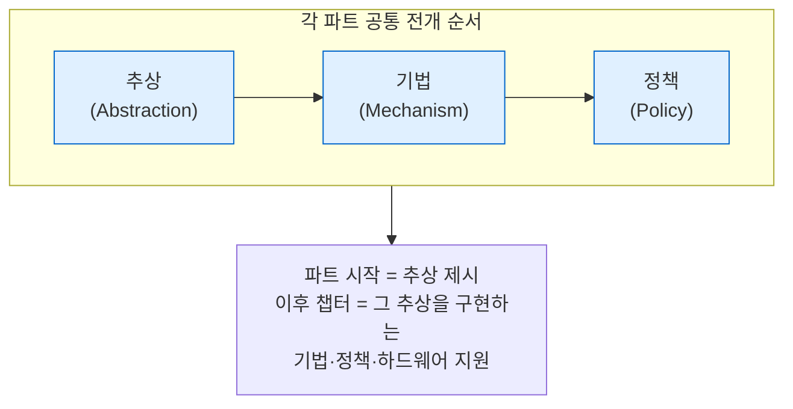

---
tags:
  - topic/os
  - ostep/intro
  - preface
  - study-method
  - status/verified
aliases:
  - OSTEP 서문
  - Preface
created: 2026-08-19
updated: 2026-08-19
---

# 0. 서문 (Preface)

> 책의 구성 원리와 5가지 서술 장치 정의. 본문 독해 전 반드시 파악해야 하는 읽기 규약

- 원서 PDF — [00-Preface.pdf](../../pdfs/00-intro/00-Preface.pdf) · [00-Preface-Translate.pdf](../../pdfs/00-intro/00-Preface-Translate.pdf) · [00-TOC.pdf](../../pdfs/00-intro/00-TOC.pdf)
- 제목 유래 — Richard Feynman의 물리학 강의 노트 *Six Easy Pieces* 에 대한 경의

## 책의 구성 원리

세 가지 주제 축(three easy pieces)으로 OS 전체를 분할. 각 축은 다시 챕터 집합으로 세분.

- **추상(abstraction)** — OS가 제공하는 개념. 예: 프로세스, 주소 공간, 파일
- **기법(mechanism)** — 추상을 구현하는 저수준 프로토콜. 예: 문맥 교환, 주소 변환
- **정책(policy)** — 여러 선택지 중 무엇을 고를지 결정하는 알고리즘. 예: 어느 프로세스를 다음에 실행할지
- 기법·정책 분리는 책 전체를 관통하는 설계 원칙 → 정책 교체 시 기법 재구현 불필요

> [!note] ASIDE: 역사를 함께 서술하는 이유
> 원서는 각 아이디어의 원 논문을 인용(`[V+65]` 형태). 저자 주장 — 무엇이 지금 이렇게 되었는지(`what is`)를 이해하려면 과거(`what was`)를 알아야 함. 인용 표기는 각 챕터 말미 참고문헌과 대응

## 5가지 서술 장치 (범례)

원서가 본문 전체에서 반복 사용하는 장치. 이론 문서도 동일 대응 유지.

| 장치                      | 원서 형태          | 문서 형태                  | 목적                           |
| ----------------------- | -------------- | ---------------------- | ---------------------------- |
| **crux of the problem** | 음영 박스, 대문자 제목  | `> [!question] CRUX`   | 챕터가 풀려는 문제를 본문 앞에 명시         |
| **timeline**            | 시간 순 표         | 표 또는 `sequenceDiagram` | "그때 무슨 일이 일어나는지"를 시간 축으로 전개  |
| **aside**               | `ASIDE:` 제목 박스 | `> [!note] ASIDE`      | 관련 있으나 필수는 아닌 배경             |
| **tip**                 | `TIP:` 제목 박스   | `> [!tip] TIP`         | 시스템 구축 일반 교훈                 |
| **dialogue**            | 교수·학생 문답 챕터    | 독립 문서                  | 파트 도입·복습. 서술 밖에서 생각하게 만드는 장치 |

- `crux` 복수형은 `cruxes` 가 아니라 **`cruces`** — 원서가 명시적으로 언급
- 타임라인 이해가 핵심 — 페이지 폴트 발생 시 무슨 일이 일어나는지 시간 순으로 말할 수 있으면 가상 메모리를 이해한 것
- `aside`·`tip`·`cruces` 는 원서 권말 색인에 별도 목록으로 정리

> [!question] CRUX: 이 책이 답하는 단 하나의 질문
> **운영체제는 자원을 어떻게 가상화하는가(How does the OS virtualize resources)?**
> `why` 는 자명함 — 시스템을 쓰기 쉽게 만들기 위함. 따라서 초점은 `how` 에 있음 — 어떤 기법·정책을 쓰는지, 어떻게 효율적으로 하는지, 어떤 하드웨어 지원이 필요한지

## 학습 방법 (원서 권고)

- 숙제(homework) — OS 일부를 모사한 시뮬레이터. **난수 시드를 바꾸면 사실상 무한한 문제 생성** 가능, 정답 자동 산출 옵션 존재
- 프로젝트(project) — 가장 중요한 부록. 2종 존재
  - **시스템 프로그래밍** — C·UNIX 입문자용 저수준 프로그래밍
  - **xv6 커널** — MIT 개발 교육용 커널 내부 수정. C 경험자용
- 프로젝트·예제 전부 **C 언어**. 대부분 OS의 기반 언어이므로 습득 가치 존재

> [!tip] TIP: 코드를 직접 실행할 것
> 원서는 가능한 곳 전부에서 의사 코드가 아닌 **실제 코드** 사용 → 타이핑해서 돌려볼 수 있음. 공식 코드 저장소 [ostep-code](https://github.com/remzi-arpacidusseau/ostep-code) 제공. 본 저장소 `projects/` 가 이에 대응

## Java 학습 경험과의 대응

| 항목 | Java 학습 | OSTEP 학습 |
|---|---|---|
| 실행 단위 | JVM 위의 스레드 | OS 위의 프로세스·커널 스레드 |
| 메모리 | GC 자동 회수 | 주소 공간을 OS가 가상화, 해제는 프로그램 책임 |
| 동기화 | `synchronized` · `java.util.concurrent` | 락·조건 변수·세마포어를 **직접 구현**하며 원리 확인 |
| I/O | `InputStream` 추상 | 파일 디스크립터 · `read`/`write` 시스템 콜 |
| 관심사 | 언어·프레임워크 계층 | 그 계층이 서 있는 **아래쪽 전부** |

- Java의 `synchronized` 가 무엇을 대신 해주고 있었는지가 파트 2에서 드러남
- GC 부재 환경의 메모리 관리는 파트 1(ch 14·17)에서 다룸

## 관련 문서

- [[OS/ostep/docs/00-intro/01-dialogue|1. 책에 관한 대화]] — 세 가지 이야기 명명 유래
- [[OS/ostep/docs/00-intro/02-introduction|2. 운영체제 개요]] — 세 축의 실제 코드 시연
- [[OS/ostep/docs/README|이론 문서 인덱스]] — 전 챕터 목록
- [[OS/ostep/README|OSTEP 학습 진입점]] — 서술 장치 대응표·측정 환경
