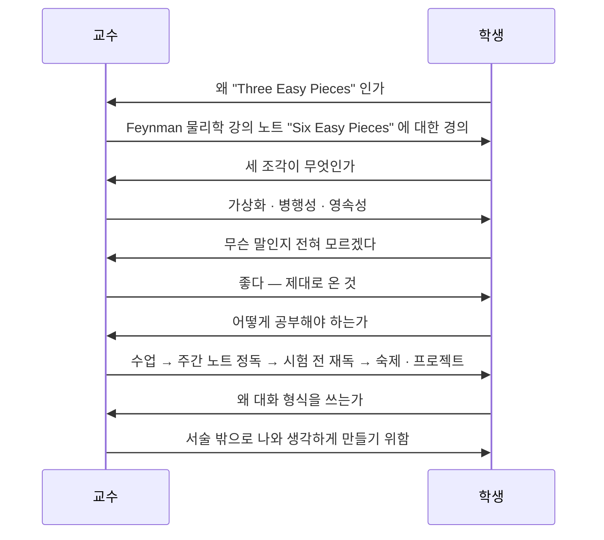
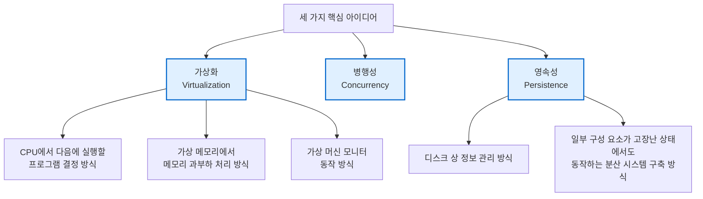

---
tags:
  - topic/os
  - ostep/intro
  - dialogue
  - three-easy-pieces
  - status/verified
aliases:
  - 책에 관한 대화
  - A Dialogue on the Book
created: 2026-08-19
updated: 2026-08-19
---

# 1. 책에 관한 대화 (A Dialogue on the Book)

> 교수·학생 문답 형식으로 책의 제목 유래, 세 가지 축, 학습 방법을 제시하는 도입 챕터

- 원서 PDF — [01-Dialogue.pdf](../../pdfs/00-intro/01-Dialogue.pdf)
- 형식 — Dialogue. 파트 도입·복습에 사용되는 원서의 5가지 서술 장치 중 하나

## 대화 전개

## 제목의 유래

- **Three Easy Pieces** — Richard Feynman의 물리학 강의 노트 요약본 *Six Easy Pieces* 에서 차용
- Feynman은 물리학 6조각, 이 책은 운영체제 3조각
- 저자 농담 — "Operating Systems are about half as hard as Physics" (조각 수가 절반인 근거)

> [!note] ASIDE: Feynman 관련 오해 정정
> 학생이 *Surely You're Joking, Mr. Feynman* (유머 회고록)을 떠올리자 교수가 정정 — 이 책이 닮으려는 것은 **물리학 강의 노트**이지 유머 회고록이 아님

## 세 조각 (Three Easy Pieces)

세 가지 핵심 아이디어. 이 셋을 배우면 OS 동작 전반을 파악하게 됨.

- 원서가 대화에서 예고한 구체 주제 — CPU 스케줄링, 가상 메모리 과부하 처리, VMM, 디스크 정보 관리, 부분 고장 내성 분산 시스템
- 병행성은 이 대화에서 세부 예시 없이 이름만 제시 → ch 25~34에서 전개

> [!question] CRUX: 도입 챕터가 세우는 기대
> 세 단어(가상화·병행성·영속성)만으로 OS 전체를 조직할 수 있는가. 학생의 "무슨 말인지 모르겠다"에 교수가 "좋다"고 답하는 구조 → **모르는 상태가 정상 출발점**임을 명시

## 학습 방법

교수가 제시한 순서. 각자 방법을 찾아야 하나 권고안은 아래.

| 단계 | 시점 | 행위 | 목적 |
|---|---|---|---|
| 1 | 수업 시간 | 강의 청강 | 개념 도입 |
| 2 | 매주 말 | 노트 정독 | 아이디어 정착 |
| 3 | 시험 전 | 노트 재독 | 지식 고정 |
| 4 | 과제 기간 | 숙제 풀이 | 이해 점검 |
| 5 | 프로젝트 | 실제 문제를 푸는 실제 코드 작성 | **최선의 방법** |

- 5단계가 최우선 — "doing projects where you write real code to solve real problems is the best way to put the ideas within these notes into action"
- 본 저장소 대응 — 1~3단계는 `docs/`, 4~5단계는 `projects/`

> [!note] ASIDE: 인용 출처 정정 (원서 각주)
> 통상 공자(Confucius) 것으로 알려진 "I hear and I forget. I see and I remember. I do and I understand" 는 실제로 **순자(Xunzi)** 가 더 정확한 출처. 원서 각주 인용 —
> "Not having heard something is not as good as having heard it; having heard it is not as good as having seen it; having seen it is not as good as knowing it; knowing it is not as good as putting it into practice."
> 나중에 어떤 이유로 공자에게 귀속되었다는 것이 원서 설명

## 대화 형식을 쓰는 이유

- 학생 질문 — "그냥 책인데 왜 자료를 직접 제시하지 않는가"
- 교수 답 — 서술(narrative) 밖으로 자신을 끌어내 **생각하는 시간**이 때때로 유용함. 대화가 그 시간에 해당
- 부수 효과 — 복잡한 아이디어를 교수·학생이 함께 이해해 가는 구조, 유머러스한 문체 허용

## 정리

- 제목은 Feynman 강의 노트 차용. 세 조각 = 가상화 · 병행성 · 영속성
- 모르는 상태에서 시작하는 것이 정상. 세 단어의 의미는 ch 2에서 실제 코드로 확인
- 학습의 최선은 실제 코드 작성 → 이론 문서만 읽고 끝내면 원서 의도 미달

## 관련 문서

- [[OS/ostep/docs/00-intro/00-preface|0. 서문]] — 5가지 서술 장치 정의, 추상·기법·정책 전개 순서
- [[OS/ostep/docs/00-intro/02-introduction|2. 운영체제 개요]] — 세 조각을 실제 C 코드 4개로 시연
- [[OS/ostep/projects/01-intro-four-pieces/README|실습 1. 네 조각 프로그램]] — 대화가 예고한 내용의 첫 실행 실습
- [[OS/ostep/docs/README|이론 문서 인덱스]] — 전 챕터 목록
