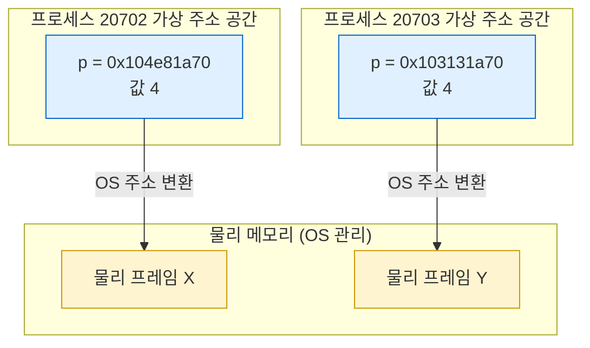
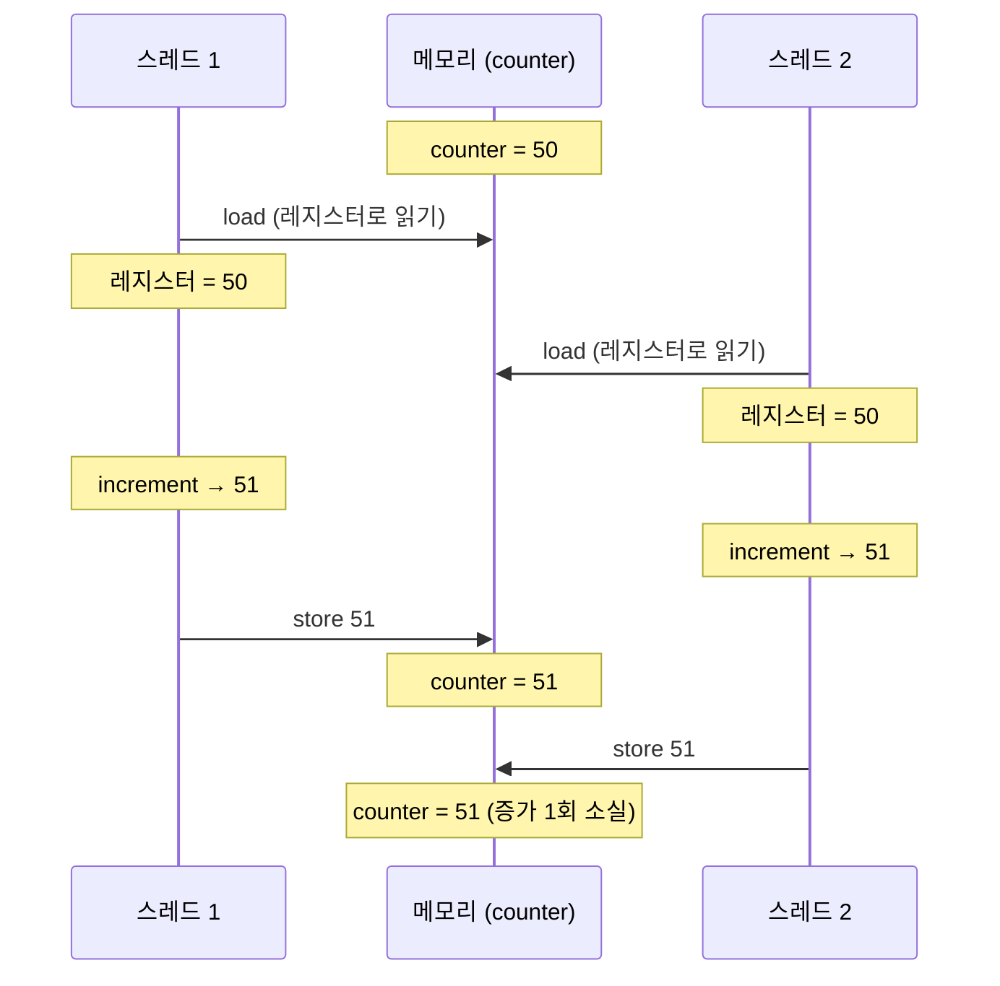
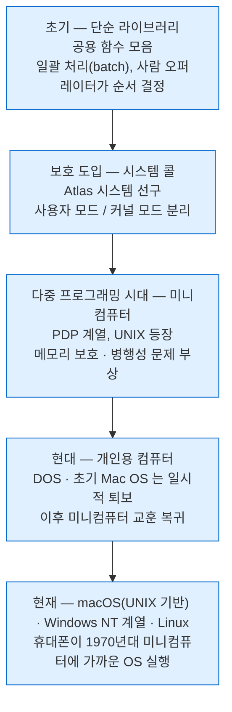
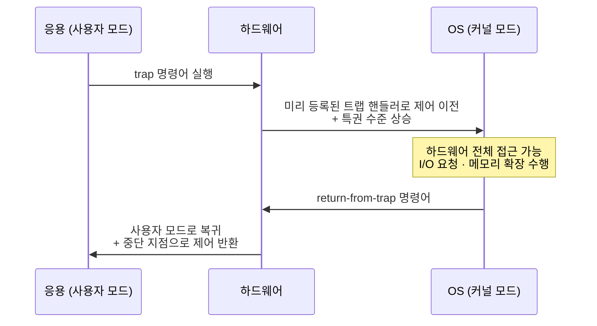

---
tags:
  - topic/os
  - ostep/intro
  - virtualization
  - concurrency
  - persistence
  - system-call
  - lang/c
  - status/verified
aliases:
  - 운영체제 개요
  - Introduction to Operating Systems
created: 2026-08-19
updated: 2026-08-19
---

# 2. 운영체제 개요 (Introduction to Operating Systems)

> 4개 C 프로그램으로 가상화·병행성·영속성을 실증하고, OS 설계 목표와 역사를 개괄하는 챕터

- 원서 PDF — [02-Introduction.pdf](../../pdfs/00-intro/02-Introduction.pdf)
- 실습 — [[OS/ostep/projects/01-intro-four-pieces/README|실습 1. 네 조각 프로그램]]
- 원서 절 구조 — 2.1 CPU 가상화 · 2.2 메모리 가상화 · 2.3 병행성 · 2.4 영속성 · 2.5 설계 목표 · 2.6 역사 · 2.7 요약

## 프로그램이 실행될 때 일어나는 일

- 폰 노이만(Von Neumann) 모델 — 프로세서가 명령어를 **반입(fetch) → 해석(decode) → 실행(execute)** 반복
- 초당 수백만~수십억 회 수행. 명령어 하나 완료 후 다음 명령어로 이동, 프로그램 종료까지 반복
- 이 단순 모델 아래에서 OS가 수많은 일을 대신 수행 → 시스템을 **쓰기 쉽게(easy to use)** 만드는 것이 목적


> [!note] ASIDE: 현대 프로세서의 실상
> 원서 각주 — 실제 프로세서는 속도를 위해 **여러 명령어 동시 실행**, **순서를 바꿔 실행(out-of-order)** 등을 수행. 다만 대부분 프로그램이 가정하는 "한 번에 하나씩 순차 실행" 모델로 논의 진행

## OS의 세 가지 별칭

| 별칭 | 근거 |
|---|---|
| **가상 머신(virtual machine)** | 물리 자원을 더 일반적·강력·사용하기 쉬운 가상 형태로 변환 |
| **표준 라이브러리(standard library)** | 프로그램 실행·메모리 접근·장치 접근을 시스템 콜(API)로 제공. 전형적 OS는 수백 개 시스템 콜 export |
| **자원 관리자(resource manager)** | CPU·메모리·디스크를 여러 프로그램이 공유하도록 효율·공정하게 관리 |

> [!question] CRUX: 이 책의 중심 질문
> **운영체제는 자원을 어떻게 가상화하는가(How does the OS virtualize resources)?**
> `why` 는 자명 — 쓰기 쉽게 만들기 위함. 따라서 초점은 `how` — 어떤 기법·정책을 구현하는지, 어떻게 효율적으로 하는지, 어떤 하드웨어 지원이 필요한지

## 2.1 CPU 가상화 (Virtualizing The CPU)

1초마다 인자로 받은 문자열을 무한 출력하는 프로그램. `Spin(1)` 은 시간을 반복 확인하며 1초를 소모하는 함수.

```c
#include <stdio.h>
#include <stdlib.h>
#include "common.h"   // GetTime() · Spin() 정의

int main(int argc, char *argv[])
{
    if (argc != 2) {                                   // 인자 개수 검증
        fprintf(stderr, "usage: cpu <string>\n");
        exit(1);
    }
    char *str = argv[1];                               // argv[1] = 출력할 문자열

    while (1) {                                        // 무한 루프 — Control-c 로만 종료
        printf("%s\n", str);
        Spin(1);                                       // 1초 소모 (바쁜 대기)
    }
    return 0;
}
```

- 프로그램 자체는 CPU를 계속 점유하며 아무 유용한 일도 하지 않음 → CPU 자원 경쟁 관찰에 적합

```bash
gcc -o cpu cpu.c -Wall
```

- `-o cpu` — 출력 실행 파일명 `cpu` 지정. 미지정 시 `a.out`
- `-Wall` — 주요 경고 전체 활성

```bash
script -q /dev/null ./cpu A 2>&1 | head -4
```

- `script -q /dev/null <명령>` — 의사 터미널(pty) 할당 후 명령 실행. `-q` 는 시작·종료 메시지 억제, `/dev/null` 은 타이핑 기록 파일 폐기
- `2>&1` — 표준 에러를 표준 출력으로 합류
- `| head -4` — 앞 4줄만 취하고 종료
- pty 사용 이유 — `stdout` 이 파이프면 `printf` 가 **전체 버퍼링**(4096바이트)으로 전환되어 출력이 즉시 나오지 않음. pty는 **행 버퍼링** → 1초마다 한 줄씩 관찰 가능

```text
A
A
A
A
```

같은 프로그램을 4개 동시 실행. 셸의 `&` 로 백그라운드 작업 생성.

```bash
script -q /dev/null sh -c './cpu A & ./cpu B & ./cpu C & ./cpu D & wait' 2>&1 | head -12
```

- `sh -c '<명령들>'` — 하위 셸에서 여러 명령을 한 문자열로 실행
- `&` — 각 명령을 백그라운드 작업으로 실행 → 4개 프로세스 동시 생성
- `wait` — 하위 셸이 백그라운드 작업 종료까지 대기. 미지정 시 셸이 즉시 종료되어 pty가 닫힘
- `| head -12` — 12줄 관찰 후 종료

```text
B
A
D
C
B
A
D
C
B
A
D
C
```

- 물리 CPU 수와 무관하게 4개 프로그램이 **동시에 실행되는 것처럼** 보임
- OS가 하드웨어 지원을 받아 만드는 환상 — **가상 CPU가 무수히 존재**하는 듯한 착각
- 이것이 **CPU 가상화**. 파트 1의 첫 주제
- 두 프로그램이 동시에 실행되려 할 때 무엇을 먼저 실행할지는 OS의 **정책(policy)** 이 결정 → ch 7~10 스케줄링

> [!note] ASIDE: 출력 순서가 `A B C D` 가 아닌 이유
> 실측에서 `B A D C` 순으로 시작. 프로세스 생성 순서와 실제 스케줄 순서는 무관 — 스케줄러 결정에 따름. 실행마다 순서 변동 가능

## 2.2 메모리 가상화 (Virtualizing Memory)

물리 메모리 모델은 단순 — **바이트 배열**. 읽기는 주소 지정, 쓰기는 주소와 데이터 지정.

- 프로그램의 모든 자료 구조가 메모리에 존재
- 명령어 자체도 메모리에 존재 → **명령어 반입마다 메모리 접근** 발생

`malloc` 으로 정수 1개 크기를 할당하고, 주소를 출력한 뒤 1초마다 값을 증가시키는 프로그램.

```c
#include <unistd.h>
#include <stdio.h>
#include <stdlib.h>
#include "common.h"

int main(int argc, char *argv[]) {
    if (argc != 2) {
        fprintf(stderr, "usage: mem <value>\n");
        exit(1);
    }
    int *p;
    p = malloc(sizeof(int));                                  // 힙에 int 크기 할당
    assert(p != NULL);                                        // 할당 실패 시 즉시 중단
    printf("(%d) addr pointed to by p: %p\n", (int) getpid(), p);
    *p = atoi(argv[1]);                                       // p가 가리키는 주소에 초기값 저장
    while (1) {
        Spin(1);
        *p = *p + 1;                                          // 같은 주소의 값 증가
        printf("(%d) value of p: %d\n", getpid(), *p);
    }
    return 0;
}
```

- `getpid()` — 실행 중 프로세스의 **PID(프로세스 식별자)** 반환. 프로세스마다 유일
- `%p` — 포인터 값(주소)을 16진수로 출력하는 변환 지정자

```bash
gcc -o mem mem.c -Wall
```

- `-o mem` — 출력 실행 파일명 `mem` 지정
- `-Wall` — 주요 경고 전체 활성

```bash
script -q /dev/null ./mem 0 2>&1 | head -6
```

- `script -q /dev/null <명령>` — pty 할당 실행. `-q` 시작·종료 메시지 억제
- `2>&1` — 표준 에러를 표준 출력으로 합류
- `| head -6` — 6줄 관찰 후 종료

```text
(20691) addr pointed to by p: 0x102969a70
(20691) value of p: 1
(20691) value of p: 2
(20691) value of p: 3
(20691) value of p: 4
(20691) value of p: 5
```

2개 동시 실행 — 각 프로세스가 자기 주소의 값을 **독립적으로** 갱신하는지 확인.

```bash
script -q /dev/null sh -c './mem 0 & ./mem 0 & wait' 2>&1 | head -10
```

- `sh -c '<명령들>'` — 하위 셸에서 두 프로세스 동시 실행
- `&` — 백그라운드 작업 생성
- `wait` — 백그라운드 작업 종료까지 하위 셸 대기
- `| head -10` — 10줄 관찰 후 종료

```text
(20702) addr pointed to by p: 0x104e81a70
(20703) addr pointed to by p: 0x103131a70
(20702) value of p: 1
(20703) value of p: 1
(20702) value of p: 2
(20703) value of p: 2
(20702) value of p: 3
(20703) value of p: 3
(20702) value of p: 4
(20703) value of p: 4
```

- 두 프로세스가 각자 `1, 2, 3, 4` 로 **독립 증가** → 서로의 메모리에 영향 없음
- 각 프로세스는 자신만의 **가상 주소 공간(virtual address space)** 에 접근. OS가 이를 물리 메모리로 매핑
- 프로그램 관점에서는 물리 메모리를 독점한 것처럼 보이나, 실제 물리 메모리는 OS가 관리하는 공유 자원



> [!question] CRUX: 메모리 가상화의 문제
> 물리 메모리는 하나뿐인데, 각 프로세스에게 **자기만의 거대한 주소 공간**을 어떻게 제공하는가. 변환은 어떤 하드웨어 지원으로 빠르게 수행하는가 → ch 13~24

### macOS 실측과 책 결과의 차이 (중요)

원서 실행 결과는 두 프로세스가 **동일 주소** `0x200000` 을 출력. 실측은 서로 다른 주소.

| 항목 | 원서(Linux, ASLR 비활성) | 실측(macOS arm64) |
|---|---|---|
| 프로세스 1 주소 | `0x200000` | `0x104e81a70` |
| 프로세스 2 주소 | `0x200000` | `0x103131a70` |
| 동일 여부 | 동일 | 상이 |

- 원인 — **ASLR(Address Space Layout Randomization)**. 주소 공간 배치를 실행마다 무작위화하는 보안 기법
- 원서 각주 — 이 예제가 책처럼 보이려면 ASLR을 **비활성화**해야 함. ASLR은 스택 스매싱 등 특정 공격에 대한 유효한 방어
- macOS는 ASLR을 커널 수준에서 강제 → 사용자가 끌 수 없음 (확인 필요: 디버거 부착 등 특수 경로 예외 가능성)
- **결론은 동일** — 주소값이 같든 다르든, 각 프로세스가 서로 간섭 없이 자기 값만 갱신한다는 관찰은 그대로 성립. 가상 주소 공간 격리의 증거로 충분

> [!tip] TIP: 관찰이 책과 다를 때
> 값이 다르다고 실습 실패가 아님. **무엇이 결론의 근거인지** 분리할 것 — 여기서 근거는 "주소 동일"이 아니라 "값이 독립 증가". 환경 차이를 규명하는 과정 자체가 OS 학습

## 2.3 병행성 (Concurrency)

두 스레드가 공유 변수 `counter` 를 각각 `loops` 회 증가시키는 프로그램.

```c
#include <stdio.h>
#include <stdlib.h>
#include "common.h"
#include "common_threads.h"   // Pthread_create · Pthread_join 래퍼

volatile int counter = 0;     // 두 스레드가 공유하는 변수
int loops;

void *worker(void *arg) {
    int i;
    for (i = 0; i < loops; i++) {
        counter++;            // ← 문제 지점. 원자적이지 않음
    }
    return NULL;
}

int main(int argc, char *argv[]) {
    if (argc != 2) {
        fprintf(stderr, "usage: threads <loops>\n");
        exit(1);
    }
    loops = atoi(argv[1]);
    pthread_t p1, p2;
    printf("Initial value : %d\n", counter);
    Pthread_create(&p1, NULL, worker, NULL);   // 스레드 1 생성
    Pthread_create(&p2, NULL, worker, NULL);   // 스레드 2 생성
    Pthread_join(p1, NULL);                    // 스레드 1 종료 대기
    Pthread_join(p2, NULL);                    // 스레드 2 종료 대기
    printf("Final value   : %d\n", counter);
    return 0;
}
```

- **스레드** — 다른 함수와 **같은 메모리 공간**에서 실행되는 함수. 여러 개가 동시에 활성 상태
- `Pthread_create` 는 원서 자체 래퍼 — 소문자 `pthread_create` 호출 후 **반환 코드 성공 여부를 검증**. 원서 각주로 명시
- `volatile` — 컴파일러 최적화로 인한 레지스터 캐싱 방지 목적. 다만 `volatile` 만으로는 원자성 미보장

```bash
gcc -o threads threads.c -Wall -pthread
```

- `-o threads` — 출력 실행 파일명 `threads` 지정
- `-Wall` — 주요 경고 전체 활성
- `-pthread` — POSIX 스레드 지원. 컴파일 시 매크로 정의 + 링크 시 스레드 라이브러리 연결. **누락 시 링크 에러 또는 오동작**

`loops = 1000` — 기대값 2000.

```bash
./threads 1000
```

```text
Initial value : 0
Final value   : 2000
```

`loops = 100000` — 기대값 200000. 3회 반복 실행.

```bash
./threads 100000; ./threads 100000; ./threads 100000
```

```text
Initial value : 0
Final value   : 102691
Initial value : 0
Final value   : 102385
Initial value : 0
Final value   : 103279
```

- 기대값 200000 대비 **크게 미달**, 게다가 실행마다 값이 다름
- 원서 실측도 동일 현상 — `143012`, `137298` 등 실행마다 상이

### 원인 — `counter++` 는 3개 명령어



- `counter++` 는 기계어 3개로 분해 — **메모리→레지스터 load**, **increment**, **레지스터→메모리 store**
- 세 명령어가 **원자적으로(all at once) 실행되지 않음** → 두 스레드의 명령어가 섞이면 증가 연산 소실
- 소실 횟수가 매번 달라 결과값도 매번 다름. 높은 `loops` 에서 우연히 정답이 나오는 경우도 존재

> [!question] CRUX: 올바른 병행 프로그램을 어떻게 작성하는가
> 같은 메모리 공간에서 다수 스레드가 동시에 실행될 때 올바른 프로그램을 어떻게 만드는가. OS는 어떤 프리미티브를 제공해야 하는가. 하드웨어는 어떤 기법을 제공해야 하는가 → ch 25~34

- 병행성 문제는 **OS 자신이 먼저** 마주친 문제 — 한 프로세스 실행 후 다른 프로세스로 전환하며 여러 일을 동시 처리
- 현대 멀티스레드 응용 프로그램도 동일 문제 재현 → OS 내부만의 문제가 아님

> [!note] ASIDE: Java 경험과의 대응
> Java의 `synchronized` · `AtomicInteger` 가 대신 해주던 일이 이 문제. `counter++` 가 Java에서도 원자적이지 않은 것과 동일한 원인 — 다만 Java는 언어·표준 라이브러리 수준 해결책을 제공. C에서는 락을 직접 다뤄야 함 → ch 28

## 2.4 영속성 (Persistence)

- DRAM 등 시스템 메모리는 **휘발성(volatile)** — 전원 차단·크래시 시 데이터 소실
- 영속 저장에는 하드웨어(I/O 장치 — HDD·SSD)와 소프트웨어(**파일 시스템**) 필요
- **CPU·메모리와 달리 디스크는 가상화하지 않음** — 사용자가 파일 내용을 **공유하려 하기 때문**

파일 공유의 전형적 예 — 편집기가 만든 `.c` 파일을 컴파일러가 입력으로 사용, 컴파일러 산출 실행 파일을 셸이 실행.


- 세 프로세스(편집기·컴파일러·셸)가 **파일을 매개로** 정보 공유 → 프로세스별 사설 가상 디스크를 만들면 불가능한 흐름

`/tmp/file` 을 만들어 `hello world` 를 쓰는 프로그램.

```c
#include <stdio.h>
#include <unistd.h>
#include <assert.h>
#include <fcntl.h>
#include <sys/stat.h>
#include <sys/types.h>
#include <string.h>

int main(int argc, char *argv[]) {
    int fd = open("/tmp/file", O_WRONLY | O_CREAT | O_TRUNC, S_IRUSR | S_IWUSR);
    assert(fd >= 0);                                  // 실패 시 fd < 0
    char buffer[20];
    sprintf(buffer, "hello world\n");
    int rc = write(fd, buffer, strlen(buffer));        // 파일에 기록
    assert(rc == (strlen(buffer)));
    fsync(fd);                                        // 디스크로 강제 반영
    close(fd);                                        // 더 쓰지 않음을 통보
    return 0;
}
```

- `open` 인자 — 경로, 플래그, 권한 모드
  - `O_WRONLY` — 쓰기 전용 개방
  - `O_CREAT` — 파일 부재 시 생성
  - `O_TRUNC` — 기존 내용 절단(길이 0으로)
  - `S_IRUSR | S_IWUSR` — 소유자 읽기·쓰기 권한(`0600`)
- `write(fd, buf, n)` — `fd` 에 `buf` 로부터 `n` 바이트 기록. 반환값은 실제 기록 바이트 수
- `fsync(fd)` — 버퍼에 남은 내용을 저장 장치까지 **강제 반영**. 성능을 위해 파일 시스템이 쓰기를 지연시키므로 필요
- `close(fd)` — 파일 디스크립터 해제

```bash
gcc -o io io.c -Wall
```

- `-o io` — 출력 실행 파일명 `io` 지정
- `-Wall` — 주요 경고 전체 활성

```bash
./io && ls -l /tmp/file && cat /tmp/file
```

- `&&` — 앞 명령이 성공(종료 코드 0)한 경우에만 다음 명령 실행
- `ls -l` — 상세 목록 표시(권한·소유자·크기·시각)
- `cat` — 파일 내용 표준 출력

```text
-rw-------@ 1 sunwoo  wheel  12 Aug 19 16:12 /tmp/file
hello world
```

- 권한 `-rw-------` — `S_IRUSR | S_IWUSR` 지정 결과. 소유자만 읽기·쓰기
- 크기 `12` — `"hello world\n"` 의 바이트 수
- 시스템 콜 3개(`open`·`write`·`close`)가 **파일 시스템**으로 전달되어 처리됨

### 파일 시스템이 실제로 하는 일

- 새 데이터를 디스크의 **어디에 배치할지** 결정
- 자체 자료 구조(inode·비트맵 등)에 위치 **추적 정보 갱신**
- 하부 저장 장치에 I/O 요청 발행 — 기존 구조 읽기, 갱신 쓰기
- 성능을 위해 쓰기를 **일정 시간 지연**시켜 큰 묶음으로 일괄 처리(batch)
- 쓰기 도중 크래시 대비 — **저널링(journaling)** 또는 **copy-on-write** 로 쓰기 순서를 정교하게 통제
- 연산별 효율을 위해 단순 리스트부터 b-트리까지 다양한 자료 구조·접근 방식 사용

> [!question] CRUX: 데이터를 영속적으로 어떻게 저장하는가
> 파일 시스템은 영속 데이터를 관리하는 OS 부분. 올바르게 저장하려면 어떤 기법이 필요한가. 고성능을 위해서는 어떤 기법·정책이 필요한가. 하드웨어·소프트웨어 실패 상황에서 신뢰성은 어떻게 달성하는가 → ch 35~50

> [!note] ASIDE: 장치 드라이버
> 특정 장치를 다루는 방법을 아는 OS 코드. 장치를 직접 부리려면 저수준 인터페이스와 정확한 의미론에 대한 깊은 지식이 필요 → OS가 시스템 콜로 표준적·단순한 접근 경로를 제공하는 것이 **OS를 표준 라이브러리로 보는 근거**

## 2.5 설계 목표 (Design Goals)

OS는 물리 자원(CPU·메모리·디스크)을 가상화하고, 병행성 문제를 처리하고, 파일을 영속 저장. 이를 구축할 때의 목표.

| 목표 | 내용 | 상충 관계 |
|---|---|---|
| **추상화(abstraction)** | 시스템을 편리하고 쓰기 쉽게. 큰 프로그램을 이해 가능한 조각으로 분할 | 계층이 늘면 오버헤드 증가 |
| **고성능(performance)** | OS 오버헤드 최소화 — 추가 시간(명령어 수)·추가 공간(메모리·디스크) | 가상화·편의성과 상충 |
| **보호(protection)** | 응용 간, OS와 응용 간 보호. 한 프로그램의 악의적·우발적 오동작이 타 프로그램·OS를 해치지 않도록 | 검사 비용이 성능 저하 |
| **신뢰성(reliability)** | OS는 무정지 동작 필요 — 실패 시 모든 응용이 함께 실패 | 코드 수백만 줄 규모에서 달성 난이도 높음 |
| **에너지 효율** | 전력 소비 절감 | 성능과 상충 |
| **보안(security)** | 보호의 확장. 악의적 응용 방어. 고도로 네트워크화된 환경에서 필수 | 검사·암호화 비용 |
| **이동성(mobility)** | 점점 작아지는 장치에서 동작 | 자원 제약 |

- **격리(isolation)** — 보호의 핵심 원리. 프로세스를 서로 격리하는 것이 보호의 관건이며 OS가 하는 일 대부분의 기반
- 추상화의 계층 예시 — 트랜지스터 → 논리 게이트 → 프로세서 → 어셈블리 → C → 대규모 프로그램. 각 계층은 아래 계층을 생각하지 않게 해줌
- **완벽은 항상 달성 불가** — 어느 지점에서 감수할지 판단하는 것이 시스템 구축 역량
- 시스템 용도에 따라 목표 우선순위가 달라지고 구현도 달라짐. 다만 원리는 다양한 장치에 공통 적용

> [!tip] TIP: 올바른 트레이드오프 집합을 찾을 것
> 원서 논지 — "finding the right set of trade-offs is a key to building systems". 목표는 서로 상충하므로 모두 최대화하는 설계는 부재

## 2.6 역사 (Some History)



### 초기 OS — 단순 라이브러리

- OS가 하는 일이 거의 없었음. **공용 함수 라이브러리 모음** 수준. 예: 저수준 I/O 처리 코드를 각 프로그래머가 작성하지 않도록 API 제공
- 메인프레임에서 한 번에 한 프로그램 실행, 사람 **오퍼레이터**가 통제. 실행 순서 결정도 사람의 일
- **일괄 처리(batch processing)** — 여러 작업을 모아 묶음으로 실행
- 대화형 사용 부재 — 비용 때문. 사용자가 컴퓨터 앞에 앉아 있으면 대부분 시간 유휴 상태, 시간당 수십만 달러 손실

### 라이브러리를 넘어 — 보호

- OS를 대신해 실행되는 코드는 **특별함**을 인식 — 장치를 통제하므로 일반 응용 코드와 다르게 취급해야 함
- 근거 — 임의 응용이 디스크 아무 곳이나 읽게 하면 프라이버시 붕괴. 파일 시스템을 **라이브러리로 구현하는 것은 무의미**
- **시스템 콜(system call)** 발명 — Atlas 시스템이 선구. 특별한 하드웨어 명령어 쌍과 하드웨어 상태를 추가해 OS 진입을 **형식적·통제된 과정**으로 전환



| 구분 | 프로시저 호출 | 시스템 콜 |
|---|---|---|
| 제어 이전 대상 | 같은 프로그램 내 함수 | **OS** |
| 특권 수준 | 변화 없음 | **동시에 상승** |
| 진입 방법 | 호출 명령어 | **트랩(trap) 명령어** |
| 복귀 방법 | 반환 명령어 | **return-from-trap 명령어** |

- **사용자 모드(user mode)** — 하드웨어가 응용 동작을 제한. 통상 디스크 I/O 요청 발행, 임의 물리 메모리 페이지 접근, 네트워크 패킷 전송 불가
- **커널 모드(kernel mode)** — OS가 하드웨어 전체에 접근. I/O 요청 발행, 프로그램에 메모리 추가 할당 등 수행 가능

### 다중 프로그래밍 시대

- 미니컴퓨터(DEC PDP 계열) 등장으로 가격 급락 → 조직 내 소집단이 자체 컴퓨터 보유 → 개발자 활동 폭증
- **다중 프로그래밍(multiprogramming)** 보편화 — 여러 작업을 메모리에 올려두고 **빠르게 전환**하여 CPU 이용률 향상
- 전환이 특히 중요했던 이유 — I/O 장치가 느림. I/O 처리 대기 중 CPU를 붙잡아 두는 것은 낭비 → 다른 작업으로 전환
- 파생 과제
  - **메모리 보호** — 한 프로그램이 타 프로그램 메모리에 접근하지 못하게
  - **병행성 처리** — 인터럽트 존재 하에서 OS가 올바르게 동작하도록 보장
- **UNIX** 도입이 당대 최대 실무적 진전 — Bell Labs의 Ken Thompson(과 Dennis Ritchie) 주도

> [!note] ASIDE: UNIX의 중요성
> MIT의 Multics 등 선행 시스템에 영향받아, 여러 좋은 아이디어를 모아 **단순하고 강력한** 시스템으로 정리.
> - 통합 원리 — **작고 강력한 프로그램을 연결해 큰 작업 흐름을 구성**. 셸이 파이프 같은 프리미티브 제공
> - 예 — `grep foo file.txt|wc -l` 로 `foo` 포함 행 수 계산
> - C 컴파일러 제공 → 프로그래머·개발자에게 우호적 환경
> - 요청자 누구에게나 사본 무료 배포 — **초기 형태의 오픈 소스**
> - 코드 접근성·가독성 — C로 작성된 작고 아름다운 커널이 타인의 개조를 유도. Berkeley의 Bill Joy 주도로 BSD 배포판 탄생(고급 가상 메모리·파일 시스템·네트워킹 서브시스템 포함). Joy는 이후 Sun Microsystems 공동 창업
> - 확산 저해 요인 — 소유권·수익 주장에 따른 법적 분쟁. 기업별 변종 난립(SunOS·AIX·HPUX·IRIX)

### 현대

- 개인용 컴퓨터(PC) 등장 — Apple II·IBM PC 주도. 책상마다 한 대
- OS 관점에서는 **초기에 큰 후퇴** — 미니컴퓨터 시대 교훈을 잊거나 아예 몰랐음
  - **DOS** — 메모리 보호를 중요하게 보지 않음 → 악의적·부실한 응용이 메모리 전역을 훼손 가능
  - **초기 Mac OS (v9 이하)** — 작업 스케줄링에 **협조적(cooperative) 방식** 채택 → 무한 루프에 빠진 스레드가 시스템 전체를 점유, 재부팅 강제
- 이후 미니컴퓨터 OS 기능이 데스크톱으로 복귀
  - **macOS** — 핵심에 UNIX. 성숙한 시스템이 갖춘 기능 전반 포함
  - **Windows** — Windows NT부터 큰 도약
- 현대 휴대폰 OS는 1980년대 PC보다 **1970년대 미니컴퓨터**에 가까움

> [!note] ASIDE: 그리고 Linux가 등장
> Linus Torvalds가 원본 코드베이스가 아닌 **원리와 아이디어**만 차용해 자체 UNIX 구현 → 법적 문제 회피. 전 세계 조력자와 기존 GNU 도구 활용 → Linux 탄생 및 현대 오픈 소스 운동 태동.
> 인터넷 시대에 다수 기업(Google·Amazon·Facebook 등)이 Linux 채택 — 무료이며 필요에 맞게 수정 가능했기 때문. 스마트폰에서도 Android를 통해 거점 확보. Steve Jobs가 UNIX 기반 NeXTStep 환경을 Apple로 들여옴 → 데스크톱에서도 UNIX 보편화

## 2.7 정리

- OS는 물리 자원을 **가상화**하고, **병행성** 문제를 처리하고, 데이터를 **영속** 저장하는 소프트웨어
- 3개 프로그램이 각 축을 실증 — `cpu.c`(CPU 가상화) · `mem.c`(메모리 가상화) · `threads.c`(병행성) · `io.c`(영속성)
- OS의 세 별칭 — 가상 머신 · 표준 라이브러리 · 자원 관리자
- 설계는 목표 간 **트레이드오프** 선택 문제. 완벽 달성 불가
- 역사 축약 — 라이브러리 → 시스템 콜(보호) → 다중 프로그래밍(UNIX) → PC 후퇴 → 현대 복귀
- 이후 각 파트는 **추상 → 기법 → 정책** 순으로 전개

## 관련 문서

- [[OS/ostep/docs/00-intro/00-preface|0. 서문]] — 추상·기법·정책 전개 순서, 서술 장치 정의
- [[OS/ostep/docs/00-intro/01-dialogue|1. 책에 관한 대화]] — 세 가지 이야기 명명 유래
- [[OS/ostep/projects/01-intro-four-pieces/README|실습 1. 네 조각 프로그램]] — 본 챕터 4개 프로그램 직접 작성·실행
- [[OS/ostep/docs/README|이론 문서 인덱스]] — 전 챕터 목록
- [[C/docs/02-memory/heap-and-free|힙과 free]] — `mem.c` 가 사용하는 `malloc`·힙 해제 상세
- [[C/docs/07-stdlib/06-stdio-buffering|stdio 버퍼링]] — pty·파이프에 따라 `printf` 출력 시점이 달라지는 원인
- [[C/docs/07-stdlib/05-posix|POSIX 시스템 콜]] — `open`·`write`·`close`·`getpid` 시그니처
