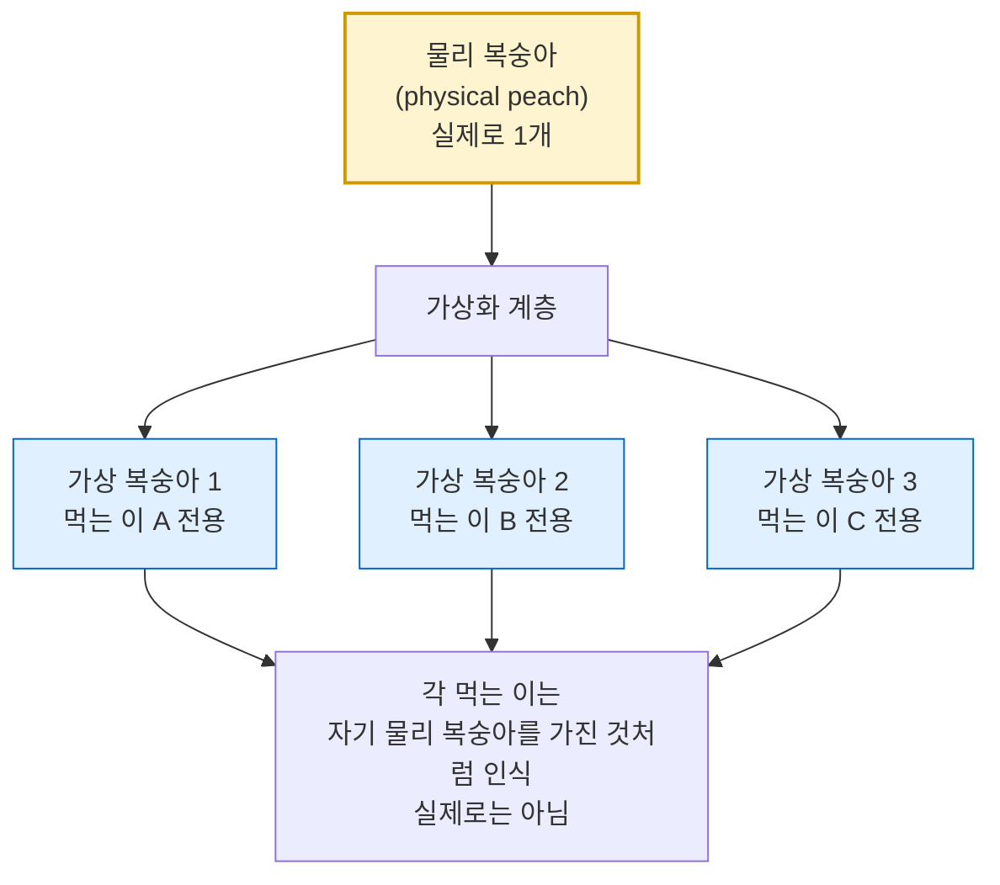

---
tags:
  - topic/os
  - ostep/virtualization
  - dialogue
  - time-sharing
  - status/verified
aliases:
  - 가상화 대화
  - A Dialogue on Virtualization
  - 복숭아 비유
created: 2026-08-19
updated: 2026-08-19
---

# 3. 가상화 대화 (A Dialogue on Virtualization)

> 복숭아 비유로 가상화의 본질(하나의 물리 자원 → 다수의 가상 자원 환상)을 제시하는 파트 1 도입 대화

- 원서 PDF — [03-Dialogue.pdf](../../pdfs/01-virtualization/03-Dialogue.pdf)
- 위치 — Part I Virtualization 의 첫 챕터

## 복숭아 비유

- **물리 복숭아** — 실제로 하나뿐인 자원
- **가상 복숭아** — 각 먹는 이에게 제공되는 것. 하나의 물리 복숭아로부터 여러 개를 만들어냄
- 핵심 — 이 환상 속에서 각자는 **자기 물리 복숭아를 가진 것처럼 보이지만 실제로는 아님**

### 학생의 반론과 답

- 학생 반론 — "복숭아가 하나뿐인데, 누군가와 나눠 먹으면 알아차릴 것"
- 교수 답 — 먹는 이가 많을 때의 특성. **대부분의 시간에 그들은 졸거나 다른 일을 하고 있음** → 그 사이 복숭아를 빼앗아 잠시 다른 사람에게 줄 수 있음
- 이것이 **시분할(time sharing)** 의 비유 — 자원을 잠시씩 번갈아 사용

## CPU 로의 대응

- 시스템에 물리 CPU가 1개(현재는 2·4개 이상이 흔함)라고 가정
- 가상화가 하는 일 — 그 단일 CPU를 응용 프로그램들에게 **여러 개의 가상 CPU** 로 보이게 함
- 각 응용은 자기 전용 CPU가 있다고 여기지만 실제로는 하나
- 결과 — OS가 만들어낸 환상. **CPU를 가상화했다(virtualized the CPU)**

| 비유 요소 | 대응 대상 |
|---|---|
| 물리 복숭아 | 물리 CPU |
| 가상 복숭아 | 가상 CPU |
| 먹는 이 | 응용 프로그램(프로세스) |
| 졸고 있는 시간 | 프로세스가 CPU를 쓰지 않는 구간(I/O 대기 등) |
| 복숭아를 빼앗아 넘김 | 문맥 교환(context switch) |

## 정리

- 가상화 = **하나의 물리 자원을 다수의 가상 자원으로 보이게 하는 환상 제공**
- 성립 근거 — 이용자가 항상 자원을 쓰고 있지 않음. 유휴 구간을 타 이용자에게 배분 가능
- 파트 1은 이 환상을 CPU(ch 4~11)와 메모리(ch 13~24)에 대해 각각 구현하는 방법을 다룸

## 관련 문서

- [[OS/ostep/docs/00-intro/02-introduction|2. 운영체제 개요]] — `cpu.c` 4개 동시 실행으로 이 환상을 실제 관찰
- [[OS/ostep/docs/01-virtualization/04-processes|4. 프로세스 추상]] — 환상의 단위인 프로세스 정의
- [[OS/ostep/docs/README|이론 문서 인덱스]] — 전 챕터 목록
