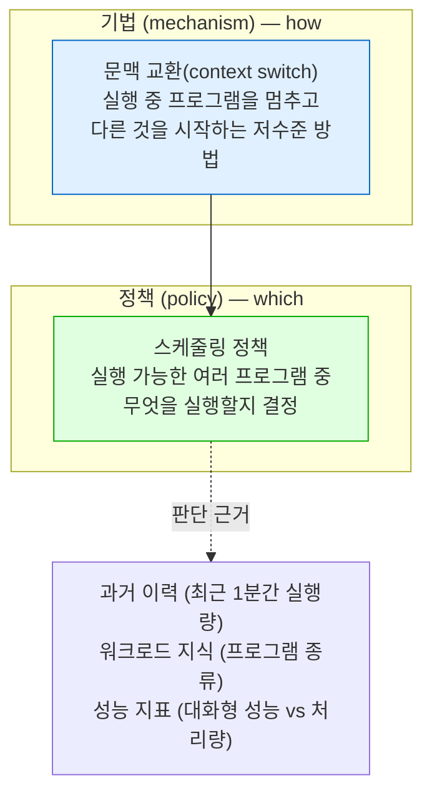
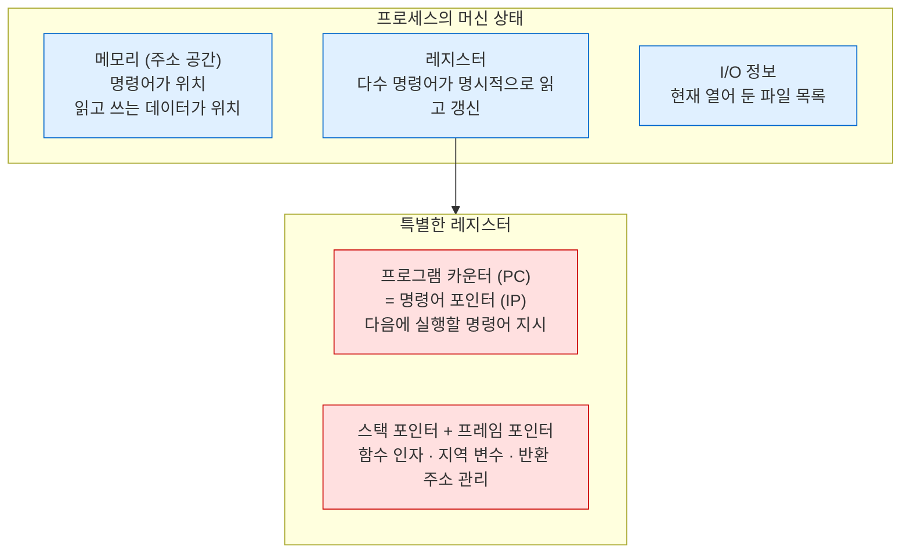
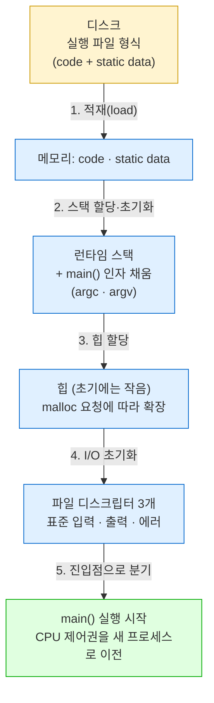
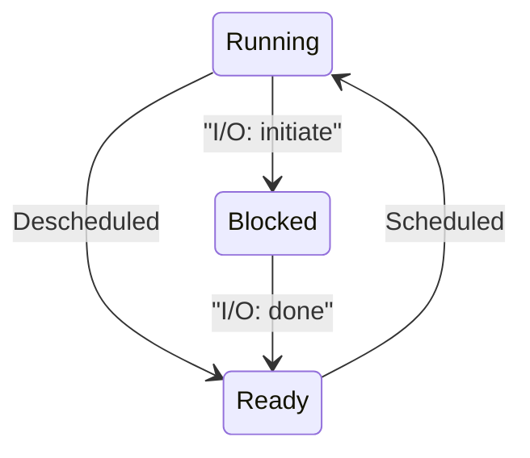

---
tags:
  - topic/os
  - ostep/virtualization
  - process
  - process-state
  - pcb
  - time-sharing
  - mechanism-policy
  - status/verified
aliases:
  - 프로세스 추상
  - The Abstraction The Process
  - PCB
  - 프로세스 상태 전이
created: 2026-08-19
updated: 2026-08-19
---

# 4. 프로세스 추상 (The Abstraction: The Process)

> OS가 제공하는 가장 기본 추상인 프로세스 정의. 머신 상태 구성 요소, 상태 전이 3종, 커널 자료 구조

- 원서 PDF — [04-Processes.pdf](../../pdfs/01-virtualization/04-Processes.pdf)
- 원서 절 구조 — 4.1 프로세스 추상 · 4.2 프로세스 API · 4.3 프로세스 생성 상세 · 4.4 프로세스 상태 · 4.5 자료 구조 · 4.6 요약

## 프로세스란

- 비형식적 정의 — **실행 중인 프로그램(running program)**
- 프로그램 자체는 생명 없는 것 — 디스크에 명령어(와 정적 데이터) 덩어리로 앉아 대기
- OS가 그 바이트를 가져와 실행시켜 **유용한 것으로 변환**
- 전형적 시스템은 수십~수백 개 프로세스를 동시 실행하는 것처럼 보임 → CPU 가용성을 신경 쓰지 않고 그냥 프로그램을 실행하면 되므로 시스템이 쓰기 쉬워짐

> [!question] CRUX: 다수 CPU의 환상을 어떻게 제공하는가
> 물리 CPU는 몇 개뿐인데, OS는 어떻게 **거의 무한한 CPU 공급**의 환상을 제공하는가

- 해법 — **CPU 가상화**. 한 프로세스를 실행하다 멈추고 다른 것을 실행, 반복
- 이 기법이 **시분할(time sharing)**. 원하는 만큼 병행 프로세스 실행 가능
- 잠재 비용은 **성능** — CPU를 공유해야 하므로 각각은 더 느리게 실행됨

> [!tip] TIP: 시분할과 공간 분할
> **시분할(time sharing)** — 자원을 한 주체가 잠시 쓰고 다음 주체가 잠시 쓰는 방식으로 공유. 예: CPU, 네트워크 링크
> **공간 분할(space sharing)** — 자원을 공간적으로 나눠 배분. 예: 디스크 공간 — 어떤 블록이 한 파일에 배정되면 사용자가 그 파일을 삭제하기까지 다른 파일에 배정되지 않음

### 기법과 정책



- **기법(mechanism)** — 필요한 기능을 구현하는 저수준 방법·프로토콜. `how` 질문에 대한 답
- **정책(policy)** — OS 내부에서 어떤 결정을 내리는 알고리즘. `which` 질문에 대한 답
- 기법 위에 정책이 얹힘

> [!tip] TIP: 정책과 기법을 분리할 것
> 다수 OS의 공통 설계 패러다임 — 고수준 정책을 저수준 기법에서 분리. 기법 = "OS는 문맥 교환을 **어떻게** 수행하는가", 정책 = "OS는 지금 **어느** 프로세스를 실행해야 하는가".
> 분리 이점 — 기법을 다시 설계하지 않고 정책만 교체 가능 → **모듈화**(일반 소프트웨어 설계 원칙)의 한 형태

## 4.1 프로세스 추상

- 프로세스를 파악하려면 **머신 상태(machine state)** 를 이해해야 함 — 프로그램이 실행 중일 때 읽거나 갱신할 수 있는 것



| 구성 요소 | 내용 |
|---|---|
| **메모리** | 프로세스가 주소 지정할 수 있는 메모리 = **주소 공간(address space)**. 명령어와 데이터 모두 포함 |
| **레지스터** | 명령어가 명시적으로 읽고 갱신하는 대상 |
| **프로그램 카운터(PC)** | 다음에 실행할 명령어를 지시. **명령어 포인터(IP)** 라고도 함 |
| **스택 포인터 · 프레임 포인터** | 함수 인자·지역 변수·반환 주소용 스택 관리 |
| **I/O 정보** | 현재 열어 둔 파일 목록 등 |

> [!note] ASIDE: Java 와의 대응
> Java의 스레드 스택·프레임과 개념적으로 유사하나 층이 다름 — 여기서는 **OS가 관리하는 프로세스 단위**의 머신 상태. JVM 자체가 하나의 프로세스이며, 그 안의 스레드는 파트 2 주제

## 4.2 프로세스 API

실제 API(`fork`·`exec`·`wait`)는 ch 5에서 다룸. 현대 OS 인터페이스에 반드시 포함되어야 하는 것.

| API | 역할 | 사용 예 |
|---|---|---|
| **Create** | 새 프로세스 생성 | 셸에 명령 입력, 응용 아이콘 더블클릭 |
| **Destroy** | 프로세스 강제 종료 | 폭주 프로세스 kill |
| **Wait** | 프로세스 종료 대기 | 자식 완료 대기 |
| **Miscellaneous Control** | 일시 정지(suspend)·재개(resume) | 잠시 실행 중단 후 계속 |
| **Status** | 상태 정보 조회 | 실행 시간, 현재 상태 |

- 정상 종료하는 프로세스는 스스로 exit — Destroy 는 그렇지 않은 경우를 위한 장치

## 4.3 프로세스 생성 상세



1. **코드·정적 데이터 적재** — 디스크(또는 SSD)의 실행 파일 형식에서 바이트를 읽어 프로세스 주소 공간에 배치
   - 초기·단순 OS — **즉시 적재(eagerly)**. 실행 전에 전부 적재
   - 현대 OS — **지연 적재(lazily)**. 실행 중 필요한 시점에 조각별로 적재. 상세 이해에는 페이징·스와핑 지식 필요 → ch 18~22
2. **런타임 스택 할당** — C 프로그램은 지역 변수·함수 인자·반환 주소에 스택 사용. OS가 이 메모리를 할당해 프로세스에 부여
   - **`main()` 의 인자(`argc`·`argv`)를 스택에 채워 넣는 것도 OS의 일**
3. **힙 할당** — 명시적 동적 할당 데이터용. `malloc` 요청, `free` 해제. 연결 리스트·해시 테이블·트리 등에 필요
   - 초기에는 작음. 실행 중 `malloc` 요청이 늘면 OS가 개입해 메모리 추가 할당
4. **I/O 초기화** — UNIX 계열은 기본으로 **파일 디스크립터 3개**(표준 입력·출력·에러) 개방
5. **진입점 분기** — `main()` 으로 점프해 CPU 제어권을 새 프로세스로 이전. 이 특수 기법은 ch 6 주제

## 4.4 프로세스 상태

단순화된 관점에서 프로세스는 3개 상태 중 하나에 있음.

| 상태 | 의미 |
|---|---|
| **실행(Running)** | 프로세서에서 실행 중. 명령어를 수행하고 있음 |
| **준비(Ready)** | 실행 준비는 되었으나 OS가 지금 실행하지 않기로 선택한 상태 |
| **대기(Blocked)** | 어떤 연산을 수행한 결과, 다른 사건이 일어나기까지 실행 불가한 상태. 대표 예 — 디스크 I/O 요청 발행 |



- **스케줄됨(scheduled)** — 준비 → 실행 이동
- **디스케줄됨(descheduled)** — 실행 → 준비 이동
- 대기 상태가 되면 사건(예: I/O 완료)이 발생하기까지 OS가 그대로 유지. 사건 발생 시 준비 상태로 복귀(OS 판단에 따라 즉시 실행 가능)

### 상태 추적 예 1 — CPU만 사용

두 프로세스가 I/O 없이 CPU만 사용하는 경우.

| 시각 | Process₀ | Process₁ | 비고 |
|---|---|---|---|
| 1 | Running | Ready | |
| 2 | Running | Ready | |
| 3 | Running | Ready | |
| 4 | Running | Ready | Process₀ 완료 |
| 5 | – | Running | |
| 6 | – | Running | |
| 7 | – | Running | |
| 8 | – | Running | Process₁ 완료 |

### 상태 추적 예 2 — CPU와 I/O 혼재

| 시각 | Process₀ | Process₁ | 비고 |
|---|---|---|---|
| 1 | Running | Ready | |
| 2 | Running | Ready | |
| 3 | Running | Ready | Process₀ 가 I/O 발행 |
| 4 | Blocked | Running | Process₀ 대기 → Process₁ 실행 |
| 5 | Blocked | Running | |
| 6 | Blocked | Running | I/O 완료 |
| 7 | Ready | Running | |
| 8 | Ready | Running | Process₁ 완료 |
| 9 | Running | – | |
| 10 | Running | – | Process₀ 완료 |

- 단순한 예에서도 OS가 내려야 하는 결정이 다수 존재
  - **결정 1** — Process₀ 가 I/O를 발행했을 때 Process₁ 을 실행. CPU를 바쁘게 유지해 자원 이용률 향상 → 타당
  - **결정 2** — Process₀ 의 I/O 완료 시 즉시 되돌리지 않음. **좋은 결정인지 불분명** (원서가 독자에게 판단을 남김)
- 이런 결정을 내리는 것이 **OS 스케줄러** → ch 7~10

### macOS 실측 — 상태 관찰

세 종류 프로세스를 동시에 띄워 `ps` 로 상태 확인. 부모가 `wait` 를 호출하지 않는 프로그램으로 좀비까지 재현.

```c
#include <stdio.h>
#include <stdlib.h>
#include <unistd.h>

int main(void) {
    pid_t rc = fork();
    if (rc == 0) { exit(0); }                        // 자식: 즉시 종료 → 좀비
    printf("parent=%d child=%d\n", (int) getpid(), (int) rc);
    fflush(stdout);
    sleep(60);                                       // wait 미호출 → 자식이 좀비로 잔존
    return 0;
}
```

```bash
gcc -Wall -o zombie_demo zombie_demo.c
```

- `-Wall` — 주요 경고 활성
- `-o zombie_demo` — 출력 실행 파일명 지정

```bash
ps -o pid,ppid,stat,%cpu,command -p 24330 -p 24337 -p 24331 -p 24332
```

- `ps` — 프로세스 상태 조회
- `-o pid,ppid,stat,%cpu,command` — 출력 열 지정. `pid` 프로세스 ID, `ppid` 부모 PID, `stat` 상태 코드, `%cpu` CPU 사용률, `command` 실행 명령
- `-p <PID>` — 특정 PID만 조회. macOS `ps` 는 여러 PID 지정 시 `-p` 를 각각 반복해야 함(콤마 구분은 일부만 인식)

```text
  PID  PPID STAT  %CPU COMMAND
24330 24322 SN     0.0 ./zombie_demo
24331 24322 SN     0.0 sleep 60
24332 24322 RN    99.3 ./cpu A
24337 24330 ZN     0.0 <defunct>
```

| PID | STAT | 책의 상태 | 근거 |
|---|---|---|---|
| 24332 | `RN` | **Running** | `cpu A` — 바쁜 대기로 CPU 점유. `%CPU 99.3` |
| 24330 | `SN` | **Blocked** | `sleep(60)` 호출로 대기 중. `%CPU 0.0` |
| 24331 | `SN` | **Blocked** | `sleep 60` 명령. 동일 |
| 24337 | `ZN` | **좀비(최종 상태)** | 부모(24330)가 `wait` 미호출 → 종료했으나 정리되지 않음. `COMMAND` 가 `<defunct>` |

- `STAT` 두 번째 문자 `N` — 나이스 값이 조정되어 우선순위가 낮음을 의미. 상태 코드 자체는 첫 문자(`R`·`S`·`Z`)
- **Ready 상태는 `ps` 로 직접 관찰 불가** — macOS `ps` 는 `R` 을 실행 중과 실행 가능 모두에 사용. 책의 Ready/Running 구분은 커널 내부 상태이며 사용자 도구로 분리 관찰 어려움 (확인 필요: 커널 트레이싱 도구 사용 시 가능성)

## 4.5 자료 구조

- OS도 프로그램 → 정보 추적용 핵심 자료 구조 보유
- **프로세스 리스트(process list)** — 준비 상태 프로세스 전체와 현재 실행 중인 프로세스를 추적. 대기 프로세스도 추적해 I/O 완료 시 올바른 프로세스를 깨워야 함

> [!note] ASIDE: 자료 구조 — 프로세스 리스트
> **태스크 리스트(task list)** 라고도 함. 이 책에서 다루는 첫 자료 구조. 단순한 편이나, 동시에 여러 프로그램을 실행할 수 있는 OS라면 반드시 유사한 구조를 가짐.
> 프로세스 개별 정보를 담는 구조를 **PCB(Process Control Block)** 라고 부르기도 함 — 각 프로세스 정보를 담은 C 구조체를 가리키는 표현. **프로세스 디스크립터(process descriptor)** 라고도 함

### xv6 커널의 프로세스 구조체

```c
// 프로세스를 멈추고 다시 시작하기 위해 xv6 가 저장·복원하는 레지스터
struct context {
  int eip;
  int esp;
  int ebx;
  int ecx;
  int edx;
  int esi;
  int edi;
  int ebp;
};

// 프로세스가 가질 수 있는 상태들
enum proc_state { UNUSED, EMBRYO, SLEEPING,
                  RUNNABLE, RUNNING, ZOMBIE };

// xv6 가 각 프로세스에 대해 추적하는 정보
// 레지스터 컨텍스트와 상태 포함
struct proc {
  char *mem;                  // Start of process memory
  uint sz;                    // Size of process memory
  char *kstack;               // Bottom of kernel stack
                              // for this process
  enum proc_state state;      // Process state
  int pid;                    // Process ID
  struct proc *parent;        // Parent process
  void *chan;                 // If !zero, sleeping on chan
  int killed;                 // If !zero, has been killed
  struct file *ofile[NOFILE]; // Open files
  struct inode *cwd;          // Current directory
  struct context context;     // Switch here to run process
  struct trapframe *tf;       // Trap frame for the
                              // current interrupt
};
```

- **레지스터 컨텍스트(register context)** — 멈춘 프로세스의 레지스터 내용 보관. 정지 시 레지스터를 이 메모리에 저장, 복원 시 실제 물리 레지스터로 되돌림 → **문맥 교환(context switch)** 의 실체 (ch 6)
- xv6 `context` 가 `eip`·`esp` 등 **x86 레지스터명**을 쓰는 점에 유의 — xv6 는 x86 기반. arm64 에서는 레지스터 구성이 다름
- 상태가 3개(실행·준비·대기)보다 많음
  - **초기 상태(EMBRYO)** — 생성 중
  - **최종 상태(ZOMBIE)** — 종료했으나 아직 정리되지 않음
- 좀비 상태의 용도 — 다른 프로세스(보통 생성한 **부모**)가 종료 코드를 검사해 성공 여부 확인 가능. UNIX 계열 관례상 성공 시 0, 실패 시 0 이 아닌 값 반환
- 부모가 마지막으로 `wait()` 를 호출 → 자식 완료 대기 + **OS에 관련 자료 구조 정리 허가**

> [!note] ASIDE: 좀비 상태 (원서 각주)
> "Just like real zombies, these zombies are relatively easy to kill. However, different techniques are usually recommended."

## 4.6 정리

- **프로세스** — OS의 가장 기본 추상. 실행 중인 프로그램
- 머신 상태 = 주소 공간 + 레지스터(PC·스택 포인터 포함) + I/O 정보
- API 5종 — Create · Destroy · Wait · Miscellaneous Control · Status
- 생성 절차 — 적재 → 스택 할당·인자 채움 → 힙 할당 → I/O 초기화 → `main()` 분기
- 상태 3종(실행·준비·대기) + 초기·최종(좀비) 상태
- 자료 구조 — 프로세스 리스트, PCB(프로세스 디스크립터)
- 다음 — 프로세스 구현에 필요한 **저수준 기법**(ch 5·6)과 지능적 스케줄링을 위한 **고수준 정책**(ch 7~10)

## 관련 문서

- [[OS/ostep/docs/01-virtualization/03-dialogue|3. 가상화 대화]] — 복숭아 비유로 본 시분할
- [[OS/ostep/docs/01-virtualization/05-process-api|5. 프로세스 API]] — `fork`·`wait`·`exec` 실제 인터페이스
- [[OS/ostep/docs/01-virtualization/06-direct-execution|6. 제한적 직접 실행]] — 문맥 교환 기법의 실체
- [[OS/ostep/docs/00-intro/02-introduction|2. 운영체제 개요]] — 기법·정책 분리의 최초 등장
- [[C/docs/07-stdlib/05-posix|POSIX 시스템 콜]] — `fork`·`getpid`·`sleep` 시그니처
- [[OS/ostep/docs/README|이론 문서 인덱스]] — 전 챕터 목록
