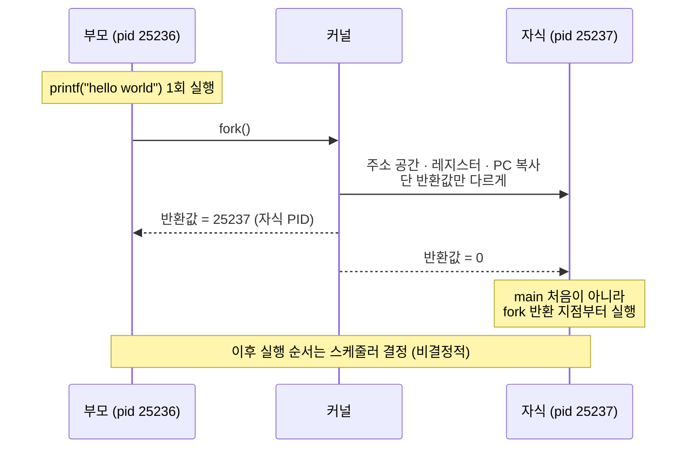
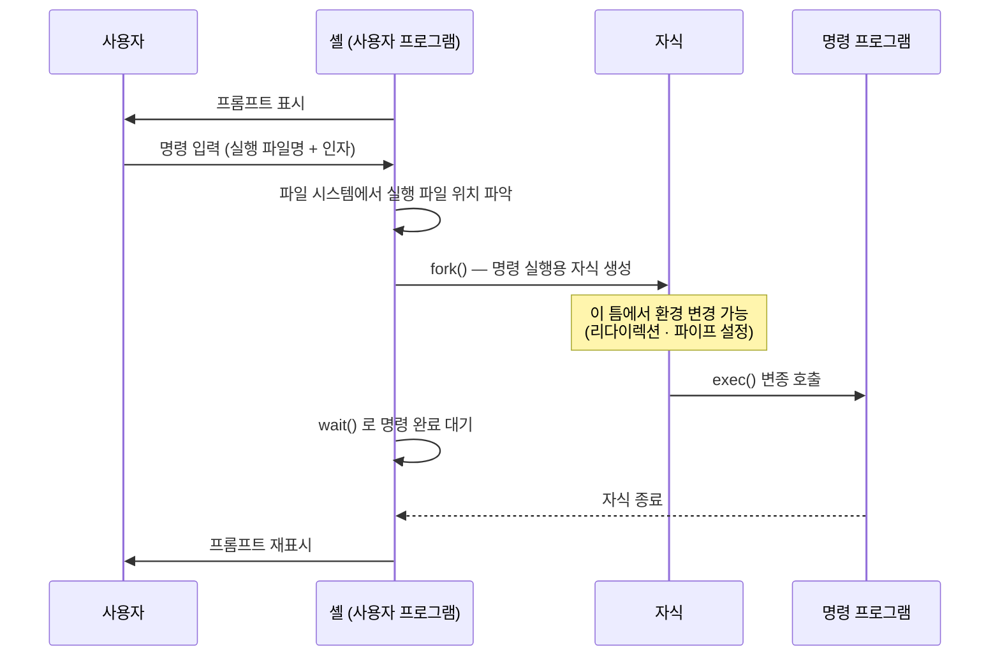

---
tags:
  - topic/os
  - ostep/virtualization
  - process
  - fork
  - exec
  - signal
  - file-descriptor
  - lang/c
  - status/verified
aliases:
  - 프로세스 API
  - Interlude Process API
  - fork exec wait
created: 2026-08-19
updated: 2026-08-19
---

# 5. 프로세스 API (Interlude: Process API)

> UNIX 프로세스 생성·제어 API — `fork` · `exec` · `wait` 세 시스템 콜의 조합과 그것이 셸을 가능하게 하는 이유

- 원서 PDF — [05-Process-API.pdf](../../pdfs/01-virtualization/05-Process-API.pdf)
- 실습 — [[OS/ostep/projects/02-process-api/README|실습 2. 프로세스 API]]
- 원서 절 구조 — 5.1 `fork` · 5.2 `wait` · 5.3 `exec` · 5.4 API 동기 · 5.5 프로세스 제어와 사용자 · 5.6 유용한 도구 · 5.7 요약

> [!note] ASIDE: 간주(Interlude) 챕터란
> **Interlude** 는 시스템의 실용적 측면, 특히 **OS API와 그 사용법**을 다루는 챕터. 원서 표현 — "If you don't like practical things, you could skip these interludes. But you should like practical things, because... companies, for example, don't usually hire you for your non-practical skills."

> [!question] CRUX: 프로세스를 어떻게 생성하고 제어하는가
> 프로세스 생성·제어를 위해 OS는 어떤 인터페이스를 제시해야 하는가. 강력한 기능성·사용 편의성·고성능을 가능하게 하려면 이 인터페이스를 어떻게 설계해야 하는가

## 5.1 `fork()` 시스템 콜

- 새 프로세스 생성용. 원서 표현 — **"가장 이상한 루틴"**
- 생성되는 프로세스는 호출 프로세스의 **(거의) 정확한 복사본**
- OS 관점에서는 같은 프로그램의 복사본 2개가 실행 중이며, **둘 다 `fork()` 에서 반환하려는 상태**

```c
#include <stdio.h>
#include <stdlib.h>
#include <unistd.h>

int main(int argc, char *argv[])
{
    printf("hello world (pid:%d)\n", (int) getpid());

    int rc = fork();

    if (rc < 0) {                    // fork 실패
        fprintf(stderr, "fork failed\n");
        exit(1);
    } else if (rc == 0) {            // 자식 (새 프로세스)
        printf("hello, I am child (pid:%d)\n", (int) getpid());
    } else {                         // 부모
        printf("hello, I am parent of %d (pid:%d)\n", rc, (int) getpid());
    }

    return 0;
}
```

```bash
gcc -Wall -Wextra -Wno-unused-parameter -g -o p1 p1.c
```

- `-Wall` — 주요 경고 활성
- `-Wextra` — 추가 경고 활성
- `-Wno-unused-parameter` — 미사용 매개변수 경고 비활성. 원서 코드가 `main` 인자를 쓰지 않는 원형을 유지하므로
- `-g` — 디버그 심볼 포함
- `-o p1` — 출력 실행 파일명 지정

```bash
./p1
```

- 옵션 없음

macOS arm64 실측 (터미널 직접 실행).

```text
hello world (pid:25236)
hello, I am parent of 25237 (pid:25236)
hello, I am child (pid:25237)
```

### `fork()` 의 세 가지 이상한 점



1. **자식은 `main()` 부터 시작하지 않음** — `fork()` 를 자기가 호출했던 것처럼 그 반환 지점에서 생명을 시작. 증거 — `hello world` 가 한 번만 출력
2. **정확한 복사본이 아님** — 자기 주소 공간(사설 메모리), 자기 레지스터, 자기 PC를 갖되 **반환값이 다름**
   - 부모 → 새로 생성된 자식의 PID
   - 자식 → `0`
   - 이 구분 덕분에 두 경우를 처리하는 코드를 쉽게 작성 가능
3. **출력이 비결정적(non-deterministic)** — 자식 생성 후 시스템에 관심 대상 프로세스가 2개. 단일 CPU 가정 시 어느 쪽이 먼저 실행될지 알 수 없음
   - 원서는 자식이 먼저 출력되는 경우도 제시
   - 어느 프로세스가 실행될지 결정하는 것은 **CPU 스케줄러**. 스케줄러는 복잡하므로 무엇을 선택할지 강한 가정 불가
   - 이 비결정성이 흥미로운 문제를 야기 — 특히 멀티스레드 프로그램에서. 파트 2 주제

| 관찰 | 실측(macOS arm64) | 원서(Linux) |
|---|---|---|
| `hello world` 출력 횟수 | 1회 | 1회 |
| 부모의 `rc` | 자식 PID | 자식 PID |
| 자식의 `rc` | 0 | 0 |
| 출력 순서 | 6회 실행 모두 부모 우선 | 부모 우선·자식 우선 모두 제시 |

- 실측에서 부모 우선 경향이 관찰되나 **보장 사항 아님**. 원서 지적대로 순서를 가정한 코드는 잘못된 코드

## 5.2 `wait()` 시스템 콜

- 부모가 자식이 하던 일을 끝내기를 기다리는 데 사용. 더 완전한 형제 함수는 `waitpid()`
- 부모가 `wait()` 를 호출하면 자식 종료까지 **블록(실행 지연)**. 자식 완료 시 부모가 언블록되고 `wait()` 가 반환

```c
#include <stdio.h>
#include <stdlib.h>
#include <unistd.h>
#include <sys/wait.h>

int main(int argc, char *argv[])
{
    printf("hello world (pid:%d)\n", (int) getpid());

    int rc = fork();

    if (rc < 0) {
        fprintf(stderr, "fork failed\n");
        exit(1);
    } else if (rc == 0) {
        printf("hello, I am child (pid:%d)\n", (int) getpid());
        sleep(1);                    // 자식을 일부러 늦춤
    } else {
        int wc = wait(NULL);         // 자식 종료까지 블록. 반환값 = 종료한 자식 PID
        printf("hello, I am parent of %d (wc:%d) (pid:%d)\n",
               rc, wc, (int) getpid());
    }

    return 0;
}
```

```bash
gcc -Wall -Wextra -Wno-unused-parameter -g -o p2 p2.c
```

- `-Wall` — 주요 경고 활성
- `-Wextra` — 추가 경고 활성
- `-Wno-unused-parameter` — 미사용 매개변수 경고 비활성
- `-g` — 디버그 심볼 포함
- `-o p2` — 출력 실행 파일명 지정

```bash
./p2
```

- 옵션 없음

```text
hello world (pid:25252)
hello, I am child (pid:25253)
hello, I am parent of 25253 (wc:25253) (pid:25252)
```

- **자식이 항상 먼저 출력** → 출력이 결정적으로 바뀜
- 근거 — 부모가 먼저 실행되더라도 즉시 `wait()` 호출. 자식이 실행·종료하기까지 반환하지 않음. 부모가 먼저 실행되든 나중이든 결과가 같아짐
- `wc:25253` — 반환값이 종료한 자식의 PID. 부모의 `rc` 와 동일

> [!note] ASIDE: 원서의 유보 (각주)
> `wait()` 가 자식 종료 전에 반환하는 경우도 존재 → man page 참조 권고. 원서는 "the child will always print first" 같은 **절대적·무조건적 단정**에 주의하라고 스스로 경고

## 5.3 `exec()` 시스템 콜

- **호출한 프로그램과 다른 프로그램을 실행**하려는 경우 사용
- `fork()` 만으로는 같은 프로그램의 복사본을 계속 실행하는 것밖에 못 함

```c
#include <stdio.h>
#include <stdlib.h>
#include <unistd.h>
#include <string.h>
#include <sys/wait.h>

int main(int argc, char *argv[])
{
    printf("hello world (pid:%d)\n", (int) getpid());

    int rc = fork();

    if (rc < 0) {
        fprintf(stderr, "fork failed\n");
        exit(1);
    } else if (rc == 0) {
        printf("hello, I am child (pid:%d)\n", (int) getpid());
        char *myargs[3];
        myargs[0] = strdup("wc");     // 실행할 프로그램: wc
        myargs[1] = strdup("p3.c");   // 인자: 셀 대상 파일
        myargs[2] = NULL;             // 배열 끝 표시
        execvp(myargs[0], myargs);    // 단어 수 세기 실행
        printf("this shouldn't print out");   // 도달 불가
    } else {
        int wc = wait(NULL);
        printf("hello, I am parent of %d (wc:%d) (pid:%d)\n",
               rc, wc, (int) getpid());
    }

    return 0;
}
```

```bash
gcc -Wall -Wextra -Wno-unused-parameter -g -o p3 p3.c
```

- `-Wall` — 주요 경고 활성
- `-Wextra` — 추가 경고 활성
- `-Wno-unused-parameter` — 미사용 매개변수 경고 비활성
- `-g` — 디버그 심볼 포함
- `-o p3` — 출력 실행 파일명 지정

```bash
./p3
```

- 옵션 없음

```text
hello world (pid:25261)
hello, I am child (pid:25262)
      51     225    1783 p3.c
hello, I am parent of 25262 (wc:25262) (pid:25261)
```

대조 — `wc` 직접 실행.

```bash
wc p3.c
```

- 옵션 없음. 출력은 행 수 · 단어 수 · 바이트 수 순

```text
      51     225    1783 p3.c
```

### `exec()` 의 동작

```mermaid
flowchart TB
    A["자식 프로세스 (p3 코드 실행 중)"] -->|"execvp(\"wc\", myargs)"| B["실행 파일 wc 에서<br/>코드 · 정적 데이터 적재"]
    B --> C["현재 코드 세그먼트 ·<br/>정적 데이터를 덮어씀"]
    C --> D["힙 · 스택 등<br/>메모리 공간 나머지 재초기화"]
    D --> E["인자를 새 프로세스의 argv 로 전달"]
    E --> F["wc 실행<br/>= p3 가 실행된 적 없는 것과 거의 같은 상태"]
    F -.->|"성공한 exec 는<br/>절대 반환하지 않음"| X["execvp 다음 줄 도달 불가"]

    classDef old fill:#ffe0e0,stroke:#c00
    classDef new fill:#e0ffe0,stroke:#0a0
    class A,C old
    class F new
```

- 실행 파일명(`wc`)과 인자(`p3.c`)를 받아 **그 실행 파일에서 코드·정적 데이터를 적재하고 현재 것을 덮어씀**
- 힙·스택 등 메모리 공간의 나머지는 재초기화
- 인자를 그 프로세스의 `argv` 로 전달
- **새 프로세스를 생성하지 않음** — 현재 실행 중인 프로그램(`p3`)을 다른 프로그램(`wc`)으로 **변신(transform)** 시킴
- **성공한 `exec()` 호출은 절대 반환하지 않음** → `printf("this shouldn't print out")` 미출력이 증거

> [!note] ASIDE: `exec` 계열 6종 (원서 각주)
> Linux 에는 `execl()` · `execlp()` · `execle()` · `execv()` · `execvp()` · `execvpe()` 6가지 변종 존재. man page 참조 권고
> - `l` — 인자를 **가변 인자 목록(list)** 으로 전달
> - `v` — 인자를 **배열(vector)** 로 전달
> - `p` — `PATH` 환경 변수를 검색해 실행 파일 탐색
> - `e` — **환경 변수(environment)** 배열을 직접 지정

## 5.4 왜 이런 API 인가

- 의문 — 새 프로세스 생성이라는 단순한 행위에 왜 이토록 이상한 인터페이스를 만들었는가
- 답 — **`fork()` 와 `exec()` 의 분리가 UNIX 셸 구축에 필수적**
  - 셸이 `fork()` **이후**, `exec()` **이전**에 코드를 실행할 수 있게 해줌
  - 그 코드가 곧 실행될 프로그램의 **환경을 변경** → 다양한 기능을 쉽게 구현 가능

### 셸의 동작



- 셸은 **그냥 사용자 프로그램**. 프롬프트를 보여주고 입력을 기다림
- 절차 — 실행 파일 위치 파악 → `fork()` → `exec()` 변종 → `wait()` → 프롬프트 재표시

> [!note] ASIDE: 셸의 종류 (원서 각주)
> `tcsh` · `bash` · `zsh` 등 다수 존재. 하나를 골라 man page 를 읽고 익힐 것 — 모든 UNIX 전문가가 그렇게 함

### 출력 리다이렉션

```bash
wc p3.c > newfile.txt
```

- `>` — 표준 출력을 파일로 리다이렉트

구현 방식 — 자식 생성 후 `exec()` 호출 **전에**, 자식 프로세스에서 실행되는 코드가 **표준 출력을 닫고 대상 파일을 개방**.

```c
#include <stdio.h>
#include <stdlib.h>
#include <unistd.h>
#include <string.h>
#include <fcntl.h>
#include <assert.h>
#include <sys/wait.h>

int main(int argc, char *argv[])
{
    int rc = fork();

    if (rc < 0) {
        fprintf(stderr, "fork failed\n");
        exit(1);
    } else if (rc == 0) {
        // 자식: 표준 출력을 파일로 돌린다
        close(STDOUT_FILENO);
        open("./p4.output", O_CREAT | O_WRONLY | O_TRUNC, S_IRWXU);

        char *myargs[3];
        myargs[0] = strdup("wc");
        myargs[1] = strdup("p4.c");
        myargs[2] = NULL;
        execvp(myargs[0], myargs);
    } else {
        int wc = wait(NULL);
        assert(wc >= 0);
    }

    return 0;
}
```

```bash
gcc -Wall -Wextra -Wno-unused-parameter -g -o p4 p4.c
```

- `-Wall` — 주요 경고 활성
- `-Wextra` — 추가 경고 활성
- `-Wno-unused-parameter` — 미사용 매개변수 경고 비활성
- `-g` — 디버그 심볼 포함
- `-o p4` — 출력 실행 파일명 지정

```bash
./p4
cat p4.output
```

- `./p4` — 옵션 없음. 화면 출력 없음
- `cat` — 파일 내용 표준 출력

```text
      48     210    1537 p4.c
```

리다이렉션이 성립하는 두 전제.

| 전제 | 내용 |
|---|---|
| **fd 배정 규칙** | UNIX 는 **0 번부터 비어 있는 파일 디스크립터를 찾음**. `close(STDOUT_FILENO)` 로 1 번을 비우면 다음 `open` 이 반드시 1 번을 받음 |
| **fd 의 `exec` 생존** | **열린 파일 디스크립터는 `exec()` 호출을 넘어 유지됨** → 변신한 `wc` 의 `printf` 가 파일로 흘러감 |

- `p4` 실행 시 화면에 아무것도 안 보이지만, 실제로는 `fork` → `execvp("wc")` 가 정상 수행된 것
- **파이프도 유사한 방식** — `pipe()` 시스템 콜 사용. 한 프로세스의 출력을 커널 내 파이프(큐)에 연결하고, 다른 프로세스의 입력을 같은 파이프에 연결 → 긴 명령 사슬 구성 가능

```bash
grep -o foo file | wc -l
```

- `grep -o foo file` — `file` 에서 `foo` 를 찾아 **일치한 부분만** 한 줄씩 출력. `-o` 가 그 동작
- `|` — 앞 명령의 표준 출력을 뒤 명령의 표준 입력으로 연결
- `wc -l` — 행 수만 출력. `-l` 이 그 동작
- 결합 결과 — `foo` 출현 횟수 계수

> [!tip] TIP: 제대로 만들 것 (Lampson의 법칙)
> Lampson 의 "Hints for Computer Systems Design" 인용 — **"Get it right. Neither abstraction nor simplicity is a substitute for getting it right."**
> 프로세스 생성 API를 설계하는 방법은 많으나, `fork()` 와 `exec()` 의 조합은 단순하면서 대단히 강력함. UNIX 설계자들이 **제대로 만든(got it right)** 사례

## 5.5 프로세스 제어와 사용자

- `fork()`·`exec()`·`wait()` 외에도 프로세스 상호작용 인터페이스 다수 존재
- **`kill()`** — 프로세스에 **시그널(signal)** 전송. 일시 정지·종료 등의 지시 포함
- 대부분 UNIX 셸에서 특정 키 조합이 현재 실행 중 프로세스에 특정 시그널을 보내도록 구성

| 키 조합 | 시그널 | 효과 |
|---|---|---|
| `Control-c` | `SIGINT` (interrupt) | 통상 프로세스 종료 |
| `Control-z` | `SIGTSTP` (stop) | 실행 중간에 일시 정지. 이후 `fg` 내장 명령 등으로 재개 |

- 시그널 서브시스템 — 외부 사건을 프로세스에 전달하는 풍부한 기반 구조. 개별 프로세스 내에서 시그널을 수신·처리하는 방법, 개별 프로세스와 **프로세스 그룹 전체**에 시그널을 보내는 방법 제공
- **`signal()`** 시스템 콜로 시그널을 "잡음(catch)" → 특정 시그널 전달 시 정상 실행을 중단하고 대응 코드 실행

### 사용자 개념

- 질문 — 누가 프로세스에 시그널을 보낼 수 있고, 누가 못 하는가
- 여러 사람이 동시에 시스템을 사용할 수 있으므로, 누구나 임의로 `SIGINT` 를 보낼 수 있다면 **사용성과 보안이 훼손**
- 그래서 현대 시스템은 **사용자(user)** 개념을 강하게 포함
  - 사용자가 비밀번호를 입력해 자격 증명 확립 후 로그인
  - 하나 또는 여러 프로세스를 띄우고 그에 대한 **완전한 통제권** 행사(정지·종료 등)
  - 일반적으로 **자기 프로세스만** 통제 가능
- 자원(CPU·메모리·디스크)을 각 사용자와 그 프로세스에 배분해 전체 시스템 목표를 충족시키는 것이 OS의 일

> [!note] ASIDE: 슈퍼유저(root)
> 시스템을 관리할 사용자가 필요하며, 그 사용자는 대부분 사용자와 달리 제한받지 않음.
> - 자기가 시작하지 않은 **임의 프로세스도 종료 가능**
> - `shutdown` 같은 강력한 명령 실행 가능
> - UNIX 계열에서 이 특별 권한은 **슈퍼유저(superuser, root)** 에게 부여
> - 원서 표현 — "Being root is much like being Spider-Man: with great power comes great responsibility"
> - 보안 강화와 값비싼 실수 회피를 위해 **평소에는 일반 사용자로 있는 것이 바람직**

## 5.6 유용한 도구

| 도구 | 용도 |
|---|---|
| `ps` | 실행 중인 프로세스 조회. 유용한 플래그는 man page 참조 |
| `top` | 시스템 프로세스와 CPU·자원 소모량 표시. 원서 농담 — 실행하면 `top` 자신이 최대 자원 소모자로 표시되는 경우가 많음 |
| `kill` | 프로세스에 임의 시그널 전송 |
| `killall` | `kill` 보다 다소 사용자 친화적. **주의해서 사용** — 실수로 윈도 매니저를 종료하면 컴퓨터 사용이 곤란해짐 |
| CPU 미터 | 시스템 부하를 한눈에 파악. 원서 저자는 Macintosh 툴바에 MenuMeters 상주 사용 |

> [!note] ASIDE: RTFM — man page 를 읽을 것
> man page 는 UNIX 시스템에 존재하는 **문서의 원형** — 웹이라는 것이 존재하기도 전에 만들어짐.
> man page 를 읽는 데 시간을 쓰는 것은 시스템 프로그래머 성장의 핵심 단계. 특히 유용한 것 — **사용 중인 셸**(`tcsh`·`bash` 등)과 **프로그램이 호출하는 모든 시스템 콜**(반환값·에러 조건 확인 목적).
> 동료에게 `fork()` 의 세부를 물으면 `RTFM` 이라는 답이 올 수 있음 — Read The Man pages 의 완곡한 권유

## 5.7 정리

- UNIX 프로세스 생성 API 3종 — `fork()` · `exec()` · `wait()`
- `fork()` — (거의) 정확한 복사본 생성. 반환값으로 부모·자식 구분. 출력 순서 비결정적
- `wait()` — 자식 종료 대기. 출력을 결정적으로 만듦
- `exec()` — 프로세스를 만들지 않고 현재 프로그램을 다른 프로그램으로 변신. 성공 시 반환 없음
- `fork`/`exec` 분리의 가치 — **그 사이에서 환경을 변경** 가능 → 리다이렉션·파이프 구현 기반
- 더 깊은 내용은 Stevens & Rago 의 Process Control · Process Relationships · Signals 장 참조

> [!note] ASIDE: `fork()` 에 대한 반론 (원서 5.7)
> 저자들은 UNIX 프로세스 API를 높이 평가하나, 그 평가가 보편적인 것은 아님을 명시.
> Microsoft · Boston University · ETH 연구자들의 논문이 `fork()` 의 문제를 상술하고 `spawn()` 같은 더 단순한 프로세스 생성 API를 옹호함.
> 원서 권고 — 그 논문과 관련 연구를 읽어 다른 관점을 이해할 것. "While it's generally good to trust this book, remember too that the authors have opinions; those opinions may not (always) be as widely shared as you might think."

## 관련 문서

- [[OS/ostep/docs/01-virtualization/04-processes|4. 프로세스 추상]] — 프로세스 정의·상태 전이·좀비 상태
- [[OS/ostep/docs/01-virtualization/06-direct-execution|6. 제한적 직접 실행]] — 시스템 콜이 실제로 커널로 진입하는 방식
- [[OS/ostep/projects/02-process-api/README|실습 2. 프로세스 API]] — 본 챕터 4개 프로그램 실행·검증
- [[C/docs/07-stdlib/05-posix|POSIX 시스템 콜]] — `fork`·`wait`·`execvp`·`kill`·`signal` 시그니처
- [[C/docs/07-stdlib/06-stdio-buffering|stdio 버퍼링]] — `fork` 시 출력 버퍼가 복제되는 문제
- [[C/projects/make-shell/README|make-shell 프로젝트]] — 본 챕터 API로 셸을 구현한 사례
- [[OS/ostep/docs/README|이론 문서 인덱스]] — 전 챕터 목록
