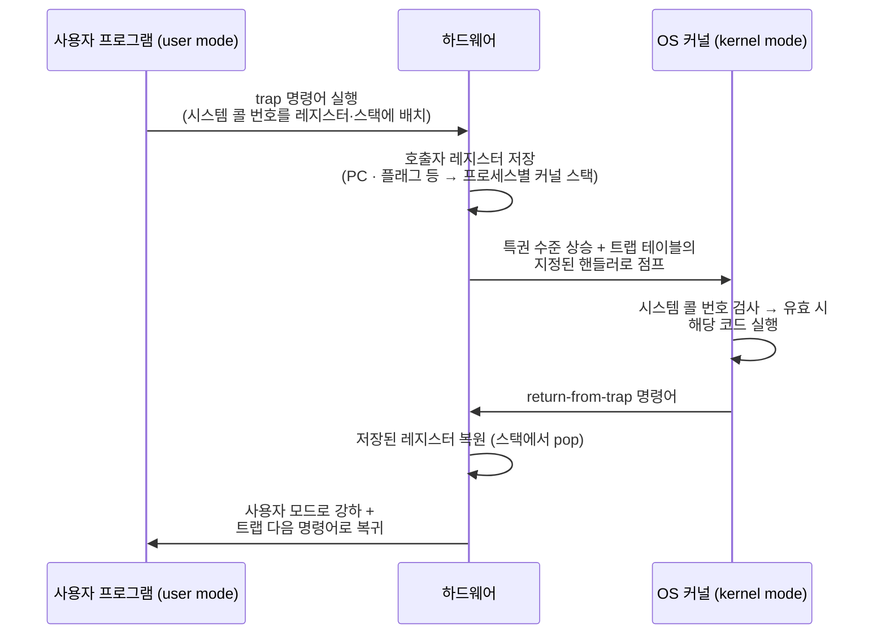

---
tags:
  - topic/os
  - ostep/virtualization
  - limited-direct-execution
  - system-call
  - trap
  - context-switch
  - timer-interrupt
  - status/verified
aliases:
  - 제한적 직접 실행
  - Limited Direct Execution
  - LDE
  - 문맥 교환
  - 트랩
created: 2026-08-19
updated: 2026-08-19
---

# 6. 제한적 직접 실행 (Mechanism: Limited Direct Execution)

> CPU 가상화의 저수준 기법. 성능과 통제를 동시에 얻기 위한 사용자·커널 모드 분리, 트랩, 타이머 인터럽트, 문맥 교환

- 원서 PDF — [06-Direct-Execution.pdf](../../pdfs/01-virtualization/06-Direct-Execution.pdf)
- 원서 절 구조 — 6.1 기본 기법 LDE · 6.2 문제 1 제한된 연산 · 6.3 문제 2 프로세스 간 전환 · 6.4 병행성 · 6.5 요약

## 두 가지 도전 과제

- CPU 가상화의 기본 착상은 단순 — 한 프로세스를 잠시 실행하고, 다음 것을 실행, 반복(**시분할**)
- 그러나 구현에는 두 과제 존재

| 과제 | 질문 |
|---|---|
| **성능(performance)** | 시스템에 과도한 오버헤드를 더하지 않고 가상화를 구현하는 방법 |
| **통제(control)** | CPU에 대한 통제를 유지하면서 프로세스를 효율적으로 실행하는 방법 |

- 통제가 특히 중요 — OS가 자원 관리자이므로. 통제 없으면 프로세스가 **영원히 실행되며 머신을 점유**하거나, **허용되지 않은 정보에 접근** 가능
- 고성능과 통제 유지의 동시 달성이 OS 구축의 중심 과제 중 하나

> [!question] CRUX: 통제를 유지하며 CPU를 효율적으로 가상화하는 방법
> OS는 시스템에 대한 통제를 유지하면서 효율적으로 CPU를 가상화해야 함. 이를 위해 **하드웨어와 OS 지원 양쪽**이 필요. OS는 자기 일을 효과적으로 수행하기 위해 하드웨어 지원을 신중하게 활용

## 6.1 기본 기법 — 제한적 직접 실행

- **직접 실행(direct execution)** — 프로그램을 CPU에서 그냥 직접 실행하는 것
- 기대만큼 빠르게 실행시키기 위한 자연스러운 발상

### 제한 없는 직접 실행 프로토콜

| OS | 프로그램 |
|---|---|
| 프로세스 리스트에 항목 생성 | |
| 프로그램용 메모리 할당 | |
| 프로그램을 메모리에 적재 | |
| `argc`/`argv` 로 스택 설정 | |
| 레지스터 초기화 | |
| `call main()` 실행 | |
| | `main()` 실행 |
| | `return from main` 실행 |
| 프로세스 메모리 해제 | |
| 프로세스 리스트에서 제거 | |

- 프로그램의 `main()` 으로 점프하고 다시 커널로 돌아오는 데 **일반 호출·반환**을 사용
- 여기서 두 문제 발생
  1. 그냥 실행시키면 OS는 프로그램이 **원치 않는 일을 하지 않도록** 어떻게 보장하는가 (효율은 유지하면서)
  2. 실행 중인 프로세스를 **멈추고 다른 프로세스로 전환**하는 방법은 무엇인가 (시분할 구현)
- 이 문제들의 해답에서 이름의 **"제한적(limited)"** 부분이 유래. 제한이 없다면 OS는 아무것도 통제하지 못하고 **"그냥 라이브러리"** 가 됨

## 6.2 문제 1 — 제한된 연산

- 직접 실행의 장점은 속도 — 프로그램이 하드웨어 CPU에서 네이티브로 실행
- 문제 — 프로세스가 **제한된 연산**(디스크 I/O 요청, CPU·메모리 등 자원 추가 확보)을 하려는 경우

> [!question] CRUX: 제한된 연산을 어떻게 수행하는가
> 프로세스는 I/O 등 일부 제한된 연산을 수행할 수 있어야 하나, 시스템에 대한 완전한 통제권은 주어지지 않아야 함. OS와 하드웨어는 이를 위해 어떻게 협력하는가

- 아무 프로세스나 I/O를 마음대로 하게 두면 — 예: 파일 접근 전에 권한을 검사하는 파일 시스템 구축 불가. 프로세스가 디스크 전체를 읽고 쓸 수 있으므로 **모든 보호가 무의미**

### 사용자 모드와 커널 모드

| 모드 | 권한 |
|---|---|
| **사용자 모드(user mode)** | 할 수 있는 일이 제한됨. I/O 요청 발행 불가 → 시도 시 프로세서가 예외 발생 → OS가 프로세스를 종료할 가능성 높음 |
| **커널 모드(kernel mode)** | OS(커널)가 실행되는 모드. I/O 요청 발행, 모든 종류의 제한 명령 실행 등 특권 연산 수행 가능 |

- 남는 과제 — 사용자 프로세스가 디스크 읽기 같은 특권 연산을 원할 때 무엇을 해야 하는가
- 해법 — 사실상 모든 현대 하드웨어가 **시스템 콜(system call)** 수행 능력 제공. Atlas 같은 고대 머신에서 선구
- 시스템 콜의 역할 — 커널이 파일 시스템 접근, 프로세스 생성·소멸, 프로세스 간 통신, 메모리 추가 할당 같은 **핵심 기능을 신중하게 노출**
- 규모 — 대부분 OS가 수백 개 제공(POSIX 표준 참조). 초기 UNIX는 약 20개의 간결한 부분집합만 노출

### 트랩과 return-from-trap



- **트랩(trap) 명령어** — 커널로 점프하는 동시에 특권 수준을 커널 모드로 상승
- **return-from-trap 명령어** — 호출한 사용자 프로그램으로 복귀하는 동시에 특권 수준을 사용자 모드로 하강
- 하드웨어의 책임 — 트랩 실행 시 **호출자 레지스터를 충분히 저장**해 정확히 복귀할 수 있게 해야 함
  - x86 예 — 프로그램 카운터·플래그·기타 레지스터를 **프로세스별 커널 스택**에 push. `return-from-trap` 이 이 값들을 pop 하고 사용자 모드 실행 재개
  - 다른 하드웨어는 규약이 다르나 **기본 개념은 플랫폼 간 유사**

> [!tip] TIP: 보호된 제어 이전을 사용할 것
> 하드웨어가 서로 다른 실행 모드를 제공해 OS를 보조. 사용자 모드에서 응용은 하드웨어 자원에 완전히 접근하지 못하고, 커널 모드에서 OS는 머신 자원 전체에 접근. 커널로 트랩하는 특수 명령어와 사용자 모드로 돌아가는 return-from-trap 명령어, 그리고 **트랩 테이블 위치를 하드웨어에 알리는 명령어**도 함께 제공됨

### 트랩 테이블

- 문제 — 트랩은 OS 내부의 **어느 코드를 실행할지** 어떻게 아는가
- 호출 프로세스가 점프할 주소를 지정하게 하면 안 됨 — 프로그램이 커널 아무 곳으로나 점프 가능 → **매우 나쁜 착상(Very Bad Idea)**

> [!note] ASIDE: 왜 나쁜 착상인가 (원서 각주)
> 파일 접근 코드로 점프하되 **권한 검사 직후 지점**으로 점프한다고 상상할 것. 실제로 이런 능력이 있으면 교활한 프로그래머가 커널로 임의 코드 시퀀스를 실행시킬 수 있음

- 해법 — 커널이 **부팅 시점에 트랩 테이블(trap table)** 설정
  - 머신은 특권(커널) 모드로 부팅되므로 하드웨어를 자유롭게 구성 가능
  - OS가 초기에 하는 일 중 하나 — 특정 예외 사건 발생 시 실행할 코드를 하드웨어에 통보
    - 하드 디스크 인터럽트 발생 시 실행할 코드
    - 키보드 인터럽트 발생 시 실행할 코드
    - 프로그램이 시스템 콜을 할 때 실행할 코드
  - 하드웨어는 다음 재부팅까지 이 **트랩 핸들러 위치를 기억**
- **시스템 콜 번호(system-call number)** — 각 시스템 콜에 배정. 사용자 코드가 원하는 번호를 레지스터나 스택 지정 위치에 배치. OS는 트랩 핸들러에서 이 번호를 검사해 유효 시 대응 코드 실행
  - 이 **간접 계층이 보호 수단** — 사용자 코드가 정확한 점프 주소를 지정할 수 없고 **번호로 서비스를 요청**해야 함
- 트랩 테이블 위치를 알리는 명령어 자체도 **특권 연산** — 사용자 모드에서 실행 시 하드웨어가 거부

> [!question] 생각해 볼 것 (원서 제시)
> 자기 트랩 테이블을 설치할 수 있다면 시스템에 어떤 끔찍한 일을 할 수 있는가. 머신을 장악할 수 있는가

> [!note] ASIDE: 시스템 콜이 프로시저 호출처럼 보이는 이유
> `open()`·`read()` 같은 시스템 콜이 C의 일반 프로시저 호출과 똑같이 보이는데, 시스템은 어떻게 그것이 시스템 콜임을 알고 올바른 처리를 하는가.
> 답 — **실제로 프로시저 호출임**. 다만 그 안에 트랩 명령어가 숨어 있음.
> - `open()` 호출 = **C 라이브러리로의 프로시저 호출**
> - 라이브러리가 커널과 합의된 **호출 규약**에 따라 인자를 알려진 위치(스택·특정 레지스터)에 배치
> - 시스템 콜 번호도 알려진 위치에 배치
> - 그다음 트랩 명령어 실행
> - 트랩 이후의 라이브러리 코드가 반환값을 풀어 프로그램에 제어 반환
> - 따라서 **시스템 콜을 하는 C 라이브러리 부분은 손으로 작성한 어셈블리** — 인자·반환값 처리 규약과 하드웨어별 트랩 명령어를 정확히 따라야 하므로
> - 결론 — 개인이 트랩용 어셈블리를 직접 쓰지 않아도 되는 이유는 **누군가 이미 써 두었기 때문**

> [!tip] TIP: 보안 시스템에서 사용자 입력을 경계할 것
> 하드웨어 트랩 기법을 추가하고 모든 OS 호출을 그것을 통하게 만들었더라도, 안전한 OS 구현에는 고려할 측면이 더 많음. 그중 하나가 **시스템 콜 경계에서의 인자 처리** — OS는 사용자가 전달한 것을 검사해 인자가 올바르게 지정되었는지 확인하거나 호출을 거부해야 함.
> 예 — `write()` 에서 사용자가 쓰기 원본 버퍼 주소를 지정. 사용자가 (실수든 악의든) **커널 주소 공간 내부 주소**를 넘기면 OS는 이를 탐지해 거부해야 함. 그러지 않으면 사용자가 커널 메모리 전체를 읽을 수 있고, 커널 가상 메모리는 통상 시스템의 **물리 메모리 전체**를 포함하므로 이 작은 실수가 **시스템 내 임의 프로세스의 메모리를 읽는 능력**으로 이어짐.
> 일반 원칙 — 안전한 시스템은 사용자 입력을 **큰 의심**으로 다뤄야 함

### LDE 프로토콜 (시스템 콜)

두 단계로 구성. **굵게 표시된 것이 특권 명령**.

| 부팅 시 OS (커널 모드) | 하드웨어 |
|---|---|
| 트랩 테이블 초기화 | |
| | 다음 주소를 기억 — 시스템 콜 핸들러 |

| 실행 시 OS (커널 모드) | 하드웨어 | 프로그램 (사용자 모드) |
|---|---|---|
| 프로세스 리스트에 항목 생성 | | |
| 프로그램용 메모리 할당 | | |
| 프로그램을 메모리에 적재 | | |
| `argv` 로 사용자 스택 설정 | | |
| 커널 스택에 레지스터·PC 채움 | | |
| **return-from-trap** | | |
| | 커널 스택에서 레지스터 복원 | |
| | 사용자 모드로 이동 | |
| | `main` 으로 점프 | |
| | | `main()` 실행 |
| | | 시스템 콜 호출 → **OS로 트랩** |
| | 커널 스택에 레지스터 저장 | |
| | 커널 모드로 이동 | |
| | 트랩 핸들러로 점프 | |
| 트랩 처리 — 시스템 콜의 일 수행 | | |
| **return-from-trap** | | |
| | 커널 스택에서 레지스터 복원 | |
| | 사용자 모드로 이동 | |
| | 트랩 이후 PC로 점프 | |
| | | `main` 에서 반환 → `exit()` 로 트랩 |
| 프로세스 메모리 해제 | | |
| 프로세스 리스트에서 제거 | | |

- 전제 — 각 프로세스가 **커널 스택**을 가지며, 커널 진입·이탈 시 하드웨어가 레지스터(범용 레지스터·PC)를 그곳에 저장·복원

### macOS 실측 — 시스템 콜 비용

시스템 콜이 실제로 트랩을 발생시키는지, 비용이 얼마인지 측정.

```c
#include <stdio.h>
#include <unistd.h>
#include <errno.h>
#include <sys/time.h>
#include <sched.h>

static double now(void) {
    struct timeval t;
    gettimeofday(&t, NULL);
    return (double) t.tv_sec + (double) t.tv_usec / 1e6;
}

#define BENCH(label, expr)                                        \
    do {                                                          \
        double a = now();                                         \
        for (long i = 0; i < N; i++) { sink += (long)(expr); }     \
        double b = now();                                          \
        printf("%-24s %7.0f ns/call\n", label, (b - a) / N * 1e9); \
    } while (0)

int main(void) {
    const long N = 300000;
    volatile long sink = 0;      // 최적화로 루프가 제거되는 것 방지
    char buf[1];

    BENCH("baseline (i++)",      i);
    BENCH("getpid()",            getpid());
    BENCH("getppid()",           getppid());
    BENCH("close(-1) -> EBADF",  close(-1));
    BENCH("read(-1,buf,0)",      read(-1, buf, 0));
    BENCH("sched_yield()",       sched_yield());
    return 0;
}
```

```bash
gcc -Wall -Wextra -O0 -o syscall_cost syscall_cost.c
```

- `-Wall` — 주요 경고 활성
- `-Wextra` — 추가 경고 활성
- `-O0` — 최적화 비활성. 측정 대상 루프가 제거되지 않도록 하는 것이 목적
- `-o syscall_cost` — 출력 실행 파일명 지정

```bash
./syscall_cost
```

- 옵션 없음

```text
baseline (i++)                   3 ns/call
getpid()                         4 ns/call
getppid()                      160 ns/call
close(-1) -> EBADF             118 ns/call
read(-1,buf,0)                 118 ns/call
sched_yield()                   94 ns/call
```

재측정 (측정 변동 확인).

```text
baseline (i++)                   0 ns/call
getpid()                         1 ns/call
getppid()                       86 ns/call
close(-1) -> EBADF              89 ns/call
read(-1,buf,0)                 113 ns/call
sched_yield()                   93 ns/call
```

**해석**

| 호출 | 실측 | 판정 |
|---|---|---|
| `getpid()` | 1~4 ns | **실제 트랩이 발생하지 않음.** 기준선과 사실상 동일 → 커널 진입 없이 캐시된 값 반환 |
| `getppid()` · `close(-1)` · `read(-1,...)` · `sched_yield()` | 86~160 ns | **실제 트랩 발생.** 기준선의 수십 배 |

- `getpid()` 만 유독 싼 이유 — macOS 는 자기 PID 같은 불변값을 **커널 진입 없이 읽을 수 있는 경로**(commpage 등)로 제공. 시스템 콜 비용 측정에 `getpid` 를 쓰면 **측정 자체가 무효** (확인 필요: 정확한 구현 경로는 XNU 소스 확인 필요)
- 원서 ASIDE 는 현대 시스템의 시스템 콜을 **sub-microsecond** 로 기술 → 실측 86~160 ns = 0.09~0.16 μs 로 **일치**
- 측정 변동이 큰 이유 — 프로세스 스케줄링·캐시 상태·전력 관리 상태에 따른 편차. 단일 측정값을 신뢰하지 말 것

> [!note] ASIDE: 문맥 교환은 얼마나 걸리는가 (원서)
> `lmbench` 도구가 이런 것들을 정확히 측정.
> - 1996년 200MHz P6 CPU + Linux 1.3.37 — 시스템 콜 약 **4 마이크로초**, 문맥 교환 약 **6 마이크로초**
> - 현대 시스템은 거의 한 자릿수 개선 — 2~3GHz 프로세서에서 **sub-microsecond**
> 다만 **모든 OS 동작이 CPU 성능을 따라가지는 않음**. Ousterhout 의 관찰 — 많은 OS 연산이 **메모리 집약적**이며, 메모리 대역폭은 프로세서 속도만큼 극적으로 개선되지 않았음. 따라서 워크로드에 따라 **최신 프로세서를 사더라도 OS 가 기대만큼 빨라지지 않을 수 있음**

## 6.3 문제 2 — 프로세스 간 전환

- 겉보기엔 단순 — OS가 한 프로세스를 멈추고 다른 것을 시작하기로 결정하면 됨
- 실제 난점 — **프로세스가 CPU에서 실행 중이라는 것은 정의상 OS가 실행되지 않고 있다는 뜻**. OS가 실행되지 않으면 아무것도 할 수 없음

> [!question] CRUX: CPU 통제권을 어떻게 되찾는가
> OS는 프로세스 간 전환을 위해 어떻게 CPU의 통제권을 되찾을 수 있는가

### 협조적 접근 — 시스템 콜을 기다림

- 과거 일부 시스템의 방식 — 초기 Macintosh OS, 구 Xerox Alto 시스템
- OS가 시스템의 프로세스들이 **합리적으로 행동할 것을 신뢰**. 너무 오래 실행되는 프로세스는 주기적으로 CPU를 양보한다고 가정
- 양보 경로
  - 대부분 프로세스는 **시스템 콜**로 CPU 제어권을 자주 OS에 이전 — 파일 개방·읽기, 다른 머신에 메시지 전송, 새 프로세스 생성 등
  - 명시적 **`yield` 시스템 콜** — 다른 일은 하지 않고 오직 OS에 제어를 이전
  - **불법 행위** 시에도 제어 이전 — 0으로 나누기, 접근 불가 메모리 접근 시 트랩 발생 → OS가 제어권 회복(위반 프로세스를 종료할 가능성)
- 결론 — 협조적 스케줄링에서 OS는 **시스템 콜이나 불법 연산이 일어나기를 기다려** 제어권을 회복
- 약점 — 프로세스가 (악의든 버그든) **무한 루프에 빠져 시스템 콜을 전혀 하지 않으면** OS가 할 수 있는 일이 없음. 유일한 수단은 **재부팅**

> [!tip] TIP: 재부팅은 유용하다
> 협조적 선점에서 무한 루프의 유일한 해법이 재부팅이라는 점을 비웃을 수 있으나, 연구자들은 재부팅(일반적으로는 소프트웨어 일부를 처음부터 다시 시작하는 것)이 견고한 시스템 구축에 **대단히 유용한 도구**임을 보임.
> - 소프트웨어를 **알려진, 더 많이 검증된 상태**로 되돌림
> - 다루기 어려운 **오래되거나 누출된 자원(예: 메모리)을 회수**
> - **자동화가 쉬움**
> 이런 이유로 대규모 클러스터 인터넷 서비스에서 시스템 관리 소프트웨어가 머신 집합을 주기적으로 재부팅하는 것은 드문 일이 아님

### 비협조적 접근 — OS가 통제권을 가진다

> [!question] CRUX: 협조 없이 통제권을 얻는 방법
> 프로세스가 협조하지 않아도 OS는 어떻게 CPU 통제권을 얻는가. 불량 프로세스가 머신을 점유하지 못하게 하려면 무엇을 해야 하는가

- 답 — **타이머 인터럽트(timer interrupt)**. 여러 사람이 수년 전 발견
- 타이머 장치를 **몇 밀리초마다 인터럽트를 발생**시키도록 프로그래밍 가능
- 인터럽트 발생 시
  1. 현재 실행 중인 프로세스가 **정지**
  2. OS 내부의 **미리 구성된 인터럽트 핸들러**가 실행
  3. 이 시점에 OS가 CPU 통제권을 회복 → 현재 프로세스를 멈추고 다른 것을 시작할 수 있음
- OS의 준비 작업 (둘 다 **부팅 시점**)
  1. 타이머 인터럽트 발생 시 실행할 코드를 하드웨어에 통보
  2. **타이머를 시작** — 특권 연산
- 타이머를 켜 두면 OS는 **제어권이 결국 자기에게 돌아온다는 확신**을 갖고 사용자 프로그램을 자유롭게 실행 가능
- 타이머는 **끌 수도 있음**(역시 특권 연산) — 병행성 논의에서 다룸
- 인터럽트 발생 시 하드웨어 책임 — 실행 중이던 프로그램의 상태를 충분히 저장해 이후 `return-from-trap` 으로 정확히 재개 가능하게 함. 명시적 시스템 콜 트랩 때와 매우 유사

> [!tip] TIP: 타이머 인터럽트로 통제권을 회복할 것
> 타이머 인터럽트 추가는 프로세스가 비협조적으로 행동해도 OS가 CPU에서 **다시 실행될 수 있는 능력**을 부여. 이 하드웨어 기능은 OS가 머신 통제를 유지하는 데 **필수적**

> [!tip] TIP: 응용의 오동작 처리
> OS는 설계상(악의) 또는 우연히(버그) 하지 말아야 할 일을 시도하는 프로세스를 다뤄야 함. 현대 시스템의 방식 — **위반자를 그냥 종료**. 원서 표현 — "One strike and you're out!" 다소 잔혹하나, 불법 메모리 접근이나 불법 명령어 실행 시 OS가 달리 무엇을 할 수 있는가

### 문맥 저장·복원

- 협조적(시스템 콜)이든 강제적(타이머 인터럽트)이든 OS가 통제권을 회복하면 결정이 필요 — **현재 프로세스를 계속 실행할지, 다른 것으로 전환할지**
- 이 결정을 내리는 OS 부분이 **스케줄러(scheduler)** → ch 7~10
- 전환 결정 시 OS가 **문맥 교환(context switch)** 이라는 저수준 코드 실행
  - 현재 실행 중 프로세스의 레지스터 몇 개를 저장(예: 그 프로세스의 커널 스택으로)
  - 곧 실행될 프로세스의 레지스터 몇 개를 복원(그 프로세스의 커널 스택에서)
  - 결과 — 마지막에 `return-from-trap` 을 실행할 때 **실행 중이던 프로세스가 아니라 다른 프로세스의 실행이 재개**됨
- 구체적으로 — 저수준 어셈블리로 현재 프로세스의 **범용 레지스터·PC·커널 스택 포인터를 저장**하고, 곧 실행될 프로세스의 것을 복원하며 **커널 스택을 전환**
  - 스택을 전환하므로, 커널은 한 프로세스(중단된 쪽) 문맥에서 switch 코드에 진입하고 **다른 프로세스 문맥으로 반환**

### LDE 프로토콜 (타이머 인터럽트)

| 부팅 시 OS (커널 모드) | 하드웨어 |
|---|---|
| 트랩 테이블 초기화 | |
| | 다음 주소들을 기억 — 시스템 콜 핸들러 · 타이머 핸들러 |
| 인터럽트 타이머 시작 | |
| | 타이머 시작 — X ms 후 CPU에 인터럽트 |

| 실행 시 OS (커널 모드) | 하드웨어 | 프로그램 (사용자 모드) |
|---|---|---|
| | | 프로세스 A 실행 중 |
| | **타이머 인터럽트** | |
| | `regs(A)` → `k-stack(A)` 저장 | |
| | 커널 모드로 이동 | |
| | 트랩 핸들러로 점프 | |
| 트랩 처리 | | |
| `switch()` 루틴 호출 | | |
| `regs(A)` → `proc_t(A)` 저장 | | |
| `regs(B)` ← `proc_t(B)` 복원 | | |
| `k-stack(B)` 로 전환 | | |
| **return-from-trap** (B로) | | |
| | `regs(B)` ← `k-stack(B)` 복원 | |
| | 사용자 모드로 이동 | |
| | B의 PC로 점프 | |
| | | 프로세스 B 실행 시작 |

**두 종류의 레지스터 저장·복원이 발생하는 점이 핵심.**

| 구분 | 시점 | 저장 주체 | 저장 위치 |
|---|---|---|---|
| 1차 | 타이머 인터럽트 발생 | **하드웨어가 암묵적으로** | 실행 중이던 프로세스의 **커널 스택** |
| 2차 | OS가 A → B 전환 결정 | **소프트웨어(OS)가 명시적으로** | 프로세스 구조체 내 **메모리** |

- 2차 동작의 의미 — 시스템 상태를 "A에서 커널로 트랩한 직후"에서 **"B에서 커널로 트랩한 직후"** 로 이동시키는 것

### xv6 문맥 교환 코드 (x86 어셈블리)

```text
# void swtch(struct context *old, struct context *new);
#
# Save current register context in old
# and then load register context from new.
.globl swtch
swtch:
  # Save old registers
  movl 4(%esp), %eax   # put old ptr into eax
  popl 0(%eax)         # save the old IP
  movl %esp, 4(%eax)   # and stack
  movl %ebx, 8(%eax)   # and other registers
  movl %ecx, 12(%eax)
  movl %edx, 16(%eax)
  movl %esi, 20(%eax)
  movl %edi, 24(%eax)
  movl %ebp, 28(%eax)

  # Load new registers
  movl 4(%esp), %eax   # put new ptr into eax
  movl 28(%eax), %ebp  # restore other registers
  movl 24(%eax), %edi
  movl 20(%eax), %esi
  movl 16(%eax), %edx
  movl 12(%eax), %ecx
  movl 8(%eax), %ebx
  movl 4(%eax), %esp   # stack is switched here
  pushl 0(%eax)        # return addr put in place
  ret                  # finally return into new ctxt
```

- `old`·`new` 문맥 구조체는 각각 이전·새 프로세스의 **프로세스 구조체 안**에 위치
- `movl 4(%eax), %esp` 가 **스택이 전환되는 지점** — 이 줄 이후로는 새 프로세스의 커널 스택 위에서 실행
- `pushl 0(%eax)` + `ret` — 새 문맥의 반환 주소를 스택에 놓고 반환 → **다른 프로세스의 실행 흐름으로 진입**
- x86 레지스터명(`%esp`·`%eax`·`%ebp`) 사용에 유의 — xv6 는 x86 기반. arm64 에서는 레지스터 구성과 명령어가 다름

## 6.4 병행성에 대한 우려

- 자연스러운 의문
  - 시스템 콜 처리 중에 타이머 인터럽트가 발생하면 어떻게 되는가
  - 한 인터럽트를 처리하는 중에 다른 인터럽트가 발생하면 커널에서 처리가 어려워지지 않는가
- 답 — **그렇다**. OS는 인터럽트·트랩 처리 중 다른 인터럽트가 발생하는 경우를 실제로 고려해야 함. 이것이 파트 2(병행성) 전체의 주제
- 기본 대처 스케치
  - **인터럽트 처리 중 인터럽트 비활성화** — 한 인터럽트 처리 중 다른 것이 CPU에 전달되지 않게 보장
    - 주의 — 너무 오래 비활성화하면 **인터럽트 유실** 발생. 기술적 표현으로 "bad"
  - **정교한 락 기법(locking scheme)** — 내부 자료 구조의 병행 접근 보호. 커널 내에서 여러 활동이 동시에 진행 가능해짐. 특히 멀티프로세서에서 유용
    - 다만 락은 복잡하며 **찾기 어려운 다양한 버그**로 이어짐 → 파트 2 주제

## 6.5 정리

- **제한적 직접 실행(LDE)** — 실행하려는 프로그램을 CPU에서 그냥 실행하되, 먼저 하드웨어를 설정해 **OS 도움 없이 프로세스가 할 수 있는 일을 제한**
- 원서의 비유 — 아이 방 **베이비 프루핑(baby proofing)**. 위험한 것이 든 캐비닛을 잠그고 콘센트를 덮으면 아이를 자유롭게 돌아다니게 둘 수 있음
  - OS도 부팅 시 **트랩 핸들러 설정 + 인터럽트 타이머 시작** 후, 프로세스를 **제한된 모드로만** 실행 → 프로세스가 효율적으로 실행되면서 특권 연산이 필요할 때나 CPU를 너무 오래 독점했을 때만 OS 개입
- 남은 질문 — **특정 시점에 어느 프로세스를 실행해야 하는가**. 스케줄러가 답해야 하는 문제 → 다음 주제

> [!note] ASIDE: CPU 가상화 핵심 용어 (기법)
> - CPU는 최소 **두 가지 실행 모드** 지원 — 제한된 **사용자 모드**, 특권(비제한) **커널 모드**
> - 전형적 사용자 응용은 사용자 모드에서 실행되며, OS 서비스 요청 시 **시스템 콜로 커널에 트랩**
> - **트랩 명령어**는 레지스터 상태를 신중히 저장하고, 하드웨어 상태를 커널 모드로 바꾸고, OS의 미리 지정된 목적지(**트랩 테이블**)로 점프
> - OS가 시스템 콜 처리를 마치면 특별한 **return-from-trap 명령어**로 사용자 프로그램에 복귀 — 특권을 낮추고, 트랩했던 명령어 다음으로 제어 반환
> - **트랩 테이블은 부팅 시 OS가 설정**해야 하며, 사용자 프로그램이 쉽게 수정할 수 없어야 함. 이 전부가 **LDE 프로토콜**의 일부 — 프로그램을 효율적으로 실행하면서 OS 통제를 잃지 않음
> - 프로그램이 실행되면 OS는 하드웨어 기법으로 사용자 프로그램이 영원히 실행되지 않게 보장해야 함 — 즉 **타이머 인터럽트**. **비협조적** CPU 스케줄링 방식
> - 타이머 인터럽트나 시스템 콜 도중 OS가 현재 프로세스에서 다른 프로세스로 전환하려는 경우 사용하는 저수준 기법이 **문맥 교환**

## 관련 문서

- [[OS/ostep/docs/01-virtualization/05-process-api|5. 프로세스 API]] — 시스템 콜의 사용자 측 인터페이스
- [[OS/ostep/docs/01-virtualization/04-processes|4. 프로세스 추상]] — 레지스터 컨텍스트를 담는 프로세스 구조체
- [[OS/ostep/docs/01-virtualization/07-cpu-scheduling|7. CPU 스케줄링]] — 이 기법 위에 얹히는 정책
- [[OS/ostep/docs/00-intro/02-introduction|2. 운영체제 개요]] — 시스템 콜과 모드 전환의 역사적 배경
- [[C/docs/07-stdlib/05-posix|POSIX 시스템 콜]] — `read`·`close`·`sched_yield` 시그니처
- [[OS/ostep/docs/README|이론 문서 인덱스]] — 전 챕터 목록
