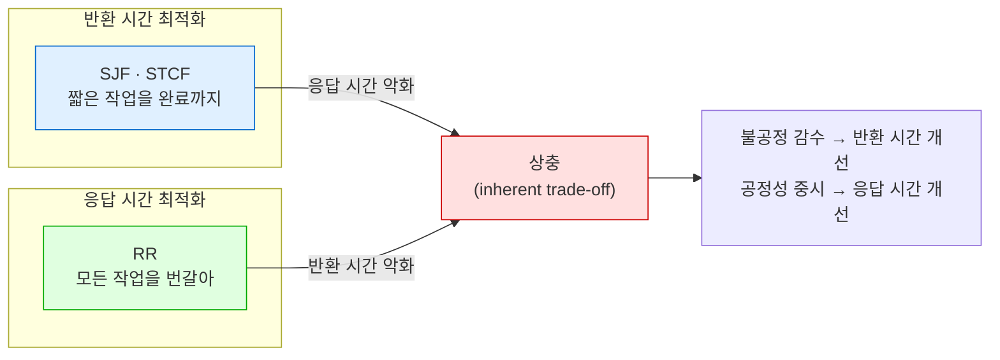

---
tags:
  - topic/os
  - ostep/virtualization
  - scheduling
  - fifo
  - sjf
  - stcf
  - round-robin
  - turnaround-time
  - response-time
  - status/verified
aliases:
  - CPU 스케줄링
  - Scheduling Introduction
  - FIFO SJF STCF RR
  - 반환 시간
  - 응답 시간
created: 2026-08-19
updated: 2026-08-19
---

# 7. CPU 스케줄링 (Scheduling: Introduction)

> 스케줄링 정책의 기본 골격. 워크로드 가정 5개를 하나씩 완화하며 FIFO → SJF → STCF → RR 로 전개하고, 반환 시간과 응답 시간의 본질적 상충을 도출

- 원서 PDF — [07-CPU-Scheduling.pdf](../../pdfs/01-virtualization/07-CPU-Scheduling.pdf)
- 원서 절 구조 — 7.1 워크로드 가정 · 7.2 지표 · 7.3 FIFO · 7.4 SJF · 7.5 STCF · 7.6 응답 시간 · 7.7 RR · 7.8 I/O 통합 · 7.9 예언자 부재 · 7.10 요약

- 전제 — ch 6의 저수준 기법(문맥 교환)은 이미 명확해야 함. 이 챕터는 그 위에 얹히는 **고수준 정책**
- 스케줄링의 기원은 컴퓨터 시스템보다 앞섬 — 초기 접근은 **경영과학(operations management)** 분야에서 차용. 조립 라인 등 인간 활동에도 스케줄링이 필요하며 효율에 대한 갈망도 동일

> [!question] CRUX: 스케줄링 정책을 어떻게 개발하는가
> 스케줄링 정책을 사고하기 위한 기본 골격을 어떻게 세우는가. 핵심 가정은 무엇인가. 어떤 지표가 중요한가. 초기 컴퓨터 시스템에서 사용된 기본 접근은 무엇인가

## 7.1 워크로드 가정

시스템에서 실행되는 프로세스(**작업, job**) 집합을 **워크로드(workload)** 라고 부름. 워크로드 파악은 정책 구축의 핵심 — 워크로드를 많이 알수록 정책을 정교하게 조율 가능.

| 번호 | 가정 | 현실성 |
|---|---|---|
| 1 | 각 작업의 실행 시간이 동일 | 비현실적 |
| 2 | 모든 작업이 동시에 도착 | 비현실적 |
| 3 | 시작한 작업은 완료까지 실행 | 비현실적 |
| 4 | 모든 작업이 CPU만 사용 (I/O 없음) | 비현실적 |
| 5 | 각 작업의 실행 시간이 **알려져 있음** | **가장 비현실적** — 스케줄러를 전지(omniscient)하게 만듦 |

- 가정을 **하나씩 완화(relax)** 해 가며 최종적으로 실용적 스케줄링 규율에 도달하는 것이 챕터 구조
- 원서 표현 — Orwell 의 *Animal Farm* 처럼 "어떤 가정은 다른 가정보다 더 비현실적". 특히 가정 5

## 7.2 스케줄링 지표

정책을 비교하려면 **지표(metric)** 필요. 이 챕터는 우선 하나만 사용.

**반환 시간(turnaround time)** — 작업이 완료된 시각에서 시스템에 도착한 시각을 뺀 값.

```text
T_turnaround = T_completion − T_arrival
```

- 모든 작업이 동시 도착한다는 가정 하에서는 `T_arrival = 0` → `T_turnaround = T_completion`
- 반환 시간은 **성능 지표(performance metric)**
- 또 다른 관심 지표 — **공정성(fairness)**. 예: Jain's Fairness Index
- **성능과 공정성은 스케줄링에서 자주 상충** — 스케줄러가 성능을 최적화하면서 일부 작업의 실행을 막을 수 있고, 그러면 공정성이 하락

## 7.3 FIFO (First In, First Out)

- **FCFS(First Come, First Served)** 라고도 함
- 장점 — 단순하고 구현이 쉬움. 위 가정 하에서는 꽤 잘 동작

### 예 1 — 동일 길이 작업 3개

A·B·C 가 `T_arrival = 0` 에 거의 동시 도착(A 가 B 보다 미세하게 먼저, B 가 C 보다 미세하게 먼저). 각 10초 실행.

```text
       A          B          C
 |----------|----------|----------|
 0         10         20         30
```

| 작업 | 완료 시각 | 반환 시간 |
|---|---|---|
| A | 10 | 10 |
| B | 20 | 20 |
| C | 30 | 30 |

```text
평균 반환 시간 = (10 + 20 + 30) / 3 = 20
```

### 예 2 — 가정 1 완화 (길이가 다름)

A 가 100초, B·C 가 각 10초. 여전히 동시 도착.

```text
                  A (100s)                  B(10) C(10)
 |----------------------------------------|------|------|
 0                                       100    110    120
```

| 작업 | 완료 시각 | 반환 시간 |
|---|---|---|
| A | 100 | 100 |
| B | 110 | 110 |
| C | 120 | 120 |

```text
평균 반환 시간 = (100 + 110 + 120) / 3 = 110
```

- **호송 효과(convoy effect)** — 상대적으로 짧은 다수의 자원 소비자가 **무거운 자원 소비자 뒤에 줄서게** 되는 현상
- 비유 — 식료품점 단일 줄에서 앞사람이 카트 3대와 수표책을 들고 있는 상황

## 7.4 SJF (Shortest Job First)

- 경영과학에서 차용한 착상. 이름이 정책을 그대로 설명 — **가장 짧은 작업을 먼저**, 다음으로 짧은 것, 반복

```text
 B(10) C(10)                  A (100s)
 |------|------|----------------------------------------|
 0     10     20                                       120
```

| 작업 | 완료 시각 | 반환 시간 |
|---|---|---|
| B | 10 | 10 |
| C | 20 | 20 |
| A | 120 | 120 |

```text
평균 반환 시간 = (10 + 20 + 120) / 3 = 50
```

- FIFO 의 110초 → **50초**. 2배 이상 개선
- 모든 작업이 동시 도착한다는 가정 하에서 **SJF 는 최적(optimal) 스케줄링 알고리즘**임을 증명 가능
  - 원서 단서 — "you are in a systems class, not theory or operations research; no proofs are allowed"

> [!tip] TIP: SJF 의 원리
> SJF 는 **고객(작업)당 체감 반환 시간이 중요한 모든 시스템**에 적용 가능한 일반 스케줄링 원리. 기다려 본 모든 줄을 생각해 볼 것 — 고객 만족을 신경 쓰는 곳이라면 SJF 를 고려했을 가능성이 높음. 예: 식료품점의 **"10개 이하" 전용 계산대**

### 가정 2 완화 — 임의 시점 도착

A 가 `t=0` 도착 100초 필요, B·C 가 `t=10` 도착 각 10초 필요.

```text
      [B,C 도착 t=10]
             |
                  A (100s)                  B(10) C(10)
 |----------------------------------------|------|------|
 0                                       100    110    120
```

| 작업 | 도착 | 완료 | 반환 시간 |
|---|---|---|---|
| A | 0 | 100 | 100 |
| B | 10 | 110 | 100 |
| C | 10 | 120 | 110 |

```text
평균 반환 시간 = (100 + 100 + 110) / 3 = 103.33
```

- B·C 가 A 직후 도착했는데도 A 완료까지 기다려야 함 → **호송 문제 재발**
- 원인 — 정의상 **SJF 는 비선점(non-preemptive) 스케줄러**

## 7.5 STCF (Shortest Time-to-Completion First)

- 가정 3(완료까지 실행) 완화 필요 + 스케줄러 내부 기법 필요
- ch 6의 타이머 인터럽트·문맥 교환이 있으므로, B·C 도착 시 **A 를 선점(preempt)** 하고 다른 작업을 실행한 뒤 나중에 A 를 계속할 수 있음
- **SJF 에 선점을 추가** 한 것이 STCF. **PSJF(Preemptive Shortest Job First)** 라고도 함
- 동작 — 새 작업이 시스템에 진입할 때마다, **남은 작업들(새 작업 포함) 중 남은 시간이 가장 적은 것**을 판별해 스케줄

```text
      [B,C 도착 t=10]
             |
 A(10) B(10) C(10)            A 잔여 (90s)
 |------|------|------|--------------------------------|
 0     10     20     30                               120
```

| 작업 | 도착 | 완료 | 반환 시간 |
|---|---|---|---|
| A | 0 | 120 | 120 |
| B | 10 | 20 | 10 |
| C | 10 | 30 | 20 |

```text
평균 반환 시간 = (120 + 10 + 20) / 3 = 50
```

- 103.33초 → **50초**
- 새 가정 하에서 **STCF 도 증명 가능하게 최적**

> [!note] ASIDE: 선점형 스케줄러
> 일괄 처리(batch) 시대에는 **비선점** 스케줄러가 다수 개발 — 각 작업을 완료까지 실행한 뒤에야 새 작업 실행 여부를 고려.
> **사실상 모든 현대 스케줄러는 선점형**이며, 다른 프로세스를 실행하기 위해 한 프로세스를 멈추는 데 거리낌이 없음. 이는 스케줄러가 앞서 배운 기법(**문맥 교환**)을 사용한다는 뜻

## 7.6 새 지표 — 응답 시간

- 작업 길이를 알고, 작업이 CPU만 쓰고, 지표가 반환 시간뿐이라면 STCF 가 훌륭한 정책. 초기 일괄 처리 시스템에서는 실제로 타당했음
- **시분할 머신의 도입이 이를 바꿈** — 사용자가 단말 앞에 앉아 **대화형 성능**을 요구

**응답 시간(response time)** — 작업이 시스템에 도착한 시점부터 **처음 스케줄되기까지의 시간**.

```text
T_response = T_firstrun − T_arrival
```

> [!note] ASIDE: 응답 시간 정의의 변형 (원서 각주)
> 작업이 어떤 "응답"을 산출하기까지의 시간을 포함하도록 조금 다르게 정의하는 경우도 있음. 원서 정의는 **최선 경우(best-case) 버전** — 작업이 즉시 응답을 산출한다고 가정한 것

앞의 STCF 예(A `t=0`, B·C `t=10`)의 응답 시간.

| 작업 | 도착 | 최초 실행 | 응답 시간 |
|---|---|---|---|
| A | 0 | 0 | 0 |
| B | 10 | 10 | 0 |
| C | 10 | 20 | 10 |

```text
평균 응답 시간 = (0 + 0 + 10) / 3 = 3.33
```

- **STCF 계열은 응답 시간에 특히 나쁨** — 세 작업이 동시 도착하면 세 번째 작업은 앞의 두 작업이 **전부 완료되기까지** 기다린 뒤 처음 스케줄됨
- 반환 시간에는 훌륭하나 응답 시간·대화형 성능에는 부적합. 단말에서 타이핑하고 10초를 기다려야 응답이 보이는 상황은 유쾌하지 않음

## 7.7 RR (Round Robin)

- 착상 — 작업을 완료까지 실행하지 않고, **타임 슬라이스(time slice)** 동안만 실행한 뒤 실행 큐의 다음 작업으로 전환. 작업이 끝나기까지 반복
  - 타임 슬라이스를 **스케줄링 퀀텀(scheduling quantum)** 이라고도 함
  - 이 때문에 RR 을 **시간 분할(time-slicing)** 이라고도 부름
- **제약** — 타임 슬라이스 길이는 **타이머 인터럽트 주기의 배수**여야 함. 타이머가 10ms마다 인터럽트하면 슬라이스는 10·20ms 등 10의 배수

### 응답 시간 비교

A·B·C 가 동시 도착, 각 5초 실행.

SJF (완료까지 실행).

```text
     A         B         C
 |---------|---------|---------|
 0         5        10        15
```

RR (타임 슬라이스 1초).

```text
시간축:  0    5    10   15
        ABCABCABCABCABC
```

| 정책 | A 응답 | B 응답 | C 응답 | 평균 응답 시간 |
|---|---|---|---|---|
| SJF | 0 | 5 | 10 | **5** |
| RR (1s) | 0 | 1 | 2 | **1** |

### 타임 슬라이스 길이의 상충

| 슬라이스 | 응답 시간 | 문맥 교환 오버헤드 |
|---|---|---|
| 짧게 | 좋아짐 | **전체 성능을 지배할 정도로 커짐** |
| 길게 | 나빠짐 | 분할 상환되어 작아짐 |

- 시스템 설계자의 상충 — 전환 비용을 분할 상환할 만큼 길게, 그러나 응답성을 잃을 만큼 길지 않게

> [!tip] TIP: 분할 상환으로 비용을 줄일 것
> 어떤 연산에 **고정 비용**이 있을 때 널리 쓰이는 일반 기법이 **분할 상환(amortization)**. 그 비용을 덜 자주 치르면(연산 횟수를 줄이면) 시스템 총비용이 감소.
> 예 — 타임 슬라이스 10ms, 문맥 교환 비용 1ms → 시간의 약 **10%** 를 문맥 교환에 낭비. 슬라이스를 100ms 로 늘리면 **1% 미만** → 시간 분할 비용이 분할 상환됨

- **문맥 교환 비용은 레지스터 저장·복원만이 아님**
  - 프로그램 실행 시 **CPU 캐시·TLB·분기 예측기** 등 온칩 하드웨어에 상당한 상태가 축적
  - 다른 작업으로 전환하면 이 상태가 **flush** 되고 새 작업의 상태를 들여와야 함 → 체감 가능한 성능 비용 발생

### RR 의 반환 시간

같은 예(A·B·C 각 5초, 슬라이스 1초).

| 작업 | 완료 시각 | 반환 시간 |
|---|---|---|
| A | 13 | 13 |
| B | 14 | 14 |
| C | 15 | 15 |

```text
평균 반환 시간 = (13 + 14 + 15) / 3 = 14
```

- SJF 의 평균 반환 시간 `(5+10+15)/3 = 10` 과 비교해 나쁨
- **RR 은 반환 시간 지표로는 최악의 정책 중 하나**. 직관 — RR 은 각 작업을 짧게만 실행하고 넘어가므로 **모든 작업을 최대한 늘려 놓음**. 반환 시간은 작업이 언제 끝나는지만 신경 쓰므로 RR 은 거의 최악(pessimal), 많은 경우 단순 FIFO 보다도 나쁨

### 본질적 상충



- 일반화 — **공정한(fair) 정책**, 즉 작은 시간 규모에서 CPU를 활성 프로세스들에 균등 배분하는 정책은 반환 시간 같은 지표에서 나쁜 성능을 냄
- **불공정을 감수하면** 짧은 작업을 완료까지 실행 가능 — 대신 응답 시간 비용
- **공정성을 중시하면** 응답 시간이 낮아짐 — 대신 반환 시간 비용
- 원서 표현 — "you can't have your cake and eat it too"

| 계열 | 최적화 대상 | 취약 지표 |
|---|---|---|
| SJF · STCF | 반환 시간 | 응답 시간 |
| RR | 응답 시간 | 반환 시간 |

## 7.8 I/O 통합 (가정 4 완화)

- 모든 프로그램은 I/O 를 수행 — 입력이 없는 프로그램은 매번 같은 출력을 내고, 출력이 없는 프로그램은 실행 사실이 무의미
- 스케줄러의 결정 시점 두 곳
  1. 작업이 **I/O 요청을 발행**할 때 — 실행 중 작업이 I/O 동안 CPU를 쓰지 않고 **대기(blocked)** 상태가 됨. HDD 라면 수 밀리초 이상 블록될 수 있음 → **다른 작업을 CPU에 스케줄해야 함**
  2. **I/O 가 완료**될 때 — 인터럽트 발생 → OS 실행 → I/O 를 발행한 프로세스를 대기에서 **준비** 상태로 이동. 그 시점에 그 작업을 실행할지도 결정 가능

### 예 — 중첩(overlap) 없음 vs 있음

A·B 각각 CPU 시간 50ms 필요. A 는 10ms 실행 후 I/O 요청(각 I/O 는 10ms), B 는 I/O 없이 CPU 50ms 사용.

**중첩 없음** — A 를 먼저 전부, 그다음 B.

```text
CPU   A    A    A    A    A  B B B B B
Disk    ▓    ▓    ▓    ▓
      0   20   40   60   80  100  120  140
```

- A 의 I/O 동안 CPU 유휴 → **자원 이용률 저하**

**중첩 있음** — A 의 10ms 부분 작업(sub-job)을 각각 독립 작업으로 취급.

```text
CPU   A B A B A B A B A B
Disk    ▓   ▓   ▓   ▓
      0   20   40   60   80  100  120  140
```

- 시스템 시작 시 선택지 — 10ms A 냐 50ms B 냐. **STCF 라면 짧은 쪽(A) 선택**
- A 의 첫 부분 작업 완료 → B 만 남아 실행 시작 → A 의 새 부분 작업이 제출되며 **B 를 선점**하고 10ms 실행
- 결과 — 한 프로세스의 I/O 완료를 기다리는 동안 **다른 프로세스가 CPU 사용** → 시스템 이용률 향상
- 일반 원리 — **각 CPU 버스트를 하나의 작업으로 취급**하면, "대화형" 프로세스가 자주 실행되도록 보장되고 그 사이 CPU 집약 작업이 실행되어 프로세서 이용률이 좋아짐

> [!tip] TIP: 중첩은 이용률을 높인다
> 가능한 경우 연산을 **중첩(overlap)** 시켜 시스템 이용률을 최대화할 것. 디스크 I/O 수행이나 원격 머신에 메시지 전송 등 여러 영역에서 유용 — 어느 경우든 **연산을 시작한 뒤 다른 일로 전환**하는 것이 좋은 착상이며 전체 이용률과 효율을 개선

## 7.9 예언자 부재 (가정 5)

- 마지막 가정 — 스케줄러가 각 작업의 길이를 안다는 것. **최악의 가정**
- 실제 범용 OS는 각 작업의 길이를 **거의 알지 못함**
- 남은 질문 두 개
  1. 사전 지식 없이 SJF/STCF 처럼 행동하는 접근을 어떻게 구축하는가
  2. RR 의 착상을 어떻게 통합해 **응답 시간도 좋게** 만드는가
- 해법 — **최근 과거로 미래를 예측하는 스케줄러**. 이름은 **MLFQ(multi-level feedback queue)** → ch 8

## 7.10 정리

- 두 계열의 접근
  - **남은 작업이 가장 짧은 것을 실행**(SJF·STCF) → 반환 시간 최적화, 응답 시간 취약
  - **모든 작업을 번갈아 실행**(RR) → 응답 시간 최적화, 반환 시간 취약
- 한쪽이 좋은 곳에서 다른 쪽이 나쁨 — 시스템에 흔한 **본질적 상충**
- I/O 통합 방법 — CPU 버스트를 독립 작업으로 취급해 **중첩** 확보
- **미래를 볼 수 없다는 OS의 근본적 한계는 미해결** → 다음 챕터에서 최근 과거로 미래를 예측하는 MLFQ 로 극복

### 지표별 정책 성능 요약

| 정책 | 선점 | 평균 반환 시간(예 2 기준) | 평균 응답 시간(A·B·C 각 5s) | 필요한 사전 지식 |
|---|---|---|---|---|
| FIFO | 비선점 | 110 | — | 없음 |
| SJF | 비선점 | 50 (동시 도착) / 103.33 (늦은 도착) | 5 | **작업 길이** |
| STCF | 선점 | 50 | — (동시 도착 시 SJF 와 동일 경향) | **남은 시간** |
| RR (1s) | 선점 | 14 (A·B·C 각 5s) | 1 | 없음 |

- 표의 반환 시간은 **서로 다른 작업 집합**의 값이므로 열 간 직접 비교 불가. 같은 작업 집합 내 비교로만 사용

## 관련 문서

- [[OS/ostep/docs/01-virtualization/06-direct-execution|6. 제한적 직접 실행]] — 선점을 가능하게 하는 타이머 인터럽트·문맥 교환
- [[OS/ostep/docs/01-virtualization/08-multi-level-feedback|8. 멀티 레벨 피드백 큐]] — 작업 길이를 모른 채 SJF 에 근접하는 방법
- [[OS/ostep/docs/01-virtualization/04-processes|4. 프로세스 추상]] — 준비·대기 상태 전이와 I/O 중첩의 관계
- [[OS/ostep/docs/README|이론 문서 인덱스]] — 전 챕터 목록
