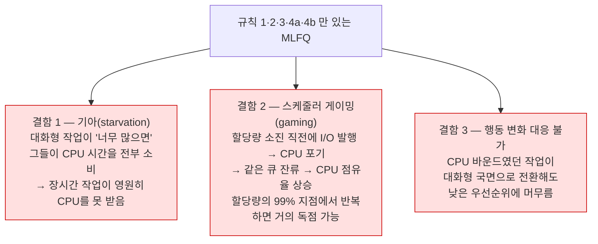

---
tags:
  - topic/os
  - ostep/virtualization
  - scheduling
  - mlfq
  - starvation
  - priority
  - nice
  - status/verified
aliases:
  - MLFQ
  - 멀티 레벨 피드백 큐
  - Multi-Level Feedback Queue
created: 2026-08-19
updated: 2026-08-19
---

# 8. 멀티 레벨 피드백 큐 (Scheduling: The Multi-Level Feedback Queue)

> 작업 길이를 모른 채 SJF의 반환 시간과 RR의 응답 시간을 동시에 노리는 스케줄러. 규칙 5개를 3단계에 걸쳐 개선하며 기아·게이밍 문제를 해소

- 원서 PDF — [08-Multi-level-Feedback.pdf](../../pdfs/01-virtualization/08-Multi-level-Feedback.pdf)
- 원서 절 구조 — 8.1 기본 규칙 · 8.2 시도 1 우선순위 변경 · 8.3 시도 2 우선순위 상승 · 8.4 시도 3 더 나은 계정 · 8.5 조율과 기타 문제 · 8.6 요약

- 최초 기술 — Corbato 등, 1962년 **CTSS(Compatible Time-Sharing System)**. 이 연구와 이후 Multics 연구로 Corbato 는 ACM 최고 영예인 **튜링상** 수상

## MLFQ가 풀려는 두 겹의 문제

| 목표 | 장애물 |
|---|---|
| **반환 시간 최적화** — 짧은 작업을 먼저 실행 | OS는 통상 작업이 얼마나 실행될지 모름. 그런데 SJF·STCF 는 정확히 그 지식을 요구 |
| **응답 시간 최소화** — 대화형 사용자에게 반응성 제공 | RR 은 응답 시간을 줄이나 반환 시간에 최악 |

> [!question] CRUX: 완전한 지식 없이 어떻게 스케줄하는가
> 작업 길이에 대한 **사전 지식 없이**, 대화형 작업의 응답 시간을 최소화하면서 반환 시간도 최소화하는 스케줄러를 어떻게 설계하는가

> [!tip] TIP: 역사로부터 배울 것
> MLFQ 는 **과거로부터 배워 미래를 예측하는** 시스템의 훌륭한 예. 이런 접근은 OS(및 하드웨어 분기 예측기·캐싱 알고리즘 등 CS 여러 영역)에 흔함.
> 작업에 **행동의 국면(phase)** 이 있어 예측 가능할 때 동작. 다만 주의 필요 — 쉽게 틀릴 수 있고, **지식이 전혀 없을 때보다 더 나쁜 결정**으로 시스템을 몰고 갈 수 있음

## 8.1 기본 규칙

- MLFQ 는 **여러 개의 별개 큐**를 가지며 각 큐에 서로 다른 **우선순위 수준** 배정
- 실행 준비된 작업은 어느 한 순간에 **단일 큐**에 위치
- 우선순위로 어느 작업을 실행할지 결정 — **더 높은 큐의 작업**이 선택됨
- 같은 큐에 여러 작업이 있으면(= 같은 우선순위) 그들 사이에서 **RR** 스케줄링

| 규칙 | 내용 |
|---|---|
| **규칙 1** | `Priority(A) > Priority(B)` 이면 A 실행 (B 는 실행 안 함) |
| **규칙 2** | `Priority(A) = Priority(B)` 이면 A·B 를 RR 로 실행 |

- 핵심은 **스케줄러가 우선순위를 어떻게 설정하는가**
- MLFQ 는 고정 우선순위를 주지 않고 **관찰된 행동에 따라 우선순위를 변화**시킴
  - 키보드 입력을 기다리며 CPU를 반복적으로 포기하는 작업 → **우선순위 유지(높게)**. 대화형 프로세스의 행태
  - 장시간 CPU를 집약적으로 쓰는 작업 → **우선순위 하락**
- 즉 실행되는 동안 프로세스를 학습해, **작업의 과거로 미래 행동을 예측**

### 어느 한 순간의 큐 상태 예

```text
[높은 우선순위]  Q8 --> A --> B
                 Q7
                 Q6
                 Q5
                 Q4 --> C
                 Q3
                 Q2
[낮은 우선순위]  Q1 --> D
```

- 현재 규칙만으로는 스케줄러가 최상위 A·B 사이에서만 타임 슬라이스를 번갈아 줌
- **C 와 D 는 실행 기회를 전혀 얻지 못함** — 원서 표현 "an outrage!"
- 정적 스냅숏만으로는 MLFQ 를 이해할 수 없음 → **시간에 따른 우선순위 변화**를 봐야 함

## 8.2 시도 1 — 우선순위 변경 방법

- 대상 워크로드 — 짧게 실행되며 CPU를 자주 포기하는 **대화형 작업**들과, CPU 시간이 많이 필요하나 응답 시간은 중요하지 않은 **CPU 바운드 작업**들의 혼합
- 새 개념 **할당량(allotment)** — 스케줄러가 우선순위를 낮추기 전까지 작업이 **주어진 우선순위 수준에서 쓸 수 있는 시간**
  - 단순화를 위해 처음에는 **할당량 = 타임 슬라이스 1개**로 가정

| 규칙 | 내용 |
|---|---|
| **규칙 3** | 작업이 시스템에 진입하면 **최상위 우선순위**(최상단 큐)에 배치 |
| **규칙 4a** | 실행 중 **할당량을 다 쓰면** 우선순위 하락(한 큐 아래로 이동) |
| **규칙 4b** | 할당량이 끝나기 전에 **CPU를 포기하면**(예: I/O 수행) 같은 우선순위 수준 유지(할당량 리셋) |

### 예 1 — 장시간 실행 작업 하나

타임 슬라이스 10ms, 할당량 = 타임 슬라이스. 3개 큐.

```text
Q2  ██
Q1     ██
Q0        ██████████████████████████████
    0      50       100      150     200
```

- 작업이 최상위 `Q2` 로 진입 → 10ms 슬라이스 후 `Q1` 로 하락 → 슬라이스 후 최하위 `Q0` 로 하락 → 그곳에 잔류

### 예 2 — 짧은 작업이 도착

A = 장시간 CPU 집약 작업(이미 실행 중), B = 짧은 대화형 작업(`T=100` 도착, 실행 시간 20ms).

```text
Q2              ▒▒
Q1                ▒▒
Q0  ██████████      ████████████████████
    0      50      100      150     200
      ██ = A (장시간)   ▒▒ = B (짧은 작업)
```

- A 는 최하위 큐에서 실행 중 (장시간 CPU 집약 작업의 귀결)
- B 가 `T=100` 도착 → **최상위 큐 삽입** → 실행 시간이 짧으므로(20ms) **최하위 큐에 닿기 전에 2개 슬라이스로 완료**
- 이후 A 가 (낮은 우선순위로) 재개
- **알고리즘의 주요 목표가 드러나는 지점** — 작업이 짧은지 긴지 모르므로 **일단 짧은 작업이라 가정**하고 높은 우선순위를 부여
  - 실제로 짧으면 빠르게 실행·완료
  - 짧지 않으면 큐를 천천히 내려가며 **스스로 장시간 배치성 프로세스임을 증명**
- 이 방식으로 **MLFQ 가 SJF 를 근사**

### 예 3 — I/O 가 있는 경우

B 가 I/O 수행 전에 CPU를 1ms만 필요로 하는 대화형 작업, A 는 장시간 배치 작업.

```text
Q2  ▒ ▒ ▒ ▒ ▒ ▒ ▒ ▒ ▒ ▒
Q1
Q0   █ █ █ █ █ █ █ █ █
    0      50      100      150     200
```

- 규칙 4b 에 따라, 할당량을 다 쓰기 전에 프로세서를 포기하면 **같은 우선순위 유지**
- 의도 — 대화형 작업이 I/O(키보드·마우스 입력 대기)를 많이 하면 할당량 완료 전에 CPU를 놓게 되는데, 이를 **벌하지 않겠다는 것**
- 결과 — B 가 계속 CPU를 놓으므로 **최상위 우선순위 유지** → 대화형 작업을 빠르게 실행하는 목표 달성

### 현재 MLFQ의 심각한 결함 3가지



> [!tip] TIP: 스케줄링은 공격으로부터 안전해야 한다
> 스케줄링 정책이 보안 문제가 아니라고 생각할 수 있으나, 점점 많은 경우에 정확히 그러함. 현대 데이터센터에서는 전 세계 사용자가 CPU·메모리·네트워크·스토리지를 공유 — 정책 설계와 집행에 주의하지 않으면 **한 사용자가 다른 사용자에게 해를 입히고 자신은 이득**을 볼 수 있음. 따라서 스케줄링 정책은 시스템 보안의 중요한 부분이며 신중히 구성되어야 함

## 8.3 시도 2 — 우선순위 상승 (기아 해결)

- 착상 — **주기적으로 시스템 내 모든 작업의 우선순위를 상승**시킴. 단순하게는 전부 최상단 큐로 던져 넣기

| 규칙 | 내용 |
|---|---|
| **규칙 5** | 일정 기간 `S` 가 지나면 시스템 내 **모든 작업을 최상단 큐로 이동** |

이 규칙이 **두 문제를 동시에 해결**.

| 해결되는 문제 | 근거 |
|---|---|
| **기아 방지** | 최상단 큐에 앉으면 다른 고우선순위 작업들과 RR 방식으로 CPU 공유 → 결국 서비스를 받게 됨 |
| **행동 변화 대응** | CPU 바운드 작업이 대화형으로 바뀌었다면, 우선순위 상승을 받은 뒤 스케줄러가 적절히 대우 |

### 예 — 우선순위 상승 없음 vs 있음

장시간 작업 1개가 짧은 대화형 작업 2개와 CPU를 경쟁.

```text
[상승 없음 — 장시간 작업이 기아]
Q2  ▒▒▒▒ ▒▒▒▒ ▒▒▒▒ ▒▒▒▒ ▒▒▒▒
Q1
Q0  ██                              (짧은 작업 도착 후 실행 기회 소멸)
    0      50      100      150     200

[100ms 마다 상승 — 장시간 작업도 진행]
Q2  ▒▒▒▒ ▒▒▒▒ █▒▒▒ ▒▒▒▒ █▒▒▒
Q1        █
Q0  ██       ██        ██
    0      50      100      150     200
      ↑ 상승          ↑ 상승
```

- 상승 없으면 짧은 작업 2개가 도착한 순간 장시간 작업이 **기아**
- 100ms마다 상승하면 장시간 작업이 최상위로 올라가 **주기적으로 실행** → 최소한의 진행 보장
- 원서 주 — 예시의 100ms 는 실제로는 너무 작은 값일 가능성. 설명 목적으로 사용

### 부두 상수 문제

- `S` 를 얼마로 설정해야 하는가
- John Ousterhout 는 시스템의 이런 값들을 **부두 상수(voo-doo constant)** 라고 불렀음 — 올바르게 설정하려면 흑마술이 필요해 보이므로

| `S` 설정 | 결과 |
|---|---|
| 너무 크면 | 장시간 작업이 기아 |
| 너무 작으면 | 대화형 작업이 CPU의 적정 몫을 못 받음 |

- 흔히 **시스템 관리자**가 올바른 값을 찾도록 남겨짐 — 또는 현대에는 점차 **기계 학습 기반 자동 방법**에 맡김

> [!tip] TIP: 부두 상수를 피할 것 (Ousterhout의 법칙)
> 부두 상수 회피는 가능한 언제나 좋은 착상. 불행히 위 예처럼 종종 어려움. 시스템이 좋은 값을 **학습**하도록 시도할 수 있으나 그것도 간단하지 않음.
> 빈번한 결과 — **기본 파라미터 값으로 채워진 설정 파일**, 그리고 무언가 잘 안 될 때 숙련 관리자가 조정. 짐작대로 이 값들은 대개 수정되지 않은 채 남고, 우리는 기본값이 현장에서 잘 동작하기를 바라는 처지에 놓임

## 8.4 시도 3 — 더 나은 계정 (게이밍 방지)

- 진짜 원인 — **규칙 4a·4b**. 할당량 만료 전에 CPU를 포기하면 우선순위를 유지시켜 주는 것
- 해법 — MLFQ **각 수준에서 CPU 시간을 더 잘 계정(accounting)**
  - 프로세스가 I/O 를 할 때 그 수준에서 쓴 할당량을 **잊지 않고 추적**
  - 할당량을 다 쓰면 다음 우선순위 큐로 강등
  - **한 번의 긴 버스트로 썼는지 여러 번의 작은 버스트로 썼는지는 무관**

| 규칙 | 내용 |
|---|---|
| **규칙 4** (4a·4b 대체) | 주어진 수준에서 **시간 할당량을 다 쓰면**(CPU를 몇 번 포기했는지와 무관하게) 우선순위 하락 |

### 예 — 게이밍 내성 없음 vs 있음

```text
[구 규칙 4a·4b — 게이밍 성공]
Q2  ▒▒▒ ▒▒▒ ▒▒▒ ▒▒▒ ▒▒▒ ▒▒▒     (할당량 직전 I/O → 최상위 잔류)
Q1
Q0
    0    50   100  150  200  250  300

[새 규칙 4 — 게이밍 차단]
Q2  ▒▒▒
Q1      ▒▒▒
Q0          ▒▒▒▒▒▒▒▒▒▒▒▒▒▒       (I/O 행태와 무관하게 하강)
    0    50   100  150  200  250  300
```

- 보호 장치가 없으면 프로세스가 할당량 종료 전 I/O 를 발행해 **같은 우선순위 수준에 머물며 CPU 시간을 지배**
- 더 나은 계정을 도입하면 프로세스의 I/O 행태와 무관하게 큐를 천천히 내려감 → **불공정한 몫을 얻을 수 없음**

## 8.5 MLFQ 조율과 기타 문제

파라미터화 질문 — 큐를 몇 개 둘 것인가, 큐별 타임 슬라이스 크기는, 할당량은, 우선순위 상승 빈도는. **쉬운 답은 없으며** 워크로드 경험과 후속 조율로 만족스러운 균형에 도달할 뿐.

### 큐별 타임 슬라이스 차등

- 대부분 MLFQ 변종은 **큐마다 다른 타임 슬라이스 길이** 허용

| 큐 | 성격 | 타임 슬라이스 |
|---|---|---|
| 고우선순위 | 대화형 작업으로 구성 → 빠른 교대가 타당 | 짧게 (10ms 이하) |
| 저우선순위 | 장시간 CPU 바운드 작업 | 길게 (수백 ms) |

```text
[낮은 우선순위 = 긴 퀀텀]
Q2  ██▒▒                        슬라이스 10ms, 총 20ms
Q1      ████▒▒▒▒                슬라이스 20ms, 총 40ms
Q0              ████████▒▒▒▒▒▒▒▒ 슬라이스 40ms
    0    50   100  150  200  250  300
```

### 실제 구현 사례

| 시스템 | 방식 |
|---|---|
| **Solaris TS**(Time-Sharing 클래스) | **테이블** 제공 — 프로세스 우선순위가 생애에 걸쳐 어떻게 변하는지, 각 슬라이스 길이, 상승 빈도를 정의. 관리자가 테이블을 수정해 동작 변경 가능. 기본값은 **큐 60개**, 슬라이스가 **20ms(최고 우선순위)에서 수백 ms(최저)** 로 점증, 우선순위 상승은 **약 1초마다** |
| **FreeBSD (4.3)** | 테이블·규칙 대신 **수식**으로 현재 우선순위 계산 — 프로세스가 쓴 CPU 양에 기반. 사용량이 시간에 따라 **감쇠(decay)** 되어 다른 방식으로 우선순위 상승 효과 제공 |

- 그 밖의 흔한 기능
  - 일부 스케줄러는 **최상위 우선순위를 OS 작업용으로 예약** → 일반 사용자 작업은 최고 우선순위를 얻지 못함
  - 일부는 **사용자 조언(advice)** 허용 — `nice` 명령행 유틸리티로 작업 우선순위를 (어느 정도) 올리거나 내려 실행 기회를 조정

> [!tip] TIP: 가능한 곳에서는 조언을 사용할 것
> OS는 시스템의 각 프로세스에 무엇이 최선인지 거의 알지 못하므로, 사용자·관리자가 **힌트**를 제공할 인터페이스를 두는 것이 유용. 이런 힌트를 **조언(advice)** 이라 부름 — OS가 반드시 따라야 하는 것은 아니고, 더 나은 결정을 위해 고려할 수 있는 것.
> 적용 부위 — 스케줄러(`nice`), 메모리 관리자(`madvise`), 파일 시스템(informed prefetching·caching)

### macOS 실측 — `nice` 의 동작

```bash
nice -n 0 ./cpu A & nice -n 19 ./cpu B &
```

- `nice -n <증가분> <명령>` — 지정한 값만큼 나이스 값을 **증가**시켜 명령 실행. 나이스 값이 크면 우선순위가 낮음
- `&` — 백그라운드 작업으로 실행

```bash
ps -o pid,nice,stat,%cpu,command -p 27442 -p 27443
```

- `-o pid,nice,stat,%cpu,command` — 출력 열 지정. `nice` 열이 나이스 값
- `-p <PID>` — 특정 PID 조회. macOS `ps` 는 PID 마다 `-p` 반복

```text
  PID NI STAT  %CPU COMMAND
27442  5 RN    99.3 ./cpu A
27443 20 RN    99.1 ./cpu B
```

**관찰 두 가지**

1. **`nice -n 0` 인데 `NI` 가 0 이 아니라 5** — `nice` 는 절대값 설정이 아니라 **부모로부터의 상대 증가**. 그리고 `nice -n 19` 는 `5+19=24` 가 아니라 `20` — macOS 나이스 상한에 걸려 절단(clamp)된 것
   - 이 환경에서 기준값이 5 인 이유는 확인 필요 — 셸 자체는 `NI 0` 인데 그 셸이 백그라운드로 띄운 프로세스가 `NI 5` 로 관찰됨 (macOS 의 백그라운드 QoS 처리 가능성. XNU 동작 확인 필요)
2. **나이스 값이 달라도 둘 다 `%CPU` 99%** — 이 머신은 논리 CPU 10개로 **CPU 경쟁이 없음**. 우선순위는 **자원이 부족할 때만** 배분에 영향
   - 우선순위 효과를 관찰하려면 CPU 수보다 많은 CPU 바운드 프로세스를 띄워 경쟁을 만들어야 함

## 8.6 정리

- 이름의 유래 — **여러 수준의 큐(multi-level queue)** 를 가지며, 작업 우선순위 결정에 **피드백(feedback)** 사용. 역사가 안내자 — 작업이 시간에 따라 어떻게 행동하는지 주목해 그에 맞게 대우

### 최종 MLFQ 규칙 (원서 8.6 재수록)

| 규칙 | 내용 |
|---|---|
| **규칙 1** | `Priority(A) > Priority(B)` 이면 A 실행 (B 는 실행 안 함) |
| **규칙 2** | `Priority(A) = Priority(B)` 이면 A·B 를 RR 로 실행 |
| **규칙 3** | 작업이 시스템에 진입하면 최상위 우선순위에 배치 |
| **규칙 4** | 주어진 수준에서 시간 할당량을 다 쓰면(CPU를 몇 번 포기했는지 무관) 우선순위 하락 |
| **규칙 5** | 일정 기간 `S` 후 시스템 내 모든 작업을 최상단 큐로 이동 |

- 결과 — 작업 길이에 대한 사전 지식 없이 **짧은·I/O 집약 대화형 작업은 빠르게**(SJF·RR 의 장점), **장시간 작업도 기아 없이 진행**

## 관련 문서

- [[OS/ostep/docs/01-virtualization/07-cpu-scheduling|7. CPU 스케줄링]] — MLFQ가 근사하려는 SJF·STCF·RR
- [[OS/ostep/docs/01-virtualization/09-lottery-scheduling|9. 비례 배분 스케줄링]] — 반환·응답 시간이 아닌 **몫(share)** 을 목표로 하는 다른 계열
- [[OS/ostep/docs/01-virtualization/06-direct-execution|6. 제한적 직접 실행]] — 우선순위 하락·상승을 실행하는 타이머 인터럽트 기반
- [[OS/ostep/docs/README|이론 문서 인덱스]] — 전 챕터 목록
