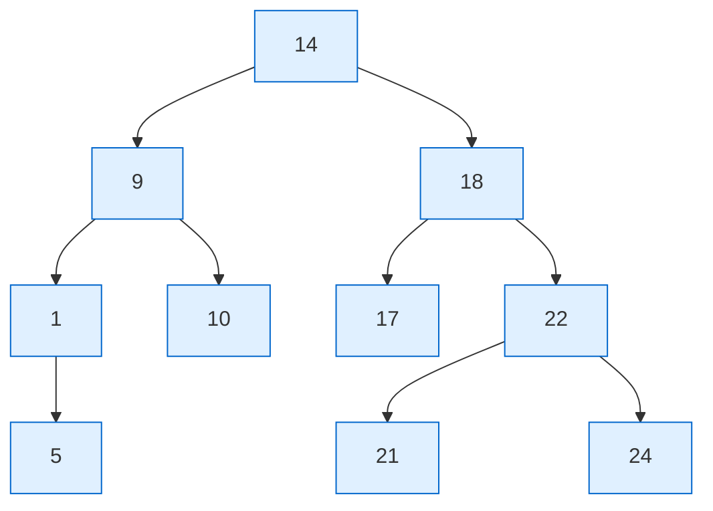

---
tags:
  - topic/os
  - ostep/virtualization
  - scheduling
  - lottery-scheduling
  - stride-scheduling
  - cfs
  - proportional-share
  - nice
  - status/verified
aliases:
  - 비례 배분 스케줄링
  - 추첨 스케줄링
  - Lottery Scheduling
  - 보폭 스케줄링
  - Stride Scheduling
  - CFS
created: 2026-08-19
updated: 2026-08-19
---

# 9. 비례 배분 스케줄링 (Scheduling: Proportional Share)

> 반환·응답 시간이 아니라 **CPU 시간의 일정 비율 보장**을 목표로 하는 계열. 추첨(확률적) · 보폭(결정적) · Linux CFS

- 원서 PDF — [09-Lottery-Scheduling.pdf](../../pdfs/01-virtualization/09-Lottery-Scheduling.pdf)
- 원서 절 구조 — 9.1 티켓 개념 · 9.2 티켓 기법 · 9.3 구현 · 9.4 예제 · 9.5 티켓 배정 · 9.6 보폭 스케줄링 · 9.7 Linux CFS · 9.8 요약

- **비례 배분(proportional-share)** = **공정 배분(fair-share)** 스케줄러
- 착상 — 반환·응답 시간 최적화 대신, 각 작업이 **CPU 시간의 일정 비율**을 얻도록 보장
- 초기 대표 사례 — Waldspurger & Weihl 의 **추첨 스케줄링(lottery scheduling)**. 다만 착상 자체는 더 오래됨
- 기본 방식 — 주기적으로 **추첨**을 열어 다음에 실행할 프로세스를 결정. 더 자주 실행되어야 하는 프로세스에 **당첨 기회를 더 많이** 부여

> [!question] CRUX: CPU를 비례적으로 어떻게 공유하는가
> CPU를 비례적으로 공유하는 스케줄러를 어떻게 설계하는가. 그 핵심 기법은 무엇인가. 얼마나 효과적인가

## 9.1 기본 개념 — 티켓이 몫을 나타냄

- **티켓(ticket)** — 프로세스(또는 사용자 등)가 받아야 할 자원의 몫을 표현
- 프로세스가 가진 **티켓의 비율**이 곧 그 프로세스의 시스템 자원 몫

예 — A 가 75장, B 가 25장. 목표는 A 가 CPU의 75%, B 가 25%.

- 추첨은 이를 **확률적으로(probabilistically) 달성**. 결정적이지 않음
- 절차 — 스케줄러가 총 티켓 수(예: 100)를 알고, **당첨 티켓**(0~99 중 하나)을 뽑음. A 가 0~74, B 가 75~99 를 보유하면 당첨 번호가 실행 주체를 결정. 그 프로세스 상태를 적재해 실행

당첨 티켓 예 20회.

```text
63 85 70 39 76 17 29 41 36 39 10 99 68 83 63 62 43  0 49 12
```

결과 스케줄.

```text
A  B  A  A  B  A  A  A  A  A  A  B  A  B  A  A  A  A  A  A
```

- B 는 20개 슬라이스 중 **4개(20%)** 만 실행 — 목표 25%에 미달
- 그러나 **두 작업이 오래 경쟁할수록 목표 비율에 근접할 확률이 높아짐**

> [!note] ASIDE: 0부터 세는 이유 (원서 각주)
> "Computer Scientists always start counting at 0." 비전공자에게 낯설어 유명 인물이 그 이유를 글로 쓸 의무를 느낄 정도였음

> [!tip] TIP: 무작위성을 사용할 것
> 추첨 스케줄링의 가장 아름다운 측면 중 하나가 **무작위성** 사용. 결정을 내려야 할 때 무작위 접근은 종종 견고하고 단순한 방법.
> 전통적 결정 방식 대비 최소 **3가지 이점**
> 1. **이상한 코너 케이스 회피** — 예: LRU 교체 정책은 일부 순환적·순차적 워크로드에서 최악 성능. 무작위는 그런 최악 경우가 부재
> 2. **경량성** — 대안 추적에 상태가 거의 불필요. 전통적 공정 배분은 프로세스별 CPU 사용량 계정이 필요하고 실행마다 갱신해야 하나, 무작위는 **최소한의 프로세스별 상태**(티켓 수)만 요구
> 3. **속도** — 난수 생성이 빠르면 결정도 빠름. 물론 더 빨라야 할수록 **의사 난수(pseudo-random)** 로 기울게 됨

> [!tip] TIP: 몫을 표현하는 데 티켓을 사용할 것
> 추첨(과 보폭) 스케줄링 설계의 가장 강력하고 기본적인 기법이 **티켓**. 여기서는 CPU 몫 표현에 쓰이나 훨씬 넓게 적용 가능 — Waldspurger 는 하이퍼바이저 가상 메모리 관리 연구에서 티켓으로 **게스트 OS의 메모리 몫**을 표현하는 방법을 보임. 소유 비율을 표현할 기법이 필요하면 티켓을 고려할 것

## 9.2 티켓 기법 3종

| 기법 | 내용 | 용도 |
|---|---|---|
| **티켓 통화(ticket currency)** | 사용자가 자기 티켓을 자기 작업들에 **원하는 통화 단위로** 배분. 시스템이 전역 값으로 자동 환산 | 사용자 내부 배분의 자유 |
| **티켓 이전(ticket transfer)** | 프로세스가 자기 티켓을 다른 프로세스에 **일시적으로 넘김** | 클라이언트/서버 — 클라이언트가 서버에 작업을 요청할 때 티켓을 넘겨 서버 성능을 극대화. 완료 후 반환 |
| **티켓 인플레이션(ticket inflation)** | 프로세스가 자기 티켓 수를 **일시적으로 올리거나 내림** | **서로 신뢰하는 프로세스 그룹**에서만 유효. 어느 프로세스가 CPU 시간이 더 필요함을 알면 다른 프로세스와 통신 없이 티켓 값을 올려 시스템에 알림 |

- 인플레이션 주의 — 서로 신뢰하지 않는 경쟁 상황에서는 무의미. **탐욕적 프로세스 하나가 자기에게 막대한 티켓을 주고 머신을 장악**할 수 있음

### 티켓 통화 환산 예

사용자 A·B 에게 각 100장 부여. A 는 작업 2개(A1·A2)에 자기 통화로 각 500장(총 1000장), B 는 작업 1개에 자기 통화로 10장(총 10장).

```text
User A -> 500 (A's currency) to A1 -> 50 (global currency)
       -> 500 (A's currency) to A2 -> 50 (global currency)
User B -> 10  (B's currency) to B1 -> 100 (global currency)
```

- A1·A2 의 500장 → 전역 통화 **각 50장**, B1 의 10장 → 전역 **100장**
- 추첨은 전역 통화 총 **200장**을 대상으로 열림

## 9.3 구현

- 놀라운 점은 **구현의 단순함**. 필요한 것 3가지
  1. 당첨 티켓을 뽑을 좋은 **난수 생성기**
  2. 시스템 프로세스를 추적할 **자료 구조**(예: 리스트)
  3. **총 티켓 수**

```text
head --> [Job:A Tix:100] --> [Job:B Tix:50] --> [Job:C Tix:250] --> NULL
```

총 티켓 400. 당첨 번호로 300 을 뽑은 경우의 결정 코드.

```c
// counter: used to track if we've found the winner yet
int counter = 0;

// winner: call some random number generator to
//         get a value >= 0 and <= (totaltickets - 1)
int winner = getrandom(0, totaltickets);

// current: use this to walk through the list of jobs
node_t *current = head;
while (current) {
    counter = counter + current->tickets;
    if (counter > winner)
        break;                  // found the winner
    current = current->next;
}
// 'current' is the winner: schedule it...
```

동작 추적 (`winner = 300`).

| 단계 | `counter` | 비교 | 결과 |
|---|---|---|---|
| A 반영 | 100 | `100 > 300`? 아니오 | 계속 |
| B 반영 | 150 | `150 > 300`? 아니오 | 계속 |
| C 반영 | 400 | `400 > 300`? **예** | **C 당첨** — 루프 탈출 |

- 효율화 — 리스트를 **티켓 수 내림차순으로 정렬**하면 일반적으로 순회 횟수가 최소화됨. 특히 소수 프로세스가 티켓 대부분을 보유한 경우
- 정렬 순서는 **알고리즘의 정확성에 영향 없음**

> [!note] ASIDE: 범위 내 난수 생성의 난점 (원서 각주)
> 놀랍게도 이를 **정확히** 하는 것은 까다로움. Björn Lindberg 의 지적 — 관련 논의는 Stack Overflow "how to generate a random number from within a range" 참조

## 9.4 공정성 예제

- 설정 — 티켓 수가 같은(각 100장) 두 작업이 경쟁. 실행 시간 `R` 을 1~1000 으로 변화
- **공정성 지표 `F`** — 첫 작업 완료 시각 ÷ 두 번째 작업 완료 시각

```text
예: R = 10, 첫 작업이 10에 완료, 두 번째가 20에 완료
    F = 10 / 20 = 0.5

완벽히 공정한 스케줄러 → F = 1
```

- 30회 시행 평균 결과 — **작업 길이가 짧으면 평균 공정성이 상당히 낮음**
- **작업이 유의미한 수의 타임 슬라이스만큼 실행되어야** 추첨 스케줄러가 목표 공정 결과에 근접

## 9.5 티켓을 어떻게 배정하는가

- 미해결 문제 — 시스템 동작이 티켓 배분 방식에 크게 의존
- 한 접근 — **사용자가 가장 잘 안다고 가정**. 각 사용자에게 티켓 일정 수를 주고, 사용자가 자기 작업에 원하는 대로 배분
- 그러나 이는 **비-해법(non-solution)** — 실제로 무엇을 해야 하는지 알려주지 않음
- 결론 — 주어진 작업 집합에 대한 **"티켓 배정 문제"는 열린 문제로 남음**

## 9.6 보폭 스케줄링 (Stride Scheduling)

- 의문 — 애초에 왜 무작위성을 쓰는가. 무작위는 단순하고 근사적으로 옳은 스케줄러를 주지만, **짧은 시간 규모에서는 정확한 비율을 주지 못함**
- Waldspurger 가 **결정적(deterministic)** 공정 배분 스케줄러인 보폭 스케줄링 고안

### 보폭과 pass 값

- 각 작업이 **보폭(stride)** 을 가짐 — 티켓 수에 **반비례**
- 계산 — 큰 수를 티켓 수로 나눔

| 작업 | 티켓 | 보폭 (10000 ÷ 티켓) |
|---|---|---|
| A | 100 | **100** |
| B | 50 | **200** |
| C | 250 | **40** |

- **pass 값** — 프로세스가 실행될 때마다 자기 보폭만큼 증가시키는 카운터. 전역 진행도 추적
- 알고리즘 — 매 시점 **pass 값이 가장 낮은 프로세스**를 실행하고, 실행 후 그 pass 를 보폭만큼 증가

```c
curr = remove_min(queue);     // pick client with min pass
schedule(curr);               // run for quantum
curr->pass += curr->stride;   // update pass using stride
insert(queue, curr);          // return curr to queue
```

### 트레이스

초기 pass 값은 모두 0. 동률이면 임의 선택 가능(여기서는 A 선택).

| Pass(A) 보폭 100 | Pass(B) 보폭 200 | Pass(C) 보폭 40 | 실행 주체 |
|---|---|---|---|
| 0 | 0 | 0 | **A** |
| 100 | 0 | 0 | **B** |
| 100 | 200 | 0 | **C** |
| 100 | 200 | 40 | **C** |
| 100 | 200 | 80 | **C** |
| 100 | 200 | 120 | **A** |
| 200 | 200 | 120 | **C** |
| 200 | 200 | 160 | **C** |
| 200 | 200 | 200 | (모두 동률 → 반복) |

- 한 주기에서 **C 5회, A 2회, B 1회** 실행 → 티켓 비율 `250 : 100 : 50` = `5 : 2 : 1` 과 **정확히 일치**
- 추첨은 시간에 걸쳐 확률적으로 비율 달성, 보폭은 **각 스케줄링 주기 끝에서 정확히** 달성

### 그럼에도 추첨을 쓰는 이유

| 항목 | 추첨 | 보폭 |
|---|---|---|
| 비율 정확성 | 확률적 | **정확** |
| **전역 상태** | **불필요** | 필요 (pass 값) |
| 새 작업 진입 | 티켓만 추가하고 전역 총합 갱신 → 간단 | 새 작업의 pass 값을 무엇으로 둘지 문제. **0 으로 두면 CPU 독점** |

- 추첨의 장점 — **프로세스별 전역 상태 부재** → 새 프로세스를 합리적으로 편입시키기가 훨씬 쉬움

## 9.7 Linux CFS (Completely Fair Scheduler)

- 현재 Linux 방식. 공정 배분을 구현하되 **고효율·고확장성** 방식으로
- 효율 목표 — 스케줄링 결정에 **아주 적은 시간**을 쓰는 것. 설계 자체와 과제에 잘 맞는 자료 구조의 영리한 사용으로 달성
- 효율의 중요성 근거 — Kanev 등의 Google 데이터센터 연구에서 **적극적 최적화 후에도 스케줄링이 전체 데이터센터 CPU 시간의 약 5%** 사용

### 기본 동작 — 가상 실행 시간(vruntime)

- 대부분 스케줄러는 **고정 타임 슬라이스** 개념 기반이나 CFS 는 다르게 동작
- 목표 — 경쟁하는 모든 프로세스에게 CPU를 공정하게 균등 분할
- 방법 — **vruntime(virtual runtime)** 이라는 단순 계수 기법
  - 각 프로세스가 실행되면서 vruntime 누적
  - 기본 경우 각 프로세스의 vruntime 은 **물리(실제) 시간에 비례해 동일 속도로 증가**
  - 스케줄링 결정 시 **vruntime 이 가장 낮은 프로세스**를 다음에 실행

### 제어 파라미터

| 파라미터 | 전형적 값 | 역할 |
|---|---|---|
| `sched_latency` | **48 ms** | 전환을 고려하기 전에 한 프로세스가 얼마나 실행될지 결정. 이 값을 실행 프로세스 수 `n` 으로 나눠 프로세스별 타임 슬라이스 산출 → 이 기간에 걸쳐 완전히 공정 |
| `min_granularity` | **6 ms** | 타임 슬라이스의 **하한**. 프로세스가 너무 많아 슬라이스가 지나치게 작아지는 것을 방지 |

- 긴장 관계 — **자주 전환**하면 공정성 상승, 성능 하락(문맥 교환 과다). **덜 전환**하면 성능 상승, 근시적 공정성 하락

계산 예.

```text
n = 4  → 48 / 4 = 12 ms (프로세스별 슬라이스)
n = 10 → 48 / 10 = 4.8 ms → min_granularity 에 걸려 6 ms 로 상향
```

- `n = 10` 인 경우 목표 스케줄링 지연 48ms 에 걸쳐 **완벽히 공정하지는 않으나 근접**하면서 높은 CPU 효율 유지

동작 예 — 작업 4개(A·B·C·D)가 각각 2개 슬라이스씩 실행, 이후 C·D 완료 → 남은 2개가 각 24ms 씩 RR.

```text
 A  B  C  D  A  B  C  D    A     B     A     B     A     B
 |--|--|--|--|--|--|--|--|-----|-----|-----|-----|-----|-----|
 0           50          100         150         200        250
```

- CFS 는 **주기적 타이머 인터럽트**를 사용 → 고정 시간 간격에서만 결정 가능. 이 인터럽트는 자주 발생(예: 1ms마다)
- 슬라이스가 타이머 간격의 정확한 배수가 아니어도 무관 — **CFS 가 vruntime 을 정밀히 추적**하므로 장기적으로 이상적 공유에 근사

### 가중치 (nice)

- CFS 는 티켓이 아니라 고전적 UNIX 기법인 **nice 수준**으로 우선순위 제어
- 범위 **-20 ~ +19**, 기본 0. **양수 = 낮은 우선순위**, 음수 = 높은 우선순위
- 원서 농담 — "when you're too nice, you just don't get as much (scheduling) attention"

nice 값 → 가중치 매핑 테이블.

```c
static const int prio_to_weight[40] = {
 /* -20 */ 88761, 71755, 56483, 46273, 36291,
 /* -15 */ 29154, 23254, 18705, 14949, 11916,
 /* -10 */  9548,  7620,  6100,  4904,  3906,
 /*  -5 */  3121,  2501,  1991,  1586,  1277,
 /*   0 */  1024,   820,   655,   526,   423,
 /*   5 */   335,   272,   215,   172,   137,
 /*  10 */   110,    87,    70,    56,    45,
 /*  15 */    36,    29,    23,    18,    15,
};
```

타임 슬라이스 계산식 (프로세스 `n` 개).

```text
                     weight_k
time_slice_k =  ───────────────────  ×  sched_latency
                 Σ(i=0..n-1) weight_i
```

vruntime 누적식 — 실제 실행 시간을 가중치로 **반비례 조정**. `weight_0 = 1024`(nice 0 기본 가중치).

```text
                                weight_0
vruntime_i = vruntime_i  +  ───────────────  ×  runtime_i
                                weight_i
```

계산 예 — A 는 nice `-5`, B 는 nice `0`.

| 작업 | nice | 가중치 | 타임 슬라이스 | vruntime 누적 속도 |
|---|---|---|---|---|
| A | -5 | 3121 | `3121/(3121+1024) × 48 ≈ 36 ms` (약 3/4) | `1024/3121 ≈ 1/3` 배 |
| B | 0 | 1024 | `1024/(3121+1024) × 48 ≈ 12 ms` (약 1/4) | `1024/1024 = 1` 배 |

- 테이블 설계의 영리한 점 — **nice 값의 차이가 일정하면 CPU 비율이 보존됨**
  - 검산 — A 가 nice `5`(가중치 335), B 가 nice `10`(가중치 110)이라면 비율 `335/110 ≈ 3.05`. 앞의 `3121/1024 ≈ 3.05` 와 **동일** → 스케줄 결과가 정확히 같아짐

### 레드-블랙 트리 사용

- 효율의 한 측면 — 다음 실행 작업을 찾을 때 **최대한 빠르게** 찾아야 함
- 리스트는 확장성 부족 — 현대 시스템은 때로 수천 개 프로세스로 구성되며, 수 밀리초마다 긴 리스트를 탐색하는 것은 낭비
- CFS 는 프로세스를 **레드-블랙 트리(red-black tree)** 에 보관
  - 균형 트리의 한 종류. 단순 이진 트리는 최악 삽입 패턴에서 리스트 수준 성능으로 퇴화할 수 있으나, 균형 트리는 추가 작업으로 **깊이를 낮게 유지** → 연산이 **선형이 아니라 로그 시간**
- **모든 프로세스를 담지 않음** — **실행 중(또는 실행 가능한)** 프로세스만. 프로세스가 잠들면(I/O 완료 대기, 네트워크 패킷 대기) 트리에서 **제거**되고 다른 곳에서 추적

vruntime 값이 `1, 5, 9, 10, 14, 17, 18, 21, 22, 24` 인 작업 10개의 트리 구성.



| 자료 구조 | 다음 작업 찾기 | 재삽입 | 검색 |
|---|---|---|---|
| 정렬된 리스트 | 첫 원소 제거 — 간단 | 올바른 위치를 찾아 스캔 → **O(n)** | 평균 **선형** |
| 레드-블랙 트리 | vruntime 순 정렬 | **O(log n)** | **O(log n)** |

- `n` 이 수천 단위면 로그 시간이 선형보다 **체감 가능하게 효율적**

> [!tip] TIP: 적절한 곳에 효율적 자료 구조를 사용할 것
> 많은 경우 리스트로 충분하고, 많은 경우 충분하지 않음. **언제 어떤 자료 구조를 쓸지 아는 것이 좋은 엔지니어링의 표식**.
> 초기 스케줄러의 단순 리스트는 현대 시스템, 특히 데이터센터의 부하 높은 서버에서 잘 동작하지 않음 — 수천 개 활성 프로세스에서 매 수 밀리초마다 코어별로 긴 리스트를 탐색하면 귀중한 CPU 사이클을 낭비. CFS 는 레드-블랙 트리의 우수한 구현으로 이를 해결.
> 일반화 — 시스템용 자료 구조를 고를 때 **접근 패턴과 사용 빈도**를 신중히 고려할 것

### I/O 와 잠든 프로세스 처리

- 문제 — 오래 잠들어 있던 작업. A 는 계속 실행, B 는 10초간 잠들었다고 가정
  - B 가 깨어나면 vruntime 이 A 보다 **10초 뒤처져 있음** → 주의하지 않으면 B 가 따라잡는 동안 **10초간 CPU 독점**하며 A 를 기아 상태로 만듦
- CFS 대처 — 작업이 깨어날 때 그 vruntime 을 **트리에서 발견된 최소값으로 설정**. 트리에는 실행 중 작업만 있음을 기억할 것
- 대가 — **짧은 기간 자주 잠드는 작업은 CPU의 공정한 몫을 결코 얻지 못함**

### 기타 CFS 기능

- 캐시 성능 개선을 위한 다수 휴리스틱
- 다중 CPU 를 효과적으로 다루는 전략 (ch 10)
- **프로세스 그룹 단위 스케줄링** — 각 프로세스를 독립 개체로 취급하는 대신 큰 그룹에 걸쳐 스케줄
- 상세는 Bouron 등의 최근 연구부터 참조

## 9.8 정리

세 가지 비례 배분 접근.

| 접근 | 방식 | 비율 정확성 | 특징 |
|---|---|---|---|
| **추첨** | 무작위성 | 확률적 (장기적으로 근접) | 전역 상태 불필요, 새 작업 편입 용이 |
| **보폭** | 결정적 (pass·stride) | 주기 끝에서 정확 | 전역 상태 필요, 새 작업 편입이 문제 |
| **CFS** | 가중 RR + 동적 슬라이스 (vruntime) | 실용적으로 근접 | 유일한 "실제" 스케줄러. 확장성·부하 성능 고려. **오늘날 가장 널리 쓰이는 공정 배분 스케줄러** |

**공정 배분 스케줄러의 문제점**

| 문제 | 내용 |
|---|---|
| **I/O 와의 궁합** | I/O 를 간헐적으로 수행하는 작업이 CPU의 공정한 몫을 못 받을 수 있음 |
| **티켓·우선순위 배정** | 브라우저에 티켓을 몇 장 줘야 하는지, 텍스트 편집기 nice 값을 얼마로 둬야 하는지 알 방법이 없음 |

- MLFQ 등 범용 스케줄러는 이 문제들을 **자동 처리**하므로 배포가 더 쉬울 수 있음
- 그러나 이 문제들이 지배적 관심사가 아닌 영역이 다수 존재하며, 거기서는 비례 배분이 큰 효과
  - 예 — **가상화 데이터센터(클라우드)**. CPU 사이클의 1/4을 Windows VM에, 나머지를 기반 Linux 설치에 배정하려는 경우 비례 공유가 단순하고 효과적
  - 착상은 **다른 자원으로도 확장** 가능 — VMWare ESX Server 의 메모리 비례 공유는 Waldspurger 참조

## 관련 문서

- [[OS/ostep/docs/01-virtualization/08-multi-level-feedback|8. 멀티 레벨 피드백 큐]] — 티켓·우선순위 배정 문제를 자동 처리하는 대안 계열
- [[OS/ostep/docs/01-virtualization/07-cpu-scheduling|7. CPU 스케줄링]] — 반환·응답 시간 지표와 RR 의 공정성 논의
- [[OS/ostep/docs/01-virtualization/10-multi-cpu-scheduling|10. 멀티프로세서 스케줄링]] — CFS 의 다중 CPU 전략 배경
- [[OS/ostep/docs/README|이론 문서 인덱스]] — 전 챕터 목록
