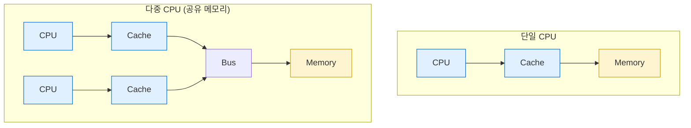
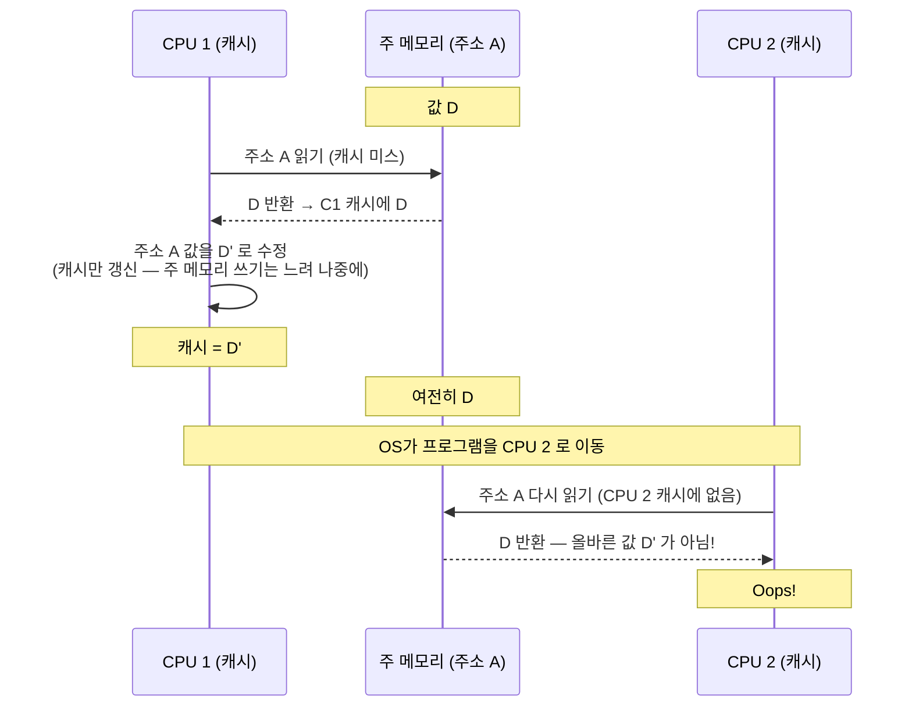
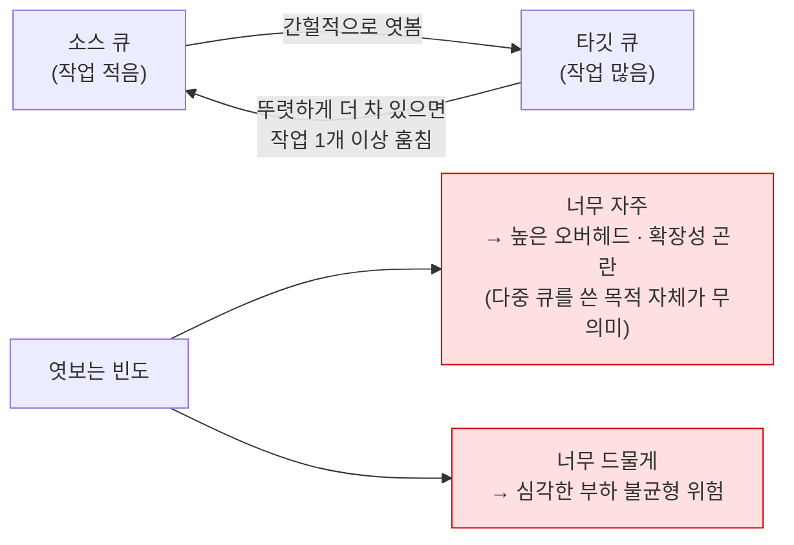

---
tags:
  - topic/os
  - ostep/virtualization
  - scheduling
  - multiprocessor
  - cache-coherence
  - cache-affinity
  - work-stealing
  - status/verified
aliases:
  - 멀티프로세서 스케줄링
  - Multiprocessor Scheduling
  - SQMS
  - MQMS
  - 캐시 친화성
  - 워크 스틸링
created: 2026-08-19
updated: 2026-08-19
---

# 10. 멀티프로세서 스케줄링 (Multiprocessor Scheduling, Advanced)

> 다중 CPU 환경의 스케줄링. 캐시 일관성·동기화·캐시 친화성 배경과 단일 큐(SQMS) vs 다중 큐(MQMS) 상충

- 원서 PDF — [10-Multi-CPU-Scheduling.pdf](../../pdfs/01-virtualization/10-Multi-CPU-Scheduling.pdf)
- 원서 절 구조 — 10.1 멀티프로세서 구조 · 10.2 동기화 · 10.3 캐시 친화성 · 10.4 단일 큐 · 10.5 다중 큐 · 10.6 Linux 스케줄러 · 10.7 요약

> [!note] ASIDE: 고급(Advanced) 챕터
> 고급 챕터는 진정한 이해를 위해 책 여러 부분의 재료를 요구하나, 그 선행 재료보다 **앞선 절에 논리적으로 속하는** 챕터. 이 챕터는 파트 2(병행성)를 먼저 읽어야 훨씬 잘 이해되지만, 논리적으로는 가상화(일반)·CPU 스케줄링(구체)에 속함 → **순서를 바꿔, 파트 2 이후에 읽는 것을 권장**

- 멀티코어 확산 배경 — 컴퓨터 설계자들이 **전력을 과도하게 쓰지 않고 단일 CPU를 훨씬 빠르게 만들기 어려워짐** → 여러 CPU 코어를 한 칩에 집적
- 첫 난점 — 전형적 응용(직접 작성한 C 프로그램)은 **단일 CPU만 사용**. CPU를 늘려도 그 응용이 빨라지지 않음 → 스레드 등으로 **병렬 실행하도록 재작성** 필요

> [!question] CRUX: 다중 CPU에서 작업을 어떻게 스케줄하는가
> OS는 다중 CPU에서 작업을 어떻게 스케줄해야 하는가. 어떤 새 문제가 생기는가. 기존 기법이 그대로 통하는가, 아니면 새 착상이 필요한가

## 10.1 배경 — 멀티프로세서 구조

단일 CPU 하드웨어와 다중 CPU 하드웨어의 근본적 차이는 **하드웨어 캐시 사용**과 **여러 프로세서 간 데이터 공유 방식**에 있음.



- **캐시** — 작고 빠른 메모리. 주 메모리에 있는 인기 데이터의 **복사본**을 보관
- **주 메모리** — 모든 데이터를 보관하나 접근이 느림
- 자주 접근하는 데이터를 캐시에 두면 **크고 느린 메모리가 빠른 것처럼 보이게** 됨

동작 예 — 단일 CPU, 캐시 64KB.

| 시점 | 동작 | 소요 |
|---|---|---|
| 첫 `load` | 데이터가 주 메모리에 있음 → 가져옴. 재사용을 예상해 **캐시에 복사본 배치** | 수십~수백 ns |
| 이후 같은 항목 `load` | CPU가 먼저 캐시를 확인 → 발견(hit) | **수 ns** |

### 지역성(locality) 두 종류

| 종류 | 내용 | 예 |
|---|---|---|
| **시간 지역성(temporal locality)** | 어떤 데이터가 접근되면 **가까운 미래에 다시** 접근될 가능성이 높음 | 루프에서 반복 접근되는 변수·명령어 |
| **공간 지역성(spatial locality)** | 주소 `x` 를 접근하면 **`x` 근처** 항목도 접근할 가능성이 높음 | 배열 순회, 순차 실행되는 명령어 |

- 많은 프로그램에 이런 지역성이 존재하므로 하드웨어는 어떤 데이터를 캐시에 둘지 **좋은 추측**을 할 수 있음

### 캐시 일관성 문제 (cache coherence)



- 하드웨어가 제공하는 기본 해법 — **메모리 접근을 감시**해 단일 공유 메모리라는 관점을 보존
- 버스 기반 시스템의 한 방법 — **버스 스누핑(bus snooping)**. 각 캐시가 주 메모리로 연결된 버스를 관찰해 메모리 갱신에 주의
  - 자기 캐시에 보유한 항목의 갱신을 보면 **무효화(invalidate — 자기 캐시에서 제거)** 하거나 **갱신(update — 새 값을 자기 캐시에도 반영)**
  - **write-back 캐시**는 주 메모리 쓰기가 나중에야 보이므로 이를 더 복잡하게 만듦

## 10.2 동기화도 잊지 말 것

- 캐시가 일관성을 제공하니 프로그램(또는 OS 자신)은 공유 데이터 접근 시 걱정할 게 없는가 → **아니오**
- CPU 간 공유 데이터·구조를 접근(특히 **갱신**)할 때 정확성 보장을 위해 **상호 배제 프리미티브(락)** 사용 필요
  - 락 없는(lock-free) 자료 구조 같은 다른 접근은 복잡하며 간헐적으로만 사용
- 예 — 여러 CPU에서 병행 접근되는 공유 큐. 락 없이 병행 삽입·삭제하면 **하부 일관성 프로토콜이 있어도 기대대로 동작하지 않음**

공유 연결 리스트에서 원소를 제거하는 코드.

```c
typedef struct __Node_t {
    int              value;
    struct __Node_t *next;
} Node_t;

int List_Pop() {
    Node_t *tmp = head;          // remember old head
    int value   = head->value;   // ... and its value
    head        = head->next;    // advance to next
    free(tmp);                   // free old head
    return value;                // return value @head
}
```

두 CPU의 스레드가 동시에 이 루틴에 진입하면.

| 단계 | 스레드 1 | 스레드 2 | 결과 |
|---|---|---|---|
| `tmp = head` | 현재 `head` 를 자기 `tmp` 에 저장 | 같은 `head` 값을 자기 `tmp` 에 저장 | `tmp` 는 스택 할당이므로 **각자 사설 저장소** |
| 이후 | 같은 head 원소 제거 시도 | 같은 head 원소 제거 시도 | **같은 원소 이중 `free`**, 같은 값 **두 번 반환** |

- 해법 — 뮤텍스(`pthread_mutex_t m;`) 할당 후 루틴 시작에 `lock(&m)`, 끝에 `unlock(&m)`
- 그러나 이 접근도 문제가 없지 않음 — 특히 **성능**. **CPU 수가 늘면 동기화된 공유 자료 구조 접근이 상당히 느려짐**

## 10.3 캐시 친화성 (cache affinity)

- 프로세스가 특정 CPU에서 실행되면 그 CPU의 **캐시와 TLB에 상당한 상태를 축적**
- 다음번 실행 시 **같은 CPU에서 실행하는 것이 유리** — 일부 상태가 이미 그 CPU 캐시에 있으므로 더 빠르게 실행
- 매번 다른 CPU에서 실행하면 **매번 상태를 다시 적재**해야 하므로 성능 악화
  - 다른 CPU에서도 **정확하게는 동작함** — 하드웨어의 캐시 일관성 프로토콜 덕분
- 따라서 멀티프로세서 스케줄러는 스케줄링 결정 시 캐시 친화성을 고려해, 가능하면 **프로세스를 같은 CPU에 유지**하는 편을 선호해야 함

### macOS 실측 — 캐시·코어 구성

```bash
sysctl -n hw.ncpu hw.physicalcpu hw.logicalcpu
```

- `sysctl -n <키...>` — 커널 상태 변수 조회. `-n` 은 키 이름을 생략하고 값만 출력
- `hw.ncpu` 논리 CPU 수 · `hw.physicalcpu` 물리 코어 수 · `hw.logicalcpu` 논리 코어 수

```text
10
10
10
```

```bash
sysctl hw.cachelinesize hw.l1dcachesize hw.l1icachesize hw.l2cachesize
```

- 옵션 없음(`-n` 미지정) → 키 이름과 값을 함께 출력
- `hw.cachelinesize` 캐시 라인 크기 · `hw.l1dcachesize` L1 데이터 캐시 · `hw.l1icachesize` L1 명령 캐시 · `hw.l2cachesize` L2 캐시

```text
hw.cachelinesize: 128
hw.l1dcachesize: 65536
hw.l1icachesize: 131072
hw.l2cachesize: 6291456
```

```bash
sysctl hw.perflevel0.logicalcpu hw.perflevel1.logicalcpu
sysctl -n machdep.cpu.brand_string
```

- `hw.perflevel0.logicalcpu` — 성능 등급 0(고성능 코어) 의 논리 CPU 수
- `hw.perflevel1.logicalcpu` — 성능 등급 1(고효율 코어) 의 논리 CPU 수
- `machdep.cpu.brand_string` — CPU 모델명

```text
hw.perflevel0.logicalcpu: 4
hw.perflevel1.logicalcpu: 6
Apple M5
```

| 항목 | 실측값 |
|---|---|
| 논리 CPU | **10개** (고성능 4 + 고효율 6) |
| 캐시 라인 | **128 바이트** |
| L1 데이터 캐시 | **64 KB** (65536) |
| L1 명령 캐시 | **128 KB** (131072) |
| L2 캐시 | **6 MB** (6291456) |
| 모델 | Apple M5 |

- 원서 예시(캐시 64KB)와 L1d 크기가 일치
- **비대칭 코어(성능·효율)** 존재 → 원서의 동질적 CPU 가정보다 복잡. 스케줄러가 캐시 친화성 외에 **어느 등급 코어에 배치할지**도 결정해야 함 (macOS 는 QoS 클래스로 이를 처리. 상세 동작은 확인 필요)

## 10.4 단일 큐 스케줄링 (SQMS)

- **SQMS(single-queue multiprocessor scheduling)** — 스케줄될 모든 작업을 **하나의 큐**에 넣음
- 장점 — **단순성**. 기존 단일 프로세서 정책을 다중 CPU에 적응시키는 데 큰 작업이 필요 없음(CPU 2개면 최선의 두 작업을 고르는 식)

### 결함 1 — 확장성 부족

- 다중 CPU에서 올바르게 동작시키려면 코드에 **락**을 삽입해야 함
- 락은 성능을 크게 떨어뜨림. 특히 **CPU 수가 늘수록**
- 단일 락 경쟁이 증가하면 시스템이 **락 오버헤드에 점점 더 많은 시간**을, 실제 해야 할 일에 점점 적은 시간을 씀

### 결함 2 — 캐시 친화성

작업 5개(A~E), 프로세서 4개.

```text
Queue --> A --> B --> C --> D --> E --> NULL
```

각 CPU가 전역 공유 큐에서 다음 작업을 그냥 집어가면.

```text
CPU 0   A   E   D   C   B   ... (반복) ...
CPU 1   B   A   E   D   C   ... (반복) ...
CPU 2   C   B   A   E   D   ... (반복) ...
CPU 3   D   C   B   A   E   ... (반복) ...
```

- 각 작업이 **CPU를 계속 튕겨 다님** → 캐시 친화성 관점에서 **정확히 반대**되는 결과

### 친화성 기법 적용

대부분 SQMS 스케줄러는 프로세스가 가능하면 같은 CPU에서 계속 실행되도록 **친화성 기법**을 포함. 일부 작업에는 친화성을 주고 다른 작업은 이동시켜 부하 균형.

```text
CPU 0   A   E   A   A   A   ... (반복) ...
CPU 1   B   B   E   B   B   ... (반복) ...
CPU 2   C   C   C   E   C   ... (반복) ...
CPU 3   D   D   D   D   E   ... (반복) ...
```

- A~D 는 프로세서 간 이동하지 않고 **E 만 이주(migrate)** → 대부분에 친화성 보존
- 다음 주기에는 다른 작업을 이주시켜 **친화성 공정성**도 달성 가능
- 다만 이런 방식의 **구현은 복잡**할 수 있음

| SQMS | 평가 |
|---|---|
| 강점 | 기존 단일 CPU 스케줄러가 있으면 구현이 직관적. 부하 균형이 잘 맞음 |
| 약점 | 동기화 오버헤드로 **확장성 부족**. 캐시 친화성을 쉽게 보존하지 못함 |

## 10.5 다중 큐 스케줄링 (MQMS)

- **MQMS(multi-queue multiprocessor scheduling)** — 큐를 여럿 둠(예: CPU당 1개)
- 각 큐는 특정 스케줄링 규율(RR 등)을 따를 것이며, 물론 어떤 알고리즘도 사용 가능
- 작업이 진입하면 **어떤 휴리스틱**(무작위, 작업 수가 적은 큐 선택 등)에 따라 **정확히 하나의 큐**에 배치
- 그 후 본질적으로 **독립적으로** 스케줄됨 → 단일 큐 접근의 정보 공유·동기화 문제 회피

CPU 2개(CPU 0·1), 작업 A·B·C·D.

```text
Q0 --> A --> C
Q1 --> B --> D
```

RR 정책 적용 시.

```text
CPU 0   A A C C A A C C A A C C ...
CPU 1   B B D D B B D D B B D D ...
```

| MQMS 장점 | 근거 |
|---|---|
| **확장성** | CPU 수가 늘면 큐 수도 늘어남 → 락·캐시 경쟁이 중심 문제가 되지 않음 |
| **캐시 친화성** | 작업이 같은 CPU에 머물러 캐시 내용 재사용 이득을 얻음 |

### 새 문제 — 부하 불균형 (load imbalance)

C 가 완료된 경우.

```text
Q0 --> A
Q1 --> B --> D
```

```text
CPU 0   A A A A A A A A A A A A ...
CPU 1   B B D D B B D D B B D D ...
```

- **A 가 B·D 보다 2배의 CPU**를 받음 → 원하는 결과가 아님

A 와 C 가 모두 완료된 경우.

```text
Q0 --> (비어 있음)
Q1 --> B --> D
```

```text
CPU 0   (유휴)
CPU 1   B B D D B B D D B B D D ...
```

- **CPU 0 이 유휴** — 원서 표현 "How terrible – CPU 0 is idle!"

> [!question] CRUX: 부하 불균형을 어떻게 다루는가
> 다중 큐 멀티프로세서 스케줄러는 스케줄링 목표를 더 잘 달성하기 위해 부하 불균형을 어떻게 처리해야 하는가

### 해법 — 이주(migration)

**쉬운 경우** — 한 CPU가 유휴, 다른 쪽에 작업이 있음.

```text
Q0 --> (비어 있음)          Q1 --> B --> D
→ B 또는 D 중 하나를 CPU 0 으로 이동하면 균형 달성
```

**까다로운 경우** — A 가 CPU 0 에 혼자, B·D 가 CPU 1 에서 교대.

- **단일 이주로는 해결되지 않음** → 하나 이상 작업의 **지속적 이주(continuous migration)** 필요

```text
CPU 0   A A A A B A B A B B B B ...
CPU 1   B D B D D D D D A D A D ...
```

- 처음에는 A 가 CPU 0 에 혼자, B·D 가 CPU 1 에서 교대
- 몇 슬라이스 후 B 가 CPU 0 으로 이동해 A 와 경쟁, D 는 CPU 1 을 잠시 독점 → **부하 균형**
- 다른 이주 패턴도 다수 존재

### 워크 스틸링 (work stealing)

- 작업이 적은 **소스(source) 큐**가 간헐적으로 다른 **타깃(target) 큐**를 엿보아 얼마나 찼는지 확인
- 타깃이 (뚜렷하게) 더 차 있으면 소스가 타깃에서 작업 하나 이상을 **"훔쳐"** 부하 균형



- **자연스러운 긴장 관계** 존재 — 올바른 임계값 찾기는 시스템 정책 설계에서 흔하듯 **흑마술(black art)** 로 남음

## 10.6 Linux 멀티프로세서 스케줄러

Linux 커뮤니티에서 **공통 해법이 등장하지 않았음**. 시간에 걸쳐 세 스케줄러 등장.

| 스케줄러 | 큐 구조 | 방식 |
|---|---|---|
| **O(1)** | 다중 큐 | **우선순위 기반**(앞서 다룬 MLFQ 유사). 시간에 따라 프로세스 우선순위를 변경하고 최고 우선순위를 순서대로 스케줄. **대화형 성능에 특히 초점** |
| **CFS** | 다중 큐 | **결정적 비례 배분**(보폭 스케줄링에 더 가까움) |
| **BFS** | **단일 큐** | 역시 비례 배분이나, **EEVDF(Earliest Eligible Virtual Deadline First)** 라는 더 복잡한 방식 기반 |

- 두 접근(단일 큐·다중 큐) **모두 성공할 수 있음**을 보여줌
- 원서 각주 — BFS 의 약자가 무엇인지는 직접 찾아볼 것. 다만 마음이 약한 사람에게는 권하지 않음

## 10.7 정리

| 접근 | 구현 | 부하 균형 | 확장성 | 캐시 친화성 |
|---|---|---|---|---|
| **SQMS** (단일 큐) | 직관적 | **좋음** | **어려움** (동기화 오버헤드) | **어려움** |
| **MQMS** (다중 큐) | 더 복잡 | **어려움** (불균형) | **좋음** | **좋음** |

- 어느 접근을 취하든 **단순한 답은 없음**. 범용 스케줄러 구축은 여전히 벅찬 과제 — **작은 코드 변경이 큰 행동 차이**로 이어짐
- 원서 조언 — 정확히 무엇을 하는지 알고 있거나, 최소한 그 일로 큰 보수를 받고 있을 때만 착수할 것

## 관련 문서

- [[OS/ostep/docs/01-virtualization/09-lottery-scheduling|9. 비례 배분 스케줄링]] — CFS·BFS 의 비례 배분 기반
- [[OS/ostep/docs/01-virtualization/08-multi-level-feedback|8. 멀티 레벨 피드백 큐]] — O(1) 스케줄러가 닮은 우선순위 기반 방식
- [[OS/ostep/docs/01-virtualization/11-summary|11. CPU 가상화 요약]] — 파트 전반 정리
- [[OS/ostep/docs/00-intro/02-introduction|2. 운영체제 개요]] — 공유 데이터 갱신의 원자성 부재 문제(`counter++`)
- [[OS/ostep/docs/README|이론 문서 인덱스]] — 전 챕터 목록
